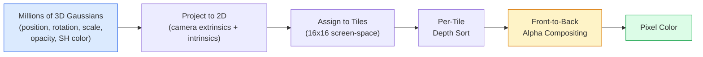

# 3D Gaussian Splatting from Scratch

> A scene is a cloud of millions of 3D Gaussians. Each has position, orientation, scale, opacity, and a color that varies with viewing direction. Rasterize them, backpropagate through the rasterizer, done.

**Type:** Build
**Languages:** Python
**Prerequisites:** Phase 4 Lesson 13 (3D Vision and NeRF), Phase 1 Lesson 12 (Tensor Operations), Phase 4 Lesson 10 (Diffusion Basics, optional)
**Time:** ~90 min

## Learning Objectives

- Explain why 3D Gaussian splatting replaced NeRF as the production default for photorealistic 3D reconstruction in 2026
- Name the six parameters per Gaussian (position, rotation quaternion, scale, opacity, spherical harmonic color, optional features) and how many floats each contributes
- Implement a 2D Gaussian splatting rasterizer from scratch with `alpha` compositing, then show how the 3D case projects to the same loop
- Reconstruct a scene from 20-50 photos using `nerfstudio`, `gsplat`, or `SuperSplat`, and export to the `KHR_gaussian_splatting` glTF extension or OpenUSD 26.03's `UsdVolParticleField3DGaussianSplat` schema

## The Problem

NeRF stores a scene as an MLP's weights. Each rendered pixel is hundreds of MLP queries along a ray. Training takes hours, rendering takes seconds, and the weights can't be edited — move a chair in the scene and you must retrain.

3D Gaussian Splatting (Kerbl, Kopanas, Leimkühler, Drettakis, SIGGRAPH 2023) replaces all of this. A scene is a set of explicit 3D Gaussians. Rendering is GPU rasterization at 100+ fps. Training takes minutes. Editing is straightforward: translate a subset of Gaussians and you've moved that chair. By 2026, the Khronos Group has approved a glTF extension for Gaussian splatting, OpenUSD 26.03 ships a Gaussian splatting schema, Zillow and Apartments.com use them to render properties, and most new research papers on 3D reconstruction are variants of the core 3DGS idea.

The mental model is simple, but the math has enough moving parts that most introductions start at rasterization and skip projection and spherical harmonics. This lesson builds the whole thing — first a 2D version, then the 3D extension.

## The Concept

### What a Gaussian Carries

A 3D Gaussian is a parameterized blob in space with these attributes:

```
position         mu         (3,)    center in world coordinates
rotation         q          (4,)    unit quaternion encoding orientation
scale            s          (3,)    per-axis log-scale (exponentiated at render time)
opacity          alpha      (1,)    opacity in [0, 1] after sigmoid
SH coefficients  c_lm       (3 * (L+1)^2,)   view-dependent color
```

Rotation + scale build a 3x3 covariance: `Sigma = R S S^T R^T`. That's the Gaussian's shape in 3D. Spherical harmonics let color vary with viewing direction — specular highlights, subtle sheen, view-dependent glow — without storing per-view textures. With SH degree 3, each color channel gets 16 coefficients, totaling 48 floats per Gaussian for color alone.

A scene typically has 1–5 million Gaussians. Each stores roughly 60 floats (3 + 4 + 3 + 1 + 48 + misc). A five-million-Gaussian scene is 240 MB — far smaller than an equivalent point cloud with per-point textures, and an order of magnitude smaller than NeRF's MLP weights when re-rendering at high resolution.

### Rasterization, Not Ray Marching



Five steps, all GPU-friendly. No per-pixel MLP queries. A single RTX 3080 Ti renders 6 million splats at 147 fps.

### Projection Step

A 3D Gaussian with world position `mu` and 3D covariance `Sigma` projects to a 2D Gaussian with screen position `mu'` and 2D covariance `Sigma'`:

```
mu' = project(mu)
Sigma' = J W Sigma W^T J^T          (2 x 2)

W = view transform (camera rotation + translation)
J = Jacobian of perspective projection at mu'
```

The 2D Gaussian's footprint is an ellipse whose axes are the eigenvectors of `Sigma'`. Every pixel inside that ellipse receives the Gaussian's contribution, weighted by `exp(-0.5 * (p - mu')^T Sigma'^-1 (p - mu'))`.

### Alpha Compositing Rule

For a pixel, sort the Gaussians covering it back-to-front (or equivalently front-to-back with the reversed formula). Color is composited with the same equation every translucent rasterizer has used since the 1980s:

```
C_pixel = sum_i alpha_i * T_i * c_i

T_i = prod_{j < i} (1 - alpha_j)       transmittance up to i
alpha_i = opacity_i * exp(-0.5 * d^T Sigma'^-1 d)   local contribution
c_i = eval_SH(SH_i, view_direction)    view-dependent color
```

This **is the same equation as NeRF's volume rendering**, just applied to a set of explicit sparse Gaussians instead of dense samples along a ray. This equivalence is what makes rendering quality match NeRF — both integrate the same radiance field equation.

### Why This Is Differentiable

Every step — projection, tile assignment, alpha compositing, SH evaluation — is differentiable with respect to Gaussian parameters. Given a ground-truth image, compute the loss on rendered pixels, backpropagate through the rasterizer, and update all `(mu, q, s, alpha, c_lm)` with gradient descent. Over ~30,000 iterations, Gaussians find their correct positions, scales, and colors.

### Densification and Pruning

A fixed set of Gaussians can't cover complex scenes. Training includes two adaptive mechanisms:

- **Clone** a Gaussian when its gradient magnitude is large but its scale is small — the reconstruction here needs more detail.
- **Split** a large-scale Gaussian with large gradient into two smaller ones — one big Gaussian is too smooth to fit that region.
- **Prune** Gaussians whose opacity drops below a threshold — they're not contributing.

Densification runs every N iterations. A scene typically grows from ~100K initial Gaussians (seeded with SfM points) to 1–5M by the end of training.

### Spherical Harmonics in One Paragraph

View-dependent color is a function `c(direction)` on the unit sphere. Spherical harmonics are the Fourier basis for the sphere. Truncated to degree `L`, each channel gets `(L+1)^2` basis functions. Evaluating color for a new view is a dot product between the learned SH coefficients and the basis evaluated at the viewing direction. Degree 0 = one coefficient = constant color. Degree 3 = 16 coefficients = enough to capture Lambertian shading, specularity, and subtle reflections. The 3D Gaussian Splatting paper defaults to degree 3.

### The 2026 Production Stack

```
1. Capture            Smartphone / DJI drone / handheld scanner
2. SfM / MVS         COLMAP or GLOMAP for camera poses + sparse points
3. Train 3DGS        nerfstudio / gsplat / inria official / PostShot (~10-30 min on RTX 4090)
4. Edit              SuperSplat / SplatForge (clean floaters, segment)
5. Export            .ply -> glTF KHR_gaussian_splatting or .usd (OpenUSD 26.03)
6. View              Cesium / Unreal / Babylon.js / Three.js / Vision Pro
```

### 4D and Generative Variants

- **4D Gaussian Splatting** — Gaussians are functions of time; used for volumetric video (Superman 2026, A$AP Rocky's "Helicopter").
- **Generative splat** — text-to-splat models (World Labs' Marble) that hallucinate entire scenes.
- **3D Gaussian Unscented Transform** — NVIDIA NuRec's variant for autonomous driving simulation.

## Build It

### Step 1: A Single 2D Gaussian

We build a 2D rasterizer first. The 3D case reduces to it after projection.

```python
import torch
import torch.nn as nn
import torch.nn.functional as F


def eval_2d_gaussian(means, covs, points):
    """
    means:  (G, 2)      centers
    covs:   (G, 2, 2)   covariance matrices
    points: (H, W, 2)   pixel coordinates
    Returns: (G, H, W)  density of each Gaussian at each pixel
    """
    G = means.size(0)
    H, W, _ = points.shape
    flat = points.view(-1, 2)
    inv = torch.linalg.inv(covs)
    diff = flat[None, :, :] - means[:, None, :]
    d = torch.einsum("gpi,gij,gpj->gp", diff, inv, diff)
    density = torch.exp(-0.5 * d)
    return density.view(G, H, W)
```

The `einsum` computes the quadratic form `diff^T Sigma^-1 diff` for each (Gaussian, pixel) pair.

### Step 2: 2D Splatting Rasterizer

Front-to-back alpha compositing. In 2D depth is meaningless, so we sort by a learned per-Gaussian scalar.

```python
def rasterise_2d(means, covs, colours, opacities, depths, image_size):
    """
    means:     (G, 2)
    covs:      (G, 2, 2)
    colours:   (G, 3)
    opacities: (G,)     in [0, 1]
    depths:    (G,)     per-Gaussian scalar for sorting
    image_size: (H, W)
    Returns:   (H, W, 3) rendered image
    """
    H, W = image_size
    yy, xx = torch.meshgrid(
        torch.arange(H, dtype=torch.float32, device=means.device),
        torch.arange(W, dtype=torch.float32, device=means.device),
        indexing="ij",
    )
    points = torch.stack([xx, yy], dim=-1)

    densities = eval_2d_gaussian(means, covs, points)
    alphas = opacities[:, None, None] * densities
    alphas = alphas.clamp(0.0, 0.99)

    order = torch.argsort(depths)
    alphas = alphas[order]
    colours_sorted = colours[order]

    T = torch.ones(H, W, device=means.device)
    out = torch.zeros(H, W, 3, device=means.device)
    for i in range(means.size(0)):
        a = alphas[i]
        out += (T * a)[..., None] * colours_sorted[i][None, None, :]
        T = T * (1.0 - a)
    return out
```

Not fast — real implementations use tile-based CUDA kernels — but the math is fully correct and fully differentiable.

### Step 3: A Trainable 2D Splat Scene

```python
class Splats2D(nn.Module):
    def __init__(self, num_splats=128, image_size=64, seed=0):
        super().__init__()
        g = torch.Generator().manual_seed(seed)
        H, W = image_size, image_size
        self.means = nn.Parameter(torch.rand(num_splats, 2, generator=g) * torch.tensor([W, H]))
        self.log_scale = nn.Parameter(torch.ones(num_splats, 2) * math.log(2.0))
        self.rot = nn.Parameter(torch.zeros(num_splats))  # single angle in 2D
        self.colour_logits = nn.Parameter(torch.randn(num_splats, 3, generator=g) * 0.5)
        self.opacity_logit = nn.Parameter(torch.zeros(num_splats))
        self.depth = nn.Parameter(torch.rand(num_splats, generator=g))

    def covs(self):
        s = torch.exp(self.log_scale)
        c, si = torch.cos(self.rot), torch.sin(self.rot)
        R = torch.stack([
            torch.stack([c, -si], dim=-1),
            torch.stack([si, c], dim=-1),
        ], dim=-2)
        S = torch.diag_embed(s ** 2)
        return R @ S @ R.transpose(-1, -2)

    def forward(self, image_size):
        covs = self.covs()
        colours = torch.sigmoid(self.colour_logits)
        opacities = torch.sigmoid(self.opacity_logit)
        return rasterise_2d(self.means, covs, colours, opacities, self.depth, image_size)
```

`log_scale`, `opacity_logit`, and `colour_logits` are unconstrained parameters mapped through the correct activations at render time. This is the standard pattern in every 3DGS implementation.

### Step 4: Fitting a Target Image with 2D Gaussians

```python
import math
import numpy as np

def make_target(size=64):
    yy, xx = np.meshgrid(np.arange(size), np.arange(size), indexing="ij")
    img = np.zeros((size, size, 3), dtype=np.float32)
    # Red circle
    mask = (xx - 20) ** 2 + (yy - 20) ** 2 < 10 ** 2
    img[mask] = [1.0, 0.2, 0.2]
    # Blue square
    mask = (np.abs(xx - 45) < 8) & (np.abs(yy - 40) < 8)
    img[mask] = [0.2, 0.3, 1.0]
    return torch.from_numpy(img)


target = make_target(64)
model = Splats2D(num_splats=64, image_size=64)
opt = torch.optim.Adam(model.parameters(), lr=0.05)

for step in range(200):
    pred = model((64, 64))
    loss = F.mse_loss(pred, target)
    opt.zero_grad(); loss.backward(); opt.step()
    if step % 40 == 0:
        print(f"step {step:3d}  mse {loss.item():.4f}")
```

In 200 steps, 64 Gaussians settle into the two shapes. That's the whole idea — gradient descent on explicit geometric primitives.

### Step 5: From 2D to 3D

The 3D extension keeps the same loop. What's new:

1. Per-Gaussian rotation is a quaternion, not a single angle.
2. Covariance is `R S S^T R^T` with `R` built from a quaternion and `S = diag(exp(log_scale))`.
3. Projection `(mu, Sigma) -> (mu', Sigma')` uses camera extrinsics and the Jacobian of perspective projection at `mu`.
4. Color becomes a spherical harmonic expansion; evaluate it at the viewing direction.
5. Depth sorting comes from actual camera-space z, not a learned scalar.

Every production implementation (`gsplat`, `inria/gaussian-splatting`, `nerfstudio`) does exactly this in a tile-based CUDA kernel on GPU.

### Step 6: Spherical Harmonic Evaluation

SH basis up to degree 3 has 16 terms per channel. Evaluation:

```python
def eval_sh_degree_3(sh_coeffs, dirs):
    """
    sh_coeffs: (..., 16, 3)   last dim is RGB channels
    dirs:      (..., 3)       unit vectors
    Returns:   (..., 3)
    """
    C0 = 0.282094791773878
    C1 = 0.488602511902920
    C2 = [1.092548430592079, 1.092548430592079,
          0.315391565252520, 1.092548430592079,
          0.546274215296039]
    x, y, z = dirs[..., 0], dirs[..., 1], dirs[..., 2]
    x2, y2, z2 = x * x, y * y, z * z
    xy, yz, xz = x * y, y * z, x * z

    result = C0 * sh_coeffs[..., 0, :]
    result = result - C1 * y[..., None] * sh_coeffs[..., 1, :]
    result = result + C1 * z[..., None] * sh_coeffs[..., 2, :]
    result = result - C1 * x[..., None] * sh_coeffs[..., 3, :]

    result = result + C2[0] * xy[..., None] * sh_coeffs[..., 4, :]
    result = result + C2[1] * yz[..., None] * sh_coeffs[..., 5, :]
    result = result + C2[2] * (2.0 * z2 - x2 - y2)[..., None] * sh_coeffs[..., 6, :]
    result = result + C2[3] * xz[..., None] * sh_coeffs[..., 7, :]
    result = result + C2[4] * (x2 - y2)[..., None] * sh_coeffs[..., 8, :]

    # Degree 3 terms omitted for brevity; full 16-coefficient version in the code file
    return result
```

The learned `sh_coeffs` store "color in every direction" for that Gaussian. At render time, evaluate against the current viewing direction to get a 3-channel RGB.

## Use It

For real 3DGS work, use `gsplat` (Meta) or `nerfstudio`:

```bash
pip install nerfstudio gsplat
ns-download-data example
ns-train splatfacto --data path/to/data
```

`splatfacto` is nerfstudio's 3DGS trainer. A typical scene runs in 10-30 min on an RTX 4090.

Export options that matter in 2026:

- `.ply` — raw Gaussian cloud (portable, largest file).
- `.splat` — PlayCanvas / SuperSplat quantized format.
- glTF `KHR_gaussian_splatting` — Khronos standard, portable across viewers (Feb 2026 RC).
- OpenUSD `UsdVolParticleField3DGaussianSplat` — USD-native for NVIDIA Omniverse and Vision Pro pipelines.

For 4D / dynamic scenes, `4DGS` and `Deformable-3DGS` extend the same mechanism with time-varying means and opacities.

## Ship It

This lesson produces:

- `outputs/prompt-3dgs-capture-planner.md` — a prompt that plans a capture session (photo count, camera path, lighting) for a given scene type.
- `outputs/skill-3dgs-export-router.md` — a skill that picks the right export format (`.ply` / `.splat` / glTF / USD) given the downstream viewer or engine.

## Exercises

1. **(Easy)** Run the 2D splat trainer above on another synthetic image. Vary `num_splats` across `[16, 64, 256]` and plot MSE vs step for each. Find the point of diminishing returns.
2. **(Medium)** Extend the 2D rasterizer to support per-Gaussian RGB color that varies with a scalar "viewing angle" via a degree-2 harmonic. Train on a pair of target images; verify the model reconstructs both.
3. **(Hard)** Clone `nerfstudio`, train `splatfacto` on a 20-photo capture of any scene you have (desk, plant, face, room). Export to glTF `KHR_gaussian_splatting` and open in a viewer (Three.js `GaussianSplats3D`, SuperSplat, Babylon.js V9). Report training time, Gaussian count, and rendering fps.

## Key Terms

| Term | What people say | What it actually is |
|------|----------------|----------------------|
| 3DGS | "Gaussian splat" | Explicitly represents a scene as millions of 3D Gaussians, each with position, rotation, scale, opacity, SH color |
| Covariance | "the Gaussian's shape" | `Sigma = R S S^T R^T`; a Gaussian's orientation and anisotropic scale |
| Alpha compositing | "back-to-front blending" | The same equation as NeRF volume rendering, now applied to an explicit sparse set |
| Densification | "clone and split" | Adaptively add new Gaussians where reconstruction underfits |
| Pruning | "delete low-opacity ones" | Remove Gaussians that collapse to near-zero opacity during training |
| Spherical harmonics | "view-dependent color" | Fourier basis on the sphere; stores color as a function of viewing direction |
| Splatfacto | "nerfstudio's 3DGS" | The easiest path to train 3DGS in 2026 |
| `KHR_gaussian_splatting` | "the glTF standard" | Khronos 2026 extension making 3DGS portable across viewers and engines |

## Further Reading

- [3D Gaussian Splatting for Real-Time Radiance Field Rendering (Kerbl et al., SIGGRAPH 2023)](https://repo-sam.inria.fr/fungraph/3d-gaussian-splatting/) — the original paper
- [gsplat (Meta/nerfstudio)](https://github.com/nerfstudio-project/gsplat) — production-quality CUDA rasterizer
- [nerfstudio Splatfacto](https://docs.nerf.studio/nerfology/methods/splat.html) — reference training recipe
- [Khronos KHR_gaussian_splatting extension](https://github.com/KhronosGroup/glTF/blob/main/extensions/2.0/Khronos/KHR_gaussian_splatting/README.md) — the 2026 portable format
- [OpenUSD 26.03 release notes](https://openusd.org/release/) — `UsdVolParticleField3DGaussianSplat` schema
- [THE FUTURE 3D State of Gaussian Splatting 2026](https://www.thefuture3d.com/blog-0/2026/4/4/state-of-gaussian-splatting-2026) — industry overview

