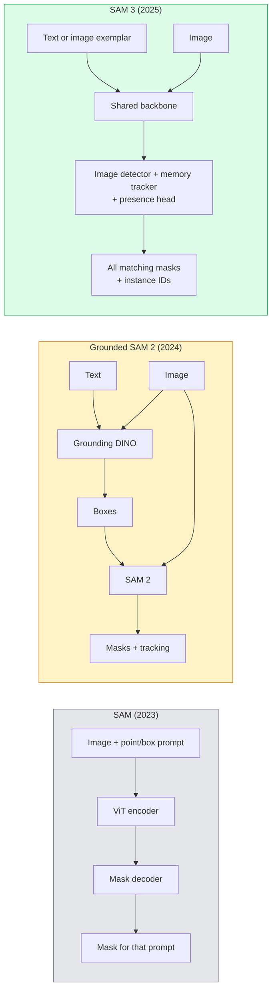

# SAM 3 and Open-Vocabulary Segmentation

> Give a model a text prompt and an image, get a mask for every matching object. SAM 3 does this in a single forward pass.

**Type:** Use + Build
**Languages:** Python
**Prerequisites:** Phase 4 Lesson 07 (U-Net), Phase 4 Lesson 08 (Mask R-CNN), Phase 4 Lesson 18 (CLIP)
**Time:** ~60 min

## Learning Objectives

- Distinguish SAM (vision-only prompts), Grounded SAM / SAM 2 (detector + SAM), and SAM 3 (native text prompts via Promptable Concept Segmentation)
- Explain the SAM 3 architecture: shared backbone + image detector + memory-based video tracker + presence head + decoupled detector-tracker design
- Use the Hugging Face `transformers` SAM 3 integration for text-prompted detection, segmentation, and video tracking
- Choose between SAM 3, Grounded SAM 2, YOLO-World, and SAM-MI based on latency, concept complexity, and deployment target

## The Problem

SAM in 2023 was a vision-prompt-only model: you click a point or draw a box, it returns a mask. For "give me all the oranges in this photo," you needed a detector (Grounding DINO) to produce boxes, then SAM to segment each one. Grounded SAM turned this into a pipeline, but it's a cascade of two frozen models with unavoidable error accumulation.

SAM 3 (Meta, November 2025, ICLR 2026) collapses the cascade. It accepts a short noun phrase or an image exemplar as a prompt and returns all matching masks with instance IDs in a single forward pass. This is **Promptable Concept Segmentation (PCS)**. Combined with the March 2026 Object Multiplex update (SAM 3.1), it efficiently tracks multiple instances of the same concept across video.

This lesson covers the structural shift it represents. 2D segmentation, detection, and text-image grounding have merged into one model. The production question is no longer "which pipeline do I chain together" but "which promptable model handles my use case end-to-end."

## The Concept

### Three Generations



### Promptable Concept Segmentation

A "concept prompt" is a short noun phrase (`"yellow school bus"`, `"striped red umbrella"`, `"hand holding a mug"`) or an image exemplar. The model returns a segmentation mask for every instance matching that concept in the image, plus a unique instance ID for each match.

Three differences from classic vision-prompted SAM:

1. No per-instance prompting needed — one text prompt returns all matches.
2. Open vocabulary — the concept can be anything describable in natural language.
3. Multiple instances returned at once, not one mask per prompt.

### Key Architecture Components

- **Shared backbone** — A single ViT processes the image. Both the detector head and the memory-based tracker read from it.
- **Presence head** — Predicts whether the concept exists in the image at all. Decouples "is it here?" from "where is it?" Reduces false positives on absent concepts.
- **Decoupled detector-tracker** — Image-level detection and video-level tracking have separate heads that don't interfere with each other.
- **Memory bank** — Stores per-instance features across frames for video tracking (same mechanism as SAM 2).

### Training at Scale

SAM 3 trains on **4 million unique concepts** generated by a data engine that iteratively annotates and corrects using AI + human review. The new **SA-CO benchmark** contains 270K unique concepts — 50× larger than prior benchmarks. SAM 3 reaches 75-80% of human performance on SA-CO and doubles existing systems on image + video PCS.

### SAM 3.1 Object Multiplex

March 2026 update: **Object Multiplex** introduces a shared memory mechanism that jointly tracks many instances of the same concept at once. Previously, tracking N instances meant N independent memory banks. Multiplex collapses them into one shared memory with per-instance queries. Result: multi-object tracking speeds up significantly without sacrificing accuracy.

### Where Grounded SAM Still Matters in 2026

- When you need to swap in a specific open-vocabulary detector (DINO-X, Florence-2).
- When SAM 3's license (gated on HF) is a blocker.
- When you need finer control over detector thresholds than SAM 3 exposes.
- For research / ablation work on the detector component.

Modular pipelines still have a place. For most production work, SAM 3 is the simpler answer.

### YOLO-World vs SAM 3

- **YOLO-World** — Open-vocabulary detector only (no masks). Real-time. Best when you need high-fps boxes.
- **SAM 3** — Full segmentation + tracking. Slower but richer output.

Production split: YOLO-World for fast detection-only pipelines (robot navigation, quick dashboards), SAM 3 for anything needing masks or tracking.

### SAM-MI Efficiency

SAM-MI (2025-2026) addresses SAM's decoder bottleneck. Key ideas:

- **Sparse point prompts** — Use a few carefully selected points instead of dense prompts; reduces decoder calls by 96%.
- **Shallow mask aggregation** — Merges coarse mask predictions into a sharper mask.
- **Decoupled mask injection** — The decoder receives precomputed mask features instead of re-running.

Result: ~1.6× speedup over Grounded-SAM on open-vocabulary benchmarks.

### Output Format Across Three Models

All three return the same overall structure (boxes + labels + scores + masks + IDs) — useful because your downstream pipeline doesn't need to branch based on which model ran.

## Build It

### Step 1: Construct Prompts

Write a helper that turns a user sentence into a list of SAM 3 concept prompts. This is the boundary where "user-typed" meets "model-consumed."

```python
def split_concepts(sentence):
    """
    Heuristic splitter for multi-concept prompts.
    Returns a list of short noun phrases.
    """
    for sep in [",", ";", "and", "or", "&"]:
        if sep in sentence:
            parts = [p.strip() for p in sentence.replace("and ", ",").split(",")]
            return [p for p in parts if p]
    return [sentence.strip()]

print(split_concepts("cats, dogs and balloons"))
```

SAM 3 accepts one concept per forward pass; for multi-concept queries, loop or batch them.

### Step 2: Post-Processing Helper

Turn SAM 3's raw output into a clean detection list matching our Phase 4 Lesson 16 pipeline contract.

```python
from dataclasses import dataclass
from typing import List

@dataclass
class ConceptDetection:
    concept: str
    instance_id: int
    box: tuple          # (x1, y1, x2, y2)
    score: float
    mask_rle: str       # run-length encoded


def rle_encode(binary_mask):
    flat = binary_mask.flatten().astype("uint8")
    runs = []
    prev, count = flat[0], 0
    for v in flat:
        if v == prev:
            count += 1
        else:
            runs.append((int(prev), count))
            prev, count = v, 1
    runs.append((int(prev), count))
    return ";".join(f"{v}x{c}" for v, c in runs)
```

RLE keeps the response payload small even for many high-resolution masks. The same format works across SAM 2, SAM 3, and Grounded SAM 2.

### Step 3: A Unified Open-Vocabulary Segmentation Interface

Hide whatever backend you have (SAM 3, Grounded SAM 2, YOLO-World + SAM 2) behind one method. When the backend changes, your downstream code doesn't.

```python
from abc import ABC, abstractmethod
import numpy as np

class OpenVocabSeg(ABC):
    @abstractmethod
    def detect(self, image: np.ndarray, concept: str) -> List[ConceptDetection]:
        ...


class StubOpenVocabSeg(OpenVocabSeg):
    """
    Deterministic stub for pipeline testing when no real model is loaded.
    """
    def detect(self, image, concept):
        h, w = image.shape[:2]
        return [
            ConceptDetection(
                concept=concept,
                instance_id=0,
                box=(w * 0.2, h * 0.3, w * 0.5, h * 0.8),
                score=0.89,
                mask_rle="0x100;1x50;0x200",
            ),
            ConceptDetection(
                concept=concept,
                instance_id=1,
                box=(w * 0.55, h * 0.25, w * 0.85, h * 0.75),
                score=0.74,
                mask_rle="0x80;1x40;0x220",
            ),
        ]
```

The real `SAM3OpenVocabSeg` subclass would wrap `transformers.Sam3Model` and `Sam3Processor`.

### Step 4: Hugging Face SAM 3 Usage (Reference)

For the actual model, the `transformers` integration:

```python
from transformers import Sam3Processor, Sam3Model
import torch

processor = Sam3Processor.from_pretrained("facebook/sam3")
model = Sam3Model.from_pretrained("facebook/sam3").eval()

inputs = processor(images=pil_image, return_tensors="pt")
inputs = processor.set_text_prompt(inputs, "yellow school bus")

with torch.no_grad():
    outputs = model(**inputs)

masks = processor.post_process_masks(
    outputs.masks, inputs.original_sizes, inputs.reshaped_input_sizes
)
boxes = outputs.boxes
scores = outputs.scores
```

One prompt, one call returns all matches.

### Step 5: Measuring What Grounded SAM 2 Gives You for Free

An honest benchmark: what happens when you swap Grounded SAM 2 for SAM 3 in a real pipeline?

- Latency: SAM 3 saves one forward pass (no separate detector), but the model itself is heavier; usually net-neutral or slightly faster.
- Accuracy: SAM 3 is noticeably better on rare or compositional concepts ("striped red umbrella"). Similar on common single-word concepts.
- Flexibility: Grounded SAM 2 lets you swap detectors (DINO-X, Florence-2, Grounding DINO 1.5); SAM 3 is monolithic.

Conclusion: SAM 3 is the 2026 default for open-vocabulary segmentation. Grounded SAM 2 remains the right answer when you need detector flexibility or different license terms.

## Use It

Production deployment patterns:

- **Real-time annotation** — SAM 3 + CVAT's "label as text prompt" feature. Annotators pick a label name; SAM 3 pre-annotates every matching instance. Review and correct.
- **Video analytics** — Multi-object tracking with SAM 3.1 Object Multiplex; feed frames to the memory-based tracker.
- **Robotics** — Open-vocabulary manipulation with SAM 3 ("pick up the red cup"); runs as a planning primitive.
- **Medical imaging** — SAM 3 fine-tuned on medical concepts; requires access request on HF.

Ultralytics wraps SAM 3 in its Python package:

```python
from ultralytics import SAM

model = SAM("sam3.pt")
results = model(image_path, prompts="yellow school bus")
```

Same interface as YOLO and SAM 2.

## Ship It

This lesson produces:

- `outputs/prompt-open-vocab-stack-picker.md` — A prompt that picks SAM 3 / Grounded SAM 2 / YOLO-World / SAM-MI based on latency, concept complexity, and license.
- `outputs/skill-concept-prompt-designer.md` — A skill that turns user utterances into well-formed SAM 3 concept prompts (splitting, disambiguation, fallback).

## Exercises

1. **(Easy)** Run SAM 3 on 10 images with a concept prompt of your choice. Compare against SAM 2 + Grounding DINO 1.5 on the same images. Report which concepts each model missed.
2. **(Medium)** Build a "click-to-include / click-to-exclude" UI on top of SAM 3: a text prompt returns candidate instances; the user clicks which to keep as positives. Export the final concept set as JSON.
3. **(Hard)** Fine-tune SAM 3 on a custom concept set (e.g., 5 types of electronic components) with 20 annotated images each. Compare against zero-shot SAM 3 on the same test set; measure mask IoU improvement.

## Key Terms

| Term | What people say | What it actually is |
|------|----------------|----------------------|
| Open-vocabulary segmentation | "Segment by text" | Producing masks for objects described in natural language, not a fixed label set |
| PCS | "Promptable Concept Segmentation" | SAM 3's core task — given a noun phrase or image exemplar, segment all matching instances |
| Concept prompt | "Text input" | A short noun phrase or image exemplar; not a full sentence |
| Presence head | "Is it here?" | SAM 3 module that decides whether the concept exists in the image before localizing |
| SA-CO | "SAM 3 benchmark" | 270K-concept open-vocabulary segmentation benchmark; 50× larger than prior open-vocab benchmarks |
| Object Multiplex | "SAM 3.1 update" | Shared-memory multi-object tracking; fast joint tracking of many instances |
| Grounded SAM 2 | "Modular pipeline" | Detector + SAM 2 cascade; still relevant when swapping detectors matters |
| SAM-MI | "Efficient SAM variant" | Mask injection, ~1.6× speedup over Grounded-SAM |

## Further Reading

- [SAM 3: Segment Anything with Concepts (arXiv 2511.16719)](https://arxiv.org/abs/2511.16719)
- [SAM 3.1 Object Multiplex (Meta AI, March 2026)](https://ai.meta.com/blog/segment-anything-model-3/)
- [SAM 3 model page on Hugging Face](https://huggingface.co/facebook/sam3)
- [Grounded SAM 2 tutorial (PyImageSearch)](https://pyimagesearch.com/2026/01/19/grounded-sam-2-from-open-set-detection-to-segmentation-and-tracking/)
- [Ultralytics SAM 3 docs](https://docs.ultralytics.com/models/sam-3/)
- [SAM3-I: Instruction-aware SAM (arXiv 2512.04585)](https://arxiv.org/abs/2512.04585)
