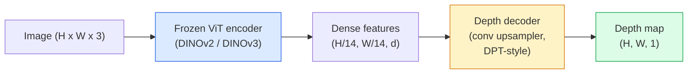

# Monocular Depth and Geometry Estimation

> A depth map is a single-channel image where each pixel is the distance to the camera. Predicting it from a single RGB frame used to be impossible without stereo or LiDAR. In 2026 a frozen ViT encoder plus a lightweight head gets within a few percent of ground truth.

**Type:** Build + Use
**Languages:** Python
**Prerequisites:** Phase 4 Lesson 14 (ViT), Phase 4 Lesson 17 (Self-Supervised Vision), Phase 4 Lesson 07 (U-Net)
**Time:** ~60 min

## Learning Objectives

- Distinguish relative depth from metric depth, and name which each production model (MiDaS, Marigold, Depth Anything V3, ZoeDepth) solves
- Predict depth for any single image using Depth Anything V3 (DINOv2 backbone), no calibration needed
- Explain why monocular depth works from a single image (perspective cues, texture gradients, learned priors) and what it cannot recover (absolute scale, occluded geometry)
- Lift 2D detections to 3D points using a depth map and pinhole camera intrinsics

## The Problem

Depth is the missing axis in 2D computer vision. Given RGB, you know where things appear on the image plane; you don't know how far away they are. Depth sensors (stereo rigs, LiDAR, time-of-flight) solve this directly but are expensive, fragile, and range-limited.

Monocular depth estimation — predicting depth from a single RGB frame — used to produce blurry, unreliable output. By 2026 large pretrained encoders changed this: Depth Anything V3 uses a frozen DINOv2 backbone and produces depth maps that generalize across indoor, outdoor, medical, and satellite domains. Marigold reframes depth as a conditional diffusion problem. ZoeDepth regresses real metric distances.

Depth is also the bridge between 2D detection and 3D understanding: multiply a detection box's pixels by depth and you lift the 2D object into a 3D point cloud. That's the core of every AR occlusion system, every obstacle-avoidance pipeline, every "pick up the cup" robot.

## The Concept

### Relative Depth vs Metric Depth

- **Relative depth** — Ordered `z` values with no real-world units. "Pixel A is closer than pixel B, but the ratio of distances isn't anchored to meters."
- **Metric depth** — Absolute distance to camera in meters. Requires the model to learn a statistical relationship between image cues and real-world distances.

MiDaS and Depth Anything V3 produce relative depth. Marigold produces relative depth. ZoeDepth, UniDepth, and Metric3D produce metric depth. Metric models are sensitive to camera intrinsics; relative models aren't.

### Encoder-Decoder Pattern



Depth Anything V3 freezes the encoder and trains only the DPT-style decoder. The encoder provides rich features; the decoder interpolates them back to image resolution and regresses depth.

### Why a Single Image Can Produce Depth

A 2D image contains many monocular cues correlated with depth:

- **Perspective** — Lines parallel in 3D converge in 2D.
- **Texture gradient** — Distant surfaces have smaller, denser textures.
- **Occlusion order** — Closer objects occlude farther ones.
- **Size constancy** — Known objects (cars, people) give approximate scale.
- **Atmospheric perspective** — Distant objects appear hazier and bluer in outdoor scenes.

A ViT trained on billions of images internalizes these cues. With enough data and a strong backbone, monocular depth reaches reasonable accuracy without any explicit 3D supervision.

### What Monocular Depth Cannot Do

- **Absolute metric scale** without intrinsics or known objects in the scene. The network can predict "the cup is twice as far as the spoon" but doesn't know if the cup is 1 m or 10 m away.
- **Occluded geometry** — The back of a chair isn't visible and can't be reliably inferred.
- **Truly textureless / reflective surfaces** — Mirrors, glass, uniform walls. The network reports plausible but incorrect depth.

### Depth Anything V3 in 2026

- Plain DINOv2 ViT-L/14 as encoder (frozen).
- DPT decoder.
- Trained on posed image pairs from diverse sources (no explicit depth supervision needed beyond photometric consistency).
- Predicts spatially consistent geometry from **any number of visual inputs with or without known camera poses**.
- SOTA on monocular depth, arbitrary-view geometry, visual rendering, and camera pose estimation.

This is the plug-and-play model for depth in 2026.

### Marigold — Depth via Diffusion

Marigold (Ke et al., CVPR 2024) reframes depth estimation as conditional image-to-image diffusion. Condition: RGB. Target: depth map. Uses a pretrained Stable Diffusion 2 U-Net as backbone. Output depth maps are exceptionally sharp at object boundaries. Cost: inference is slower than feedforward models (10-50 denoising steps).

### Intrinsics and the Pinhole Camera

To lift a pixel `(u, v)` with depth `d` to a 3D point `(X, Y, Z)` in camera coordinates:

```
fx, fy, cx, cy = camera intrinsics
X = (u - cx) * d / fx
Y = (v - cy) * d / fy
Z = d
```

Intrinsics come from EXIF metadata, a calibration pattern, or a monocular intrinsics estimator (Perspective Fields, UniDepth). Without intrinsics you can still assume a 60-70° FOV and a mid-resolution principal point to render point clouds — usable for visualization, not for measurement.

### Evaluation

Two standard metrics:

- **AbsRel** (absolute relative error): `mean(|d_pred - d_gt| / d_gt)`. Lower is better. Production models achieve 0.05-0.1.
- **delta < 1.25** (threshold accuracy): proportion of pixels where `max(d_pred/d_gt, d_gt/d_pred) < 1.25`. Higher is better. SOTA is 0.9+.

For relative depth (Depth Anything V3, MiDaS), evaluation uses scale-shift-invariant versions of both metrics.

## Build It

### Step 1: Depth Metrics

```python
import torch

def abs_rel_error(pred, target, mask=None):
    if mask is not None:
        pred = pred[mask]
        target = target[mask]
    return (torch.abs(pred - target) / target.clamp(min=1e-6)).mean().item()


def delta_accuracy(pred, target, threshold=1.25, mask=None):
    if mask is not None:
        pred = pred[mask]
        target = target[mask]
    ratio = torch.maximum(pred / target.clamp(min=1e-6), target / pred.clamp(min=1e-6))
    return (ratio < threshold).float().mean().item()
```

Always mask out invalid depth pixels (zeros, NaN, saturated) before evaluation.

### Step 2: Scale-Shift Alignment

For relative depth models, align predictions to ground truth before computing metrics. Least-squares fit `a * pred + b = target`:

```python
def align_scale_shift(pred, target, mask=None):
    if mask is not None:
        p = pred[mask]
        t = target[mask]
    else:
        p = pred.flatten()
        t = target.flatten()
    A = torch.stack([p, torch.ones_like(p)], dim=1)
    coeffs, *_ = torch.linalg.lstsq(A, t.unsqueeze(-1))
    a, b = coeffs[:2, 0]
    return a * pred + b
```

When evaluating MiDaS / Depth Anything, run `align_scale_shift` before `abs_rel_error`.

### Step 3: Lifting Depth to a Point Cloud

```python
import numpy as np

def depth_to_point_cloud(depth, intrinsics):
    H, W = depth.shape
    fx, fy, cx, cy = intrinsics
    v, u = np.meshgrid(np.arange(H), np.arange(W), indexing="ij")
    z = depth
    x = (u - cx) * z / fx
    y = (v - cy) * z / fy
    return np.stack([x, y, z], axis=-1)


depth = np.random.uniform(0.5, 4.0, (240, 320))
intr = (320.0, 320.0, 160.0, 120.0)
pc = depth_to_point_cloud(depth, intr)
print(f"point cloud shape: {pc.shape}  (H, W, 3)")
```

One function, every 3D lifting application. Export the point cloud to `.ply` and open in MeshLab or CloudCompare.

### Step 4: Smoke Test with a Synthetic Depth Scene

```python
def synthetic_depth(size=96):
    yy, xx = np.meshgrid(np.arange(size), np.arange(size), indexing="ij")
    # Ground plane: linear gradient from near (top) to far (bottom)
    depth = 1.0 + (yy / size) * 4.0
    # Box in the middle: closer
    mask = (np.abs(xx - size / 2) < size / 6) & (np.abs(yy - size * 0.6) < size / 6)
    depth[mask] = 2.0
    return depth.astype(np.float32)


gt = torch.from_numpy(synthetic_depth(96))
pred = gt + 0.3 * torch.randn_like(gt)  # simulated prediction
aligned = align_scale_shift(pred, gt)
print(f"before align  absRel = {abs_rel_error(pred, gt):.3f}")
print(f"after align   absRel = {abs_rel_error(aligned, gt):.3f}")
```

### Step 5: Depth Anything V3 Usage (Reference)

```python
import torch
from transformers import pipeline
from PIL import Image

pipe = pipeline(task="depth-estimation", model="LiheYoung/depth-anything-v2-large")

image = Image.open("street.jpg").convert("RGB")
out = pipe(image)
depth_np = np.array(out["depth"])
```

Three lines. `out["depth"]` is a PIL grayscale image; convert to numpy for math. For Depth Anything V3 specifically, swap the model id once released; the API stays the same.

## Use It

- **Depth Anything V3** (Meta AI / ByteDance, 2024-2026) — Default for relative depth. Fastest ViT-large backbone model in production.
- **Marigold** (ETH, 2024) — Highest visual quality, slow inference.
- **UniDepth** (ETH, 2024) — Metric depth with camera intrinsics estimation.
- **ZoeDepth** (Intel, 2023) — Metric depth; older, still reliable.
- **MiDaS v3.1** — Legacy but stable; good baseline for comparison.

Typical integration pattern:

1. RGB frame arrives.
2. Depth model produces depth map.
3. Detector produces boxes.
4. Lift box centroids through depth to 3D; merge with point cloud if available.
5. Downstream: AR occlusion, path planning, object size estimation, stereo replacement.

For real-time use, Depth Anything V2 Small (INT8 quantized) reaches ~30 fps at 518x518 on consumer GPUs.

## Ship It

This lesson produces:

- `outputs/prompt-depth-model-picker.md` — Given latency, metric-vs-relative needs, and scene type, picks between Depth Anything V3, Marigold, UniDepth, and MiDaS.
- `outputs/skill-depth-to-pointcloud.md` — A skill that builds point clouds from depth maps, handles intrinsics correctly, and exports to `.ply`.

## Exercises

1. **(Easy)** Run Depth Anything V2 on any 10 images of your desk. Save depth as grayscale PNGs and inspect. Find one object where predicted depth looks wrong and explain why monocular cues failed.
2. **(Medium)** Given RGB + depth from Depth Anything V2, lift to a point cloud and render with `open3d`. Compare two scenes (indoor / outdoor) and note which looks more credible.
3. **(Hard)** Take five pairs of images that differ only in one known object's position (e.g., a bottle moved 30 cm closer). Predict metric depth with UniDepth on both. Report the predicted distance delta vs the real 30 cm.

## Key Terms

| Term | What people say | What it actually is |
|------|----------------|----------------------|
| Monocular depth | "Single-image depth" | Depth estimation from a single RGB frame, no stereo or LiDAR |
| Relative depth | "Ordered depth" | Ordered z values with no real-world units |
| Metric depth | "Absolute distance" | Depth in meters; requires calibration or a model trained with metric supervision |
| AbsRel | "Absolute relative error" | mean of |d_pred - d_gt| / d_gt; standard depth metric |
| Delta accuracy | "delta < 1.25" | Proportion of pixels where prediction is within 25% of ground truth |
| Pinhole camera | "fx, fy, cx, cy" | Camera model used to lift (u, v, d) to (X, Y, Z) |
| DPT | "Dense Prediction Transformer" | Conv-based decoder used on top of a frozen ViT encoder for depth |
| DINOv2 backbone | "Why it works" | Self-supervised features that generalize across domains without depth labels |

## Further Reading

- [Depth Anything V3 paper page](https://depth-anything.github.io/) — SOTA monocular depth with DINOv2 encoder
- [Marigold (Ke et al., CVPR 2024)](https://marigoldmonodepth.github.io/) — Diffusion-based depth estimation
- [UniDepth (Piccinelli et al., 2024)](https://arxiv.org/abs/2403.18913) — Metric depth with intrinsics
- [MiDaS v3.1 (Intel ISL)](https://github.com/isl-org/MiDaS) — Classic relative depth baseline
- [DINOv3 blog post (Meta)](https://ai.meta.com/blog/dinov3-self-supervised-vision-model/) — The encoder family that improves depth accuracy
