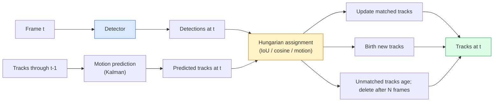

# Multi-Object Tracking and Video Memory

> Tracking is detection plus association. Detect every frame. Match this frame's detections to last frame's tracks by ID.

**Type:** Build
**Languages:** Python
**Prerequisites:** Phase 4 Lesson 06 (YOLO Detection), Phase 4 Lesson 08 (Mask R-CNN), Phase 4 Lesson 24 (SAM 3)
**Time:** ~60 min

## Learning Objectives

- Distinguish detection-based tracking from query-based tracking, naming algorithm families (SORT, DeepSORT, ByteTrack, BoT-SORT, SAM 2 memory tracker, SAM 3.1 Object Multiplex)
- Implement IoU + Hungarian assignment from scratch for classic detection-based tracking
- Explain SAM 2's memory bank and why it handles occlusion better than IoU-based association
- Read three tracking metrics (MOTA, IDF1, HOTA) and pick the one that matters for a given use case

## The Problem

A detector tells you where objects are in a single frame. A tracker tells you which detection in frame `t` is the same object as a detection in frame `t-1`. Without it, you can't count objects crossing a line, follow a ball through occlusion, or know that "car #4 has been in the lane for 8 seconds."

Tracking is critical for every video-facing product: sports analytics, surveillance, autonomous driving, medical video analysis, wildlife monitoring, subtitle counting. The core building blocks are shared: a per-frame detector, a motion model (Kalman filter or something richer), an association step (Hungarian algorithm on IoU / cosine / learned features), and a track lifecycle (birth, update, death).

2026 brings two new paradigms: **SAM 2 memory-based tracking** (association via feature memory instead of motion models) and **SAM 3.1 Object Multiplex** (shared memory for multiple instances of the same concept). This lesson walks the classic stack first, then the memory-based approach.

## The Concept

### Detection-Based Tracking



Every tracker you encounter in 2026 is a variant of this loop. Differences:

- **SORT** (2016): Kalman filter + IoU Hungarian. Simple, fast, no appearance model.
- **DeepSORT** (2017): SORT + a CNN-based appearance feature per track (ReID embedding). Handles crossings better.
- **ByteTrack** (2021): Uses low-confidence detections as a second-pass association; needs no appearance features but tops MOT17.
- **BoT-SORT** (2022): Byte + camera motion compensation + ReID.
- **StrongSORT / OC-SORT** — ByteTrack descendants with better motion and appearance.

### Kalman Filter in One Paragraph

A Kalman filter maintains a state `(x, y, w, h, dx, dy, dw, dh)` plus a covariance for each track. Each frame it **predicts** the state with a constant-velocity model, then **updates** with the matched detection. When prediction uncertainty is high, the update trusts the detection more. This gives smooth tracks and the ability to coast a track through short occlusion (1-5 frames).

Every classic tracker uses a Kalman filter in its motion prediction step.

### Hungarian Algorithm

Given an `M x N` cost matrix (tracks × detections), find the one-to-one assignment that minimizes total cost. Cost is typically `1 - IoU(track_bbox, detection_bbox)` or negative cosine similarity of appearance features. Runtime is O((M+N)^3); fast enough in Python via `scipy.optimize.linear_sum_assignment` when M, N ≤ ~1000.

### ByteTrack's Key Idea

Standard trackers discard low-confidence detections (< 0.5). ByteTrack keeps them as **second-pass candidates**: after matching tracks to high-confidence detections, unmatched tracks attempt to match low-confidence detections with a slightly relaxed IoU threshold. Recovers short occlusions and ID switches near crowds.

### SAM 2 Memory-Based Tracking

SAM 2 handles video by maintaining a **memory bank** of per-instance spatiotemporal features. Given a prompt (click, box, text) on a frame, it encodes the instance into memory. On subsequent frames, the memory cross-attends with new frame features, and the decoder produces a mask for the same instance in the new frame.

No Kalman filter, no Hungarian assignment. Association is implicit in the memory-attention operation.

Advantages:
- Robust to heavy occlusion (memory carries instance identity across many frames).
- Open-vocabulary when combined with SAM 3's text prompts.
- Works without a separate motion model.

Disadvantages:
- Slower than ByteTrack for multi-object tracking.
- Memory bank grows; requires limiting the context window.

### SAM 3.1 Object Multiplex

Previously SAM 2 / SAM 3 tracking maintained a separate memory bank per instance. 50 objects, 50 memory banks. Object Multiplex (March 2026) collapses them into one shared memory with **per-instance query tokens**. Cost scales sub-linearly with instance count.

Multiplex is the 2026 default for crowd tracking: concert crowds, warehouse workers, traffic intersections.

### Three Metrics to Know

- **MOTA (Multi-Object Tracking Accuracy)** — 1 - (FN + FP + ID switches) / GT. Weighted by error type; a single number that mixes detection and association failures.
- **IDF1 (ID F1)** — Harmonic mean of ID precision and recall. Focuses specifically on how well each ground-truth track maintains its ID over time. Better than MOTA for ID-switch-sensitive tasks.
- **HOTA (Higher-Order Tracking Accuracy)** — Decomposes into Detection Accuracy (DetA) and Association Accuracy (AssA). Community standard since 2020; most comprehensive.

Surveillance (who's who): report IDF1. Sports analytics (count passes): HOTA. General academic comparison: HOTA.

## Build It

### Step 1: IoU-Based Cost Matrix

```python
import numpy as np


def bbox_iou(a, b):
    """
    a, b: (N, 4) arrays of [x1, y1, x2, y2].
    Returns (N_a, N_b) IoU matrix.
    """
    ax1, ay1, ax2, ay2 = a[:, 0], a[:, 1], a[:, 2], a[:, 3]
    bx1, by1, bx2, by2 = b[:, 0], b[:, 1], b[:, 2], b[:, 3]
    inter_x1 = np.maximum(ax1[:, None], bx1[None, :])
    inter_y1 = np.maximum(ay1[:, None], by1[None, :])
    inter_x2 = np.minimum(ax2[:, None], bx2[None, :])
    inter_y2 = np.minimum(ay2[:, None], by2[None, :])
    inter = np.clip(inter_x2 - inter_x1, 0, None) * np.clip(inter_y2 - inter_y1, 0, None)
    area_a = (ax2 - ax1) * (ay2 - ay1)
    area_b = (bx2 - bx1) * (by2 - by1)
    union = area_a[:, None] + area_b[None, :] - inter
    return inter / np.clip(union, 1e-8, None)
```

### Step 2: Minimal SORT-Style Tracker

Omits the full constant-velocity Kalman for brevity — uses plain IoU association here; Kalman prediction is essential in production. The `sort` Python package provides the full version.

```python
from scipy.optimize import linear_sum_assignment


class Track:
    def __init__(self, tid, bbox, frame):
        self.id = tid
        self.bbox = bbox
        self.last_frame = frame
        self.hits = 1

    def update(self, bbox, frame):
        self.bbox = bbox
        self.last_frame = frame
        self.hits += 1


class SimpleTracker:
    def __init__(self, iou_threshold=0.3, max_age=5):
        self.tracks = []
        self.next_id = 1
        self.iou_threshold = iou_threshold
        self.max_age = max_age

    def step(self, detections, frame):
        if not self.tracks:
            for d in detections:
                self.tracks.append(Track(self.next_id, d, frame))
                self.next_id += 1
            return [(t.id, t.bbox) for t in self.tracks]

        track_boxes = np.array([t.bbox for t in self.tracks])
        det_boxes = np.array(detections) if len(detections) else np.empty((0, 4))

        iou = bbox_iou(track_boxes, det_boxes) if len(det_boxes) else np.zeros((len(track_boxes), 0))
        cost = 1 - iou
        cost[iou < self.iou_threshold] = 1e6

        matched_track = set()
        matched_det = set()
        if cost.size > 0:
            row, col = linear_sum_assignment(cost)
            for r, c in zip(row, col):
                if cost[r, c] < 1.0:
                    self.tracks[r].update(det_boxes[c], frame)
                    matched_track.add(r); matched_det.add(c)

        for i, d in enumerate(det_boxes):
            if i not in matched_det:
                self.tracks.append(Track(self.next_id, d, frame))
                self.next_id += 1

        self.tracks = [t for t in self.tracks if frame - t.last_frame <= self.max_age]
        return [(t.id, t.bbox) for t in self.tracks]
```

60 lines. Takes per-frame detections, returns per-frame track IDs. Real systems add Kalman prediction, ByteTrack's second-pass re-matching, and appearance features.

### Step 3: Synthetic Track Test

```python
def synthetic_frames(num_frames=20, num_objects=3, H=240, W=320, seed=0):
    rng = np.random.default_rng(seed)
    starts = rng.uniform(20, 200, size=(num_objects, 2))
    velocities = rng.uniform(-5, 5, size=(num_objects, 2))
    frames = []
    for f in range(num_frames):
        dets = []
        for i in range(num_objects):
            cx, cy = starts[i] + f * velocities[i]
            dets.append([cx - 10, cy - 10, cx + 10, cy + 10])
        frames.append(dets)
    return frames


tracker = SimpleTracker()
for f, dets in enumerate(synthetic_frames()):
    tracks = tracker.step(dets, f)
```

Three objects moving in straight lines should maintain their IDs across all 20 frames.

### Step 4: ID Switch Metric

```python
def count_id_switches(tracks_per_frame, gt_per_frame):
    """
    tracks_per_frame:  list of lists of (track_id, bbox)
    gt_per_frame:      list of lists of (gt_id, bbox)
    Returns number of ID switches.
    """
    prev_assignment = {}
    switches = 0
    for tracks, gts in zip(tracks_per_frame, gt_per_frame):
        if not tracks or not gts:
            continue
        t_boxes = np.array([b for _, b in tracks])
        g_boxes = np.array([b for _, b in gts])
        iou = bbox_iou(g_boxes, t_boxes)
        for g_idx, (gt_id, _) in enumerate(gts):
            j = iou[g_idx].argmax()
            if iou[g_idx, j] > 0.5:
                t_id = tracks[j][0]
                if gt_id in prev_assignment and prev_assignment[gt_id] != t_id:
                    switches += 1
                prev_assignment[gt_id] = t_id
    return switches
```

A simplified, IDF1-adjacent metric: counts how many times a ground-truth object changes its assigned predicted track ID. Real MOTA / IDF1 / HOTA tooling lives in `py-motmetrics` and `TrackEval`.

## Use It

Production trackers in 2026:

- `ultralytics` — YOLOv8 + built-in ByteTrack / BoT-SORT. `results = model.track(source, tracker="bytetrack.yaml")`. The default.
- `supervision` (Roboflow) — ByteTrack wrapper plus annotation tools.
- SAM 2 / SAM 3.1 — Memory-based tracking via `processor.track()`.
- Custom stacks: detector (YOLOv8 / RT-DETR) + `sort-tracker` / `OC-SORT` / `StrongSORT`.

How to pick:

- 30+ fps pedestrian / vehicle / box tracking: **ultralytics with ByteTrack**.
- Many instances of one class in a crowd: **SAM 3.1 Object Multiplex**.
- Heavy occlusion with distinguishable appearance: **DeepSORT / StrongSORT** (ReID features).
- Sports / complex interactions: **BoT-SORT** or learned trackers (MOTRv3).

## Ship It

This lesson produces:

- `outputs/prompt-tracker-picker.md` — Given scene type, occlusion pattern, and latency budget, picks SORT / ByteTrack / BoT-SORT / SAM 2 / SAM 3.1.
- `outputs/skill-mot-evaluator.md` — Writes a complete evaluation framework computing MOTA / IDF1 / HOTA against ground-truth tracks.

## Exercises

1. **(Easy)** Run the synthetic tracker above with 3, 10, and 30 objects. Report ID switches for each. Find where simple IoU-only association starts to fail.
2. **(Medium)** Add a constant-velocity Kalman prediction step before association. Show that short (2-3 frame) occlusions no longer cause ID switches.
3. **(Hard)** Integrate SAM 2's memory-based tracker (via `transformers`) as an alternative tracker backend. Run SimpleTracker and SAM 2 on a 30-second crowd clip, compare ID switches, manually annotating ground-truth IDs for 5 prominent people.

## Key Terms

| Term | What people say | What it actually is |
|------|----------------|----------------------|
| Detection-based tracking | "Detect then associate" | Per-frame detector + Hungarian assignment on IoU / appearance |
| Kalman filter | "Motion prediction" | Linear dynamics + covariance for smooth track prediction and occlusion handling |
| Hungarian algorithm | "Optimal assignment" | Solves the minimum-cost bipartite matching problem; `scipy.optimize.linear_sum_assignment` |
| ByteTrack | "Low-confidence second pass" | Re-matches unmatched tracks to low-confidence detections to recover short occlusions |
| DeepSORT | "SORT + appearance" | Adds a ReID feature for cross-frame matching; better ID retention |
| Memory bank | "SAM 2's trick" | Per-instance spatiotemporal features stored across frames; cross-attention replaces explicit association |
| Object Multiplex | "SAM 3.1 shared memory" | Single shared memory with per-instance queries for fast multi-object tracking |
| HOTA | "Modern tracking metric" | Decomposes into detection accuracy and association accuracy; community standard |

## Further Reading

- [SORT (Bewley et al., 2016)](https://arxiv.org/abs/1602.00763) — Minimal detection-based tracking paper
- [DeepSORT (Wojke et al., 2017)](https://arxiv.org/abs/1703.07402) — Adding appearance features
- [ByteTrack (Zhang et al., 2022)](https://arxiv.org/abs/2110.06864) — Low-confidence second pass
- [BoT-SORT (Aharon et al., 2022)](https://arxiv.org/abs/2206.14651) — Camera motion compensation
- [HOTA (Luiten et al., 2020)](https://arxiv.org/abs/2009.07736) — Decomposed tracking metric
- [SAM 2 video segmentation (Meta, 2024)](https://ai.meta.com/sam2/) — Memory-based tracker
- [SAM 3.1 Object Multiplex (Meta, March 2026)](https://ai.meta.com/blog/segment-anything-model-3/)
