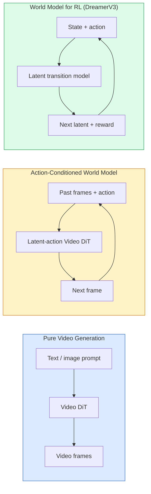

# World Models and Video Diffusion

> A video model that can predict the next few seconds of a scene is a world simulator. Condition that prediction on actions and you have a learned game engine.

**Type:** Learn + Build
**Languages:** Python
**Prerequisites:** Phase 4 Lesson 10 (Diffusion), Phase 4 Lesson 12 (Video Understanding), Phase 4 Lesson 23 (DiT + Rectified Flow)
**Time:** ~75 min

## Learning Objectives

- Explain the difference between pure video generation models (Sora 2) and action-conditioned world models (Genie 3, DreamerV3)
- Describe a Video DiT: spatiotemporal patches, 3D positional encoding, joint attention across (T, H, W) tokens
- Trace how world models plug into robotics: VLM planning → video model simulation → inverse dynamics issuing actions
- Choose between Sora 2, Genie 3, Runway GWM-1 Worlds, Wan-Video, and HunyuanVideo for a given use case (creative video, interactive simulation, autonomous driving synthesis)

## The Problem

Video generation and world modeling converged in 2026. A model that generates coherent one-minute video has, in some sense, learned how the world moves: object permanence, gravity, causality, style. If you condition that prediction on actions (move left, open door), the video model becomes a learnable simulator — a stand-in for a game engine, driving simulator, or robot environment.

The stakes are concrete. Genie 3 generates playable environments from a single image. Runway GWM-1 Worlds synthesizes infinitely explorable scenes. Sora 2 produces minute-long video with synchronized audio and modeled physics. NVIDIA Cosmos-Drive, Wayve Gaia-2, and Tesla DrivingWorld generate photorealistic driving video for autonomous driving training data. The world model paradigm is quietly taking over sim-to-real for robotics.

This lesson is Phase 4's "big picture" lesson. It connects image generation, video understanding, and agentic reasoning into the architecture pattern that mainstream research is converging on.

## The Concept

### Three Families of World Modeling



- **Sora 2** is prompt-conditioned pure video generation. No action interface. You can't "steer" it mid-rollout.
- **Genie 3**, **GWM-1 Worlds**, **Mirage / Magica** are action-conditioned world models. They infer latent actions from observed video, then condition future frame prediction on actions. Interactive — you press a key or move the camera, the scene responds.
- **DreamerV3** and the classic RL world model family predict in latent space with explicit action conditioning, trained with reward signals. Less visual; more useful for sample-efficient RL.

### Video DiT Architecture

```
Video latent:              (C, T, H, W)
Patchify (spatial):        grid of P_h x P_w patches per frame
Patchify (temporal):       group P_t frames into one temporal patch
Resulting tokens:          (T / P_t) * (H / P_h) * (W / P_w) tokens
```

Positional encoding is 3D: one rotary or learned embedding per (t, h, w) coordinate. Attention can be:

- **Full joint** — All tokens attend to all tokens. O(N^2) for N tokens. Prohibitive for long video.
- **Divided** — Alternating temporal attention (same spatial position, across time: `(H*W) * T^2`) and spatial attention (same timestep, across space: `T * (H*W)^2`). Used by TimeSformer and most video DiTs.
- **Windowed** — Local windows in (t, h, w). Used by Video Swin.

Every video diffusion model in 2026 uses one of these three patterns, plus AdaLN conditioning (Lesson 23) and rectified flow.

### Action Conditioning: Latent Action Models

Genie learns a **latent action** for each frame by discriminatively predicting the action between two consecutive frames. The model's decoder then conditions on the inferred latent action — not explicit keyboard presses. At inference, the user can specify a latent action (or sample one from a new prior), and the model generates the next frame consistent with that action.

Sora skips the action interface entirely. Its decoder predicts the next spatiotemporal token from past spatiotemporal tokens. The prompt gives the opening; nothing steers it mid-generation.

### Physical Plausibility

Sora 2's 2026 release explicitly advertises **physical plausibility**: weight, balance, object permanence, causality. The team measures via hand-rated plausibility scores; compared to Sora 1, the model improves markedly on falling objects, character collisions, and intentional failures (a failed jump).

Plausibility remains the dominant failure mode. 2024-2025 videos of people eating spaghetti or drinking from glass cups exposed the model's lack of persistent object representations. 2026 models (Sora 2, Runway Gen-5, HunyuanVideo) reduce but don't eliminate these.

### Autonomous Driving World Models

Driving world models generate photorealistic road scenes conditioned on trajectories, bounding boxes, or navigation maps. Uses:

- **Cosmos-Drive-Dreams** (NVIDIA) — Generates minute-long driving video for RL training.
- **Gaia-2** (Wayve) — Trajectory-conditioned scene synthesis for policy evaluation.
- **DrivingWorld** (Tesla) — Simulates diverse weather, time-of-day, and traffic conditions.
- **Vista** (ByteDance) — Reactive driving scene synthesis.

They replace expensive real-world data collection for corner cases — nighttime jaywalking pedestrians, icy intersections, unusual vehicle types — that otherwise require millions of miles of driving.

### The Robotics Stack: VLM + Video Model + Inverse Dynamics

The emerging three-component robotics loop:

1. **VLM** parses the goal ("pick up the red cup"), plans a high-level action sequence.
2. **Video generation model** simulates what executing each action would look like — predicts N frames of observations ahead.
3. **Inverse dynamics model** extracts the specific motor commands that would produce those observations.

This replaces reward shaping and sample-heavy RL. The world model does imagination; inverse dynamics closes the loop on execution. Genie Envisioner is one instance; many research groups are converging on this structure.

### Evaluation

- **Visual quality** — FVD (Fréchet Video Distance), user studies.
- **Prompt alignment** — Per-frame CLIPScore, VQA-style evaluation.
- **Physical plausibility** — Hand-rated on a benchmark suite (Sora 2's internal benchmark, VBench).
- **Controllability** (for interactive world models) — Action-to-observation consistency; can you return to a prior state?

### 2026 Model Landscape

| Model | Use Case | Params | Output | License |
|-------|-----|------------|--------|---------|
| Sora 2 | Text-to-video, audio | — | 1 min 1080p + audio | API only |
| Runway Gen-5 | Text/image-to-video | — | 10s clips | API |
| Runway GWM-1 Worlds | Interactive worlds | — | Infinite 3D rollout | API |
| Genie 3 | Interactive worlds from image | 11B+ | Playable frames | Research preview |
| Wan-Video 2.1 | Open-source text-to-video | 14B | High-quality clips | Non-commercial |
| HunyuanVideo | Open-source text-to-video | 13B | 10s clips | Permissive |
| Cosmos / Cosmos-Drive | Autonomous driving simulation | 7-14B | Driving scenes | NVIDIA open |
| Magica / Mirage 2 | AI-native game engine | — | Editable worlds | Product |

## Build It

### Step 1: 3D Patchification for Video

```python
import torch
import torch.nn as nn


class VideoPatch3D(nn.Module):
    def __init__(self, in_channels=4, dim=64, patch_t=2, patch_h=2, patch_w=2):
        super().__init__()
        self.proj = nn.Conv3d(
            in_channels, dim,
            kernel_size=(patch_t, patch_h, patch_w),
            stride=(patch_t, patch_h, patch_w),
        )
        self.patch_t = patch_t
        self.patch_h = patch_h
        self.patch_w = patch_w

    def forward(self, x):
        # x: (N, C, T, H, W)
        x = self.proj(x)
        n, c, t, h, w = x.shape
        tokens = x.reshape(n, c, t * h * w).transpose(1, 2)
        return tokens, (t, h, w)
```

A 3D convolution with stride equal to kernel size acts as a spatiotemporal patchifier. `(T, H, W) -> (T/2, H/2, W/2)` token grid.

### Step 2: 3D Rotary Positional Encoding

Rotary positional embeddings (RoPE) applied separately along the `t`, `h`, `w` axes:

```python
def rope_3d(tokens, t_dim, h_dim, w_dim, grid):
    """
    tokens: (N, T*H*W, D)
    grid: (T, H, W) dimensions
    t_dim + h_dim + w_dim == D
    """
    T, H, W = grid
    n, seq, d = tokens.shape
    if t_dim + h_dim + w_dim != d:
        raise ValueError(f"t_dim+h_dim+w_dim ({t_dim}+{h_dim}+{w_dim}) must equal D={d}")
    assert seq == T * H * W
    t_idx = torch.arange(T, device=tokens.device).repeat_interleave(H * W)
    h_idx = torch.arange(H, device=tokens.device).repeat_interleave(W).repeat(T)
    w_idx = torch.arange(W, device=tokens.device).repeat(T * H)
    # Simplified: only frequency-scale channels. Real RoPE rotates paired channels.
    freqs_t = torch.exp(-torch.log(torch.tensor(10000.0)) * torch.arange(t_dim // 2, device=tokens.device) / (t_dim // 2))
    freqs_h = torch.exp(-torch.log(torch.tensor(10000.0)) * torch.arange(h_dim // 2, device=tokens.device) / (h_dim // 2))
    freqs_w = torch.exp(-torch.log(torch.tensor(10000.0)) * torch.arange(w_dim // 2, device=tokens.device) / (w_dim // 2))
    emb_t = torch.cat([torch.sin(t_idx[:, None] * freqs_t), torch.cos(t_idx[:, None] * freqs_t)], dim=-1)
    emb_h = torch.cat([torch.sin(h_idx[:, None] * freqs_h), torch.cos(h_idx[:, None] * freqs_h)], dim=-1)
    emb_w = torch.cat([torch.sin(w_idx[:, None] * freqs_w), torch.cos(w_idx[:, None] * freqs_w)], dim=-1)
    return tokens + torch.cat([emb_t, emb_h, emb_w], dim=-1)
```

Simplified additive form. Real RoPE rotates paired channels at each frequency; the positional information is the same.

### Step 3: Divided Attention Block

```python
class DividedAttentionBlock(nn.Module):
    def __init__(self, dim=64, heads=2):
        super().__init__()
        self.time_attn = nn.MultiheadAttention(dim, heads, batch_first=True)
        self.space_attn = nn.MultiheadAttention(dim, heads, batch_first=True)
        self.ln1 = nn.LayerNorm(dim)
        self.ln2 = nn.LayerNorm(dim)
        self.ln3 = nn.LayerNorm(dim)
        self.mlp = nn.Sequential(nn.Linear(dim, 4 * dim), nn.GELU(), nn.Linear(4 * dim, dim))

    def forward(self, x, grid):
        T, H, W = grid
        n, seq, d = x.shape
        # Temporal attention: same (h, w), across t
        xt = x.view(n, T, H * W, d).permute(0, 2, 1, 3).reshape(n * H * W, T, d)
        a, _ = self.time_attn(self.ln1(xt), self.ln1(xt), self.ln1(xt), need_weights=False)
        xt = (xt + a).reshape(n, H * W, T, d).permute(0, 2, 1, 3).reshape(n, seq, d)
        # Spatial attention: same t, across (h, w)
        xs = xt.view(n, T, H * W, d).reshape(n * T, H * W, d)
        a, _ = self.space_attn(self.ln2(xs), self.ln2(xs), self.ln2(xs), need_weights=False)
        xs = (xs + a).reshape(n, T, H * W, d).reshape(n, seq, d)
        xs = xs + self.mlp(self.ln3(xs))
        return xs
```

Temporal attention operates within each spatial position across time; spatial attention operates within each frame across positions. Two O(T^2 + (HW)^2) operations instead of one O((THW)^2). This is the core of TimeSformer and every modern video DiT.

### Step 4: Assembling a Tiny Video DiT

```python
class TinyVideoDiT(nn.Module):
    def __init__(self, in_channels=4, dim=64, depth=2, heads=2):
        super().__init__()
        self.patch = VideoPatch3D(in_channels=in_channels, dim=dim, patch_t=2, patch_h=2, patch_w=2)
        self.blocks = nn.ModuleList([DividedAttentionBlock(dim, heads) for _ in range(depth)])
        self.out = nn.Linear(dim, in_channels * 2 * 2 * 2)

    def forward(self, x):
        tokens, grid = self.patch(x)
        for blk in self.blocks:
            tokens = blk(tokens, grid)
        return self.out(tokens), grid
```

Not a usable video generator; a structural demo with correct shapes at every component.

### Step 5: Shape Check

```python
vid = torch.randn(1, 4, 8, 16, 16)  # (N, C, T, H, W)
model = TinyVideoDiT()
out, grid = model(vid)
print(f"input  {tuple(vid.shape)}")
print(f"tokens grid {grid}")
print(f"output {tuple(out.shape)}")
```

Expected after patchification: `grid = (4, 8, 8)`, `out = (1, 256, 32)`; the head then projects per-token spatiotemporal patches that can be unpatchified back to video.

## Use It

Production access patterns in 2026:

- **Sora 2 API** (OpenAI) — Text-to-video, synchronized audio. Premium pricing.
- **Runway Gen-5 / GWM-1** (Runway) — Image-to-video, interactive worlds.
- **Wan-Video 2.1 / HunyuanVideo** — Open-source self-hosted.
- **Cosmos / Cosmos-Drive** (NVIDIA) — Driving simulation open weights.
- **Genie 3** — Research preview, apply for access.

To build an interactive world model demo: start with Wan-Video for quality, layer a latent-action adapter for interactivity. For autonomous driving simulation: Cosmos-Drive is the 2026 open reference.

For robotics, the stack in the wild:

1. Language goal -> VLM (Qwen3-VL) -> high-level plan.
2. Plan -> latent-action video model -> imagined rollout.
3. Rollout -> inverse dynamics model -> low-level actions.
4. Actions executed -> observations feed back to step 1.

## Ship It

This lesson produces:

- `outputs/prompt-video-model-picker.md` — Given task, license, and latency, picks between Sora 2 / Runway / Wan / HunyuanVideo / Cosmos.
- `outputs/skill-physical-plausibility-checks.md` — A skill defining automated checks (object permanence, gravity, continuity) to run against any generated video before delivery.

## Exercises

1. **(Easy)** Calculate the token count for a 5-second 360p video with patch-t=2, patch-h=8, patch-w=8. Reason about memory for attention at this size.
2. **(Medium)** Replace the divided attention block above with a full joint attention block. Measure shapes and parameter counts. Explain why real video models need divided attention.
3. **(Hard)** Build a minimal latent-action video model: take a dataset of (frame_t, action_t, frame_{t+1}) triplets (any simple 2D game), train a small video DiT conditioned on action embeddings, show that different actions produce different next frames.

## Key Terms

| Term | What people say | What it actually is |
|------|----------------|----------------------|
| World model | "Learned simulator" | A model that predicts future observations given state and action |
| Video DiT | "Spatiotemporal transformer" | Diffusion transformer with 3D patchification and divided attention |
| Latent action | "Inferred control" | Discrete or continuous action latent inferred from frame pairs; used to condition next-frame generation |
| Divided attention | "Temporal then spatial" | Two attention passes per block — first across time, then across space — keeping O(N^2) tractable |
| Object permanence | "Things stay real" | A scene property video models must learn; classic failure mode on food, glassware |
| FVD | "Fréchet Video Distance" | Video version of FID; primary visual quality metric |
| Inverse dynamics model | "Observation to action" | Given (state, next_state), outputs the action connecting them; closes the robotics loop |
| Cosmos-Drive | "NVIDIA driving sim" | Open-weight autonomous driving world model for RL and evaluation |

## Further Reading

- [Sora technical report (OpenAI)](https://openai.com/index/video-generation-models-as-world-simulators/)
- [Genie: Generative Interactive Environments (Bruce et al., 2024)](https://arxiv.org/abs/2402.15391) — Latent-action world model
- [TimeSformer (Bertasius et al., 2021)](https://arxiv.org/abs/2102.05095) — Divided attention for video transformers
- [DreamerV3 (Hafner et al., 2023)](https://arxiv.org/abs/2301.04104) — World model for RL
- [Cosmos-Drive-Dreams (NVIDIA, 2025)](https://research.nvidia.com/labs/toronto-ai/cosmos-drive-dreams/) — Driving world model
- [Top 10 Video Generation Models 2026 (DataCamp)](https://www.datacamp.com/blog/top-video-generation-models)
- [From Video Generation to World Model — survey repo](https://github.com/ziqihuangg/Awesome-From-Video-Generation-to-World-Model/)
