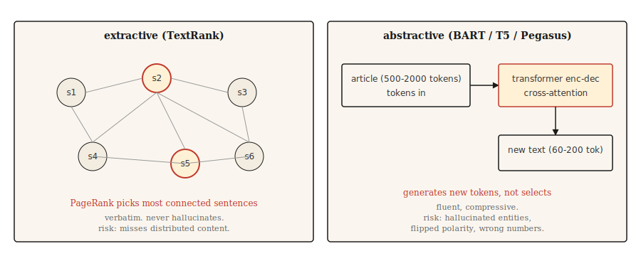

# Text Summarization

> Extractive systems tell you what the document said. Abstractive systems tell you what the author meant. Different tasks, different pitfalls.

**Type:** Build
**Languages:** Python
**Prerequisites:** Phase 5 · 02 (BoW + TF-IDF), Phase 5 · 11 (Machine Translation)
**Time:** ~75 min

## The Problem

A 2000-word news article lands in your feed. You need 120 words to explain it. You either pick the three most important sentences from the article (extractive) or rewrite the content in your own words (abstractive). Both are called summarization. They are entirely different problems.

Extractive summarization is a ranking problem. Score each sentence, return the top-`k`. Output is always grammatical because it's copied verbatim. The risk is missing content scattered across the document.

Abstractive summarization is a generation problem. A transformer produces new text conditioned on the input. Output is fluent and well-compressed but may hallucinate facts not in the source. The risk is confident fabrication.

This lesson builds both, along with their respective failure modes.

## The Concept



**Extractive.** Treat the article as a graph where nodes are sentences and edges are similarities. Run PageRank (or similar) on the graph, scoring each sentence by how connected it is to everything else. The highest-scoring sentences are the summary. The classic implementation is **TextRank** (Mihalcea and Tarau, 2004).

**Abstractive.** Fine-tune a transformer encoder-decoder (BART, T5, Pegasus) on document-summary pairs. At inference the model reads the document and generates the summary token by token via cross-attention. Pegasus in particular uses a gap-sentence pretraining objective that makes it good at summarization with less fine-tuning.

Evaluate with **ROUGE** (Recall-Oriented Understudy for Gisting Evaluation). ROUGE-1 and ROUGE-2 score unigram and bigram overlap. ROUGE-L scores the longest common subsequence. Higher is better, but 40 ROUGE-L is "good" and 50 is "excellent." Report all three in every paper. Use the `rouge-score` package.

## Build It

### Step 1: TextRank (extractive)

```python
import math
import re
from collections import Counter


def sentence_split(text):
    return re.split(r"(?<=[.!?])\s+", text.strip())


def similarity(s1, s2):
    w1 = Counter(s1.lower().split())
    w2 = Counter(s2.lower().split())
    intersection = sum((w1 & w2).values())
    denom = math.log(len(w1) + 1) + math.log(len(w2) + 1)
    if denom == 0:
        return 0.0
    return intersection / denom


def textrank(text, top_k=3, damping=0.85, iterations=50, epsilon=1e-4):
    sentences = sentence_split(text)
    n = len(sentences)
    if n <= top_k:
        return sentences

    sim = [[0.0] * n for _ in range(n)]
    for i in range(n):
        for j in range(n):
            if i != j:
                sim[i][j] = similarity(sentences[i], sentences[j])

    scores = [1.0] * n
    for _ in range(iterations):
        new_scores = [1 - damping] * n
        for i in range(n):
            total_out = sum(sim[i]) or 1e-9
            for j in range(n):
                if sim[i][j] > 0:
                    new_scores[j] += damping * sim[i][j] / total_out * scores[i]
        if max(abs(s - ns) for s, ns in zip(scores, new_scores)) < epsilon:
            scores = new_scores
            break
        scores = new_scores

    ranked = sorted(range(n), key=lambda k: scores[k], reverse=True)[:top_k]
    ranked.sort()
    return [sentences[i] for i in ranked]
```

Two things worth naming. The similarity function uses log-normalized word overlap — that's the original TextRank variant. Cosine over TF-IDF vectors also works. The damping factor 0.85 and iteration count are PageRank defaults.

### Step 2: Abstractive with BART

```python
from transformers import pipeline

summarizer = pipeline("summarization", model="facebook/bart-large-cnn")

article = """(long news article text)"""

summary = summarizer(article, max_length=120, min_length=60, do_sample=False)
print(summary[0]["summary_text"])
```

BART-large-CNN is fine-tuned on CNN/DailyMail. It produces news-style summaries out of the box. For other domains (scientific papers, dialogue, legal), use the corresponding Pegasus checkpoint or fine-tune on your target data.

### Step 3: ROUGE evaluation

```python
from rouge_score import rouge_scorer

scorer = rouge_scorer.RougeScorer(["rouge1", "rouge2", "rougeL"], use_stemmer=True)
scores = scorer.score(reference_summary, generated_summary)
print({k: round(v.fmeasure, 3) for k, v in scores.items()})
```

Always use stemming. Without it, "running" and "run" count as different words and ROUGE undercounts.

### Beyond ROUGE (summarization evaluation in 2026)

ROUGE dominated summarization evaluation for twenty years, but by 2026 it's insufficient on its own. A large-scale meta-analysis of NLG papers shows:

- **BERTScore** (contextual embedding similarity) gained traction through 2023 and is now reported alongside ROUGE in most summarization papers.
- **BARTScore** treats evaluation as generation: scores a summary by how likely a pretrained BART assigns it given the source.
- **MoverScore** (Earth Mover's Distance over contextual embeddings) topped 2025 summarization benchmarks because it captures semantic overlap better than ROUGE.
- **FactCC** and **QA-based faithfulness** were common in 2021–2023 and are now often replaced by **G-Eval** (a GPT-4 prompt chain that scores coherence, consistency, fluency, and relevance using chain-of-thought reasoning).
- **G-Eval** and similar LLM-as-judge methods correlate ~80% with human judgment when the rubric is well-designed.

Production recommendation: report ROUGE-L for historical comparison, BERTScore for semantic overlap, G-Eval for coherence and factuality. Calibrate against 50–100 human-annotated summaries.

### Step 4: The factuality problem

Abstractive summaries hallucinate. Extractive summaries have much lower hallucination risk because the output is copied verbatim from the source — though they can still mislead if source sentences are quoted out of context, are outdated, or are presented in scrambled order. This is the single biggest reason production systems still prefer extractive approaches for compliance-sensitive content.

Hallucination types to name:

- **Entity swap.** Source says "John Smith," summary says "John Brown."
- **Number drift.** Source says "25,000," summary says "25 million."
- **Polarity flip.** Source says "rejected the offer," summary says "accepted the offer."
- **Fabricated facts.** Source doesn't mention a CEO; summary says the CEO approved it.

Evaluation methods that work:

- **FactCC.** A binary classifier trained on source-summary sentence entailment. Predicts factual/non-factual.
- **QA-based factuality.** Ask a QA model questions whose answers are in the source. If the summary supports different answers, flag.
- **Entity-level F1.** Compare named entities in source vs. summary. Entities appearing only in the summary are suspicious.

For any user-facing content where factuality matters (news, medical, legal, financial), extractive is the safer default. Abstractive requires a factuality check in the loop.

## Use It

The 2026 stack:

| Use case | Recommendation |
|---------|-------------|
| News, 3–5 sentence summary, English | `facebook/bart-large-cnn` |
| Scientific papers | `google/pegasus-pubmed` or a tuned T5 |
| Multi-document, long-form | Any 32k+ context LLM with a prompt |
| Dialogue summarization | `philschmid/bart-large-cnn-samsum` |
| Extractive, structurally low hallucination risk | TextRank or `sumy`'s LSA / LexRank |

In 2026, long-context LLMs often beat dedicated models when compute isn't a constraint. The tradeoff is cost and reproducibility; dedicated models give more consistent output.

## Ship It

Save as `outputs/skill-summary-picker.md`:

```markdown
---
name: summary-picker
description: Pick extractive or abstractive, named library, factuality check.
version: 1.0.0
phase: 5
lesson: 12
tags: [nlp, summarization]
---

Given a task (document type, compliance requirement, length, compute budget), output:

1. Approach. Extractive or abstractive. Explain in one sentence why.
2. Starting model / library. Name it. `sumy.TextRankSummarizer`, `facebook/bart-large-cnn`, `google/pegasus-pubmed`, or an LLM prompt.
3. Evaluation plan. ROUGE-1, ROUGE-2, ROUGE-L (use rouge-score with stemming). Plus factuality check if abstractive.
4. One failure mode to probe. Entity swap is the most common in abstractive news summarization; flag samples where source entities do not appear in summary.

Refuse abstractive summarization for medical, legal, financial, or regulated content without a factuality gate. Flag input over the model's context window as needing chunked map-reduce summarization (not just truncation).
```

## Exercises

1. **Easy.** Run TextRank on 5 news articles. Compare the top-3 sentences against a reference summary. Measure ROUGE-L. You should see 30–45 ROUGE-L on CNN/DailyMail-style articles.
2. **Medium.** Implement entity-level factuality: extract named entities from source and summary (spaCy), compute recall of source entities in summary and precision of summary entities relative to source. High precision, low recall means safe but terse; low precision means hallucinated entities.
3. **Hard.** Compare BART-large-CNN against an LLM (Claude or GPT-4) on 50 CNN/DailyMail articles. Report ROUGE-L, factuality (entity F1), and cost per summary. Document where each wins.

## Key Terms

| Term | What people say | What it actually is |
|------|-----------------|-----------------------|
| Extractive | Pick sentences | Return sentences verbatim from the source. Never hallucinates. |
| Abstractive | Rewrite | Generate new text conditioned on the source. May hallucinate. |
| ROUGE | Summarization metric | N-gram / LCS overlap between system output and reference. |
| TextRank | Graph-based extractive | Run PageRank on a sentence similarity graph. |
| Factuality | Is it correct | Whether the summary's claims are supported by the source. |
| Hallucination | Made-up content | Content in the summary unsupported by the source. |

## Further Reading

- [Mihalcea and Tarau (2004). TextRank: Bringing Order into Texts](https://aclanthology.org/W04-3252/) — The classic extractive paper.
- [Lewis et al. (2019). BART: Denoising Sequence-to-Sequence Pre-training](https://arxiv.org/abs/1910.13461) — The BART paper.
- [Zhang et al. (2019). PEGASUS: Pre-training with Extracted Gap-sentences](https://arxiv.org/abs/1912.08777) — Pegasus and the gap-sentence objective.
- [Lin (2004). ROUGE: A Package for Automatic Evaluation of Summaries](https://aclanthology.org/W04-1013/) — The ROUGE paper.
- [Maynez et al. (2020). On Faithfulness and Factuality in Abstractive Summarization](https://arxiv.org/abs/2005.00661) — The factuality landscape paper.
