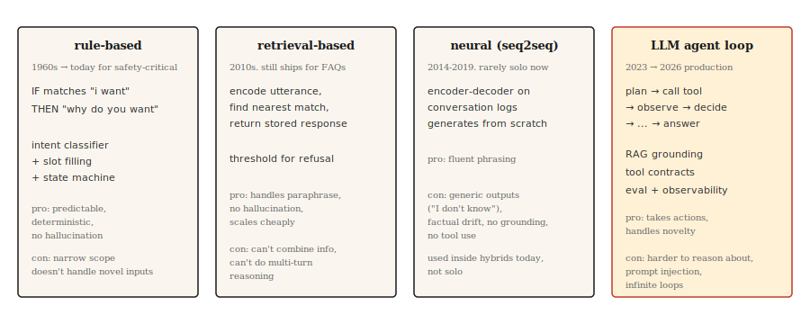

# Chatbots — From Rules to Neural to LLM Agents

> ELIZA replied with pattern matching. DialogFlow mapped intents. GPT answered from weights. Claude runs tools and verifies. Each era solved the previous era's most visible failure.

**Type:** Learn
**Languages:** Python
**Prerequisites:** Phase 5 · 13 (question answering), Phase 5 · 14 (information retrieval)
**Time:** ~75 minutes

## The Problem

The user says "I want to change my flight." The system must figure out what they want, what information is missing, how to get it, and how to complete the action. Then the user says "wait, what if I cancel instead?" and the system must remember context, switch tasks, and preserve state.

Dialogue is hard for ML systems. Input is open-ended. Output must stay coherent across many turns. The system may need to take actions on the world (rebook, charge). Every misstep is visible to the user.

Chatbot architectures have cycled through four paradigms, each introduced because the previous one failed too visibly. This lesson walks through them in order. The 2026 production landscape is a hybrid of the last two.

## The Concept



**Rule-based (ELIZA, AIML, DialogFlow).** Hand-authored patterns match user input and produce replies. Intent classifiers route requests to predefined flows. Slot-filling state machines collect required information. Works beautifully within its designed narrow scope, breaks immediately outside it. Still used in safety-critical domains where hallucination is intolerable (bank authentication, flight booking).

**Retrieval-based.** A FAQ-style system. Encode every (utterance, response) pair. At runtime, encode the user's message and retrieve the closest stored response. Think Zendesk's classic "similar articles" feature. Handles paraphrases better than rules. Doesn't generate, so doesn't hallucinate.

**Neural (seq2seq).** Encoder-decoder trained on dialogue logs. Generates responses from scratch. Fluent, but prone to generic output ("I don't know") and factual drift. Never reliably on-topic. This is why Google, Facebook, and Microsoft all shipped disappointing chatbots from 2016–2019.

**LLM agent.** A language model wrapped in a loop that plans, calls tools, and verifies results. This isn't a chatbot with a long prompt — it's an agent loop: plan → call tool → observe result → decide next step. Retrieval-first grounding (RAG) keeps it from hallucinating. Tool calls let it actually do things. This is the 2026 architecture.

These four paradigms don't replace each other sequentially. A 2026 production chatbot crosses all four: rules for authentication and destructive actions, retrieval for FAQ, neural generation for natural phrasing, LLM agent for ambiguous open-ended queries.

## Build It

### Step 1: Rule-based pattern matching

```python
import re


class RulePattern:
    def __init__(self, pattern, response_template):
        self.regex = re.compile(pattern, re.IGNORECASE)
        self.template = response_template


PATTERNS = [
    RulePattern(r"my name is (\w+)", "Nice to meet you, {0}."),
    RulePattern(r"i (need|want) (.+)", "Why do you {0} {1}?"),
    RulePattern(r"i feel (.+)", "Why do you feel {0}?"),
    RulePattern(r"(.*)", "Tell me more about that."),
]


def rule_based_respond(user_input):
    for pattern in PATTERNS:
        m = pattern.regex.match(user_input.strip())
        if m:
            return pattern.template.format(*m.groups())
    return "I don't understand."
```

A 20-line ELIZA. The reflection trick ("I feel sad" → "Why do you feel sad") is Weizenbaum's classic 1966 therapist demo. Still instructive today.

### Step 2: Retrieval-based (FAQ)

This example snippet requires `pip install sentence-transformers` (which pulls in torch). The runnable `code/main.py` for this lesson uses standard-library Jaccard similarity instead, so the lesson runs without external dependencies.

```python
from sentence_transformers import SentenceTransformer
import numpy as np


FAQ = [
    ("how do i reset my password", "Go to Settings > Security > Reset Password."),
    ("how do i cancel my order", "Go to Orders, find the order, click Cancel."),
    ("what is your return policy", "30-day returns on unused items, original packaging."),
]


encoder = SentenceTransformer("sentence-transformers/all-MiniLM-L6-v2")
faq_questions = [q for q, _ in FAQ]
faq_embeddings = encoder.encode(faq_questions, normalize_embeddings=True)


def faq_respond(user_input, threshold=0.5):
    q_emb = encoder.encode([user_input], normalize_embeddings=True)[0]
    sims = faq_embeddings @ q_emb
    best = int(np.argmax(sims))
    if sims[best] < threshold:
        return None
    return FAQ[best][1]
```

Threshold-based refusal is the key design choice. If the best match isn't close enough, return `None` and let the system escalate.

### Step 3: Neural generation (baseline)

Uses a small instruction-tuned encoder-decoder (FLAN-T5) or a fine-tuned conversational model. In 2026 it's not production-viable alone (self-contradictions, off-topic drift, factual confabulation), but in a hybrid system it handles natural phrasing. DialoGPT-style decoder-only models need explicit turn separators and EOS handling for coherent replies; a FLAN-T5 text2text pipeline works out of the box and suits a teaching example.

```python
from transformers import pipeline

chatbot = pipeline("text2text-generation", model="google/flan-t5-small")

response = chatbot("Respond politely to: Hi there!", max_new_tokens=40)
print(response[0]["generated_text"])
```

### Step 4: LLM agent loop

The 2026 production form:

```python
def agent_loop(user_message, tools, llm, max_steps=5):
    history = [{"role": "user", "content": user_message}]
    for _ in range(max_steps):
        response = llm(history, tools=tools)
        tool_call = response.get("tool_call")
        if tool_call:
            tool_name = tool_call.get("name")
            args = tool_call.get("arguments")
            if not isinstance(tool_name, str) or tool_name not in tools:
                history.append({"role": "assistant", "tool_call": tool_call})
                history.append({"role": "tool", "name": str(tool_name), "content": f"error: unknown tool {tool_name!r}"})
                continue
            if not isinstance(args, dict):
                history.append({"role": "assistant", "tool_call": tool_call})
                history.append({"role": "tool", "name": tool_name, "content": f"error: arguments must be a dict, got {type(args).__name__}"})
                continue
            fn = tools[tool_name]
            result = fn(**args)
            history.append({"role": "assistant", "tool_call": tool_call})
            history.append({"role": "tool", "name": tool_name, "content": result})
        else:
            return response["content"]
    return "I could not complete the task in the step budget."
```

Three things to note. Tools are callable functions the LLM can invoke. The loop terminates when the LLM returns a final answer instead of a tool call. The step budget prevents infinite loops on ambiguous tasks.

Real production adds: retrieval-first grounding (inject relevant documents before each LLM call), guardrails (refuse destructive actions without confirmation), observability (log every step), evaluation (automated checks that agent behavior stays on-policy).

### Step 5: Hybrid routing

```python
def hybrid_chat(user_input):
    if is_destructive_action(user_input):
        return structured_flow(user_input)

    faq_answer = faq_respond(user_input, threshold=0.6)
    if faq_answer:
        return faq_answer

    return agent_loop(user_input, tools, llm)


def is_destructive_action(text):
    danger_words = ["delete", "cancel", "charge", "refund", "transfer"]
    return any(w in text.lower() for w in danger_words)
```

The pattern: anything destructive goes through deterministic rules, boilerplate FAQ goes through retrieval, everything else goes to the LLM agent. This is what ships in 2026 customer service systems.

## Use It

The 2026 stack:

| Use case | Architecture |
|----------|--------------|
| Booking, payments, authentication | Rule-based state machine + slot filling |
| Customer service FAQ | Retrieval over curated answers |
| Open-ended help conversations | LLM agent with RAG + tool calling |
| Internal tools / IDE assistants | LLM agent with tool calling (search, read, write) |
| Companion / persona chatbots | Fine-tuned LLM with persona system prompt, retrieval over lore |

Always use hybrid routing in production. No single architecture handles every request well. The routing layer itself is typically a small intent classifier.

## Failure Modes Still Shipping Today

- **Confident fabrication.** The LLM agent claims to have completed an action it didn't perform. Mitigation: verify results, log tool calls, never let the LLM claim it did something without a successful tool return.
- **Prompt injection.** The user inserts text to override the system prompt. Ranked #1 (LLM01) in the OWASP Top 10 for LLM Applications 2025. Two flavors: direct injection (pasted into the chat) and indirect injection (hidden in documents, emails, or tool outputs the agent reads).

  Attack success rates vary by scenario. On general tool-use and coding benchmarks, measured success rates against frontier models range from ~0.5–8.5%. Specific high-risk settings (adaptive attacks targeting AI coding agents, fragile orchestration) have reached ~84%. A production CVE is EchoLeak (CVE-2025-32711, CVSS 9.3) — a zero-click data exfiltration vulnerability in Microsoft 365 Copilot triggered by an attacker-controlled email.

  Mitigation: treat user input as untrusted throughout the loop; sanitize before tool calls; isolate tool outputs from the main prompt; use the Plan-Verify-Execute (PVE) pattern where the agent plans first, then verifies each action against the plan before executing (this prevents tool results from injecting new, unplanned actions); require user confirmation for destructive actions; enforce least-privilege on tool permissions.

  No amount of prompt engineering fully eliminates this risk. External runtime defense layers are needed (LLM Guard, allowlist validation, semantic anomaly detection).

- **Scope creep.** The agent goes off-topic because a tool call returned tangentially related information. Mitigation: narrow tool contracts; keep the system prompt focused; add evaluation for off-topic rate.
- **Infinite loops.** The agent keeps calling the same tool. Mitigation: step budget, tool-call deduplication, LLM judge for "are we making progress."
- **Context window exhaustion.** Long conversations push the earliest turns out of context. Mitigation: summarize old turns, retrieve relevant past turns by similarity, or use long-context models.

## Ship It

Save as `outputs/skill-chatbot-architect.md`:

```markdown
---
name: chatbot-architect
description: Design a chatbot stack for a given use case.
version: 1.0.0
phase: 5
lesson: 17
tags: [nlp, agents, chatbot]
---

Given a product context (user need, compliance constraints, available tools, data volume), output:

1. Architecture. Rule-based, retrieval, neural, LLM agent, or hybrid (specify which paths go where).
2. LLM choice if applicable. Name the model family (Claude, GPT-4, Llama-3.1, Mixtral). Match to tool-use quality and cost.
3. Grounding strategy. RAG sources, retrieval method (see lesson 14), tool contracts.
4. Evaluation plan. Task success rate, tool-call correctness, off-task rate, hallucination rate on held-out dialogs.

Refuse to recommend a pure-LLM agent for any destructive action (payments, account deletion, data modification) without a structured confirmation flow. Refuse to skip the prompt-injection audit if the agent has write access to anything.
```

## Exercises

1. **Easy.** Implement the rule-based responder above with 10 patterns for a coffee shop ordering bot. Test edge cases: duplicate orders, modifications, cancellations, unclear intent.
2. **Medium.** Build a hybrid FAQ + LLM fallback. Prepare 50 boilerplate FAQ entries for a SaaS product with the LLM fallback doing retrieval over the docs site. Test refusal rate and accuracy on 100 real customer service questions.
3. **Hard.** Implement the agent loop above with three tools (search, read user data, send email). Run an evaluation over 50 test scenarios (including prompt injection attempts). Report off-topic rate, failed task rate, and any successful injections.

## Key Terms

| Term | What people say | What it actually is |
|------|-----------------|---------------------|
| Intent | What the user wants | A category label (book_flight, reset_password). Routes to a handler. |
| Slot | A piece of information | A parameter the bot needs (date, destination). Slot filling is a sequence of prompts. |
| RAG | Retrieval plus generation | Retrieve relevant documents, then ground the LLM's response. |
| Tool call | Function call | The LLM emits a structured call with name + arguments. Runtime executes it and returns the result. |
| Agent loop | Plan, act, verify | A controller that interleaves LLM calls with tool calls until the task is done. |
| Prompt injection | User attacks the prompt | Malicious input that attempts to override the system prompt. |

## Further Reading

- [Weizenbaum (1966). ELIZA — A Computer Program For the Study of Natural Language Communication](https://web.stanford.edu/class/cs124/p36-weizenabaum.pdf) — The original rule-based chatbot paper.
- [Thoppilan et al. (2022). LaMDA: Language Models for Dialog Applications](https://arxiv.org/abs/2201.08239) — Google's late-era neural chatbot paper, just before LLM agents took over.
- [Yao et al. (2022). ReAct: Synergizing Reasoning and Acting in Language Models](https://arxiv.org/abs/2210.03629) — The paper that named the agent loop pattern.
- [Anthropic's guide on building effective agents](https://www.anthropic.com/research/building-effective-agents) — A 2024 production guide that still holds in 2026.
- [Greshake et al. (2023). Not what you've signed up for: Compromising Real-World LLM-Integrated Applications with Indirect Prompt Injection](https://arxiv.org/abs/2302.12173) — The prompt injection paper.
- [OWASP Top 10 for LLM Applications 2025 — LLM01 Prompt Injection](https://genai.owasp.org/llmrisk/llm01-prompt-injection/) — The ranking that made prompt injection the #1 security concern.
- [AWS — Securing Amazon Bedrock Agents against Indirect Prompt Injections](https://aws.amazon.com/blogs/machine-learning/securing-amazon-bedrock-agents-a-guide-to-safeguarding-against-indirect-prompt-injections/) — Practical orchestration-layer defenses including Plan-Verify-Execute and user confirmation flows.
- [EchoLeak (CVE-2025-32711)](https://www.vectra.ai/topics/prompt-injection) — A classic CVE where indirect prompt injection led to zero-click data exfiltration. Reference case for why agents with write access need runtime defenses.
