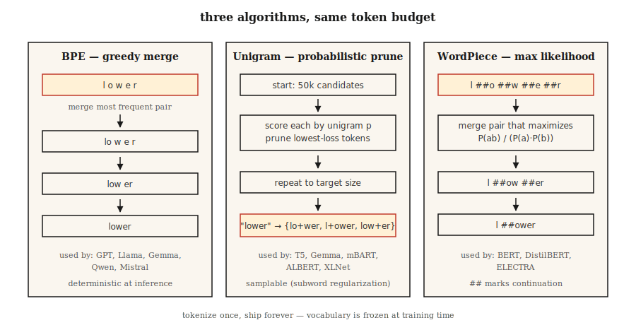

# Subword Tokenization — BPE, WordPiece, Unigram, SentencePiece

> Word-level tokenizers choke on unseen words. Character-level tokenizers explode sequence length. Subword tokenizers split the difference. Every modern LLM ships on one.

**Type:** Learn
**Languages:** Python
**Prerequisites:** Phase 5 · 01 (Text Processing), Phase 5 · 04 (GloVe / FastText / Subwords)
**Time:** ~60 min

## The Problem

Your vocabulary has 50,000 words. A user types "untokenizable". Your tokenizer returns `[UNK]`. The model now has zero signal for that word. Worse: the 90th-percentile document in your corpus has 40 rare words, meaning 40 bits of information lost per document.

Subword tokenization fixes this. Common words stay as single tokens. Rare words decompose into meaningful pieces: `untokenizable` → `un`, `token`, `izable`. Training data covers everything because any string ultimately reduces to a sequence of bytes.

Every frontier LLM in 2026 ships on one of three algorithms (BPE, Unigram, WordPiece), wrapped in one of three libraries (tiktoken, SentencePiece, HF Tokenizers). You cannot ship a language model without picking one.

## The Concept



**BPE (Byte Pair Encoding).** Start with a character-level vocabulary. Count every adjacent pair. Merge the most frequent pair into a new token. Repeat until you hit the target vocabulary size. Dominant algorithm: GPT-2/3/4, Llama, Gemma, Qwen2, Mistral.

**Byte-level BPE.** Same algorithm but operates on raw bytes (256 base tokens) rather than Unicode characters. Guarantees zero `[UNK]` tokens — any byte sequence is encodable. GPT-2 uses 50,257 tokens (256 bytes + 50,000 merges + 1 special token).

**Unigram.** Start with a huge vocabulary. Assign each token a unigram probability. Iteratively prune tokens whose removal least increases corpus log-likelihood. Inference is probabilistic: can sample segmentations (useful for data augmentation via subword regularization). Used by T5, mBART, ALBERT, XLNet, Gemma.

**WordPiece.** Merges pairs that maximize training corpus likelihood rather than raw frequency. Used by BERT, DistilBERT, ELECTRA.

**SentencePiece vs tiktoken.** SentencePiece is the library that *trains* a vocabulary (BPE or Unigram) directly on raw Unicode text, encoding whitespace as `▁`. tiktoken is OpenAI's fast *encoder* for pre-built vocabularies; it does not train. 

Rules of thumb:

- **Training a new vocabulary:** SentencePiece (multilingual, no pre-tokenization needed) or HF Tokenizers.
- **Fast inference against GPT vocabularies:** tiktoken (cl100k_base, o200k_base).
- **Both:** HF Tokenizers — one library, train + serve.

## Build It

### Step 1: BPE from scratch

See `code/main.py`. The loop:

```python
def train_bpe(corpus, num_merges):
    vocab = {tuple(word) + ("</w>",): count for word, count in corpus.items()}
    merges = []
    for _ in range(num_merges):
        pairs = Counter()
        for symbols, freq in vocab.items():
            for a, b in zip(symbols, symbols[1:]):
                pairs[(a, b)] += freq
        if not pairs:
            break
        best = pairs.most_common(1)[0][0]
        merges.append(best)
        vocab = apply_merge(vocab, best)
    return merges
```

The algorithm encodes three facts. `</w>` marks word boundaries, keeping "low" (suffix) distinguishable from "lower" (prefix). Frequency weighting lets high-frequency pairs win early. The merge list is ordered — at inference time, merges are applied in training order.

### Step 2: Encoding with learned merges

```python
def encode_bpe(word, merges):
    symbols = list(word) + ["</w>"]
    for a, b in merges:
        i = 0
        while i < len(symbols) - 1:
            if symbols[i] == a and symbols[i + 1] == b:
                symbols = symbols[:i] + [a + b] + symbols[i + 2:]
            else:
                i += 1
    return symbols
```

Naive O(n·|merges|). Production implementations (tiktoken, HF Tokenizers) use merge-rank lookups with priority queues, running in near-linear time.

### Step 3: SentencePiece in practice

```python
import sentencepiece as spm

spm.SentencePieceTrainer.train(
    input="corpus.txt",
    model_prefix="my_tokenizer",
    vocab_size=8000,
    model_type="bpe",          # or "unigram"
    character_coverage=0.9995, # lower for CJK (e.g., 0.9995 for English, 0.995 for Japanese)
    normalization_rule_name="nmt_nfkc",
)

sp = spm.SentencePieceProcessor(model_file="my_tokenizer.model")
print(sp.encode("untokenizable", out_type=str))
# ['▁un', 'token', 'izable']
```

Note: no pre-tokenization needed, whitespace encodes as `▁`, `character_coverage` controls how aggressively rare characters are kept vs mapped to `<unk>`.

### Step 4: tiktoken for OpenAI-compatible vocabularies

```python
import tiktoken
enc = tiktoken.get_encoding("o200k_base")
print(enc.encode("untokenizable"))        # [127340, 101028]
print(len(enc.encode("Hello, world!")))   # 4
```

Encoding only. Fast (Rust backend). Exactly matches GPT-4/5 tokenization for byte counting, cost estimation, and context-window budgeting.

## Pitfalls

- **Tokenizer drift.** Train on vocabulary A, deploy against vocabulary B. Token IDs differ; model outputs garbage. Check the `tokenizer.json` hash in CI.
- **Whitespace ambiguity.** "hello" vs " hello" produces different tokens in BPE. Always explicitly specify `add_special_tokens` and `add_prefix_space`.
- **Multilingual under-training.** English-heavy corpora produce vocabularies that segment non-Latin scripts into 5–10× more tokens. The same prompt in Japanese/Arabic costs 5–10× more on GPT-3.5. o200k_base partially fixes this.
- **Emoji segmentation.** A single emoji can consume 5 tokens. Verify emoji handling when budgeting context.

## Use It

2026 stack:

| Scenario | Choice |
|-----------|------|
| Training a monolingual model from scratch | HF Tokenizers (BPE) |
| Training a multilingual model | SentencePiece (Unigram, `character_coverage=0.9995`) |
| Serving an OpenAI-compatible API | tiktoken (`o200k_base` for GPT-4+) |
| Domain-specific vocabulary (code, math, protein) | Train custom BPE on domain corpus, merge with base vocabulary |
| Edge inference, small models | Unigram (smaller vocabularies perform better) |

Vocabulary size is a scaling decision, not a constant. Rough heuristic: <1B params → 32k, 1–10B → 50–100k, multilingual/frontier → 200k+.

## Ship It

Save as `outputs/skill-bpe-vs-wordpiece.md`:

```markdown
---
name: tokenizer-picker
description: Pick tokenizer algorithm, vocab size, library for a given corpus and deployment target.
version: 1.0.0
phase: 5
lesson: 19
tags: [nlp, tokenization]
---

Given a corpus (size, languages, domain) and deployment target (training from scratch / fine-tuning / API-compatible inference), output:

1. Algorithm. BPE, Unigram, or WordPiece. One-sentence reason.
2. Library. SentencePiece, HF Tokenizers, or tiktoken. Reason.
3. Vocab size. Rounded to nearest 1k. Reason tied to model size and language coverage.
4. Coverage settings. `character_coverage`, `byte_fallback`, special-token list.
5. Validation plan. Average tokens-per-word on held-out set, OOV rate, compression ratio, round-trip decode equality.

Refuse to train a character-coverage <0.995 tokenizer on corpora with rare-script content. Refuse to ship a vocab without a frozen `tokenizer.json` hash check in CI. Flag any monolingual tokenizer under 16k vocab as likely under-spec.
```

## Exercises

1. **Easy.** Train a 500-merge BPE on `code/main.py`'s small corpus. Encode three held-out words. How many produce exactly 1 token vs >1 token?
2. **Medium.** Compare token counts between `cl100k_base`, `o200k_base`, and a SentencePiece BPE you train with vocab=32k on 100 English Wikipedia sentences. Report compression ratios for each.
3. **Hard.** Train BPE, Unigram, and WordPiece on the same corpus. Use each in a small sentiment classifier. Measure downstream accuracy. Does the choice move the metric by more than 1 F1 point?

## Key Terms

| Term | What people say | What it actually is |
|------|-----------------|-----------------------|
| BPE | Byte Pair Encoding | Greedily merges the highest-frequency character pair until target vocab size is reached. |
| Byte-level BPE | Never produces unknown tokens | BPE on raw 256 bytes; used by GPT-2 / Llama. |
| Unigram | Probabilistic tokenizer | Prunes from a large candidate set using log-likelihood; used by T5, Gemma. |
| SentencePiece | The one that handles whitespace | Library that trains BPE/Unigram on raw text; encodes spaces as `▁`. |
| tiktoken | The fast one | OpenAI's Rust-based BPE encoder for pre-built vocabularies. Does not train. |
| Merge list | Those magic numbers | Ordered list of `(a, b) → ab` merges; applied in order at inference time. |
| Character coverage | How rare is too rare? | Fraction of training corpus characters the tokenizer must cover; ~0.9995 is typical. |

## Further Reading

- [Sennrich, Haddow, Birch (2015). Neural Machine Translation of Rare Words with Subword Units](https://arxiv.org/abs/1508.07909) — The BPE paper.
- [Kudo (2018). Subword Regularization with Unigram Language Model](https://arxiv.org/abs/1804.10959) — The Unigram paper.
- [Kudo, Richardson (2018). SentencePiece: A simple and language independent subword tokenizer](https://arxiv.org/abs/1808.06226) — The library.
- [Hugging Face — Summary of the tokenizers](https://huggingface.co/docs/transformers/tokenizer_summary) — Concise reference.
- [OpenAI tiktoken repo](https://github.com/openai/tiktoken) — Cookbook + encoding lists.
