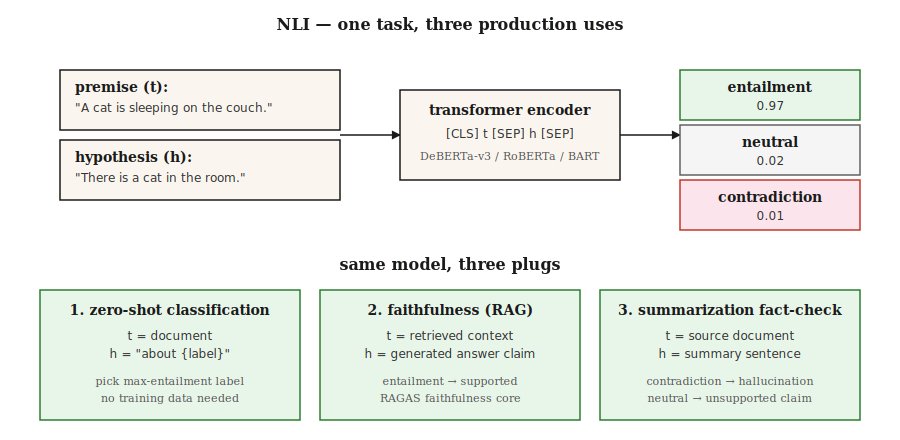

# Natural Language Inference — Textual Entailment

> "t entails h" means a reader of t would conclude h is true. NLI is the task of predicting entailment / contradiction / neutral. Seems boring on the surface, but it is a load-bearing wall in production.

**Type:** Learn
**Languages:** Python
**Prerequisites:** Phase 5 · 05 (Sentiment Analysis), Phase 5 · 13 (Question Answering)
**Time:** ~60 min

## The Problem

You built a summarizer. It produced a summary. How do you know the summary contains no hallucinations?

You built a chatbot. It answered "yes". How do you know that answer is supported by the retrieved passage?

You need to classify 10,000 news articles by topic. You have no training labels. Can you reuse a single model?

All three questions reduce to natural language inference. NLI asks: given premise `t` and hypothesis `h`, is `h` entailed by `t`, contradicted, or neutral (unrelated)?

- **Hallucination checking:** `t` = source document, `h` = summary claim. Not entailed = hallucination.
- **Grounded QA:** `t` = retrieved passage, `h` = generated answer. Not entailed = fabrication.
- **Zero-shot classification:** `t` = document, `h` = verbalized label ("This is about sports"). Entailment = predicted label.

One task, three production uses. This is why every RAG evaluation framework has an NLI model underneath.

## The Concept



**Three labels.**

- **Entailment.** `t` → `h`. "The cat is on the mat" entails "There is a cat".
- **Contradiction.** `t` → ¬`h`. "The cat is on the mat" contradicts "There is no cat".
- **Neutral.** Neither direction is inferable. "The cat is on the mat" is neutral toward "The cat is hungry".

**Not logical entailment.** NLI is *natural* language inference — what a typical human reader would infer, not strict logic. In NLI, "John walked his dog" entails "John has a dog", but strict first-order logic only accepts this once you axiomatize "ownership."

**Datasets.**

- **SNLI** (2015). 570k human-annotated pairs with image captions as premises. Narrow domain.
- **MultiNLI** (2017). 433k pairs across 10 genres. Standard training corpus in 2026.
- **ANLI** (2019). Adversarial NLI. Humans write examples specifically designed to break existing models. Harder.
- **DocNLI, ConTRoL** (2020–21). Document-length premises. Tests multi-hop and long-range reasoning.

**Architecture.** A transformer encoder (BERT, RoBERTa, DeBERTa) reads `[CLS] premise [SEP] hypothesis [SEP]`. The `[CLS]` representation feeds a 3-way softmax. Train on MNLI, evaluate on held-out benchmarks, achieve 90%+ accuracy on in-distribution pairs.

**Zero-shot via NLI.** Given a document and candidate labels, turn each label into a hypothesis ("This text is about sports"). Compute entailment probability for each. Take the argmax. This is the mechanism behind Hugging Face's `zero-shot-classification` pipeline.

## Build It

### Step 1: Run a pre-trained NLI model

```python
from transformers import pipeline

nli = pipeline("text-classification",
               model="facebook/bart-large-mnli",
               top_k=None)  # return all labels; replaces deprecated return_all_scores=True

premise = "The cat is sleeping on the couch."
hypothesis = "There is a cat in the room."

result = nli({"text": premise, "text_pair": hypothesis})[0]
print(result)
# [{'label': 'entailment', 'score': 0.97},
#  {'label': 'neutral', 'score': 0.02},
#  {'label': 'contradiction', 'score': 0.01}]
```

For production NLI, `facebook/bart-large-mnli` and `microsoft/deberta-v3-large-mnli` are the open-source defaults. DeBERTa-v3 tops the leaderboard.

### Step 2: Zero-shot classification

```python
zs = pipeline("zero-shot-classification", model="facebook/bart-large-mnli")

text = "The stock market rallied after the central bank cut interest rates."
labels = ["finance", "sports", "politics", "technology"]

result = zs(text, candidate_labels=labels)
print(result)
# {'labels': ['finance', 'politics', 'technology', 'sports'],
#  'scores': [0.92, 0.05, 0.02, 0.01]}
```

The default template is "This example is about {label}." Customize with `hypothesis_template`. No training data needed. No fine-tuning needed. Works out of the box.

### Step 3: Faithfulness checking for RAG

```python
def is_faithful(answer, context, threshold=0.5):
    result = nli({"text": context, "text_pair": answer})[0]
    entail = next(s for s in result if s["label"] == "entailment")
    return entail["score"] > threshold
```

This is the core of RAGAS faithfulness. Decompose the generated answer into atomic claims. Check each claim against the retrieved context. Report the fraction entailed.

### Step 4: Hand-built NLI classifier (conceptual)

See `code/main.py` for a standard-library-only toy implementation: premise and hypothesis compared via lexical overlap + negation detection. Cannot compete with transformer models — but it shows the task shape: two texts in, 3-way label out, loss = cross-entropy over `{entail, contradict, neutral}`.

## Pitfalls

- **Hypothesis-only shortcut.** Models can predict labels on SNLI at ~60% accuracy from the hypothesis alone, because "not", "nobody", "never" correlate with contradiction. This is a strong baseline for detecting label leakage.
- **Lexical overlap heuristic.** A subsequence heuristic ("every subsequence is entailed") passes SNLI but fails on HANS/ANLI. Use adversarial benchmarks.
- **Document-length degradation.** Single-sentence NLI models drop 20+ F1 on document-length premises. Use DocNLI-trained models for long contexts.
- **Zero-shot template sensitivity.** "This example is about {label}" vs "{label}" vs "The topic is {label}" can swing accuracy by 10+ points. Tune the template.
- **Domain mismatch.** MNLI trains on general English. Legal, medical, and scientific text need domain-specific NLI models (e.g., SciNLI, MedNLI).

## Use It

2026 stack:

| Use case | Model |
|---------|-------|
| General NLI | `microsoft/deberta-v3-large-mnli` |
| Fast / edge | `cross-encoder/nli-deberta-v3-base` |
| Zero-shot classification (lightweight) | `facebook/bart-large-mnli` |
| Document-level NLI | `MoritzLaurer/DeBERTa-v3-large-mnli-fever-anli-ling-wanli` |
| Multilingual | `MoritzLaurer/multilingual-MiniLMv2-L6-mnli-xnli` |
| Hallucination detection in RAG | NLI layer inside RAGAS / DeepEval |

2026 meta-pattern: NLI is the duct tape of text understanding. Whenever you need "does A support B?" or "does A contradict B?" — reach for NLI before reaching for another LLM call.

## Ship It

Save as `outputs/skill-nli-picker.md`:

```markdown
---
name: nli-picker
description: Pick an NLI model, label template, and evaluation setup for a classification / faithfulness / zero-shot task.
version: 1.0.0
phase: 5
lesson: 21
tags: [nlp, nli, zero-shot]
---

Given a use case (faithfulness check, zero-shot classification, document-level inference), output:

1. Model. Named NLI checkpoint. Reason tied to domain, length, language.
2. Template (if zero-shot). Verbalization pattern. Example.
3. Threshold. Entailment cutoff for the decision rule. Reason based on calibration.
4. Evaluation. Accuracy on held-out labeled set, hypothesis-only baseline, adversarial subset.

Refuse to ship zero-shot classification without a 100-example labeled sanity check. Refuse to use a sentence-level NLI model on document-length premises. Flag any claim that NLI solves hallucination — it reduces it; it does not eliminate it.
```

## Exercises

1. **Easy.** Run `facebook/bart-large-mnli` on 20 hand-crafted (premise, hypothesis, label) triples covering all three classes. Measure accuracy. Add adversarial "subsequence heuristic" traps ("I did not eat the cake" vs "I ate the cake") and see if it fails.
2. **Medium.** On 100 AG News headlines, compare zero-shot templates `"This text is about {label}"` vs `"The topic is {label}"` vs `"{label}"`. Report accuracy swing.
3. **Hard.** Build a RAG faithfulness checker: atomic claim decomposition + per-claim NLI. Evaluate on 50 RAG-generated answers with gold-standard contexts. Measure false-positive and false-negative rates against human labels.

## Key Terms

| Term | What people say | What it actually is |
|------|-----------------|-----------------------|
| NLI | Natural language inference | 3-way classification of premise–hypothesis relationships. |
| RTE | Recognizing textual entailment | Older name for NLI; same task. |
| Entailment | "t implies h" | Given t, a typical reader would conclude h is true. |
| Contradiction | "t excludes h" | Given t, a typical reader would conclude h is false. |
| Neutral | "undetermined" | Neither direction is inferable from t to h. |
| Zero-shot classification | Using NLI as a classifier | Verbalize labels as hypotheses, take the argmax entailment. |
| Faithfulness | Is the answer supported? | NLI over (retrieved context, generated answer). |

## Further Reading

- [Bowman et al. (2015). A large annotated corpus for learning natural language inference](https://arxiv.org/abs/1508.05326) — SNLI.
- [Williams, Nangia, Bowman (2017). A Broad-Coverage Challenge Corpus for Sentence Understanding through Inference](https://arxiv.org/abs/1704.05426) — MultiNLI.
- [Nie et al. (2019). Adversarial NLI](https://arxiv.org/abs/1910.14599) — The ANLI benchmark.
- [Yin, Hay, Roth (2019). Benchmarking Zero-shot Text Classification](https://arxiv.org/abs/1909.00161) — Using NLI as a classifier.
- [He et al. (2021). DeBERTa: Decoding-enhanced BERT with Disentangled Attention](https://arxiv.org/abs/2006.03654) — The 2026 NLI workhorse.
