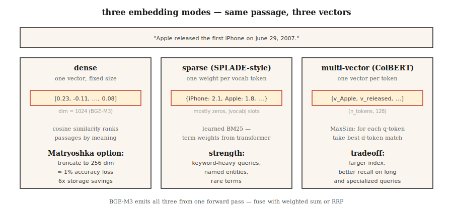

# Embedding Models — 2026 Deep Dive

> Word2Vec gives you one vector per word. Modern embedding models give you one vector per passage, across languages, with sparse, dense, and multi-vector views, dimensions tailored to your index. Pick wrong and your RAG retrieves the wrong thing.

**Type:** Learn
**Languages:** Python
**Prerequisites:** Phase 5 · 03 (Word2Vec), Phase 5 · 14 (Information Retrieval)
**Time:** ~60 min

## The Problem

Your RAG system retrieves the wrong passage 40% of the time. The culprit is rarely the vector database or the prompt — it is the embedding model.

Picking an embedding in 2026 means navigating trade-offs across five dimensions:

1. **Dense vs sparse vs multi-vector.** One vector per passage, one vector per token, or a sparse weighted bag-of-words.
2. **Language coverage.** On English-only tasks, monolingual English models still win. When the corpus is mixed, multilingual models win.
3. **Context length.** 512 tokens vs 8192 vs 32768 — and real effective capacity is often only 60–70% of the stated limit.
4. **Dimension budget.** 3072 floats at full precision = 12 KB per vector. At 100M vectors, storage is $1,300/month. Matryoshka truncation cuts it 4×.
5. **Open-weight vs hosted.** Open weights mean you control the full stack and your data. Hosted means you trade control for always-up-to-date.

This lesson maps the trade-offs so you pick based on evidence, not last quarter's hype.

## The Concept



**Dense embeddings.** One vector per passage (typically 384–3072 dims). Cosine similarity ranks passages by semantic proximity. OpenAI `text-embedding-3-large`, BGE-M3 dense mode, Voyage-3. The default choice.

**Sparse embeddings.** SPLADE-style. A transformer predicts a weight for each vocabulary token, then zeros out most of them. The result is a sparse vector of size |vocab|. Captures lexical matches (like BM25) but with learned term weights. Strong on keyword-heavy queries.

**Multi-vector (late interaction).** ColBERTv2, Jina-ColBERT. One vector per token. Scoring via MaxSim: for each query token, find the most similar document token, sum the scores. More expensive to store and score, but wins on long queries and domain-specific corpora.

**BGE-M3: all three in one pass.** A single model outputs dense, sparse, and multi-vector representations simultaneously. Each can be queried independently; scores fuse via weighted sum. The 2026 default when you want flexibility from a single checkpoint.

**Matryoshka Representation Learning.** Trained so the first N dimensions of the vector form a useful standalone embedding. Truncate a 1536-dim vector to 256 dims and trade ~1% accuracy for 6× storage savings. Supported by OpenAI text-3, Cohere v4, Voyage-4, Jina v5, Gemini Embedding 2, Nomic v1.5+.

### MTEB leaderboard tells only half the story

Massive Text Embedding Benchmark — 56 tasks across 8 task types at publication (2022), expanded to 100+ tasks by MTEB v2. As of early 2026, Gemini Embedding 2 tops the retrieval board (67.71 MTEB-R). Cohere embed-v4 leads overall (65.2 MTEB). BGE-M3 leads open-weight multilingual (63.0). The leaderboard is necessary but not sufficient — always benchmark on your domain.

### Three-tier pattern

| Use case | Mode |
|----------|---------|
| Fast first pass | Dense bi-encoder (BGE-M3, text-3-small) |
| Recall boost | Sparse (SPLADE, BGE-M3 sparse) + RRF fusion |
| Precision on top-50 | Multi-vector (ColBERTv2) or cross-encoder reranker |

Most production stacks use all three.

## Build It

### Step 1: Baseline — dense embedding with Sentence-BERT

```python
from sentence_transformers import SentenceTransformer
import numpy as np

encoder = SentenceTransformer("BAAI/bge-small-en-v1.5")
corpus = [
    "The first iPhone launched in 2007.",
    "Apple released the iPod in 2001.",
    "Android is an operating system from Google.",
]
emb = encoder.encode(corpus, normalize_embeddings=True)

query = "When was the iPhone released?"
q_emb = encoder.encode([query], normalize_embeddings=True)[0]
scores = emb @ q_emb
print(sorted(enumerate(scores), key=lambda x: -x[1]))
```

`normalize_embeddings=True` makes dot product equal cosine similarity. Always set it.

### Step 2: Matryoshka truncation

```python
def truncate(vectors, dim):
    out = vectors[:, :dim]
    return out / np.linalg.norm(out, axis=1, keepdims=True)

emb_256 = truncate(emb, 256)
emb_128 = truncate(emb, 128)
```

Re-normalize after truncation. Nomic v1.5, OpenAI text-3, and Voyage-4 are trained so the first several tiers work losslessly. Non-Matryoshka models (original Sentence-BERT) degrade sharply when truncated.

### Step 3: BGE-M3 multi-mode

```python
from FlagEmbedding import BGEM3FlagModel

model = BGEM3FlagModel("BAAI/bge-m3", use_fp16=True)

output = model.encode(
    corpus,
    return_dense=True,
    return_sparse=True,
    return_colbert_vecs=True,
)
# output["dense_vecs"]:    (n_docs, 1024)
# output["lexical_weights"]: list of dict {token_id: weight}
# output["colbert_vecs"]:  list of (n_tokens, 1024) arrays
```

Three indexes from a single inference call. Score fusion:

```python
dense_score = ... # cosine on dense vectors
sparse_score = model.compute_lexical_matching_score(q_lex, d_lex)
colbert_score = model.colbert_score(q_col, d_col)
final = 0.4 * dense_score + 0.2 * sparse_score + 0.4 * colbert_score
```

Tune the weights on your domain.

### Step 4: MTEB evaluation on a custom task

```python
from mteb import MTEB

tasks = ["ArguAna", "SciFact", "NFCorpus"]
evaluation = MTEB(tasks=tasks)
results = evaluation.run(encoder, output_folder="./mteb-results")
```

Run your candidate models on a *representative* subset. Do not trust leaderboard rankings alone — your domain is what matters.

### Step 5: Cosine from scratch

See `code/main.py`. Averaged hash-trick embeddings (standard library only). Cannot compete with transformer embeddings, but shows the shape: tokenize → vector → normalize → dot product.

## Pitfalls

- **Same model for queries and documents.** Some models (Voyage, Jina-ColBERT) use asymmetric encoding — queries and documents take different paths. Always check the model card.
- **Missing prefix.** `bge-*` models require prepending `"Represent this sentence for searching relevant passages: "` to queries. Forgetting it costs 3–5 recall points.
- **Over-truncating Matryoshka.** 1536 → 256 is usually safe. 1536 → 64 is not. Validate on your eval set.
- **Context truncation.** Most models silently truncate inputs beyond max length. Long documents need chunking (see Lesson 23).
- **Ignoring the latency tail.** MTEB scores hide p99 latency. A 600M model may score 2 points higher than a 335M model but cost 3× per query.

## Use It

2026 stack:

| Scenario | Choice |
|-----------|------|
| English-only, fast, API | `text-embedding-3-large` or `voyage-3-large` |
| Open weights, English | `BAAI/bge-large-en-v1.5` |
| Open weights, multilingual | `BAAI/bge-m3` or `Qwen3-Embedding-8B` |
| Long context (32k+) | Voyage-3-large, Cohere embed-v4, Qwen3-Embedding-8B |
| CPU-only deployment | Nomic Embed v2 (137M params, MoE) |
| Storage-constrained | Matryoshka truncation + int8 quantization |
| Keyword-heavy queries | Add SPLADE sparse, RRF-fuse with dense |

2026 pattern: start with BGE-M3 or text-3-large, evaluate on your domain via MTEB, switch if a domain-specific model wins by more than 3 points.

## Ship It

Save as `outputs/skill-embedding-picker.md`:

```markdown
---
name: embedding-picker
description: Pick embedding model, dimension, and retrieval mode for a given corpus and deployment.
version: 1.0.0
phase: 5
lesson: 22
tags: [nlp, embeddings, retrieval]
---

Given a corpus (size, languages, domain, avg length), deployment target (cloud / edge / on-prem), latency budget, and storage budget, output:

1. Model. Named checkpoint or API. One-sentence reason.
2. Dimension. Full / Matryoshka-truncated / int8-quantized. Reason tied to storage budget.
3. Mode. Dense / sparse / multi-vector / hybrid. Reason.
4. Query prefix / template if required by the model card.
5. Evaluation plan. MTEB tasks relevant to domain + held-out domain eval with nDCG@10.

Refuse recommendations that truncate Matryoshka to <64 dims without domain validation. Refuse ColBERTv2 for corpora under 10k passages (overhead not justified). Flag long-document corpora (>8k tokens) routed to models with 512-token windows.
```

## Exercises

1. **Easy.** Encode 100 sentences with `bge-small-en-v1.5` at full dimension (384) and at Matryoshka 128. Measure MRR drop on 10 queries.
2. **Medium.** Compare BGE-M3 dense, sparse, and colbert on 500 passages from your domain. Which wins on recall@10? Does RRF fusion beat the best single mode?
3. **Hard.** Run MTEB on three candidate models for your 2 most important domain tasks. Report MTEB scores, p99 latency on a 100-query batch, and cost per million queries. Pick the Pareto-optimal one.

## Key Terms

| Term | What people say | What it actually is |
|------|-----------------|-----------------------|
| Dense embedding | The vector | One fixed-length vector per text. Ranked by cosine similarity. |
| Sparse embedding | Learned BM25 | One weight per vocabulary token; mostly zeros; trained end-to-end. |
| Multi-vector | ColBERT-style | One vector per token; MaxSim scoring; larger index, better recall. |
| Matryoshka | Russian-doll trick | First N dimensions are a valid smaller embedding on their own. |
| MTEB | The benchmark | Massive Text Embedding Benchmark — 56 tasks at publication, 100+ in v2. |
| BEIR | The retrieval benchmark | 18 zero-shot retrieval tasks; commonly used to measure cross-domain robustness. |
| Asymmetric encoding | Query ≠ document path | Model uses different projections for queries and documents. |

## Further Reading

- [Reimers, Gurevych (2019). Sentence-BERT](https://arxiv.org/abs/1908.10084) — The bi-encoder paper.
- [Muennighoff et al. (2022). MTEB: Massive Text Embedding Benchmark](https://arxiv.org/abs/2210.07316) — The leaderboard paper.
- [Chen et al. (2024). BGE-M3: Multi-lingual, Multi-functionality, Multi-granularity](https://arxiv.org/abs/2402.03216) — The unified tri-mode model.
- [Kusupati et al. (2022). Matryoshka Representation Learning](https://arxiv.org/abs/2205.13147) — Dimension-ladder training objective.
- [Santhanam et al. (2022). ColBERTv2: Effective and Efficient Retrieval via Lightweight Late Interaction](https://arxiv.org/abs/2112.01488) — Late interaction in production.
- [MTEB leaderboard on Hugging Face](https://huggingface.co/spaces/mteb/leaderboard) — Live rankings.
