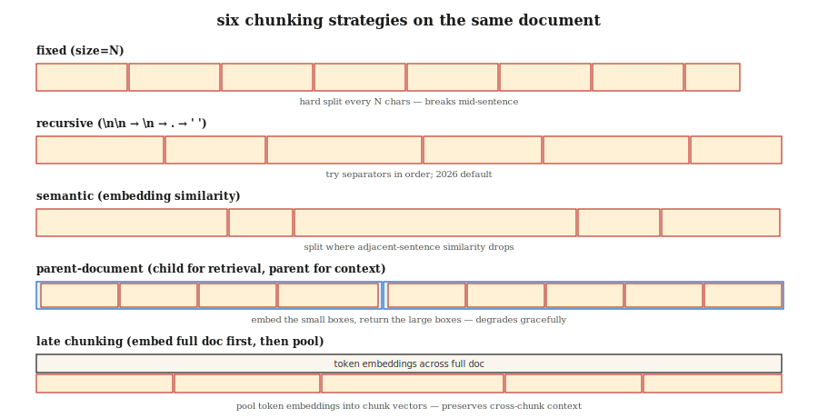

# Chunking Strategies for RAG

> Chunking configuration affects retrieval quality as much as embedding model choice (Vectara NAACL 2025). Get chunking wrong and no amount of reranking saves you.

**Type:** Build
**Languages:** Python
**Prerequisites:** Phase 5 · 14 (Information Retrieval), Phase 5 · 22 (Embedding Models)
**Time:** ~60 min

## The Problem

You feed a 50-page contract into a RAG system. A user asks: "What is the termination clause?" The retriever returns the cover page. Why? Because the model was trained on 512-token chunks and the termination clause is buried 20 pages in, split across pages, with no local keywords linking it to the query.

The fix is not "buy a better embedding model." The fix is chunking. How big? Overlap? Where to split? Include surrounding context?

February 2026 benchmarks produced surprising results:

- Vectara's 2026 study: recursive 512-token chunking beat semantic chunking, accuracy 69% → 54%.
- SPLADE + Mistral-8B on Natural Questions: overlap provided zero measurable benefit.
- Context cliff: response quality drops sharply around ~2,500 tokens of context.

The "obvious" answers (semantic chunking, 20% overlap, 1000 tokens) are often wrong. This lesson builds intuition for six strategies and tells you when to reach for which.

## The Concept



**Fixed chunking.** Cut every N characters or tokens. Simplest baseline. Breaks mid-sentence. Good compression, poor coherence.

**Recursive.** LangChain's `RecursiveCharacterTextSplitter`. First tries splitting on `\n\n`, then `\n`, then `.`, then space. Falls back cleanly. The 2026 default.

**Semantic.** Embed each sentence. Compute cosine similarity between adjacent sentences. Split where similarity drops below a threshold. Preserves topic coherence. Slower; sometimes produces 40-token fragments that hurt retrieval.

**Sentence.** Split on sentence boundaries. One sentence per chunk, or an N-sentence window. Matches semantic chunking up to ~5k tokens at a fraction of the cost.

**Parent document.** Store small child chunks for retrieval *and* larger parent chunks for context. Retrieve by child chunk; return the parent. Graceful degradation: a bad child chunk still returns a reasonable parent.

**Late chunking (2024).** Embed the full document at the token level first, then pool token embeddings into chunk embeddings. Preserves cross-chunk context. Pairs with long-context embedders (BGE-M3, Jina v3). Higher compute.

**Contextual retrieval (Anthropic, 2024).** Prepend each chunk with an LLM-generated summary that explains its position in the document ("This chunk is section 3.2 of the termination clauses..."). 35–50% retrieval lift in Anthropic's own benchmarks. Expensive to index.

### The rule that beats every default

Match chunk size to query type:

| Query type | Chunk size |
|------------|-----------|
| Factoid ("what is the CEO's name?") | 256–512 tokens |
| Analytical / multi-hop | 512–1024 tokens |
| Full-chapter comprehension | 1024–2048 tokens |

NVIDIA's 2026 benchmark. Chunks should be large enough to contain the answer plus local context, yet small enough that the retriever's top-K focuses on the answer rather than context noise.

## Build It

### Step 1: Fixed and recursive chunking

```python
def chunk_fixed(text, size=512, overlap=0):
    step = size - overlap
    return [text[i:i + size] for i in range(0, len(text), step)]


def chunk_recursive(text, size=512, seps=("\n\n", "\n", ". ", " ")):
    if len(text) <= size:
        return [text]
    for sep in seps:
        if sep not in text:
            continue
        parts = text.split(sep)
        chunks = []
        buf = ""
        for p in parts:
            if len(p) > size:
                if buf:
                    chunks.append(buf)
                    buf = ""
                chunks.extend(chunk_recursive(p, size=size, seps=seps[1:] or (" ",)))
                continue
            candidate = buf + sep + p if buf else p
            if len(candidate) <= size:
                buf = candidate
            else:
                if buf:
                    chunks.append(buf)
                buf = p
        if buf:
            chunks.append(buf)
        return [c for c in chunks if c.strip()]
    return chunk_fixed(text, size)
```

### Step 2: Semantic chunking

```python
def chunk_semantic(text, encoder, threshold=0.6, min_chars=200, max_chars=2048):
    sentences = split_sentences(text)
    if not sentences:
        return []
    embs = encoder.encode(sentences, normalize_embeddings=True)
    chunks = [[sentences[0]]]
    for i in range(1, len(sentences)):
        sim = float(embs[i] @ embs[i - 1])
        current_len = sum(len(s) for s in chunks[-1])
        if sim < threshold and current_len >= min_chars:
            chunks.append([sentences[i]])
        else:
            chunks[-1].append(sentences[i])

    result = []
    for group in chunks:
        text_group = " ".join(group)
        if len(text_group) > max_chars:
            result.extend(chunk_recursive(text_group, size=max_chars))
        else:
            result.append(text_group)
    return result
```

Tune `threshold` on your domain. Too high → fragments. Too low → one giant chunk.

### Step 3: Parent document

```python
def chunk_parent_child(text, parent_size=2048, child_size=256):
    parents = chunk_recursive(text, size=parent_size)
    mapping = []
    for p_idx, parent in enumerate(parents):
        children = chunk_recursive(parent, size=child_size)
        for child in children:
            mapping.append({"child": child, "parent_idx": p_idx, "parent": parent})
    return mapping


def retrieve_parent(child_query, mapping, encoder, top_k=3):
    child_embs = encoder.encode([m["child"] for m in mapping], normalize_embeddings=True)
    q_emb = encoder.encode([child_query], normalize_embeddings=True)[0]
    scores = child_embs @ q_emb
    top = np.argsort(-scores)[:top_k]
    seen, parents = set(), []
    for i in top:
        if mapping[i]["parent_idx"] not in seen:
            parents.append(mapping[i]["parent"])
            seen.add(mapping[i]["parent_idx"])
    return parents
```

Key insight: deduplicate parents. Multiple child chunks may map to the same parent; returning all of them wastes context.

### Step 4: Contextual retrieval (Anthropic pattern)

```python
def contextualize_chunks(document, chunks, llm):
    context_prompts = [
        f"""<document>{document}</document>
Here is the chunk to situate: <chunk>{c}</chunk>
Write 50-100 words placing this chunk in the document's context."""
        for c in chunks
    ]
    contexts = llm.batch(context_prompts)
    return [f"{ctx}\n\n{c}" for ctx, c in zip(contexts, chunks)]
```

Index these contextualized chunks. At query time, retrieval benefits from the additional surrounding signal.

### Step 5: Evaluation

```python
def recall_at_k(queries, corpus_chunks, encoder, k=5):
    chunk_embs = encoder.encode(corpus_chunks, normalize_embeddings=True)
    hits = 0
    for q_text, gold_idxs in queries:
        q_emb = encoder.encode([q_text], normalize_embeddings=True)[0]
        top = np.argsort(-(chunk_embs @ q_emb))[:k]
        if any(i in gold_idxs for i in top):
            hits += 1
    return hits / len(queries)
```

Always benchmark. The "best" strategy for your corpus may not match any blog post.

## Pitfalls

- **Evaluating chunking only on factoid queries.** Multi-hop queries reveal entirely different winners. Use an eval set stratified by query type.
- **Semantic chunking without a minimum size.** Produces 40-token fragments that hurt retrieval. Always enforce `min_tokens`.
- **Cargo-culting overlap.** 2026 research finds overlap often provides zero benefit yet doubles indexing cost. Measure, don't assume.
- **No min/max constraints.** 5-token or 5,000-token chunks both break retrieval. Clamp them.
- **Cross-document chunking.** Never let a single chunk span two documents. Always chunk per document, then merge.

## Use It

2026 stack:

| Scenario | Strategy |
|-----------|----------|
| First build, unknown corpus | Recursive, 512 tokens, no overlap |
| Factoid QA | Recursive, 256–512 tokens |
| Analytical / multi-hop | Recursive, 512–1024 tokens + parent document |
| Heavy cross-referencing (contracts, papers) | Late chunking or contextual retrieval |
| Conversational / dialogue corpora | Turn-level chunks + speaker metadata |
| Short utterances (tweets, comments) | One document = one chunk |

Start with recursive 512. Measure recall@5 on a 50-query eval set. Iterate from there.

## Ship It

Save as `outputs/skill-chunker.md`:

```markdown
---
name: chunker
description: Pick a chunking strategy, size, and overlap for a given corpus and query distribution.
version: 1.0.0
phase: 5
lesson: 23
tags: [nlp, rag, chunking]
---

Given a corpus (document types, avg length, domain) and query distribution (factoid / analytical / multi-hop), output:

1. Strategy. Recursive / sentence / semantic / parent-document / late / contextual. Reason.
2. Chunk size. Token count. Reason tied to query type.
3. Overlap. Default 0; justify if >0.
4. Min/max enforcement. `min_tokens`, `max_tokens` guards.
5. Evaluation plan. Recall@5 on 50-query stratified eval set (factoid, analytical, multi-hop).

Refuse any chunking strategy without min/max chunk size enforcement. Refuse overlap above 20% without an ablation showing it helps. Flag semantic chunking recommendations without a min-token floor.
```

## Exercises

1. **Easy.** Chunk a 20-page document with fixed(512, 0), recursive(512, 0), and recursive(512, 100). Compare chunk count and boundary quality.
2. **Medium.** Build a 30-query eval set over 5 documents. Measure recall@5 for recursive, semantic, and parent-document. Which wins? Does it match those blog posts?
3. **Hard.** Implement contextual retrieval. Measure MRR lift over baseline recursive. Report indexing cost (LLM calls) vs accuracy gain.

## Key Terms

| Term | What people say | What it actually is |
|------|-----------------|-----------------------|
| Chunk | A piece of a document | Sub-document unit that gets embedded, indexed, and retrieved. |
| Overlap | Safety margin | N tokens shared between adjacent chunks; often useless in 2026 benchmarks. |
| Semantic chunking | Smart chunking | Splits where adjacent sentence embedding similarity drops. |
| Parent document | Two-tier retrieval | Retrieve small child chunks, return larger parent chunks. |
| Late chunking | Chunk after embedding | Embed the full document at token level, pool into chunk vectors. |
| Contextual retrieval | Anthropic's trick | Prepend an LLM-generated summary to each chunk before indexing. |
| Context cliff | The 2,500-token wall | Quality degradation observed around ~2.5k context tokens in RAG (Jan 2026). |

## Further Reading

- [Yepes et al. / LangChain — Recursive Character Splitting docs](https://python.langchain.com/docs/how_to/recursive_text_splitter/) — The production default.
- [Vectara (2024, NAACL 2025). Chunking configurations analysis](https://arxiv.org/abs/2410.13070) — Chunking matters as much as embedding choice.
- [Jina AI — Late Chunking in Long-Context Embedding Models (2024)](https://jina.ai/news/late-chunking-in-long-context-embedding-models/) — The late chunking paper.
- [Anthropic — Contextual Retrieval](https://www.anthropic.com/news/contextual-retrieval) — 35–50% retrieval lift with LLM-generated context prefixes.
- [NVIDIA 2026 chunk-size benchmark — Premai summary](https://blog.premai.io/rag-chunking-strategies-the-2026-benchmark-guide/) — Chunk size by query type.
