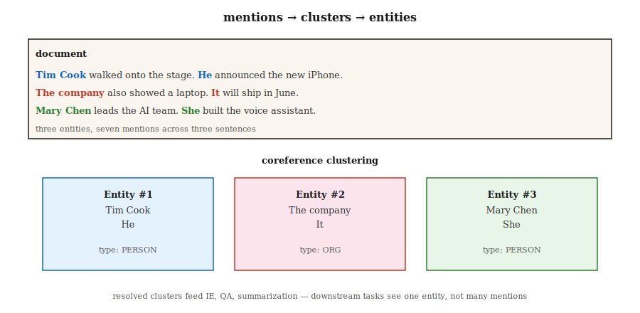

# Coreference Resolution

> "She called him. He did not answer. The doctor was at lunch." Three references, two people, nobody named. Coreference resolution figures out who is who.

**Type:** Learn
**Languages:** Python
**Prerequisites:** Phase 5 · 06 (NER), Phase 5 · 07 (POS Tagging & Parsing)
**Time:** ~60 minutes

## The Problem

Extract every mention of Apple Inc. from a 300-word article. When the text says "Apple" it's easy. When it says "the company", "they", "Cupertino's technology giant", or "Jobs's firm" it's hard. Without resolving these mentions to the same entity, your NER pipeline misses 60–80% of mentions.

Coreference resolution links all expressions referring to the same real-world entity into a cluster. It is the glue between surface NLP (NER, parsing) and downstream semantics (IE, QA, summarization, KG).

Why it matters in 2026:

- Summarization: "The CEO announced..." vs "Tim Cook announced..." — a summary should name the CEO.
- QA: "Who did she call?" requires resolving "she".
- Information extraction: A knowledge graph that treats "PER1 founded Apple" and "Jobs founded Apple" as two separate entries is wrong.
- Multi-document IE: Merging mentions across articles about the same event is cross-document coreference.

## The Concept



**Task.** Input: a document. Output: a clustering of mentions (spans), each cluster pointing to one entity.

**Mention types.**

- **Named entity.** "Tim Cook"
- **Nominal.** "the CEO", "the company"
- **Pronominal.** "he", "she", "they", "it"
- **Appositive.** "Tim Cook, Apple's CEO,"

**Architectures.**

1. **Rule-based (Hobbs, 1978).** Pronoun resolution via syntax trees and grammar rules. Good baseline. Surprisingly hard to beat on pronouns.
2. **Mention-pair classifier.** For every pair (m_i, m_j), predict whether they corefer. Cluster by transitive closure. Standard before 2016.
3. **Mention-ranking.** For each mention, rank candidate antecedents (including "no antecedent") and pick the top one.
4. **End-to-end span-based (Lee et al., 2017).** Transformer encoder. Enumerate all candidate spans up to a length limit. Predict mention scores. For each span, predict antecedent probabilities. Greedy clustering. Modern default.
5. **Generative (2024+).** Prompt an LLM: "List every pronoun in this text and its antecedent." Works well on simple cases, struggles on long documents and rare referents.

**Evaluation metrics.** Five standard metrics (MUC, B³, CEAF, BLANC, LEA) because no single metric captures clustering quality. Report the average of the first three as CoNLL F1. 2026 SOTA on CoNLL-2012: ~83 F1.

**Known hard cases.**

- Definite descriptions referring to entities introduced pages earlier.
- Bridging anaphora ("the wheels" → a car mentioned earlier).
- Zero anaphora in languages like Chinese and Japanese.
- Cataphora (pronoun before referent): "When **she** walked in, Mary smiled."

## Build It

### Step 1: Pretrained neural coref (AllenNLP / spaCy-experimental)

```python
import spacy
nlp = spacy.load("en_coreference_web_trf")   # experimental model
doc = nlp("Apple announced new products. The company said they would ship soon.")
for cluster in doc._.coref_clusters:
    print(cluster, "->", [m.text for m in cluster])
```

On a longer document you get something like:
- Cluster 1: [Apple, The company, they]
- Cluster 2: [new products]

### Step 2: Rule-based pronoun resolver (pedagogical)

Standard-library-only implementation in `code/main.py`:

1. Extract mentions: named entities (capitalized spans), pronouns (dictionary lookup), definite descriptions ("the X").
2. For each pronoun, look at the previous K mentions and score them by:
   - Gender/number agreement (heuristic)
   - Recency (closer wins)
   - Syntactic role (prefer subjects)
3. Link to the highest-scoring antecedent.

Won't beat a neural model. But it exposes the search space and the decisions an end-to-end model must make.

### Step 3: Coreference with an LLM

```python
prompt = f"""Text: {text}

List every pronoun and noun phrase that refers to a person or company.
Cluster them by what they refer to. Output JSON:
[{{"entity": "Apple", "mentions": ["Apple", "the company", "it"]}}, ...]
"""
```

Two failure modes to watch. First, LLMs over-merge ("him" and "her" pointing to two different people). Second, LLMs silently drop mentions in long documents. Always verify with span-offset checks.

### Step 4: Evaluation

The standard conll-2012 script computes MUC, B³, CEAF-φ4 and reports the average. For internal evaluation, start with span-level precision and recall on your annotated test set, then add mention-linking F1.

## Pitfalls

- **Singleton explosion.** Some systems report every mention as its own cluster. B³ is forgiving; MUC penalizes this. Always check all three metrics.
- **Pronouns in long context.** Performance drops ~15 F1 on documents over 2,000 tokens. Be careful with chunking.
- **Gender assumptions.** Hard-coded gender rules break on non-binary referents, organizations, and animals. Use learned models or neutral scoring.
- **LLM drift on long documents.** A single API call cannot reliably cluster mentions across 50+ paragraphs. Use sliding window + merge.

## Use It

2026 stack:

| Scenario | Choice |
|-----------|------|
| English, single-document | `en_coreference_web_trf` (spaCy-experimental) or AllenNLP neural coref |
| Multilingual | SpanBERT / XLM-R trained on OntoNotes or multilingual CoNLL |
| Cross-document event coref | Dedicated end-to-end models (2025–26 SOTA) |
| Quick LLM baseline | GPT-4o / Claude with structured-output coref prompt |
| Production dialogue system | Rule-based fallback + neural primary + human review on critical slots |

2026 integration pattern for production: run NER first, then coref, merge coref clusters into NER entities. Downstream tasks see one entity per cluster, not one entity per mention.

## Ship It

Save as `outputs/skill-coref-picker.md`:

```markdown
---
name: coref-picker
description: Pick a coreference approach, evaluation plan, and integration strategy.
version: 1.0.0
phase: 5
lesson: 24
tags: [nlp, coref, information-extraction]
---

Given a use case (single-doc / multi-doc, domain, language), output:

1. Approach. Rule-based / neural span-based / LLM-prompted / hybrid. One-sentence reason.
2. Model. Named checkpoint if neural.
3. Integration. Order of operations: tokenize → NER → coref → downstream task.
4. Evaluation. CoNLL F1 (MUC + B³ + CEAF-φ4 average) on held-out set + manual cluster review on 20 documents.

Refuse LLM-only coref for documents over 2,000 tokens without sliding-window merge. Refuse any pipeline that runs coref without a mention-level precision-recall report. Flag gender-heuristic systems deployed in demographically diverse text.
```

## Exercises

1. **Easy.** Run the rule-based resolver in `code/main.py` on 5 hand-written paragraphs. Measure mention-linking accuracy against gold annotations.
2. **Medium.** Run a pretrained neural coref model on a news article. Compare clusters against your own manual annotations. Where does it fail?
3. **Hard.** Build a coref-augmented NER pipeline: NER first, then merge via coref clusters. Measure entity coverage improvement over plain NER on 100 articles.

## Key Terms

| Term | How people say it | What it actually is |
|------|-----------------|-----------------------|
| Mention | A reference | A span of text (name, pronoun, noun phrase) pointing to an entity. |
| Antecedent | What "it" refers to | The earlier mention that a later mention corefers with. |
| Cluster | All mentions of an entity | The set of mentions all referring to the same real-world entity. |
| Anaphora | Backward reference | A later mention refers to an earlier one ("he" → "John"). |
| Cataphora | Forward reference | An earlier mention refers to a later one ("When he arrived, John..."). |
| Bridging | Implicit reference | "I bought a car. The wheels were bad." (the wheels of that car). |
| CoNLL F1 | The leaderboard number | Average of MUC, B³, CEAF-φ4 F1 scores. |

## Further Reading

- [Jurafsky & Martin, SLP3 Ch. 26 — Coreference Resolution and Entity Linking](https://web.stanford.edu/~jurafsky/slp3/26.pdf) — Classic textbook chapter.
- [Lee et al. (2017). End-to-end Neural Coreference Resolution](https://arxiv.org/abs/1707.07045) — Span-based end-to-end.
- [Joshi et al. (2020). SpanBERT](https://arxiv.org/abs/1907.10529) — Pretraining that boosts coref.
- [Pradhan et al. (2012). CoNLL-2012 Shared Task](https://aclanthology.org/W12-4501/) — The benchmark.
- [Hobbs (1978). Resolving Pronoun References](https://www.sciencedirect.com/science/article/pii/0024384178900064) — The rule-based classic.
