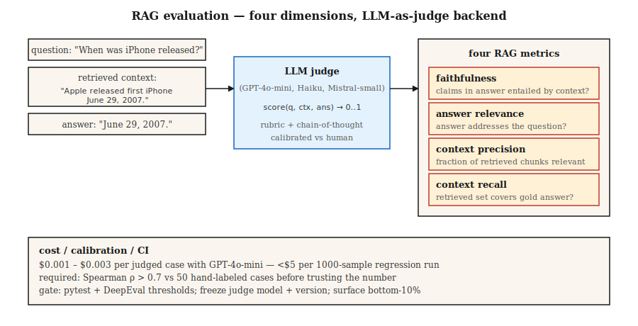

# LLM Evaluation: RAGAS, DeepEval, G-Eval

> Exact match and F1 miss semantic equivalence. Human review doesn't scale. LLM-as-judge is the production answer—provided the calibration holds and you can trust the numbers.

**Type:** Build
**Languages:** Python
**Prerequisites:** Phase 5 · 13 (Question Answering), Phase 5 · 14 (Information Retrieval)
**Time:** ~75 minutes

## The Problem

Your RAG system answers: "June 29th, 2007."
The gold reference is: "June 29, 2007."
Exact match scores 0. F1 is ~75%. A human would score 100%.

Now multiply by 10,000 test cases. Then multiply by every change to retriever, chunking, prompt, or model. You need an evaluator that understands meaning, runs cheaply at scale, doesn't lie about regressions, and surfaces the right failure modes.

In 2026, three frameworks own this problem.

- **RAGAS.** Retrieval-Augmented Generation ASsessment. Four RAG metrics (faithfulness, answer relevance, context precision, context recall), backed by NLI + LLM judge. Research-backed, lightweight.
- **DeepEval.** pytest for LLMs. G-Eval, task completion, hallucination, bias, and more. CI/CD native.
- **G-Eval.** A method (and a metric inside DeepEval): LLM-as-judge with chain-of-thought, custom criteria, 0–1 score.

All three lean on LLM-as-judge. This lesson builds intuition for the method and the trust layers around it.

## The Concept



**LLM-as-judge.** Replace static metrics with an LLM that scores outputs against a rubric. Given `(query, context, answer)`, prompt the judge LLM: "Score 0-1 on faithfulness." Get back a score.

Why it works: LLMs approximate human judgment at a fraction of the cost. GPT-4o-mini costs ~$0.003 per scored case, making a 1,000-sample regression eval under $5.

Why it fails silently:

1. **Judge bias.** Judges prefer longer answers, answers from their own model family, and answers matching the prompt style.
2. **JSON parse failures.** Bad JSON → NaN scores → silently excluded from aggregation. RAGAS users know this pain well. Catch with try/except + explicit failure modes.
3. **Cross-model version drift.** Upgrading the judge changes every metric. Pin and version the judge model.

**The RAG quartet.**

| Metric | Question | Backend |
|--------|----------|---------|
| Faithfulness | Is every claim in the answer grounded in the retrieved context? | NLI-based entailment |
| Answer relevance | Does the answer address the question? | Generate hypothetical questions from the answer; compare to the real question |
| Context precision | What fraction of retrieved chunks are relevant? | LLM judge |
| Context recall | Did retrieval return everything needed? | LLM judge against gold answer |

**G-Eval.** Define a custom criterion: "Does the answer cite the correct source?" The framework auto-expands it into chain-of-thought evaluation steps, then scores 0–1. Ideal for domain-specific quality dimensions RAGAS doesn't cover.

**Calibration.** Never trust raw judge scores until you correlate them with human labels. Run 100 hand-labeled samples. Plot judge vs. human. Compute Spearman rho. If rho < 0.7, your judge rubric needs work.

## Build It

### Step 1: Faithfulness via NLI (RAGAS-style)

```python
from typing import Callable
from transformers import pipeline

nli = pipeline("text-classification",
               model="MoritzLaurer/DeBERTa-v3-large-mnli-fever-anli-ling-wanli",
               top_k=None)

# `llm` is any callable: prompt str -> generated str.
# e.g.: llm = lambda p: client.messages.create(model="claude-haiku-4-5", ...).content[0].text
LLM = Callable[[str], str]


def atomic_claims(answer: str, llm: LLM) -> list[str]:
    prompt = f"""Break this answer into simple factual claims (one per line):
{answer}
"""
    return llm(prompt).splitlines()


def faithfulness(answer: str, context: str, llm: LLM) -> float:
    claims = atomic_claims(answer, llm)
    if not claims:
        return 0.0
    supported = 0
    for claim in claims:
        result = nli({"text": context, "text_pair": claim})[0]
        entail = next((s for s in result if s["label"] == "entailment"), None)
        if entail and entail["score"] > 0.5:
            supported += 1
    return supported / len(claims)
```

Decompose the answer into atomic claims. NLI-check each claim against the retrieved context. Faithfulness = fraction supported.

### Step 2: Answer relevance

```python
import numpy as np
from sentence_transformers import SentenceTransformer

# encoder: any model implementing .encode(texts, normalize_embeddings=True) -> ndarray
# e.g. encoder = SentenceTransformer("BAAI/bge-small-en-v1.5")

def answer_relevance(question: str, answer: str, encoder, llm: LLM, n: int = 3) -> float:
    prompt = f"Write {n} questions this answer could be the answer to:\n{answer}"
    generated = [line for line in llm(prompt).splitlines() if line.strip()][:n]
    if not generated:
        return 0.0
    q_emb = np.asarray(encoder.encode([question], normalize_embeddings=True)[0])
    g_embs = np.asarray(encoder.encode(generated, normalize_embeddings=True))
    sims = [float(q_emb @ g_emb) for g_emb in g_embs]
    return sum(sims) / len(sims)
```

If the questions implied by the answer differ from the one asked, relevance drops.

### Step 3: G-Eval custom metric

```python
from deepeval.metrics import GEval
from deepeval.test_case import LLMTestCaseParams, LLMTestCase

metric = GEval(
    name="Correctness",
    criteria="The answer should be factually accurate and match the expected output.",
    evaluation_steps=[
        "Read the expected output.",
        "Read the actual output.",
        "List factual claims in the actual output.",
        "For each claim, mark supported or unsupported by the expected output.",
        "Return score = fraction supported.",
    ],
    evaluation_params=[LLMTestCaseParams.INPUT, LLMTestCaseParams.ACTUAL_OUTPUT, LLMTestCaseParams.EXPECTED_OUTPUT],
)

test = LLMTestCase(input="When was the first iPhone released?",
                   actual_output="June 29th, 2007.",
                   expected_output="June 29, 2007.")
metric.measure(test)
print(metric.score, metric.reason)
```

Those evaluation steps are the rubric. Explicit steps are more stable than implicit "score 0–1" prompts.

### Step 4: CI gate

```python
import deepeval
from deepeval.metrics import FaithfulnessMetric, ContextualRelevancyMetric


def test_rag_system():
    cases = load_regression_cases()
    faith = FaithfulnessMetric(threshold=0.85)
    rel = ContextualRelevancyMetric(threshold=0.7)
    for case in cases:
        faith.measure(case)
        assert faith.score >= 0.85, f"faithfulness regression on {case.id}"
        rel.measure(case)
        assert rel.score >= 0.7, f"relevancy regression on {case.id}"
```

Ship as a pytest file. Run on every PR. Block merge on regression.

### Step 5: Toy evaluation from scratch

See `code/main.py`. Standard-library-only approximation of faithfulness (answer claim overlap with context) and relevance (answer token overlap with question). Not production. Shows the shape.

## Pitfalls

- **No calibration.** A judge correlating at only 0.3 with human labels is noise. Require a calibration run before shipping.
- **Self-evaluation.** Using the same LLM to both generate and judge inflates scores by 10–20%. Use a different model family for the judge.
- **Position bias in pairwise judging.** Judges prefer whichever option is presented first. Always randomize order, run both sides.
- **Raw aggregates hide failures.** A mean of 0.85 often hides 5% catastrophic failures. Always inspect the bottom quantile.
- **Gold dataset rot.** Unversioned eval sets that drift over time break longitudinal comparisons. Tag the dataset on every change.
- **LLM cost.** Judge calls dominate cost at scale. Use the cheapest model that meets calibration threshold. GPT-4o-mini, Claude Haiku, Mistral-small.

## Use It

The 2026 stack:

| Use case | Framework |
|---------|-----------|
| RAG quality monitoring | RAGAS (4 metrics) |
| CI/CD regression gate | DeepEval + pytest |
| Custom domain criteria | G-Eval inside DeepEval |
| Online live-traffic monitoring | RAGAS reference-free mode |
| Human-in-the-loop spot checks | LangSmith or Phoenix with annotation UI |
| Red-teaming / safety evals | Promptfoo + DeepEval |

Typical stack: RAGAS for monitoring, DeepEval for CI, G-Eval for new dimensions. Run all three; their disagreements are informative.

## Ship It

Save as `outputs/skill-eval-architect.md`:

```markdown
---
name: eval-architect
description: Design an LLM evaluation plan with calibrated judge and CI gates.
version: 1.0.0
phase: 5
lesson: 27
tags: [nlp, evaluation, rag]
---

Given a use case (RAG / agent / generative task), output:

1. Metrics. Faithfulness / relevance / context-precision / context-recall + any custom G-Eval metrics with criteria.
2. Judge model. Named model + version, rationale for cost vs accuracy.
3. Calibration. Hand-labeled set size, target Spearman rho vs human > 0.7.
4. Dataset versioning. Tag strategy, change log, stratification.
5. CI gate. Thresholds per metric, regression-window logic, bottom-quantile alert.

Refuse to rely on a judge untested against ≥50 human-labeled examples. Refuse self-evaluation (same model generates + judges). Refuse aggregate-only reporting without bottom-10% surfacing. Flag any pipeline where judge upgrade lands without parallel baseline eval.
```

## Exercises

1. **Easy.** Run RAGAS on 10 RAG samples with known hallucinations. Verify the faithfulness metric catches each one.
2. **Medium.** Hand-label 50 QA answers for correctness on a 0–1 scale. Score with G-Eval. Measure Spearman rho between judge and human.
3. **Hard.** Build a pytest CI gate with DeepEval. Deliberately regress the retriever. Verify the gate fails. Add a bottom-quantile alert by thresholding the lowest 10%.

## Key Terms

| Term | What people say | What it actually is |
|------|-----------------|---------------------|
| LLM-as-judge | Score with an LLM | A judge model scores outputs 0–1 against a rubric. |
| RAGAS | That RAG metrics library | Open-source eval framework with 4 reference-free RAG metrics. |
| Faithfulness | Is the answer grounded? | Fraction of answer claims entailed by the retrieved context. |
| Context precision | Are the retrieved chunks relevant? | Fraction of top-K chunks that are actually useful. |
| Context recall | Did retrieval find everything? | Fraction of gold-answer claims supported by retrieved chunks. |
| G-Eval | Custom LLM judge | Rubric + chain-of-thought evaluation steps + 0–1 score. |
| Calibration | Trust but verify | Spearman correlation between judge scores and human scores. |

## Further Reading

- [Es et al. (2023). RAGAS: Automated Evaluation of Retrieval Augmented Generation](https://arxiv.org/abs/2309.15217) — The RAGAS paper.
- [Liu et al. (2023). G-Eval: NLG Evaluation using GPT-4 with Better Human Alignment](https://arxiv.org/abs/2303.16634) — The G-Eval paper.
- [DeepEval docs](https://deepeval.com/docs/metrics-introduction) — Open-source production stack.
- [Zheng et al. (2023). Judging LLM-as-a-Judge with MT-Bench and Chatbot Arena](https://arxiv.org/abs/2306.05685) — Bias, calibration, limitations.
- [MLflow GenAI Scorer](https://mlflow.org/blog/third-party-scorers) — Unified framework integrating RAGAS, DeepEval, and Phoenix.
