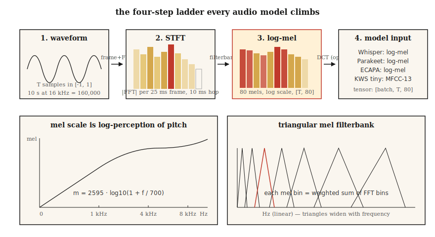

# Spectrograms, Mel Scale & Audio Features

> Neural networks don't do well on raw waveforms, but they thrive on spectrograms. They thrive even more on mel spectrograms. In 2026, every ASR, TTS, and audio classifier lives or dies by this single preprocessing choice.

**Type:** Build
**Languages:** Python
**Prerequisites:** Phase 6 · 01 (Audio Fundamentals)
**Time:** ~45 minutes

## The Problem

Take a 10-second, 16 kHz audio clip. That's 160,000 floats, all in `[-1, 1]`, almost entirely uncorrelated with labels like "dog bark" or "the word cat." The information is there in the raw waveform — it's just hard for models to extract it in that form. The same phoneme uttered 100 ms apart produces completely different raw samples.

Spectrograms solve this. They compress away temporal detail where human perception doesn't care (microsecond-level jitter) and preserve structure where perception does care (which frequencies carry energy in a roughly 10–25 ms window).

Mel spectrograms go further. Human pitch perception is logarithmic: the "perceived distance" between 100 Hz and 200 Hz is the same as between 1000 Hz and 2000 Hz. The mel scale warps the frequency axis to match this perception. From 2010 to 2026, mel-scale spectrograms have been the single most important feature in speech ML.

## The Concept



**STFT (Short-Time Fourier Transform).** Slice the waveform into overlapping frames (typical: 25 ms window, 10 ms hop = 400 samples / 160 samples at 16 kHz). Multiply each frame by a window function (Hann by default; Hamming is a slightly different tradeoff). FFT each frame. Stack the magnitude spectra into a matrix of shape `(n_frames, n_freq_bins)`. That's your spectrogram.

**Log-magnitude.** Raw magnitudes span 5–6 orders of magnitude. Take `log(|X| + 1e-6)` or `20 * log10(|X|)` to compress dynamic range. Every production pipeline uses log magnitude, not raw magnitude.

**Mel scale.** Frequency `f` (Hz) maps to mel value `m` via `m = 2595 * log10(1 + f / 700)`. The mapping is roughly linear below 1 kHz and roughly logarithmic above. 80 mel bins covering 0–8 kHz is the standard ASR input.

**Mel filterbank.** A set of triangular filters spaced equally on the mel scale. Each filter is a weighted sum of adjacent FFT bins. Multiply the STFT magnitudes by the filterbank matrix — one matrix multiplication yields the mel spectrogram.

**Log-mel spectrogram.** `log(mel_spec + 1e-10)`. Whisper's input, Parakeet's input, SeamlessM4T's input. The universal audio frontend in 2026.

**MFCC.** Take the log-mel spectrogram and apply a DCT (type II), keeping the first 13 coefficients. Decorrelates features and compresses further. It was the dominant feature until around 2015 when CNNs/Transformers on raw log-mel caught up. Still used in speaker recognition (x-vectors, ECAPA).

**Resolution tradeoff.** Larger FFT = better frequency resolution but worse time resolution. 25 ms / 10 ms is the default for audio ML; music uses 50 ms / 12.5 ms; transient detection (drum hits, plosives) uses 5 ms / 2 ms.

## Build It

### Step 1: Frame the waveform

```python
def frame(signal, frame_len, hop):
    n = 1 + (len(signal) - frame_len) // hop
    return [signal[i * hop : i * hop + frame_len] for i in range(n)]
```

A 10-second, 16 kHz audio clip with `frame_len=400, hop=160` yields 998 frames.

### Step 2: Hann window

```python
import math

def hann(N):
    return [0.5 * (1 - math.cos(2 * math.pi * n / (N - 1))) for n in range(N)]
```

Element-wise multiply before FFT. Eliminates spectral leakage caused by truncation at non-zero endpoints.

### Step 3: STFT magnitude

```python
def stft_magnitude(signal, frame_len=400, hop=160):
    win = hann(frame_len)
    frames = frame(signal, frame_len, hop)
    return [magnitudes(dft([w * s for w, s in zip(win, f)])) for f in frames]
```

Production uses `torch.stft` or `librosa.stft` (FFT-backed, vectorized). The loop here is pedagogical; it only runs on short audio in `code/main.py`.

### Step 4: Mel filterbank

```python
def hz_to_mel(f):
    return 2595.0 * math.log10(1.0 + f / 700.0)

def mel_to_hz(m):
    return 700.0 * (10 ** (m / 2595.0) - 1)

def mel_filterbank(n_mels, n_fft, sr, fmin=0, fmax=None):
    fmax = fmax or sr / 2
    mels = [hz_to_mel(fmin) + (hz_to_mel(fmax) - hz_to_mel(fmin)) * i / (n_mels + 1)
            for i in range(n_mels + 2)]
    hzs = [mel_to_hz(m) for m in mels]
    bins = [int(h * n_fft / sr) for h in hzs]
    fb = [[0.0] * (n_fft // 2 + 1) for _ in range(n_mels)]
    for m in range(n_mels):
        for k in range(bins[m], bins[m + 1]):
            fb[m][k] = (k - bins[m]) / max(1, bins[m + 1] - bins[m])
        for k in range(bins[m + 1], bins[m + 2]):
            fb[m][k] = (bins[m + 2] - k) / max(1, bins[m + 2] - bins[m + 1])
    return fb
```

80 mels covering 0–8 kHz with `n_fft=400` gives an `(80, 201)` matrix. Multiply the `(n_frames, 201)` STFT magnitudes by its transpose to get the `(n_frames, 80)` mel spectrogram.

### Step 5: Log-mel

```python
def log_mel(mel_spec, eps=1e-10):
    return [[math.log(max(v, eps)) for v in frame] for frame in mel_spec]
```

Common alternatives: `librosa.power_to_db` (dB normalized to a reference), `10 * log10(power + eps)`. Whisper uses a more involved clipping + normalization procedure (see Whisper's `log_mel_spectrogram`).

### Step 6: MFCC

```python
def dct_ii(x, n_coeffs):
    N = len(x)
    return [
        sum(x[n] * math.cos(math.pi * k * (2 * n + 1) / (2 * N)) for n in range(N))
        for k in range(n_coeffs)
    ]
```

Apply DCT to each log-mel frame, keeping the first 13 coefficients. That's your MFCC matrix. The first coefficient is usually dropped (it encodes overall energy).

## Use It

The 2026 toolkit:

| Task | Feature |
|------|----------|
| ASR (Whisper, Parakeet, SeamlessM4T) | 80 log-mel, 10 ms hop, 25 ms window |
| TTS acoustic models (VITS, F5-TTS, Kokoro) | 80 mel, 5–12 ms hop for fine temporal control |
| Audio classification (AST, PANNs, BEATs) | 128 log-mel, 10 ms hop |
| Speaker embeddings (ECAPA-TDNN, WavLM) | 80 log-mel, or raw waveform SSL |
| Music (MusicGen, Stable Audio 2) | EnCodec discrete tokens (not mel) |
| Keyword spotting | 40 MFCCs for tiny devices |

Rule of thumb: **Unless you're doing music, start with 80 log-mel.** Any deviation from this path needs to justify itself.

## Pitfalls

- **Mel count mismatch.** Training with 80 mels, inference with 128. Silent failure. Print the feature shape at both ends.
- **Upstream sample rate mismatch.** Mels computed from 22.05 kHz look different from 16 kHz. Fix SR *before* featurization.
- **dB vs log.** Whisper expects log-mel, not dB-mel. Some HF pipelines auto-detect; your custom code won't.
- **Normalization drift.** Per-utterance normalization at training, global normalization at inference. This production bug doubles WER.
- **Padding-induced leakage.** Zero-padding at audio end creates flat spectra in the final frames. Use symmetric padding or replicate padding.

## Ship It

Save as `outputs/skill-feature-extractor.md`. This skill selects the feature type, mel count, frame/hop length, and normalization for a given model target.

## Exercises

1. **Easy.** Run `code/main.py`. It synthesizes a chirp signal (frequency sweeping 200 → 4000 Hz) and prints the argmax mel bin per frame. Plot (optional) and confirm it tracks the sweep.
2. **Medium.** Re-run with `n_mels` in `{40, 80, 128}` and `frame_len` in `{200, 400, 800}`. Measure the bandwidth of the peak along the time axis. Which combination resolves the chirp best?
3. **Hard.** Implement `power_to_db` and compare ASR accuracy on AudioMNIST with a tiny CNN classifier: (a) raw log-mel, (b) dB-mel with `ref=max`, (c) MFCC-13 + delta + delta-delta. Report top-1 accuracy.

## Key Terms

| Term | How people talk about it | What it actually means |
|------|-----------------|-----------------------|
| Frame | A slice | The 25 ms waveform chunk fed to one FFT. |
| Hop | Step size | Number of samples between adjacent frames; ASR default is 10 ms. |
| Window | That Hann/Hamming thing | A pointwise multiplier that tapers frame edges to zero. |
| STFT | Spectrogram generator | Framed + windowed FFT; produces a time × frequency matrix. |
| Mel | Warped frequency | Logarithmic perceptual scale; `m = 2595·log10(1 + f/700)`. |
| Filterbank | That matrix | Triangular filters projecting STFT onto mel bins. |
| Log-mel | Whisper's input | `log(mel_spec + eps)`; the standard in 2026. |
| MFCC | Old-school feature | DCT of log-mel; 13 coefficients, decorrelated. |

## Further Reading

- [Davis, Mermelstein (1980). Comparison of parametric representations for monosyllabic word recognition](https://ieeexplore.ieee.org/document/1163420) — The MFCC paper.
- [Stevens, Volkmann, Newman (1937). A Scale for the Measurement of the Psychological Magnitude Pitch](https://pubs.aip.org/asa/jasa/article-abstract/8/3/185/735757/) — The original mel scale.
- [OpenAI — Whisper source, log_mel_spectrogram](https://github.com/openai/whisper/blob/main/whisper/audio.py) — Read the reference implementation.
- [librosa feature extraction docs](https://librosa.org/doc/main/feature.html) — `mfcc`, `melspectrogram`, and hop/window reference.
- [NVIDIA NeMo — audio preprocessing](https://docs.nvidia.com/deeplearning/nemo/user-guide/docs/en/main/asr/asr_all.html#featurizers) — Production pipeline for Parakeet + Canary models.
