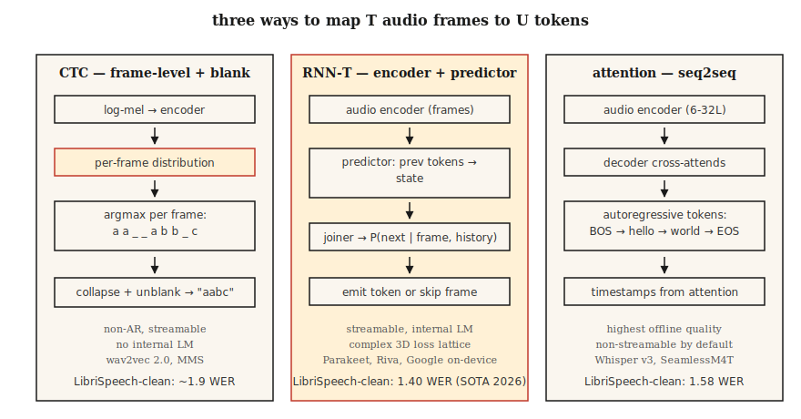

# Speech Recognition (ASR) — CTC, RNN-T, Attention

> Speech recognition is audio classification at every time step, glued together by a sequence model that understands English and silence. CTC, RNN-T, and attention are three approaches. Pick one and understand why it does what it does.

**Type:** Build
**Languages:** Python
**Prerequisites:** Phase 6 · 02 (Spectrograms & Mel), Phase 5 · 08 (CNNs & RNNs for Text), Phase 5 · 10 (Attention)
**Time:** ~45 minutes

## The Problem

You have a 10-second, 16 kHz audio clip. You want a string: "turn on the kitchen lights." The difficulty is structural: audio frames and characters are not aligned one-to-one. The word "okay" might take 200 ms or 1200 ms. Silence is interspersed between utterances. Some phonemes are longer than others. The number of output tokens isn't known in advance.

Three modeling approaches solve this:

1. **CTC (Connectionist Temporal Classification).** Output per-frame token probabilities including a special *blank*. At decoding time, collapse repeats and blanks. Non-autoregressive, fast. wav2vec 2.0 and MMS use this.
2. **RNN-T (Recurrent Neural Network Transducer).** A joint network predicts the next token given the encoder frame and previous tokens. Streamable. Google's on-device ASR and NVIDIA Parakeet use this.
3. **Attention encoder-decoder.** The encoder compresses audio into hidden states; the decoder cross-attends to them and autoregressively generates tokens. Whisper and SeamlessM4T use this.

In 2026, SOTA WER on LibriSpeech test-clean is 1.4% (Parakeet-TDT-1.1B, NVIDIA) and 1.58% (Whisper-Large-v3-turbo). The gap is tiny; deployment differences are large.

## The Concept



**CTC intuition.** Let the encoder output `T` frame-level distributions, each over `V+1` tokens (V characters + blank). For a target string `y` of length `U < T`, any frame alignment that collapses to `y` counts. The CTC loss sums over all such alignments. At inference: per-frame argmax, collapse repeats, remove blanks.

Pros: non-autoregressive, streamable, zero lookahead. Cons: *conditional independence assumption* — each frame prediction is independent of the others, so there's no internal language model. Remedied via beam search or shallow fusion with an external LM.

**RNN-T intuition.** Add a *predictor* network that embeds token history, and a *joiner* that merges predictor state with encoder frame into a joint distribution over `V+1` (the `+1` is blank / no-emit). Explicitly models the conditional dependence that CTC ignores. Streamable because each step only depends on past frames and past tokens.

Pros: streamable + internal LM. Cons: more complex training, more memory (3D loss lattice); the RNN-T loss kernel is a whole library by itself.

**Attention encoder-decoder.** Encoder (6-32 transformer layers) operates on log-mel frames. Decoder (6-32 transformer layers) cross-attends to encoder output and autoregressively generates tokens. No alignment constraint — attention can look anywhere in the audio. Not streamable unless you constrain attention (chunked Whisper-Streaming, 2024).

Pros: highest quality for offline ASR, trains with standard seq2seq tooling. Cons: autoregressive latency proportional to output length; not streamable without engineering.

### WER: The one number

**Word Error Rate** = `(S + D + I) / N`, where S=substitutions, D=deletions, I=insertions, N=reference word count. Equals word-level Levenshtein edit distance. Lower is better. WER above 20% is generally unusable; below 5% is human-level on read speech. 2026 numbers on standard benchmarks:

| Model | LibriSpeech test-clean | LibriSpeech test-other | Size |
|-------|------------------------|------------------------|------|
| Parakeet-TDT-1.1B | 1.40% | 2.78% | 1.1B params |
| Whisper-Large-v3-turbo | 1.58% | 3.03% | 809M |
| Canary-1B Flash | 1.48% | 2.87% | 1B |
| Seamless M4T v2 | 1.7% | 3.5% | 2.3B |

These are all encoder-decoder or RNN-T based. Pure CTC systems (wav2vec 2.0) land around 1.8–2.1% on test-clean.

## Build It

### Step 1: Greedy CTC decoding

```python
def ctc_greedy(frame_logits, blank=0, vocab=None):
    # frame_logits: list of per-frame probability vectors
    preds = [max(range(len(p)), key=lambda i: p[i]) for p in frame_logits]
    out = []
    prev = -1
    for p in preds:
        if p != prev and p != blank:
            out.append(p)
        prev = p
    return "".join(vocab[i] for i in out) if vocab else out
```

Two rules: collapse consecutive repeats, drop blanks. Example: `a a _ _ a b b _ c` → `a a b c`.

### Step 2: Beam search CTC

```python
def ctc_beam(frame_logits, beam=8, blank=0):
    import math
    beams = [([], 0.0)]  # (tokens, log_prob)
    for p in frame_logits:
        log_p = [math.log(max(pi, 1e-10)) for pi in p]
        candidates = []
        for seq, lp in beams:
            for t, lpt in enumerate(log_p):
                new = seq[:] if t == blank else (seq + [t] if not seq or seq[-1] != t else seq)
                candidates.append((new, lp + lpt))
        candidates.sort(key=lambda x: -x[1])
        beams = candidates[:beam]
    return beams[0][0]
```

Production uses prefix-tree beam search with LM fusion; this is the conceptual skeleton.

### Step 3: WER

```python
def wer(ref, hyp):
    r, h = ref.split(), hyp.split()
    dp = [[0] * (len(h) + 1) for _ in range(len(r) + 1)]
    for i in range(len(r) + 1):
        dp[i][0] = i
    for j in range(len(h) + 1):
        dp[0][j] = j
    for i in range(1, len(r) + 1):
        for j in range(1, len(h) + 1):
            cost = 0 if r[i - 1] == h[j - 1] else 1
            dp[i][j] = min(
                dp[i - 1][j] + 1,
                dp[i][j - 1] + 1,
                dp[i - 1][j - 1] + cost,
            )
    return dp[len(r)][len(h)] / max(1, len(r))
```

### Step 4: Run Whisper for inference

```python
import whisper
model = whisper.load_model("large-v3-turbo")
result = model.transcribe("clip.wav")
print(result["text"])
```

One line invokes the strongest general-purpose ASR of 2026. Runs at ~20× real-time on a 24 GB GPU.

### Step 5: Streaming with Parakeet or wav2vec 2.0

```python
from transformers import pipeline
asr = pipeline("automatic-speech-recognition", model="nvidia/parakeet-tdt-1.1b")
for chunk in streaming_audio():
    print(asr(chunk, return_timestamps=True))
```

Streaming ASR requires chunked encoder attention and state carryover; use a library that supports it (Parakeet via NeMo, or `transformers` pipeline with `chunk_length_s`).

## Use It

The 2026 toolkit:

| Scenario | Choose |
|-----------|------|
| English, offline, max quality | Whisper-large-v3-turbo |
| Multilingual, robust | SeamlessM4T v2 |
| Streaming, low latency | Parakeet-TDT-1.1B or Riva |
| Edge, mobile, latency <500 ms | Quantized Whisper-Tiny or Moonshine (2024) |
| Long audio | Whisper with VAD chunking (WhisperX) |
| Domain-specific (medical, legal) | Fine-tuned wav2vec 2.0 + domain LM fusion |

## Pitfalls

- **No VAD.** Running Whisper on silence produces hallucinations ("Thanks for watching!"). Always gate with VAD.
- **Character-level vs word-level vs subword-level WER.** Report WER at the word level *after* normalization (lowercasing, punctuation removal).
- **Language ID drift.** Whisper's auto LID misroutes noisy audio to Japanese or Welsh; force `language="en"` when you know the language.
- **Long audio without chunking.** Whisper has a 30-second window. Beyond that, use `chunk_length_s=30, stride=5`.

## Ship It

Save as `outputs/skill-asr-picker.md`. For a given deployment target, select the model, decoding strategy, chunking approach, and LM fusion.

## Exercises

1. **Easy.** Run `code/main.py`. It greedy-decodes a hand-crafted CTC output and computes WER against a reference.
2. **Medium.** Correctly implement prefix-tree beam search from Step 2 (handle the blank merging rules). Compare against greedy on a synthetic 10-example dataset.
3. **Hard.** Run `whisper-large-v3-turbo` on [LibriSpeech test-clean](https://www.openslr.org/12). Compute WER for the first 100 utterances. Compare with the published number.

## Key Terms

| Term | How people talk about it | What it actually means |
|------|-----------------|-----------------------|
| CTC | That loss with the blank token | Marginalizes over all frame-to-token alignments; non-autoregressive. |
| RNN-T | That streaming loss | CTC + next-token predictor; handles word order. |
| Attention enc-dec | Whisper-style | Encoder + cross-attention decoder; best offline quality. |
| WER | The number you report | Word-level `(S+D+I)/N`. |
| Blank | The "nothing" | Special CTC token meaning "no emission at this frame." |
| LM fusion | External language model | Add weighted LM log-probs during beam search. |
| VAD | The silence gate | Voice Activity Detector; trims non-speech segments. |

## Further Reading

- [Graves et al. (2006). Connectionist Temporal Classification](https://www.cs.toronto.edu/~graves/icml_2006.pdf) — The CTC paper.
- [Graves (2012). Sequence Transduction with RNNs](https://arxiv.org/abs/1211.3711) — The RNN-T paper.
- [Radford et al. / OpenAI (2022). Whisper: Robust Speech Recognition via Large-Scale Weak Supervision](https://arxiv.org/abs/2212.04356) — The 2022 landmark paper; v3-turbo is the 2024 extension.
- [NVIDIA NeMo — Parakeet-TDT card](https://huggingface.co/nvidia/parakeet-tdt-1.1b) — The 2026 Open ASR Leaderboard leader.
- [Hugging Face — Open ASR Leaderboard](https://huggingface.co/spaces/hf-audio/open_asr_leaderboard) — Live benchmark across 25+ models.
