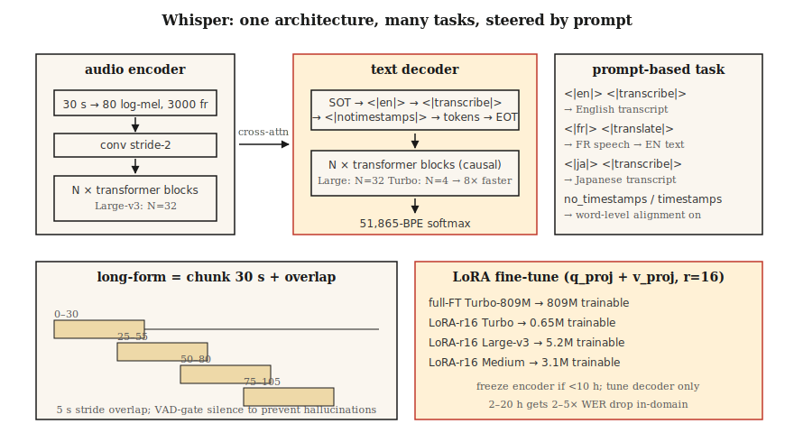

# Whisper — Architecture & Fine-Tuning

> Whisper is a 30-second-window transformer encoder-decoder trained on 680,000 hours of multilingual weakly-supervised audio-text pairs. One architecture, multiple tasks, robust across 99 languages. The 2026 ASR reference point.

**Type:** Build
**Languages:** Python
**Prerequisites:** Phase 6 · 04 (ASR), Phase 5 · 10 (Attention), Phase 7 · 05 (Full Transformer)
**Time:** ~75 minutes

## The Problem

Whisper was released by OpenAI in September 2022 as the first ASR model delivered like a commodity: paste in audio, get text, 99 languages, noise-robust, runs on a laptop. By 2024 OpenAI had released Large-v3 and Turbo variants; by 2026, Whisper is the default baseline for everything from podcast transcription to voice assistants to YouTube subtitles.

But Whisper isn't a pipeline you can treat as a black box forever. Domain shift breaks it — technical jargon, speaker accents, proper nouns, short audio, silence. You need to know:

1. What's actually inside it.
2. How to correctly feed it chunked, streaming, or long audio.
3. When to fine-tune and how.

## The Concept



**Architecture.** Standard transformer encoder-decoder.

- Input: 30-second log-mel spectrogram, 80 mels, 10 ms hop → 3000 frames. Shorter audio is zero-padded; longer audio is chunked.
- Encoder: convolutional downsampling (stride 2) + `N` transformer blocks. Large-v3: 32 layers, 1280 dims, 20 heads.
- Decoder: `N` transformer blocks with causal self-attention + cross-attention to encoder output. Same size as encoder.
- Output: BPE tokens over a 51,865-token vocabulary.

Large-v3 has 1.55B parameters. Turbo uses a 4-layer decoder (down from 32), cutting latency by 8× with <1% WER degradation.

**Prompt format.** Whisper is a multi-task model controlled by special tokens in the decoder prompt:

```
<|startoftranscript|><|en|><|transcribe|><|notimestamps|> Hello world.<|endoftext|>
```

- `<|en|>` — Language tag; determines transcribe vs translate behavior.
- `<|transcribe|>` or `<|translate|>` — Transcribe any language verbatim, or translate to English output.
- `<|notimestamps|>` — Skip word-level timestamps (faster).

The prompt is what makes one model serve multiple tasks. Swap `<|en|>` for `<|fr|>` and it transcribes French.

**30-second window.** Everything is pinned to 30 seconds. Longer audio must be chunked; shorter audio is padded. The window natively doesn't support streaming — which is why WhisperX, Whisper-Streaming, and faster-whisper exist.

**Log-mel normalization.** `(log_mel - mean) / std`, with statistics from Whisper's own training corpus. You *must* use Whisper's preprocessing (`whisper.audio.log_mel_spectrogram`), not `librosa.feature.melspectrogram`.

### 2026 variants

| Variant | Params | Latency (A100) | WER (LibriSpeech-clean) |
|---------|--------|----------------|------------------------|
| Tiny | 39M | 1× real-time | 5.4% |
| Base | 74M | 1× | 4.1% |
| Small | 244M | 1× | 3.0% |
| Medium | 769M | 1× | 2.7% |
| Large-v3 | 1.55B | 2× | 1.8% |
| Large-v3-turbo | 809M | 8× | 1.58% |
| Whisper-Streaming (2024) | 1.55B | Streaming | 2.0% |

### Fine-tuning

The canonical 2026 workflow:

1. Collect 10–100 hours of target-domain audio with aligned transcriptions.
2. Run `transformers.Seq2SeqTrainer` with a `generate_with_loss` callback.
3. Parameter-efficient: LoRA on `q_proj`, `k_proj`, `v_proj` of attention layers — 4× less GPU memory, <0.3 WER cost.
4. If you have <10 hours of data, freeze the encoder and only tune the decoder.
5. Use Whisper's own tokenizer and prompt format; never swap the tokenizer.

Community results: fine-tuning Medium on 20 hours of medical dictation dropped WER on medical vocabulary from 12% to 4.5%. Fine-tuning Turbo on 4 hours of Icelandic dropped WER from 18% to 6%.

## Build It

### Step 1: Run Whisper out of the box

```python
import whisper
model = whisper.load_model("large-v3-turbo")
result = model.transcribe(
    "clip.wav",
    language="en",
    task="transcribe",
    temperature=0.0,
    condition_on_previous_text=False,  # prevent runaway repetition
)
print(result["text"])
for seg in result["segments"]:
    print(f"[{seg['start']:.2f}–{seg['end']:.2f}] {seg['text']}")
```

Key defaults you should always override: `temperature=0.0` (sampling defaults to a 0.0 → 0.2 → 0.4 … fallback chain), `condition_on_previous_text=False` (prevents cascading hallucination), `no_speech_threshold=0.6` (silence detection).

### Step 2: Chunk long audio

```python
# whisperx is the 2026 reference for long audio + word-level timestamps
import whisperx
model = whisperx.load_model("large-v3-turbo", device="cuda", compute_type="float16")
segments = model.transcribe("1hour.mp3", batch_size=16, chunk_size=30)
```

WhisperX adds (1) Silero VAD gating, (2) word-level alignment via wav2vec 2.0, (3) speaker diarization via `pyannote.audio`. It's the workhorse for production transcription in 2026.

### Step 3: Fine-tune with LoRA

```python
from transformers import WhisperForConditionalGeneration, WhisperProcessor
from peft import LoraConfig, get_peft_model

model = WhisperForConditionalGeneration.from_pretrained("openai/whisper-large-v3-turbo")
lora = LoraConfig(
    r=16, lora_alpha=32, target_modules=["q_proj", "v_proj"],
    lora_dropout=0.1, bias="none", task_type="SEQ_2_SEQ_LM",
)
model = get_peft_model(model, lora)
# model.print_trainable_parameters()  -> ~3M trainable / 809M total
```

Follow with a standard Trainer loop. Checkpoint every 1000 steps. Evaluate with WER on a held-out set.

### Step 4: Observe what each layer learns

```python
# Grab cross-attention weights during decoding to see what the decoder attends to.
with torch.inference_mode():
    out = model.generate(
        input_features=features,
        return_dict_in_generate=True,
        output_attentions=True,
    )
# out.cross_attentions: layer × head × step × src_len
```

Visualize with a heatmap — you'll see the diagonal alignment as the decoder progressively sweeps across encoder frames. That diagonal is Whisper's understanding of word-level timestamps.

## Use It

The 2026 toolkit:

| Scenario | Choose |
|-----------|------|
| General English, offline | Large-v3-turbo via `whisperx` |
| Mobile / edge | Quantized Whisper-Tiny (int8) or Moonshine |
| Multilingual long audio | Large-v3 via `whisperx` + diarization |
| Low-resource language | LoRA fine-tune Medium or Turbo |
| Streaming (2s latency) | Whisper-Streaming or Parakeet-TDT |
| Word-level timestamps | WhisperX (forced alignment via wav2vec 2.0) |

`faster-whisper` (CTranslate2 backend) is the fastest CPU+GPU inference runtime in 2026 — 4× faster than the original with identical output.

## Pitfalls

- **Hallucinated text on silence.** Whisper was trained on subtitles containing "Thanks for watching!", "Subscribe!", lyrics. Always gate with VAD before calling.
- **`condition_on_previous_text` cascade.** One hallucination poisons subsequent windows. Set to `False` unless you need cross-chunk fluency.
- **Short audio padding.** A 2-second clip padded to 30 seconds may hallucinate in the trailing silence. Use `pad=False` or gate with VAD.
- **Wrong mel statistics.** Using librosa's mel instead of Whisper's produces near-random output. Use `whisper.audio.log_mel_spectrogram`.

## Ship It

Save as `outputs/skill-whisper-tuner.md`. Design a Whisper fine-tuning or inference pipeline for a given domain.

## Exercises

1. **Easy.** Run `code/main.py`. It tokenizes a Whisper-style prompt, computes the decoded shape budget, and prints a chunking schedule for a 10-minute audio file.
2. **Medium.** Install `faster-whisper`, transcribe a 10-minute podcast, compute WER against a manual transcript. Try `language="auto"` vs forced `language="en"`.
3. **Hard.** Using HF `datasets`, pick a language where Whisper struggles (e.g., Urdu), LoRA fine-tune Medium on 2 hours for 2 epochs, and report the WER delta.

## Key Terms

| Term | How people talk about it | What it actually means |
|------|-----------------|-----------------------|
| 30-second window | Whisper's ceiling | Hard input limit; longer audio must be chunked. |
| SOT | Start of transcript | `<|startoftranscript|>` initiates the decoder prompt. |
| Timestamp tokens | Time alignment | Each 0.02 s offset is a special token in the 51k vocabulary. |
| Turbo | The fast variant | 4-layer decoder, 8× faster, <1% WER degradation. |
| WhisperX | The long-audio wrapper | VAD + Whisper + wav2vec alignment + diarization. |
| LoRA fine-tune | Efficient adaptation | Low-rank adapters on attention; trains ~0.3% of parameters. |
| Hallucination | That silent failure | Whisper produces fluent English from noise/silence. |

## Further Reading

- [Radford et al. (2022). Whisper paper](https://arxiv.org/abs/2212.04356) — The original architecture and training recipe.
- [OpenAI (2024). Whisper Large-v3-turbo release](https://github.com/openai/whisper/discussions/2363) — 4-layer decoder, 8× speedup.
- [Bain et al. (2023). WhisperX](https://arxiv.org/abs/2303.00747) — Long audio, word-level alignment, diarization.
- [Systran — faster-whisper repo](https://github.com/SYSTRAN/faster-whisper) — CTranslate2-backed, 4× faster.
- [HuggingFace — Whisper fine-tune tutorial](https://huggingface.co/blog/fine-tune-whisper) — Canonical LoRA / full fine-tune walkthrough.
