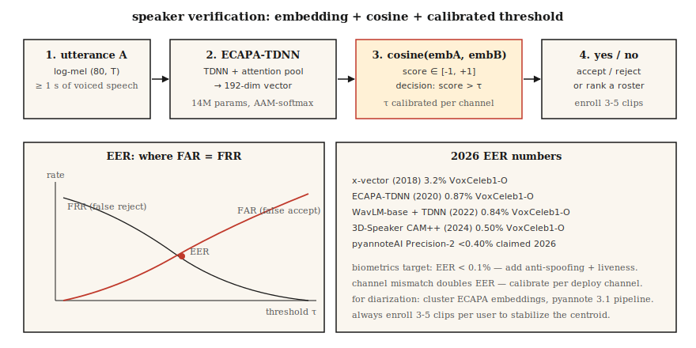

# Speaker Recognition & Verification — ECAPA, WavLM, and the Diarization Handoff

> Same person or different person? That single question is the bedrock of voice biometrics, diarization, and speaker-conditioned TTS. In 2026 the answer comes from an embedding model — ECAPA-TDNN or a WavLM-derived x-vector — and a cosine.

**Type:** Build
**Languages:** Python
**Prerequisites:** Phase 6 · 02 (Spectrograms & Mel), Phase 3 · 07 (Regularization), Phase 5 · 22 (Embedding Models)
**Time:** ~45 minutes

## The Problem

Three related tasks:

- **Speaker identification.** Given a clip, pick the speaker from a known roster of N.
- **Speaker verification.** Given two clips, answer yes/no: same speaker?
- **Speaker diarization.** Given a long meeting, segment "who spoke when."

All three reduce to the same primitive: a speaker embedding where cosine distance tracks identity. Produce a 192-dim or 256-dim vector per utterance such that same-speaker pairs cluster and different-speaker pairs separate. The engineering is 70% data (VoxCeleb + augmentations) and 30% loss (AAM-softmax).

2026 reality: ECAPA-TDNN remains the baseline; WavLM + x-vector and 3D-Speaker surpass it on harder benchmarks. Commercial systems (pyannoteAI Precision-2) claim 28% accuracy gain over open baselines.

## The Concept



**x-vectors (2018).** The foundational idea: TDNN over log-mels → statistics pool (mean + std across time) → 256-dim embedding. Supervised with softmax over speakers. Superseded but still a baseline.

**ECAPA-TDNN (2020).** x-vector + channel attention + multi-layer feature aggregation + AAM-softmax. Still the 2026 default because it's small (14M params), fast, and Apache-2.0 in SpeechBrain.

**AAM-softmax (Additive Angular Margin).** The loss that powers most 2024-2026 speaker models. Reshape softmax to penalize angular distance on a hypersphere. Margins of 0.2 radians and scale 30 are the standard hyperparameters.

**WavLM + simple head (2023-2026).** Self-supervised pretraining on 94k hours of mixed audio. Swap the ECAPA log-mel frontend for frozen WavLM features; add a simple TDNN head. Beats ECAPA by ~1% EER on VoxCeleb1-O.

**3D-Speaker (2024).** Combines CAM++ (ECAPA successor) with ResNet ensembles. EER 0.5% on VoxCeleb1-O. Current SOTA among open models.

### The metric is EER, not accuracy

**Equal Error Rate.** Plot FAR (false accept) vs FRR (false reject) against decision threshold. EER = point where FAR = FRR. Lower is better. 2026 numbers:

| Model | VoxCeleb1-O EER | VoxCeleb-Hard EER | Source |
|-------|-----------------|-------------------|--------|
| x-vector (2018) | 3.2% | 7.5% | original paper |
| ECAPA-TDNN (SpeechBrain) | 0.87% | 2.2% | SpeechBrain card |
| WavLM-base + TDNN | 0.84% | 2.0% | Microsoft, 2022 |
| 3D-Speaker CAM++ | 0.50% | 1.4% | Alibaba, 2024 |
| Commercial (pyannoteAI Precision-2) | <0.4% | claimed | product, 2026 |

EER 0.5% means 1 in 200 same-speaker pairs wrongly rejected AND 1 in 200 different-speaker pairs wrongly accepted at the chosen threshold. Biometrics-grade systems target EER &lt; 0.1%.

### The diarization handoff

Diarization pipeline in 2026:

1. VAD — Silero or pyannote segmentation.
2. Short-segment clustering — spectral clustering or online clustering on ECAPA embeddings.
3. Overlap detection — pyannote's overlap detector for multi-speaker frames.
4. Optional re-segmentation / boundary refinement.

Diarization Error Rate (DER) is the composite metric: `DER = (FA + Miss + Confusion) / total_speaker_time`. AMI meetings: 20% DER is typical; 8-12% is state-of-the-art.

## Build It

### Step 1: a distance you can trust

```python
import math

def cosine(a, b):
    dot = sum(x * y for x, y in zip(a, b))
    na = math.sqrt(sum(x * x for x in a)) or 1e-12
    nb = math.sqrt(sum(x * x for x in b)) or 1e-12
    return dot / (na * nb)
```

Cosine distance is the speaker-verification score. No thresholds from the paper — you calibrate on your domain.

### Step 2: EER calculation

```python
def eer(same_scores, diff_scores):
    thresholds = sorted(set(same_scores + diff_scores))
    best_gap = 1.0
    best_t = None
    for t in thresholds:
        far = sum(1 for s in diff_scores if s >= t) / max(1, len(diff_scores))
        frr = sum(1 for s in same_scores if s < t) / max(1, len(same_scores))
        gap = abs(far - frr)
        if gap < best_gap:
            best_gap = gap
            best_t = t
            best_eer = (far + frr) / 2
    return best_eer, best_t
```

Sweep the threshold over all observed scores, report the EER point.

### Step 3: AAM-softmax loss (conceptual)

```python
import math

def aam_softmax_logit(cos_theta, target_class, i, margin=0.2, scale=30.0):
    if i == target_class:
        cos_m = math.cos(math.acos(cos_theta) + margin)
        return scale * cos_m
    return scale * cos_theta
```

At training, for the target class you push cosine through `cos(θ + m)`; for non-target classes you pass `cos θ`. Cross-entropy on the scaled logits is AAM-softmax. Margin `m=0.2` radians (~11°) and scale `s=30` are the 2020 defaults and still work in 2026.

### Step 4: use the production model

```python
from speechbrain.inference.speaker import EncoderClassifier
classifier = EncoderClassifier.from_hparams(
    source="speechbrain/spkrec-ecapa-voxceleb",
    savedir="models/ecapa",
)

emb_a = classifier.encode_batch(signal_a).squeeze(0).squeeze(0)
emb_b = classifier.encode_batch(signal_b).squeeze(0).squeeze(0)
score = torch.nn.functional.cosine_similarity(emb_a, emb_b, dim=0).item()
```

Apache-2.0. 14M params. ~50 ms per 3 s clip on a laptop CPU. This is the 2026 starting point for any voice biometrics feature.

### Step 5: diarize a meeting with pyannote 4.0

```python
from pyannote.audio import Pipeline
pipeline = Pipeline.from_pretrained("pyannote/speaker-diarization-3.1", use_auth_token=HF_TOKEN)

diarization = pipeline("meeting.wav", min_speakers=2, max_speakers=6)
for turn, _, speaker in diarization.itertracks(yield_label=True):
    print(f"{turn.start:.1f}-{turn.end:.1f}s  {speaker}")
```

Pair this with Whisper to get speaker-attributed transcripts. pyannoteAI's commercial `precision-2` model is the 2026 accuracy leader if you can pay for it.

## Use It

The 2026 stack:

| Situation | Pick |
|-----------|------|
| Voice unlock (biometrics) | ECAPA + EER-calibrated threshold on your users' voices |
| Customer-call authentication | ECAPA + anti-spoofing (see lesson 16) + enrollment of 3-5 clips |
| Speaker-attributed transcription | pyannote 3.1 / community-1 + Whisper, post-hoc align |
| Multi-party meeting diarization | pyannote 3.1 with min/max speakers hints |
| Research SOTA | 3D-Speaker CAM++ or commercial Precision-2 |

Rule of thumb: a single ECAPA embedding per 3 s window is enough for 95% of production workloads. Deeper stacks pay off only past EER 0.5%.

## Pitfalls that still ship in 2026

- **Fixed-threshold verification.** Threshold learned on LibriSpeech won't work on your Zoom audio. Calibrate per channel.
- **Short clips.** &lt; 1 s of speech gives unreliable embeddings. Always reject or accumulate.
- **Cross-channel degradation.** Train on studio, test on phone — EER doubles. Fine-tune on your channel.
- **Overlap speech.** Diarization ignores overlapped segments by default. Run an overlap detector; expect up to 10% of conversational audio to be overlapped.
- **Language mismatch.** ECAPA trained on VoxCeleb (mostly English) holds up well but drops ~30% on unseen-language accents. WavLM-base + head is the multilingual-safer choice.
- **Enrollment size.** One clip per user is fragile. Enroll 3-5 clips from different sessions / devices.

## Ship It

Save as `outputs/skill-speaker-verifier.md`. Pick model, enrollment policy, threshold calibration, and diarization hand-off for a given workload.

## Exercises

1. **Easy.** Run `code/main.py`. It synthesizes four voices as tone/formant proxies, computes cosine between same- and different-speaker pairs, and reports EER.
2. **Medium.** Replace the toy feature extractor with SpeechBrain ECAPA-TDNN. Run on VoxCeleb1-O (list at `https://mm.kaist.ac.kr/datasets/voxceleb/`), report EER.
3. **Hard.** Diarize a 10-minute 3-speaker podcast clip with pyannote 3.1. Produce a speaker-attributed transcript by combining with Whisper-large-v3-turbo. Measure DER against a hand-labeled gold.

## Key Terms

| Term | What people say | What it actually means |
|------|-----------------|-----------------------|
| Speaker embedding | Voice fingerprint | 192/256-dim vector per clip; same speaker ⇒ close cosine. |
| ECAPA-TDNN | The default | TDNN + channel attention + MFA + AAM-softmax. |
| AAM-softmax | Angular margin loss | `cos(θ + m)` for target class on hypersphere. |
| EER | The number | Threshold where FAR = FRR. |
| DER | Diarization's error | `(FA + Miss + Confusion) / total_time`. |
| Enrollment | Sign-up phase | Collect N clips per user to build a reference centroid. |
| Overlap detection | The hard frames | Model that flags &gt; 1 speaker per frame; pyannote has one. |

## Further Reading

- [Snyder et al. (2018). x-vectors: Robust DNN Embeddings](https://www.danielpovey.com/files/2018_icassp_xvectors.pdf) — the foundational paper.
- [Desplanques et al. (2020). ECAPA-TDNN](https://arxiv.org/abs/2005.07143) — the paper everyone still cites.
- [Chen et al. (2022). WavLM](https://arxiv.org/abs/2110.13900) — pretraining that boosted speaker tasks.
- [Bredin et al. (2023). pyannote.audio 3.1](https://arxiv.org/abs/2311.03687) — the diarization default.
- [Alibaba — 3D-Speaker](https://github.com/alibaba-damo-academy/3D-Speaker) — 2024 SOTA open.
- [pyannoteAI — community-1 + Precision-2](https://www.pyannote.ai/blog/community-1) — 2026 release notes.
