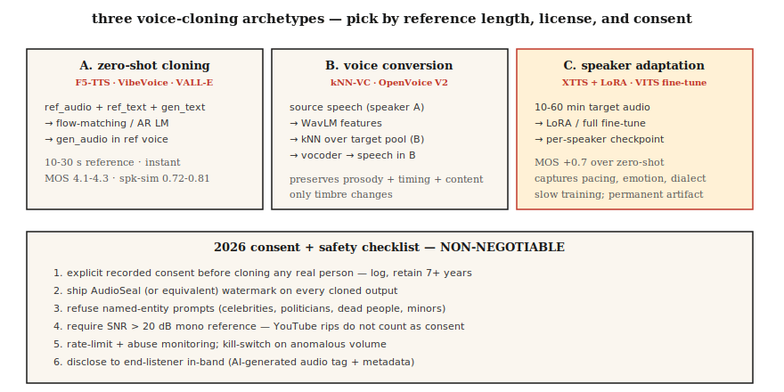

# Voice Cloning & Voice Conversion

> Voice cloning speaks your text in someone else's voice. Voice conversion rewrites your voice into someone else's while preserving what you said. Both hang on the same decomposition: separating speaker identity from content.

**Type:** Build
**Languages:** Python
**Prerequisites:** Phase 6 · 06 (Speaker Recognition), Phase 6 · 07 (TTS)
**Time:** ~75 minutes

## The Problem

In 2026, with a consumer GPU and 5 seconds of audio, you can produce a high-quality clone of anyone's voice. ElevenLabs, F5-TTS, OpenVoice v2, and VoiceBox all offer zero-shot or few-shot cloning. This technology is both a blessing (accessible TTS, dubbing, assistive speech) and a weapon (scam calls, political deepfakes, IP theft).

Two closely related tasks:

- **Voice cloning (TTS side):** Text + 5-second voice reference → audio spoken in that voice.
- **Voice conversion (speech side):** Source audio (A says X) + B's voice reference → audio of B saying X.

Both decompose the waveform into (content, speaker, prosody) and recombine content from one source with speaker identity from another.

The key constraint you must follow in 2026: **watermarking and consent gates are legal requirements in the EU (AI Act, enforceable from August 2026) and California (AB 2905, effective 2025)**. Your pipeline must emit an inaudible watermark and refuse unconsented cloning.

## The Concept



**Zero-shot cloning.** Pass a 5-second clip to a model trained on thousands of speakers. A speaker encoder maps the clip to a speaker embedding; the TTS decoder conditions on this embedding plus text.

Used by: F5-TTS (2024), YourTTS (2022), XTTS v2 (2024), OpenVoice v2 (2024).

**Few-shot fine-tuning.** Record 5–30 minutes of the target voice. Do a one-hour LoRA fine-tune of a base model. Quality jumps from "okay" to "indistinguishable." Coqui and ElevenLabs both support this mode; the community pairs it with F5-TTS.

**Voice conversion (VC).** Two schools:

- **Recognition-synthesis.** Run an ASR-like model to extract content representations (e.g., soft phoneme posteriors, PPGs), then resynthesize with a target speaker embedding. Robust to language and accent. KNN-VC (2023), Diff-HierVC (2023) use this.
- **Disentanglement.** Train an autoencoder that separates content, speaker, and prosody in a bottleneck latent space. At inference, swap the speaker embedding. Lower quality but faster. AutoVC (2019), VITS-VC variants use this.

**Neural codec-based cloning (post-2024).** VALL-E, VALL-E 2, NaturalSpeech 3, VoiceBox — treat audio as discrete tokens from SoundStream / EnCodec, train a large autoregressive or flow-matching model on codec tokens. Quality rivals ElevenLabs on short prompts.

### Ethics Is Not an Add-On

**Watermarking.** PerTh (Perth) and SilentCipher (2024) inaudibly embed a ~16–32 bit ID into audio. Survives re-encoding, streaming, and common edits. Production-ready open-source solutions.

**Consent gates.** Every cloned output must be paired with a verifiable consent record. "I, Rohit, on 2026-04-22, authorize this voice for use X." Store in a tamper-evident log.

**Detection.** AASIST, RawNet2, and Wav2Vec2-AASIST ship as detectors. The ASVspoof 2025 challenge published state-of-the-art detectors with EER of 0.8–2.3% on ElevenLabs, VALL-E 2, and Bark outputs.

### Numbers (2026)

| Model | Zero-shot? | SECS (similarity to target) | WER (intelligibility) | Parameters |
|-------|-----------|--------------------|--------------|--------|
| F5-TTS | Yes | 0.72 | 2.1% | 335M |
| XTTS v2 | Yes | 0.65 | 3.5% | 470M |
| OpenVoice v2 | Yes | 0.70 | 2.8% | 220M |
| VALL-E 2 | Yes | 0.77 | 2.4% | 370M |
| VoiceBox | Yes | 0.78 | 2.1% | 330M |

SECS > 0.70 is generally indistinguishable from the target for most listeners.

## Build It

### Step 1: Decomposition via Recognition-Synthesis (Code Demo in main.py)

```python
def clone_pipeline(ref_audio, text, target_embedder, tts_model):
    speaker_emb = target_embedder.encode(ref_audio)
    mel = tts_model(text, speaker=speaker_emb)
    return vocoder(mel)
```

Conceptually simple; the weight is in `tts_model` and the speaker encoder.

### Step 2: Zero-Shot Cloning with F5-TTS

```python
from f5_tts.api import F5TTS
tts = F5TTS()
wav = tts.infer(
    ref_file="rohit_5s.wav",
    ref_text="The quick brown fox jumps over the lazy dog.",
    gen_text="Please add milk and bread to my list.",
)
```

The reference transcript must exactly match the reference audio; mismatches break alignment.

### Step 3: Voice Conversion with KNN-VC

```python
import torch
from knnvc import KNNVC  # 2023 model, https://github.com/bshall/knn-vc
vc = KNNVC.load("wavlm-base-plus")
out_wav = vc.convert(source="my_voice.wav", target_pool=["alice_1.wav", "alice_2.wav"])
```

KNN-VC runs WavLM to extract per-frame embeddings for source and target pool, then replaces each source frame with its nearest neighbor in the pool. Non-parametric, works with one minute of target speech.

### Step 4: Embed Watermark

```python
from silentcipher import SilentCipher
sc = SilentCipher(model="2024-06-01")
payload = b"consent_id:abc123;ts:1745353200"
watermarked = sc.embed(wav, sr=24000, message=payload)
detected = sc.detect(watermarked, sr=24000)   # returns payload bytes
```

~32-bit payload, detectable after MP3 re-encoding and mild noise.

### Step 5: Consent Gate

```python
def cloned_inference(text, ref_audio, consent_record):
    assert verify_signature(consent_record), "Signed consent required"
    assert consent_record["speaker_id"] == hash_speaker(ref_audio)
    wav = tts.infer(ref_file=ref_audio, gen_text=text)
    wav = watermark(wav, payload=consent_record["id"])
    return wav
```

## Use It

2026 toolstack:

| Scenario | Pick |
|-----------|------|
| 5s zero-shot cloning, open-source | F5-TTS or OpenVoice v2 |
| Commercial production cloning | ElevenLabs Instant Voice Clone v2.5 |
| Voice conversion (rewrite) | KNN-VC or Diff-HierVC |
| Multi-speaker fine-tuning | StyleTTS 2 + speaker adapters |
| Cross-lingual cloning | XTTS v2 or VALL-E X |
| Deepfake detection | Wav2Vec2-AASIST |

## Pitfalls

- **Reference transcript misaligned.** F5-TTS and similar require reference text to exactly match reference audio, punctuation included.
- **Reverberant reference.** Echo ruins cloning. Use dry, close-mic recordings.
- **Emotion mismatch.** If the training reference is "cheerful," everything clones as cheerful. Match reference emotion to target use case.
- **Language leakage.** Clone an English speaker, then make the model speak French — it often keeps the accent; use cross-lingual models (XTTS, VALL-E X).
- **No watermark.** Legally unshippable in the EU from August 2026.

## Ship It

Save as `outputs/skill-voice-cloner.md`. Design a cloning or conversion pipeline with consent gate + watermark + quality targets.

## Exercises

1. **Easy.** Run `code/main.py`. It demonstrates speaker embedding swap by computing cosine similarity between two "speakers" before and after the swap.
2. **Medium.** Clone your own voice with OpenVoice v2. Measure SECS between reference and clone. Measure CER via Whisper.
3. **Hard.** Apply SilentCipher watermark to 20 clones, pass them through 128 kbps MP3 encode+decode, detect payload. Report bit accuracy.

## Key Terms

| Term | What people say | What it actually means |
|------|-----------------|-----------------------|
| Zero-shot cloning | 5 seconds is enough | Pretrained model + speaker embedding; no training. |
| PPG | Phoneme posterior-gram | Per-frame ASR posteriors used as language-agnostic content representation. |
| KNN-VC | Nearest-neighbor conversion | Replaces each source frame with the closest target pool frame. |
| Neural codec TTS | VALL-E style | AR model over EnCodec/SoundStream tokens. |
| Watermark | Inaudible signature | Bits embedded in audio that survive re-encoding. |
| SECS | Cloning fidelity | Cosine between target and cloned speaker embeddings. |
| AASIST | Deepfake detector | Anti-spoofing model; detects synthetic speech. |

## Further Reading

- [Chen et al. (2024). F5-TTS](https://arxiv.org/abs/2410.06885) — open-source SOTA zero-shot cloning.
- [Baevski et al. / Microsoft (2023). VALL-E](https://arxiv.org/abs/2301.02111) and [VALL-E 2 (2024)](https://arxiv.org/abs/2406.05370) — neural codec TTS.
- [Qian et al. (2019). AutoVC](https://arxiv.org/abs/1905.05879) — disentanglement-based voice conversion.
- [Baas, Waubert de Puiseau, Kamper (2023). KNN-VC](https://arxiv.org/abs/2305.18975) — retrieval-based VC.
- [SilentCipher (2024) — Audio Watermarking](https://github.com/sony/silentcipher) — production-ready 32-bit audio watermark.
- [ASVspoof 2025 results](https://www.asvspoof.org/) — detector vs. synthesizer arms race, 2026 update.
