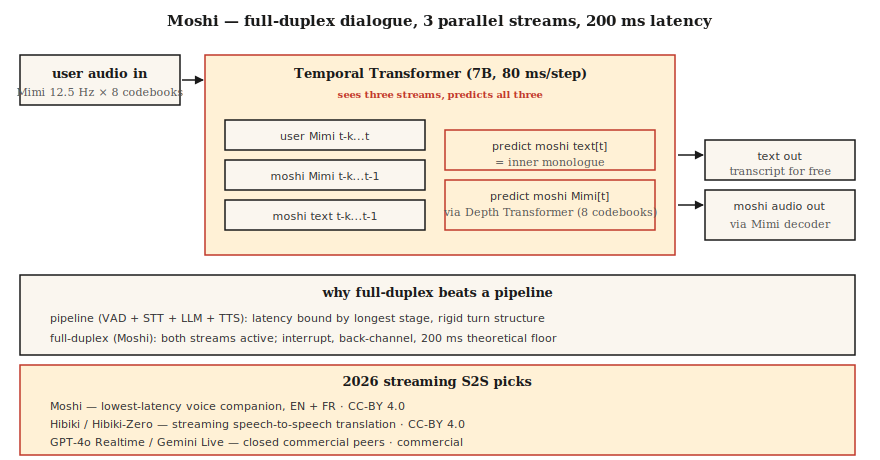

# Streaming Speech-to-Speech — Moshi, Hibiki, and Full-Duplex Conversation

> 2024-2026 redefined voice AI. Moshi delivered a single model that listens and speaks simultaneously at 200 ms latency. Hibiki does chunk-by-chunk speech-to-speech translation. Both abandon the ASR → LLM → TTS pipeline for a unified full-duplex architecture over Mimi codec tokens. This is the new reference design.

**Type:** Learn
**Languages:** Python
**Prerequisites:** Phase 6 · 13 (Neural Audio Codecs), Phase 6 · 11 (Real-Time Audio), Phase 7 · 05 (Full Transformer)
**Time:** ~75 minutes

## The Problem

Every voice agent built from Lessons 11 + 12 has a fundamental latency floor around 300-500 ms: VAD fires, STT processes, LLM reasons, TTS generates. Each stage has its own minimum latency. You can tune and parallelize, but the pipeline shape caps you.

Moshi (Kyutai, 2024-2026) asked a different question: what if there's no pipeline? What if one model directly consumes audio and produces audio, continuously, treating text as an intermediate "inner monologue" rather than a required stage?

The answer is **full-duplex speech-to-speech**. Theoretical latency of 160 ms (80 ms Mimi frame + 80 ms acoustic delay). Measured latency of 200 ms on a single L4 GPU. That's half what the best-in-class pipeline voice agents achieve.

## The Concept



### Moshi Architecture

**Input.** Two Mimi codec streams, both at 12.5 Hz × 8 codebooks:

- Stream 1: User audio (Mimi-encoded, arriving continuously)
- Stream 2: Moshi's own audio (generated by Moshi)

**Transformer.** A 7B-parameter temporal Transformer processes both streams plus a text "inner monologue" stream. At every 80 ms step, it:

1. Ingests the latest user Mimi tokens (8 codebooks).
2. Ingests the most recent Moshi Mimi tokens (8 codebooks, generated and fed back).
3. Produces the next Moshi text token (inner monologue).
4. Produces the next batch of Moshi Mimi tokens (via a small depth Transformer generating 8 codebooks).

All three streams — user audio, Moshi audio, Moshi text — run in parallel. Moshi can listen while speaking; interrupt itself when the user interrupts; insert back-channel acknowledgments ("mm-hmm") without breaking its main utterance.

**Depth transformer.** Within a single frame, the 8 codebooks aren't predicted in parallel — there are inter-codebook dependencies. A small 2-layer "depth transformer" predicts them sequentially within 80 ms. This is the standard factorization for AR codec LMs (VALL-E, VibeVoice use it too).

### Why Inner Monologue Text Helps

Without explicit text, the model must implicitly model language within the acoustic stream. Moshi's insight: force it to emit text tokens alongside audio. This text stream is essentially a transcript of what Moshi is saying. It improves semantic coherence, makes swapping language model heads easier, and gives you free transcription.

### Hibiki: Streaming Speech-to-Speech Translation

Same architecture, trained on translation pairs. Source audio in, target language audio out, continuously. Hibiki-Zero (February 2026) eliminates the need for word-level aligned training data — uses sentence-level data + GRPO reinforcement learning for latency optimization.

Initially supports four language pairs; adapts to a new language with ~1000 hours.

### The Broader Kyutai Stack (2026)

- **Moshi** — Full-duplex conversation (French-first, English well-supported)
- **Hibiki / Hibiki-Zero** — Simultaneous speech translation
- **Kyutai STT** — Streaming ASR (500 ms or 2.5 s look-ahead)
- **Kyutai Pocket TTS** — 100M parameter TTS, runs on CPU (January 2026)
- **Unmute** — The full pipeline combining these on a public server

Throughput on L40S GPU: 64 concurrent sessions, 3× real-time.

### Sesame CSM — The Cousin

Sesame CSM (2025) uses similar ideas — a Llama-3 backbone with Mimi codec heads. But CSM is unidirectional (ingests context + text, produces speech), not full-duplex. It has the best "voice presence" of any TTS on the market; it's a different beast from Moshi's full-duplex capability.

### 2026 Performance Numbers

| Model | Latency | Use Case | License |
|-------|---------|----------|---------|
| Moshi | 200 ms (L4) | Full-duplex EN / FR conversation | CC-BY 4.0 |
| Hibiki | 12.5 Hz frame rate | FR ↔ EN streaming translation | CC-BY 4.0 |
| Hibiki-Zero | Same | 5 language pairs, no aligned data | CC-BY 4.0 |
| Sesame CSM-1B | 200 ms TTFA | Context-conditioned TTS | Apache-2.0 |
| GPT-4o Realtime | ~300 ms | Closed-source, OpenAI API | Commercial |
| Gemini 2.5 Live | ~350 ms | Closed-source, Google API | Commercial |

## Build It

### Step 1: The Interface

Moshi exposes a WebSocket server consuming 80 ms chunks of Mimi-encoded audio and returning 80 ms chunks of Mimi-encoded audio. Bidirectional. Continuous.

```python
import asyncio
import websockets
from moshi.client_utils import encode_audio_mimi, decode_audio_mimi

async def moshi_chat():
    async with websockets.connect("ws://localhost:8998/api/chat") as ws:
        mic_task = asyncio.create_task(stream_mic_to(ws))
        spk_task = asyncio.create_task(stream_from_to_speaker(ws))
        await asyncio.gather(mic_task, spk_task)
```

### Step 2: Full-Duplex Loop

```python
async def stream_mic_to(ws):
    async for chunk_80ms in mic_stream_at_12_5_hz():
        mimi_tokens = encode_audio_mimi(chunk_80ms)
        await ws.send(serialize(mimi_tokens))

async def stream_from_to_speaker(ws):
    async for msg in ws:
        mimi_tokens, text_token = deserialize(msg)
        audio = decode_audio_mimi(mimi_tokens)
        await play(audio)
```

Both directions run simultaneously. Python asyncio or Rust futures are the standard transport.

### Step 3: Training Objective (Conceptual)

For each 80 ms frame `t`:

- Input: `user_mimi[0..t]`, `moshi_mimi[0..t-1]`, `moshi_text[0..t-1]`
- Predict: `moshi_text[t]`, then `moshi_mimi[t, codebook_0..7]`

Text is predicted before audio (inner monologue); audio is predicted codebook-by-codebook within the depth transformer.

### Step 4: Where Moshi Wins and Doesn't

Moshi wins at:

- End-to-end sub-250 ms on cheap hardware.
- Natural back-channeling and interruption.
- No pipeline glue code.

Moshi doesn't win at:

- Tool calling (not trained for it; you need a separate LLM path).
- Long reasoning (Moshi is a ~8B conversational model, not Claude/GPT-4).
- Factual accuracy on obscure topics.
- Most production enterprise use cases (still pipeline-based in 2026).

## Use It

| Scenario | Pick |
|-----------|------|
| Lowest-latency voice companion | Moshi |
| Real-time translation calls | Hibiki |
| Voice demo / research | Moshi, CSM |
| Enterprise agent with tools | Pipeline (Lesson 12), not Moshi |
| Custom voice TTS with context | Sesame CSM |
| Arbitrary-language speech-to-speech | GPT-4o Realtime or Gemini 2.5 Live (commercial) |

## Pitfalls

- **Limited tool calling.** Moshi is a conversational model, not an agent framework. For tools, combine with a pipeline.
- **Voice conditioning.** Moshi uses a single trained persona; cloning requires a separate training run.
- **Language coverage.** French + English are excellent; others are limited. Hibiki-Zero helps, but you still need training data.
- **Resource cost.** A full Moshi session holds a GPU slot; not a cheap shared multi-tenant deployment.

## Ship It

Save as `outputs/skill-duplex-pipeline.md`. Choose between pipeline vs full-duplex architecture for a given voice agent workload, with justification.

## Exercises

1. **Easy.** Run `code/main.py`. It symbolically simulates the dual-stream + inner monologue architecture.
2. **Medium.** Pull Moshi from HuggingFace, spin up the server, and run a conversation. Measure wall-clock latency from user end-of-speech to Moshi response start.
3. **Hard.** Take your Lesson 12 pipeline agent and compare P50 latency vs Moshi on 20 matched test utterances. Write a brief explaining when the pipeline still wins architecturally.

## Key Terms

| Term | How people talk about it | What it actually means |
|------|-----------------|-----------------------|
| Full-duplex | Listen + speak simultaneously | Two audio streams active at once on the same model. |
| Inner monologue | Model's text stream | Moshi emits text tokens alongside its audio output. |
| Depth transformer | Inter-codebook predictor | Small transformer predicting 8 codebooks within one 80 ms frame. |
| Mimi | Kyutai's codec | 12.5 Hz × 8 codebooks; semantic+acoustic; powers Moshi. |
| Streaming S2S | Audio → audio real-time | Chunk-by-chunk translation/conversation, no pipeline stages. |
| Back-channeling | "Mm-hmm" reactions | Moshi can emit small acknowledgments without breaking its own turn. |

## Further Reading

- [Défossez et al. (2024). Moshi — speech-text foundation model](https://arxiv.org/html/2410.00037v2) — The paper.
- [Kyutai Labs (2026). Hibiki-Zero](https://arxiv.org/abs/2602.12345) — Alignment-free streaming translation.
- [Sesame (2025). Crossing the uncanny valley of voice](https://www.sesame.com/research/crossing_the_uncanny_valley_of_voice) — CSM spec.
- [Kyutai — Moshi repo](https://github.com/kyutai-labs/moshi) — Installation + server.
- [OpenAI — Realtime API](https://platform.openai.com/docs/guides/realtime) — Closed-source commercial peer.
- [Kyutai — Delayed Streams Modeling](https://github.com/kyutai-labs/delayed-streams-modeling) — Underlying STT/TTS framework.
