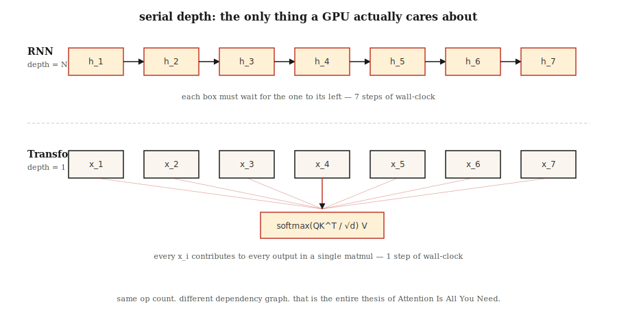

# Why Transformers — What's Wrong with RNNs

> RNNs process one token at a time. Transformers process all tokens at once. That single architectural bet rewrote every scaling curve in deep learning after 2017.

**Type:** Learn
**Languages:** Python
**Prerequisites:** Phase 3 (Deep Learning Core), Phase 5 · 09 (Sequence-to-Sequence), Phase 5 · 10 (Attention Mechanisms)
**Time:** ~45 minutes

## The Problem

Before 2017, every state-of-the-art sequence model on Earth — language, translation, speech — was a recurrent neural network. LSTMs and GRUs swept translation benchmarks (the ImageNet of translation) for five straight years. They were the only tool anyone had.

They had three fatal weaknesses. First, sequential computation means you cannot parallelize along the time axis: token `t+1` needs the hidden state of token `t`. A 1024-token sequence means 1024 serial steps on a GPU capable of a million FLOPs per cycle. Wall-clock training time grows linearly with sequence length on hardware designed for parallelism.

Second, vanishing gradients mean information from 50 tokens ago has been crushed through 50 layers of nonlinearity. Gated recurrent units (LSTM, GRU) soften that crush but never eliminate it. Long-range dependencies — "the book I read on the flight to Kyoto last summer was…" — frequently break.

Third, fixed-width hidden state means the encoder must squeeze the entire source sequence into one vector for the decoder to see anything. Whether the source is 5 tokens or 500, the bottleneck is the same shape.

The 2017 paper "Attention Is All You Need" proposed a radical idea: drop recurrence entirely. Let every position attend to every other position in parallel. Train with one large matrix multiply instead of 1024 serial operations.

The result: by 2026 it dominates every modality. Language (GPT-5, Claude 4, Llama 4), vision (ViT, DINOv2, SAM 3), audio (Whisper), biology (AlphaFold 3), robotics (RT-2). Same block, different inputs.

## The Concept



**Recurrence is a bottleneck.** An RNN computes `h_t = f(h_{t-1}, x_t)`. Each step depends on the previous one. You cannot compute `h_5` before computing `h_4`. On modern GPUs with tens of thousands of parallel cores, this wastes 99% of the silicon on long sequences.

**Attention is a broadcast.** Self-attention computes `output_i = sum_j(a_ij * v_j)` for every pair `(i, j)` simultaneously. The entire N×N attention matrix fills in one batched matmul. No step depends on another. GPUs love this.

**The speedup is not a constant factor.** It is the difference between `O(N)` serial depth and `O(1)` serial depth. In practice, on equal hardware with N=512, transformers train 5–10× faster per epoch, and the gap widens with sequence length until you hit the `O(N²)` memory wall of attention (addressed later by Flash Attention — see Lesson 12).

**The transformer's cost.** Attention memory grows `O(N²)`. 2K context is fine. 128K context requires sliding windows, RoPE extrapolation, Flash Attention tiling, or linear attention variants. Recurrence is `O(N)` in both time and memory; transformers trade time for memory, then win time back through parallelism.

**Inductive bias shift.** RNNs assume locality and recency. Transformers assume nothing — every pair of positions is a candidate for attention. This is why transformers need more data to train well, but once they have data they scale further. Chinchilla (2022) formalized this: given enough tokens, transformers always beat RNNs at equal parameter count.

## Build It

No neural networks here — we numerically simulate the core bottleneck so you can feel the gap on your own laptop.

### Step 1: Measure serial depth

See `code/main.py`. We write two functions. One encodes a sequence as a chain of additions (serial, like an RNN). One encodes it as a parallel reduction (broadcast, like attention). Same math, different dependency graph.

```python
def rnn_style(xs):
    h = 0.0
    for x in xs:
        h = 0.9 * h + x   # cannot parallelize: h depends on previous h
    return h

def attention_style(xs):
    return sum(xs) / len(xs)  # each x is independent
```

We time both on sequences up to length 100,000. The RNN version is O(N), single CPU pipeline. Even in pure Python, the attention-style reduction wins at length ≥ 1000 because Python's `sum()` is implemented in C with no interpreter overhead per iteration.

### Step 2: Count theoretical operations

Both algorithms do N additions. The difference is *dependency depth*: how many operations must happen serially before the next can start. RNN depth = N. Attention depth: log(N) for tree reduction, 1 for parallel scan. Depth — not total ops — determines GPU time.

### Step 3: Measured scaling on long sequences

We print a timing table that visualizes the O(N) gap. On a 2026 Mac laptop, sequences below 1,000 elements are too fast to measure. Sequences of 100,000 show a clean linear-scan curve. Scale this to a 16,384-token transformer versus an equivalent 12-layer LSTM, and you see why training wall-clock time was a blocker in 2016.

## Use It

When to still pick an RNN in 2026:

| Scenario | Choice |
|-----------|------|
| Streaming inference, one token at a time, constant memory | RNN or state-space model (Mamba, RWKV) |
| Ultra-long sequences (>1M tokens) where attention memory explodes | Linear attention, Mamba 2, Hyena |
| Edge devices without matmul accelerators | Depthwise-separable RNNs still win FLOPs/watt |
| Everything else (training, batch inference, up to 128K context) | Transformer |

State-space models (SSMs) like Mamba are essentially RNNs with structured parameterization that gives them the best of both worlds: `O(N)` scan memory, parallel training via selective scan. They recover ~90% of transformer quality with better long-context scaling. Most frontier labs in 2026 train SSM+transformer hybrids (e.g., Jamba, Samba) — recurrence isn't dead, it became a component.

## Ship It

See `outputs/skill-architecture-picker.md`. This skill picks an architecture for a new sequence problem given length, throughput, and training budget constraints. For training runs over 1 billion tokens, it should never recommend a pure RNN without stating the tradeoffs.

## Exercises

1. **Easy.** Take `rnn_style` from `code/main.py` and replace the scalar hidden state with a length-64 hidden state vector. Re-measure. How does serial overhead grow with hidden-state dimension?
2. **Medium.** Implement a parallel prefix sum (Hillis-Steele scan) in pure Python. Verify it produces numerical output identical to the serial scan at length 1024. Count the depth.
3. **Hard.** Port the attention-style reduction to GPU PyTorch. Sweep sequence length from 64 to 65,536 and time both. Plot the curves and explain the shape.

## Key Terms

| Term | How people talk about it | What it actually means |
|------|-----------------|-----------------------|
| Recurrence | "RNNs are serial" | Step `t` depends on the computation of step `t-1`, forcing serial execution along the time axis. |
| Serial depth | "How deep is the graph" | The longest chain of dependent operations; it bounds wall-clock time even with infinite hardware. |
| Attention | "Letting tokens look at each other" | Weighted sum `sum_j a_ij v_j`, where `a_ij` comes from a similarity score between positions i and j. |
| Context window | "How much the model can see" | The number of positions an attention layer can accept; quadratic memory cost grows with it. |
| Inductive bias | "Assumptions baked into architecture" | Prior beliefs about data structure; CNNs assume translation invariance, RNNs assume recency. |
| State-space model | "RNN with algebra behind it" | Recurrence parameterized by structured state-space matrices to support parallel training. |
| Quadratic bottleneck | "Why context is expensive" | Attention memory is `O(N²)` in sequence length; Flash Attention hides the constant, not the scaling. |

## Further Reading

- [Vaswani et al. (2017). Attention Is All You Need](https://arxiv.org/abs/1706.03762) — The paper that ended recurrence in mainstream NLP.
- [Bahdanau, Cho, Bengio (2014). Neural MT by Jointly Learning to Align and Translate](https://arxiv.org/abs/1409.0473) — Where attention was born, still welded to an RNN.
- [Hochreiter, Schmidhuber (1997). Long Short-Term Memory](https://www.bioinf.jku.at/publications/older/2604.pdf) — The original LSTM paper, for reference.
- [Gu, Dao (2023). Mamba: Linear-Time Sequence Modeling with Selective State Spaces](https://arxiv.org/abs/2312.00752) — The modern recurrent response to transformers.
