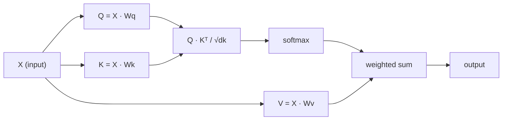

# Self-Attention from Scratch

> Attention is a lookup table where every word asks "who matters to me?" — and learns the answer.

**Type:** Build
**Languages:** Python
**Prerequisites:** Phase 3 (Deep Learning Core), Phase 5 Lesson 10 (Sequence-to-Sequence)
**Time:** ~90 minutes

## Learning Objectives

- Implement scaled dot-product self-attention from scratch using only NumPy, including query/key/value projections and softmax-weighted summation
- Build a multi-head attention layer that splits into multiple heads, computes attention in parallel, and concatenates the results
- Trace how the attention matrix captures relationships between tokens, and explain why dividing by sqrt(d_k) prevents softmax saturation
- Apply a causal mask to convert bidirectional attention into autoregressive (decoder-style) attention

## The Problem

RNNs process one token at a time. By the time you reach token 50, information from token 1 has been compressed through 50 steps. Long-range dependencies get squeezed into a fixed-size hidden state — a bottleneck no amount of LSTM gating can fully resolve.

Bahdanau's 2014 attention paper offered a fix: let the decoder look back at every encoder position and decide which ones matter for the current step. But it was still welded to an RNN. The 2017 "Attention Is All You Need" paper asked a sharper question: what if attention is the *only* mechanism? No recurrence, no convolution, just attention.

Self-attention lets every position in a sequence attend to every other position in one parallel step. This is exactly why transformers are fast, scalable, and dominant.

## The Concept

### The database lookup analogy

Think of attention as a soft database lookup:

```
Traditional database:
  Query: "capital of France"  -->  exact match  -->  "Paris"

Attention:
  Query: "capital of France"  -->  similarity with all keys  -->  weighted blend of all values
```

Each token produces three vectors:
- **Query (Q):** "What am I looking for?"
- **Key (K):** "What do I contain?"
- **Value (V):** "If selected, what information do I provide?"

The dot product of a query with all keys produces attention scores. A high score means "this key matches my query." These scores weight the values. The output is a weighted sum of values.

### Computing Q, K, V

Each token embedding is projected through three learned weight matrices:

```
Input embeddings (sequence of n tokens, each d-dimensional):

  X = [x1, x2, x3, ..., xn]       shape: (n, d)

Three weight matrices:

  Wq  shape: (d, dk)
  Wk  shape: (d, dk)
  Wv  shape: (d, dv)

Projections:

  Q = X @ Wq    shape: (n, dk)      each token's query
  K = X @ Wk    shape: (n, dk)      each token's key
  V = X @ Wv    shape: (n, dv)      each token's value
```

For a single token, intuitively:

```
             Wq
  x_i ------[*]------> q_i    "What am I looking for?"
       |
       |     Wk
       +----[*]------> k_i    "What do I contain?"
       |
       |     Wv
       +----[*]------> v_i    "What do I provide?"
```

### The attention matrix

Once you have Q, K, V for all tokens, attention scores form a matrix:

```
Scores = Q @ K^T    shape: (n, n)

              k1    k2    k3    k4    k5
        +-----+-----+-----+-----+-----+
   q1   | 2.1 | 0.3 | 0.1 | 0.8 | 0.2 |   <- how much q1 attends to each key
        +-----+-----+-----+-----+-----+
   q2   | 0.4 | 1.9 | 0.7 | 0.1 | 0.3 |
        +-----+-----+-----+-----+-----+
   q3   | 0.2 | 0.6 | 2.3 | 0.5 | 0.1 |
        +-----+-----+-----+-----+-----+
   q4   | 0.9 | 0.1 | 0.4 | 1.7 | 0.6 |
        +-----+-----+-----+-----+-----+
   q5   | 0.1 | 0.3 | 0.2 | 0.5 | 2.0 |
        +-----+-----+-----+-----+-----+

Each row: one token's attention over the full sequence
```

Watch a single query scan over all keys: each row scores every token, softmax turns scores into weights, and the context vector is a weighted blend of values.

```figure
attention-matrix
```

### Why scale?

Dot products grow with dimension dk. If dk = 64, dot products can land in the tens, pushing softmax into a vanishing-gradient region. The fix: divide by sqrt(dk).

```
Scaled scores = (Q @ K^T) / sqrt(dk)
```

This keeps values in a range where softmax produces useful gradients.

### Softmax turns scores into weights

Softmax converts raw scores into a probability distribution over each row:

```
Raw scores for q1:   [2.1, 0.3, 0.1, 0.8, 0.2]
                            |
                         softmax
                            |
Attention weights:   [0.52, 0.09, 0.07, 0.14, 0.08]   (sums to ~1.0)
```

Now each token has a set of weights saying how much it should attend to every other token.

### Weighted sum of values

Each token's final output is a weighted sum of all value vectors:

```
output_i = sum( attention_weight[i][j] * v_j  for all j )

For token 1:
  output_1 = 0.52 * v1 + 0.09 * v2 + 0.07 * v3 + 0.14 * v4 + 0.08 * v5
```

### Full pipeline



One-line formula:

```
Attention(Q, K, V) = softmax( Q @ K^T / sqrt(dk) ) @ V
```

## Build It

### Step 1: Softmax from scratch

Softmax converts raw logits into probabilities. Subtracting the max is for numerical stability.

```python
import numpy as np

def softmax(x):
    shifted = x - np.max(x, axis=-1, keepdims=True)
    exp_x = np.exp(shifted)
    return exp_x / np.sum(exp_x, axis=-1, keepdims=True)

logits = np.array([2.0, 1.0, 0.1])
print(f"logits:  {logits}")
print(f"softmax: {softmax(logits)}")
print(f"sum:     {softmax(logits).sum():.4f}")
```

### Step 2: Scaled dot-product attention

The core function. Takes Q, K, V matrices and returns the attention output plus the weight matrix.

```python
def scaled_dot_product_attention(Q, K, V):
    dk = Q.shape[-1]
    scores = Q @ K.T / np.sqrt(dk)
    weights = softmax(scores)
    output = weights @ V
    return output, weights
```

### Step 3: Self-attention class with learnable projections

A complete self-attention module with Wq, Wk, Wv weight matrices initialized using Xavier-like scaling.

```python
class SelfAttention:
    def __init__(self, d_model, dk, dv, seed=42):
        rng = np.random.default_rng(seed)
        scale = np.sqrt(2.0 / (d_model + dk))
        self.Wq = rng.normal(0, scale, (d_model, dk))
        self.Wk = rng.normal(0, scale, (d_model, dk))
        scale_v = np.sqrt(2.0 / (d_model + dv))
        self.Wv = rng.normal(0, scale_v, (d_model, dv))
        self.dk = dk

    def forward(self, X):
        Q = X @ self.Wq
        K = X @ self.Wk
        V = X @ self.Wv
        output, weights = scaled_dot_product_attention(Q, K, V)
        return output, weights
```

### Step 4: Run it on a sentence

Create fake embeddings for a sentence and observe the attention weights.

```python
sentence = ["The", "cat", "sat", "on", "the", "mat"]
n_tokens = len(sentence)
d_model = 8
dk = 4
dv = 4

rng = np.random.default_rng(42)
X = rng.normal(0, 1, (n_tokens, d_model))

attn = SelfAttention(d_model, dk, dv, seed=42)
output, weights = attn.forward(X)

print("Attention weights (each row: where that token looks):\n")
print(f"{'':>6}", end="")
for token in sentence:
    print(f"{token:>6}", end="")
print()

for i, token in enumerate(sentence):
    print(f"{token:>6}", end="")
    for j in range(n_tokens):
        w = weights[i][j]
        print(f"{w:6.3f}", end="")
    print()
```

### Step 5: Visualize attention with ASCII heatmap

Map attention weights to characters for a quick visual.

```python
def ascii_heatmap(weights, tokens, chars=" ░▒▓█"):
    n = len(tokens)
    print(f"\n{'':>6}", end="")
    for t in tokens:
        print(f"{t:>6}", end="")
    print()

    for i in range(n):
        print(f"{tokens[i]:>6}", end="")
        for j in range(n):
            level = int(weights[i][j] * (len(chars) - 1) / weights.max())
            level = min(level, len(chars) - 1)
            print(f"{'  ' + chars[level] + '   '}", end="")
        print()

ascii_heatmap(weights, sentence)
```

## Use It

PyTorch's `nn.MultiheadAttention` does exactly what we just built, plus multi-head splitting and output projection:

```python
import torch
import torch.nn as nn

d_model = 8
n_heads = 2
seq_len = 6

mha = nn.MultiheadAttention(embed_dim=d_model, num_heads=n_heads, batch_first=True)

X_torch = torch.randn(1, seq_len, d_model)

output, attn_weights = mha(X_torch, X_torch, X_torch)

print(f"Input shape:            {X_torch.shape}")
print(f"Output shape:           {output.shape}")
print(f"Attention weight shape: {attn_weights.shape}")
print(f"\nAttn weights (averaged over heads):")
print(attn_weights[0].detach().numpy().round(3))
```

Key difference: multi-head attention runs multiple attention functions in parallel, each with its own Q, K, V projections of size dk = d_model / n_heads, then concatenates the results. This lets the model attend to different types of relationships simultaneously.

## Ship It

This lesson produces:
- `outputs/prompt-attention-explainer.md` — A prompt that explains attention through the database lookup analogy

## Exercises

1. Modify `scaled_dot_product_attention` to accept an optional mask matrix that sets certain positions to negative infinity before softmax (this is how causal/decoder masking works)
2. Implement multi-head attention from scratch: split Q, K, V into `n_heads` chunks, run attention on each, concatenate, and project through a final weight matrix Wo
3. Take two different sentences of the same length, feed them through the same SelfAttention instance, and compare their attention patterns. What changed? What didn't?

## Key Terms

| Term | How people talk about it | What it actually means |
|------|----------------|----------------------|
| Query (Q) | "The question vector" | A learnable projection of the input representing what information this token is looking for |
| Key (K) | "The label vector" | A learnable projection representing what information this token contains, used for matching with queries |
| Value (V) | "The content vector" | A learnable projection carrying the actual information, aggregated according to attention scores |
| Scaled dot-product attention | "The attention formula" | softmax(QK^T / sqrt(dk)) @ V — scaling prevents softmax saturation in high dimensions |
| Self-attention | "Tokens look at themselves and each other" | Attention where Q, K, V all come from the same sequence, letting every position attend to every other position |
| Attention weights | "How much to attend" | A probability distribution over positions, obtained by applying softmax to the scaled dot products |
| Multi-head attention | "Parallel attention" | Running multiple attention functions with different projections, then concatenating results for richer representations |

## Further Reading

- [Attention Is All You Need (Vaswani et al., 2017)](https://arxiv.org/abs/1706.03762) — The original transformer paper
- [The Illustrated Transformer (Jay Alammar)](https://jalammar.github.io/illustrated-transformer/) — The best visual walkthrough of the full architecture
- [The Annotated Transformer (Harvard NLP)](https://nlp.seas.harvard.edu/annotated-transformer/) — Line-by-line PyTorch implementation with explanations
