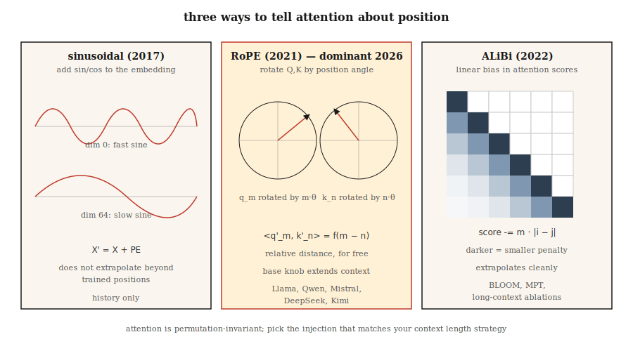

# Positional Encoding — Sinusoidal, RoPE, ALiBi

> Attention is permutation-invariant. Without a position signal, "The cat sat on the mat" and "mat the on sat cat the" produce the same output. Three algorithms fix this — each makes a different bet on what "position" means.

**Type:** Build
**Languages:** Python
**Prerequisites:** Phase 7 · 02 (Self-Attention), Phase 7 · 03 (Multi-Head Attention)
**Time:** ~45 min

## The Problem

Scaled dot-product attention is blind to order. The attention matrix `softmax(Q K^T / √d) V` is computed from pairwise similarities. Shuffle the rows of `X` and the output rows shuffle the same way. Nothing inside attention cares about position.

In a bag-of-words model this isn't a bug. But for language, code, audio, video — anything where order carries meaning — it's fatal.

The fix is to inject position into embeddings somehow. Three eras of answers:

1. **Absolute sinusoidal** (Vaswani 2017). Add `sin/cos` of position to embeddings. Simple, no learnable parameters, extrapolates poorly beyond training length.
2. **RoPE — Rotary Position Embeddings** (Su 2021). Rotate Q and K vectors by angles proportional to position. Encodes *relative* position directly in the dot product. The 2026 mainstream.
3. **ALiBi — Attention with Linear Biases** (Press 2022). Skips embeddings entirely; adds a per-head linear penalty to attention scores based on distance. Excellent length extrapolation.

By 2026, virtually every frontier open-source model uses RoPE: Llama 2/3/4, Qwen 2/3, Mistral, Mixtral, DeepSeek-V3, Kimi. A few long-context models use ALiBi or its modern variants. Absolute sinusoidal is history.

## The Concept



### Absolute sinusoidal

Precompute a fixed matrix `PE` of shape `(max_len, d_model)`:

```
PE[pos, 2i]   = sin(pos / 10000^(2i / d_model))
PE[pos, 2i+1] = cos(pos / 10000^(2i / d_model))
```

Then `X' = X + PE[:N]` before attention. Each dimension is a sine wave at a different frequency. The model learns to read position from phase patterns. Past `max_len` it fails: the model only saw positions 0–2047 and nobody told it what happens at 2048.

### RoPE

Rotates Q and K vectors (not embeddings). For a pair of dimensions `(2i, 2i+1)`:

```
[q'_2i    ]   [ cos(pos·θ_i)  -sin(pos·θ_i) ] [q_2i   ]
[q'_2i+1  ] = [ sin(pos·θ_i)   cos(pos·θ_i) ] [q_2i+1 ]

θ_i = base^(-2i / d_head),  base = 10000 by default
```

Apply the same rotation to keys at position `pos_k`. The dot product `q'_m · k'_n` becomes a function of `(m - n)` only. In other words: **attention scores depend only on relative distance**, even though rotations are defined by absolute position. Elegant trick.

Extending RoPE: `base` can be scaled (NTK-aware, YaRN, LongRoPE) to extrapolate to longer contexts without retraining. Llama 3 stretched context from 8K to 128K this way.

### ALiBi

Skips the embedding trick. Adds a bias directly to attention scores:

```
attn_score[i, j] = (q_i · k_j) / √d  -  m_h · |i - j|
```

where `m_h` is a per-head slope (e.g. `1 / 2^(8·h/H)`). Nearby tokens are boosted; distant tokens are penalized. No training-time cost. The paper shows it extrapolates better than sinusoidal and matches RoPE at training length.

### How to choose in 2026

| Variant | Extrapolation | Training cost | Who uses it |
|---------|---------------|---------------|-------------|
| Absolute sinusoidal | Poor | Free | Original transformer, early BERT |
| Learned absolute | None | Minimal | GPT-2, GPT-3 |
| RoPE | Good with scaling | Free | Llama 2/3/4, Qwen 2/3, Mistral, DeepSeek-V3, Kimi |
| RoPE + YaRN | Excellent | Fine-tuning phase | Qwen2-1M, Llama 3.1 128K |
| ALiBi | Excellent | Free | BLOOM, MPT, Baichuan |

RoPE wins because it plugs into attention without changing architecture, encodes relative position, and its `base` hyperparameter gives long-context fine-tuning a clean knob.

## Build It

### Step 1: Sinusoidal encoding

See `code/main.py`. A 4-line computation:

```python
def sinusoidal(N, d):
    pe = [[0.0] * d for _ in range(N)]
    for pos in range(N):
        for i in range(d // 2):
            theta = pos / (10000 ** (2 * i / d))
            pe[pos][2 * i]     = math.sin(theta)
            pe[pos][2 * i + 1] = math.cos(theta)
    return pe
```

Add it to the embedding matrix before the first attention layer.

### Step 2: Apply RoPE to Q, K

RoPE operates in-place on Q and K. For each pair of dimensions:

```python
def apply_rope(x, pos, base=10000):
    d = len(x)
    out = list(x)
    for i in range(d // 2):
        theta = pos / (base ** (2 * i / d))
        c, s = math.cos(theta), math.sin(theta)
        a, b = x[2 * i], x[2 * i + 1]
        out[2 * i]     = a * c - b * s
        out[2 * i + 1] = a * s + b * c
    return out
```

Key insight: apply the same function to Q at position `m` and K at position `n`. Their dot product picks up a `cos((m-n)·θ_i)` factor in each coordinate pair. Attention learns relative position for free.

### Step 3: ALiBi slopes and bias

```python
def alibi_bias(n_heads, seq_len):
    # slope_h = 2 ** (-8 * h / n_heads), h = 1..n_heads
    slopes = [2 ** (-8 * (h + 1) / n_heads) for h in range(n_heads)]
    bias = []
    for m in slopes:
        row = [[-m * abs(i - j) for j in range(seq_len)] for i in range(seq_len)]
        bias.append(row)
    return bias  # add to attention scores before softmax
```

Add `bias[h]` to head `h`'s `(seq_len, seq_len)` attention score matrix, then softmax.

### Step 4: Verify RoPE's relative-distance property

Pick two random vectors `a, b`. Rotate by `(pos_a, pos_b)`. Rotate again by `(pos_a + k, pos_b + k)`. The two dot products must match within floating-point error. This property is the entire point of RoPE — it is invariant to absolute offset; only relative gap matters.

## Use It

PyTorch 2.5+ ships RoPE utilities in `torch.nn.functional`. Most production code uses `flash_attn` or `xformers` with RoPE applied inside the attention kernel.

```python
from transformers import AutoModel
model = AutoModel.from_pretrained("meta-llama/Llama-3.2-3B")
# model.config.rope_scaling → {"type": "yarn", "factor": 32.0, "original_max_position_embeddings": 8192}
```

**2026 long-context tricks:**

- **NTK-aware interpolation.** Rescale `base` to `base * (scale_factor)^(d/(d-2))` when extending from 4K to 16K+.
- **YaRN.** Smarter interpolation that preserves attention entropy at long contexts. Used by Llama 3.1 128K.
- **LongRoPE.** Microsoft's 2024 method using evolutionary search to pick per-dimension scaling factors. Used by Phi-3-Long.
- **Position interpolation + fine-tuning.** Simply shrink positions by the extension factor, then fine-tune on 1–5B tokens. Surprisingly effective.

## Ship It

See `outputs/skill-positional-encoding-picker.md`. This skill picks an encoding strategy for a new model given target context length, extrapolation requirements, and training budget.

## Exercises

1. **Easy.** Plot the sinusoidal `PE` matrix as a heatmap for `max_len=512, d=128`. Confirm the "higher dimension index → wider stripes" pattern.
2. **Medium.** Implement NTK-aware RoPE scaling. Train a tiny LM on sequences of length 256, then test at length 1024 with and without scaling. Measure perplexity.
3. **Hard.** Implement both ALiBi and RoPE in the same attention module. Train a 4-layer transformer on a copy task at length 512. Extrapolate to 2048 at test time. Compare degradation.

## Key Terms

| Term | How people talk about it | What it actually means |
|------|--------------------------|------------------------|
| Positional encoding | "tells attention about order" | Any signal added to embeddings or attention that encodes position. |
| Sinusoidal | "the original one" | `sin/cos` at geometric frequencies added to embeddings; does not extrapolate. |
| RoPE | "rotary embeddings" | Rotates Q, K by position-dependent angles; dot product encodes relative distance. |
| ALiBi | "the linear bias trick" | Adds `-m·|i-j|` to attention scores; no embedding needed, extrapolates well. |
| base | "RoPE's knob" | Frequency scaler in RoPE; increasing it extends context at inference. |
| NTK-aware | "a RoPE scaling trick" | Rescales `base` so high-frequency dimensions aren't crushed during context extension. |
| YaRN | "the advanced one" | Per-dimension interpolation + extrapolation that preserves attention entropy. |
| Extrapolation | "works beyond training length" | Whether a position scheme gives correct output at positions past the `max_len` seen during training. |

## Further Reading

- [Vaswani et al. (2017). Attention Is All You Need §3.5](https://arxiv.org/abs/1706.03762) — the original sinusoidal encoding.
- [Su et al. (2021). RoFormer: Enhanced Transformer with Rotary Position Embedding](https://arxiv.org/abs/2104.09864) — the RoPE paper.
- [Press, Smith, Lewis (2021). Train Short, Test Long: Attention with Linear Biases Enables Input Length Extrapolation](https://arxiv.org/abs/2108.12409) — ALiBi.
- [Peng et al. (2023). YaRN: Efficient Context Window Extension of Large Language Models](https://arxiv.org/abs/2309.00071) — state-of-the-art RoPE scaling.
- [Chen et al. (2023). Extending Context Window of Large Language Models via Positional Interpolation](https://arxiv.org/abs/2306.15595) — Meta's Llama 2 long-context paper.
- [Ding et al. (2024). LongRoPE: Extending LLM Context Window Beyond 2 Million Tokens](https://arxiv.org/abs/2402.13753) — the Microsoft method used by Phi-3-Long referenced in the Use It section above.
- [HuggingFace Transformers — `modeling_rope_utils.py`](https://github.com/huggingface/transformers/blob/main/src/transformers/modeling_rope_utils.py) — production implementations of every RoPE scaling variant (default, linear, dynamic, YaRN, LongRoPE, Llama-3).
