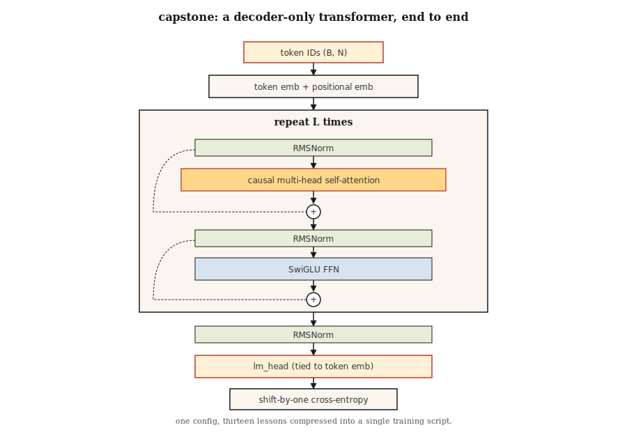

# Build a Transformer from Scratch — Capstone Project

> Thirteen lessons. One model. No shortcuts.

**Type:** Build
**Languages:** Python
**Prerequisites:** Phase 7 · 01 through 13. Don't skip.
**Time:** ~120 minutes

## The Problem

You've read every paper. You've implemented attention, multi-head splits, positional encoding, encoder and decoder blocks, BERT and GPT losses, MoE, KV cache. Now make them work together on a real task.

The capstone: train a small decoder-only transformer end-to-end on a character-level language modeling task. It reads Shakespeare. It generates new Shakespeare. It's small enough to train on a laptop in 10 minutes. It's correct enough that swapping in bigger data and longer training gives you a real LM.

This is the course's "nanoGPT." It isn't original—Karpathy's 2023 nanoGPT tutorial is the reference implementation every student writes at least once. We borrow its shape and reassemble it around what we've covered.

## The Concept



Annotated architecture:

```
input tokens (B, N)
   │
   ▼
token embedding + positional embedding  ◀── Lesson 04 (RoPE optional)
   │
   ▼
┌──── block × L ────────────────────┐
│  RMSNorm                          │  ◀── Lesson 05
│  MultiHeadAttention (causal)      │  ◀── Lesson 03 + 07 (causal mask)
│  residual                         │
│  RMSNorm                          │
│  SwiGLU FFN                       │  ◀── Lesson 05
│  residual                         │
└────────────────────────────────── ┘
   │
   ▼
final RMSNorm
   │
   ▼
lm_head (tied to token embedding)
   │
   ▼
logits (B, N, V)
   │
   ▼
shift-by-one cross-entropy            ◀── Lesson 07
```

### What We Deliver

- `GPTConfig` — single place configuring all hyperparameters.
- `MultiHeadAttention` — causal, batched, with optional Flash-style path (PyTorch's `scaled_dot_product_attention`).
- `SwiGLUFFN` — modern FFN.
- `Block` — pre-norm, residual-wrapped attention + FFN.
- `GPT` — embeddings, stacked blocks, LM head, generate().
- Training loop with AdamW, cosine LR, gradient clipping.
- Character-level tokenizer on Shakespeare text.

### What We Don't Deliver

- RoPE — conceptually implemented in Lesson 04. Here we use learned positional embeddings for simplicity. An exercise asks you to swap in RoPE.
- KV cache during generation — every generation step recomputes attention over the full prefix. Slower but simpler. An exercise asks you to add KV cache.
- Flash Attention — PyTorch 2.0+ auto-dispatches when inputs match; we use `F.scaled_dot_product_attention`.
- MoE — single FFN per block. You saw MoE in Lesson 11.

### Target Metrics

On a Mac M2 laptop, a 4-layer, 4-head, d_model=128 GPT trained for 2,000 steps on `tinyshakespeare.txt`:

- Training loss converges from ~4.2 (random) to ~1.5 in about 6 minutes.
- Sampled output looks Shakespearean: archaic words, line breaks, proper nouns like "ROMEO:" emerge.
- Validation loss (held-out last 10% of text) tracks training loss closely; no overfitting at this scale/budget.

## Build It

This lesson uses PyTorch. Install `torch` (CPU is fine). See `code/main.py`. The script handles:

- Downloading `tinyshakespeare.txt` if missing (or reading a local copy).
- Byte-level character tokenizer.
- 90/10 train/validation split.
- Training loop with bf16 autocast on supported hardware.
- Sampling after training completes.

### Step 1: Data

```python
text = open("tinyshakespeare.txt").read()
chars = sorted(set(text))
stoi = {c: i for i, c in enumerate(chars)}
itos = {i: c for c, i in stoi.items()}
encode = lambda s: [stoi[c] for c in s]
decode = lambda xs: "".join(itos[x] for x in xs)
```

65 unique characters. Tiny vocabulary. Fits in a 4-byte vocab_size. No BPE, no tokenizer headaches.

### Step 2: Model

See `code/main.py`. The block is the textbook approach from Lesson 05—pre-norm, RMSNorm, SwiGLU, causal MHA. Parameter count at 4/4/128: ~800K.

### Step 3: Training Loop

Sample a random batch of token windows of length 256. Forward. Shift-by-one cross-entropy. Backward. AdamW step. Log. Repeat.

```python
for step in range(max_steps):
    x, y = get_batch("train")
    logits = model(x)
    loss = F.cross_entropy(logits.view(-1, vocab_size), y.view(-1))
    loss.backward()
    torch.nn.utils.clip_grad_norm_(model.parameters(), 1.0)
    opt.step()
    opt.zero_grad()
```

### Step 4: Sampling

Given a prompt, repeatedly forward, sample from top-p logits, append, continue. Stop after 500 tokens.

### Step 5: Read the Output

After 2,000 steps:

```
ROMEO:
Away and mild will not thy friend, that thou shalt wit:
The chief that well shame and hath been his friends,
...
```

Not Shakespeare. But Shakespeare-shaped. For ~800K parameters and 6 minutes on a laptop, that's a clear win.

## Use It

This capstone is a reference architecture. Three extensions push it toward the real thing:

1. **Swap the tokenizer.** Use BPE (e.g., `tiktoken.get_encoding("cl100k_base")`). Vocab size jumps from 65 to ~50,000. Model capacity must scale accordingly.
2. **Train on a bigger corpus.** Use `OpenWebText` or `fineweb-edu` (HuggingFace). On a single A100, a 125M-param GPT trains on 10B tokens in about 24 hours.
3. **Add RoPE + KV cache + Flash Attention.** The exercises below walk you through each one.

The end state is a 125M-param GPT that generates fluent English. Not frontier. But the same code path—just bigger—is what Karpathy, EleutherAI, and the Allen Institute use to train research checkpoints in 2026.

## Ship It

See `outputs/skill-transformer-review.md`. This skill reviews a from-scratch transformer implementation for correctness against all 13 preceding lessons.

## Exercises

1. **Easy.** Run `code/main.py`. Verify your trained model's final-step validation loss is below 2.0. Change `max_steps` from 2,000 to 5,000—is validation loss still improving?
2. **Medium.** Replace learned positional embeddings with RoPE. Apply rotation to Q and K inside `MultiHeadAttention`. Train and verify that validation loss is at least as low.
3. **Medium.** Implement KV cache in the sampling loop. Generate 500 tokens with and without cache. Wall-clock on a laptop should improve 5–20×.
4. **Hard.** Add a second head that predicts the next-next token (MTP — multi-token prediction from DeepSeek-V3). Train jointly. Does it help?
5. **Hard.** Replace the single FFN per block with a 4-expert MoE. Router + top-2 routing. Observe what happens to validation loss at equivalent active parameters.

## Key Terms

| Term | How people talk about it | What it actually means |
|------|-----------------|-----------------------|
| nanoGPT | "Karpathy's tutorial repo" | Minimal decoder-only transformer training code, ~300 lines; canonical reference. |
| tinyshakespeare | "Standard toy corpus" | ~1.1 MB of text; every character LM tutorial has used it since 2015. |
| Tied embeddings | "Shared input/output matrix" | LM head weights = transpose of token embedding matrix; saves params, improves quality. |
| bf16 autocast | "Training precision trick" | Forward/backward run in bf16, optimizer states stay fp32; standard since 2021. |
| Gradient clipping | "Tame the spikes" | Cap global gradient norm at 1.0; prevents training from blowing up. |
| Cosine LR schedule | "2020+ default" | LR linearly ramps (warmup) then decays in cosine shape to 10% of peak. |
| MFU | "Model FLOP Utilization" | Achieved FLOPs / theoretical peak; 40% dense, 30% MoE is strong in 2026. |
| Validation loss | "Held-out loss" | Cross-entropy on data the model never saw; overfitting detector. |

## Further Reading

- [The Annotated Transformer (Harvard NLP)](https://nlp.seas.harvard.edu/annotated-transformer/) — Classic annotated implementation.

