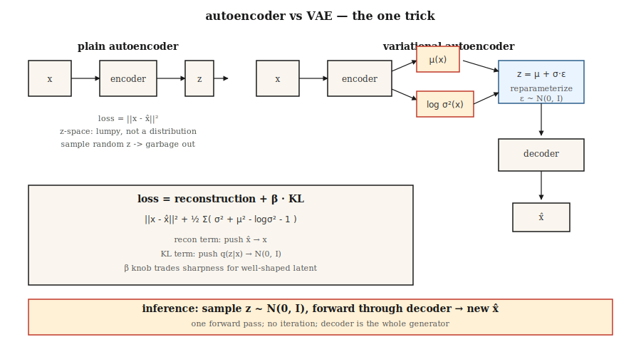

# Autoencoders & Variational Autoencoders (VAE)

> A plain autoencoder compresses then reconstructs. It memorizes answers; it does not generate. Add one trick—force the code to look like a Gaussian—and you get a sampler. That single trick, the reparameterization `z = μ + σ·ε`, is why every latent-space diffusion and flow-matching image model you use in 2026 has a VAE on its input end.

**Type:** Build
**Languages:** Python
**Prerequisites:** Phase 3 · 02 (Backpropagation), Phase 3 · 07 (CNNs), Phase 8 · 01 (Taxonomy)
**Time:** ~75 minutes

## The Problem

Compress a 784-pixel MNIST digit into a 16-number code, then reconstruct it. A plain autoencoder will ace reconstruction MSE, but the code space is a pockmarked tangle. Decode a random point in that space and you get noise. There is no sampler. It is just a compression model in disguise.

What you actually want: (a) the code space is a clean, smooth distribution you can sample from—say isotropic Gaussian `N(0, I)`, (b) decoding any sample yields a plausible digit, (c) the encoder and decoder still compress well. Three objectives, one architecture, one loss.

Kingma's 2013 VAE solves this: train the encoder to output a *distribution* `q(z|x) = N(μ(x), σ(x)²)`, pull that distribution toward the prior `N(0, I)` via a KL penalty, and sample `z` from `q(z|x)` before decoding. At inference, throw away the encoder, sample `z ~ N(0, I)`, decode. It is the KL penalty that forces the code space to have structure.

By 2026, VAEs rarely ship standalone—they've been destroyed by diffusion on raw image quality—but they are the encoder of choice for every latent diffusion model (SD 1/2/XL/3, Flux, AudioCraft). Learn the VAE and you learn the invisible first layer of every image pipeline you use.

## The Concept



**Autoencoder.** `z = encoder(x)`, `x̂ = decoder(z)`, loss = `||x - x̂||²`. Code space has no structure.

**VAE encoder.** Outputs two vectors: `μ(x)` and `log σ²(x)`. They define `q(z|x) = N(μ, diag(σ²))`.

**Reparameterization trick.** Sampling from `q(z|x)` is not differentiable. Rewrite the sample as `z = μ + σ·ε` where `ε ~ N(0, I)`. Now `z` is a deterministic function of `(μ, σ)` plus non-parametric noise—gradients flow through `μ` and `σ`.

**Loss.** The evidence lower bound (ELBO), two terms:

```
loss = reconstruction + β · KL[q(z|x) || N(0, I)]
     = ||x - x̂||²  + β · Σ_i ( σ_i² + μ_i² - log σ_i² - 1 ) / 2
```

Reconstruction pushes `x̂` toward `x`. KL pushes `q(z|x)` toward the prior. They trade off. Small β (<1) = sharper samples, less Gaussian code space. Large β (>1) = cleaner code space, blurrier samples. β-VAE (Higgins 2017) made this knob famous and launched the disentanglement research line.

**Sampling.** At inference: draw `z ~ N(0, I)`, forward through the decoder. One forward pass—no iterative sampling like diffusion.

## Build It

`code/main.py` implements a mini VAE without numpy or torch. Input is 8-dimensional synthetic data sampled from a two-component Gaussian mixture in 8D space. Encoder and decoder are single-hidden-layer MLPs. We implement tanh activation, forward pass, loss, and a hand-written backward pass. Not production code—pedagogical.

### Step 1: Encoder forward

```python
def encode(x, enc):
    h = tanh(add(matmul(enc["W1"], x), enc["b1"]))
    mu = add(matmul(enc["W_mu"], h), enc["b_mu"])
    log_sigma2 = add(matmul(enc["W_sig"], h), enc["b_sig"])
    return mu, log_sigma2
```

Output `log σ²` instead of `σ` so the network output is unconstrained (softplus on σ is a trap—gradients die at σ ≈ 0).

### Step 2: Reparameterize and decode

```python
def reparameterize(mu, log_sigma2, rng):
    eps = [rng.gauss(0, 1) for _ in mu]
    sigma = [math.exp(0.5 * lv) for lv in log_sigma2]
    return [m + s * e for m, s, e in zip(mu, sigma, eps)]

def decode(z, dec):
    h = tanh(add(matmul(dec["W1"], z), dec["b1"]))
    return add(matmul(dec["W_out"], h), dec["b_out"])
```

### Step 3: ELBO

```python
def elbo(x, x_hat, mu, log_sigma2, beta=1.0):
    recon = sum((a - b) ** 2 for a, b in zip(x, x_hat))
    kl = 0.5 * sum(math.exp(lv) + m * m - lv - 1 for m, lv in zip(mu, log_sigma2))
    return recon + beta * kl, recon, kl
```

Because both distributions are Gaussian, the KL has an exact closed-form solution. Don't numerically integrate. In 2026 people still ship code with Monte Carlo KL estimates—3× slower for no reason.

### Step 4: Generation

```python
def sample(dec, z_dim, rng):
    z = [rng.gauss(0, 1) for _ in range(z_dim)]
    return decode(z, dec)
```

That's the generative model. Five lines.

## Pitfalls

- **Posterior collapse.** The KL term pushes `q(z|x) → N(0, I)` so hard that `z` carries no information about `x`. Fix: β annealing (start at β=0, ramp to 1), free bits, or skip KL on inactive dimensions.
- **Blurry samples.** Gaussian decoder likelihood means MSE reconstruction, and MSE is Bayes-optimal for L2 (takes the mean)—the mean of many plausible digits is a blurry digit. Fix: discrete decoder (VQ-VAE, NVAE), or use VAE only as encoder and stack diffusion on the latents (this is what Stable Diffusion does).
- **β too large, too early.** See posterior collapse. Start at β≈0.01 and ramp.
- **Latent dimension too small.** 16 works for MNIST, 256 for ImageNet 256², 2048 for ImageNet 1024². Stable Diffusion's VAE compresses 512×512×3 → 64×64×4 (32× spatial area downsampling, 32× channels).

## Use It

The 2026 VAE stack:

| Scenario | Choice |
|----------|--------|
| Image latent encoder for diffusion | Stable Diffusion VAE (`sd-vae-ft-ema`) or Flux VAE |
| Audio latent encoder | Encodec (Meta), SoundStream, or DAC (Descript) |
| Video latents | Sora's spatiotemporal patches, Latte VAE, WAN VAE |
| Disentangled representation learning | β-VAE, FactorVAE, TCVAE |
| Discrete latents (for transformer modeling) | VQ-VAE, RVQ (ResidualVQ) |
| Continuous latents for generation | Plain VAE, then condition a flow/diffusion model on that latent space |

A latent diffusion model is a VAE with a diffusion model living between the encoder and decoder. The VAE does coarse compression; the diffusion model does the heavy lifting. Video (VAE + video diffusion DiT) and audio (Encodec + MusicGen transformer) follow the same pattern.

## Ship It

Save as `outputs/skill-vae-trainer.md`.

The skill takes: dataset profile + target latent dimension + downstream use (reconstruction, sampling, or input for latent diffusion), and outputs: architecture choice (plain/β/VQ/RVQ), β schedule, latent dimension, decoder likelihood (Gaussian vs categorical), and an evaluation plan (reconstruction MSE, per-dimension KL, Fréchet distance between `q(z|x)` and `N(0, I)`).

## Exercises

1. **Easy.** Change `β` in `code/main.py` to `0.01`, `0.1`, `1.0`, `5.0`. Record final reconstruction MSE and KL. Which β is Pareto-optimal for your synthetic data?
2. **Medium.** Replace the Gaussian decoder likelihood with Bernoulli (cross-entropy loss). Compare sample quality on a binarized version of the same synthetic data.
3. **Hard.** Extend `code/main.py` into a mini VQ-VAE: replace continuous `z` with nearest-neighbor lookup in a K=32 codebook. Compare reconstruction MSE and report how many codebook entries are utilized (codebook collapse is real).

## Key Terms

| Term | What people say | What it actually means |
|------|-----------------|----------------------|
| Autoencoder | Encode-decode network | `x → z → x̂`, learns MSE. Does not generate. |
| VAE | AE with a sampler | Encoder outputs a distribution; KL penalty shapes the code space. |
| ELBO | Evidence lower bound | `log p(x) ≥ recon - KL[q(z|x) || p(z)]`; tight when `q = p(z|x)`. |
| Reparameterization | `z = μ + σ·ε` | Rewrites a stochastic node as deterministic + pure noise. Lets gradients pass through sampling. |
| Prior | `p(z)` | Target distribution for latents, usually `N(0, I)`. |
| Posterior collapse | "The KL term won" | Encoder ignores `x` and outputs the prior; decoder can only hallucinate. |
| β-VAE | Tunable KL weight | `loss = recon + β·KL`. Higher β = more disentangled but blurrier. |
| VQ-VAE | Discrete latents | Replaces continuous `z` with the nearest codebook vector; enables transformer modeling. |

## Production Notes: The VAE Is the Hottest Path in a Diffusion Server

In a Stable Diffusion / Flux / SD3 pipeline, the VAE is called twice per request—once to encode (for img2img / inpainting) and once to decode. At 1024², the decode pass is often the single largest activation-memory peak in the entire pipeline because it upsamples `128×128×16` latents back to `1024×1024×3`. Two practical consequences:

- **Slice or tile the decode.** `diffusers` exposes `pipe.vae.enable_slicing()` and `pipe.vae.enable_tiling()`. Tiling trades a tiny seam artifact for `O(tile²)` instead of `O(H·W)` memory. Required to run 1024²+ on consumer GPUs.
- **bf16 decoder, fp32 numerics on final scale.** SD 1.x's VAE shipped in fp32 and *silently produces NaN* when converted to fp16 at 1024²+. SDXL shipped with `madebyollin/sdxl-vae-fp16-fix`—always prefer the fp16-fix variant, or use bf16.

## Further Reading

- [Kingma & Welling (2013). Auto-Encoding Variational Bayes](https://arxiv.org/abs/1312.6114) — The VAE paper.
- [Higgins et al. (2017). β-VAE: Learning Basic Visual Concepts with a Constrained Variational Framework](https://openreview.net/forum?id=Sy2fzU9gl) — Disentangled β-VAE.
- [van den Oord et al. (2017). Neural Discrete Representation Learning](https://arxiv.org/abs/1711.00937) — VQ-VAE.
- [Vahdat & Kautz (2021). NVAE: A Deep Hierarchical Variational Autoencoder](https://arxiv.org/abs/2007.03898) — State-of-the-art image VAE.
- [Rombach et al. (2022). High-Resolution Image Synthesis with Latent Diffusion Models](https://arxiv.org/abs/2112.10752) — Stable Diffusion; VAE as encoder.
- [Défossez et al. (2022). High Fidelity Neural Audio Compression](https://arxiv.org/abs/2210.13438) — Encodec, the standard audio VAE.
