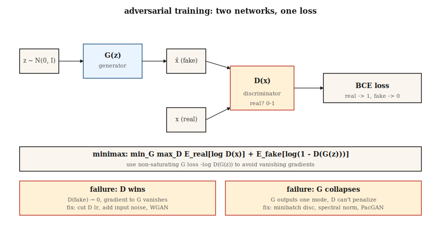

# GAN — Generator vs Discriminator

> Goodfellow's 2014 trick was to skip density entirely. Two networks. One forges, one catches. They play until fakes are indistinguishable from reals. This shouldn't work. It often doesn't. When it does, its samples in narrow domains are still the sharpest in the literature.

**Type:** Build
**Languages:** Python
**Prerequisites:** Phase 3 · 02 (Backpropagation), Phase 3 · 08 (Optimizers), Phase 8 · 02 (VAE)
**Time:** ~75 minutes

## The Problem

VAEs produce blurry samples because their MSE decoder loss is Bayes-optimal for the *mean* image—and the mean of many plausible digits is a blurry digit. You want a loss that rewards *realism*, not pixel-wise proximity to a single target. "Realism" has no closed form. You can only learn it.

Goodfellow's idea: train a classifier `D(x)` to distinguish real from fake images. Train a generator `G(z)` to fool `D`. The loss signal for `G` is whatever `D` currently thinks looks real. That signal updates as `G` improves, chasing a moving target. If both networks converge, `G` has learned the data distribution without ever writing down `log p(x)`.

This is adversarial training. Mathematically it is a minimax game:

```
min_G max_D  E_real[log D(x)] + E_fake[log(1 - D(G(z)))]
```

By 2026, GANs are no longer the SOTA generator (diffusion and flow matching took that crown). But StyleGAN 2/3 remains the sharpest face model ever deployed, GAN discriminators are used as *perceptual losses* inside diffusion training, and adversarial training powers the fast one-step distillations (SDXL-Turbo, SD3-Turbo, LCM) that let you serve real-time diffusion.

## The Concept



**Generator `G(z)`.** Maps noise vector `z ~ N(0, I)` to a sample `x̂`. A decoder-shaped network (fully connected or transposed convolution).

**Discriminator `D(x)`.** Maps a sample to a scalar probability (or score). Real → 1, fake → 0.

**Loss.** Two alternating updates:

- **Train `D`:** `loss_D = -[ log D(x) + log(1 - D(G(z))) ]`. Binary cross-entropy on real=1, fake=0.
- **Train `G`:** `loss_G = -log D(G(z))`. This is the *non-saturating* form Goodfellow uses (the original `log(1 - D(G(z)))` saturates when `D` is confident, killing gradients).

**Training loop.** One step of `D`, one step of `G`. Repeat.

**Why it works.** If `G` perfectly matches `p_data`, `D` can do no better than chance, outputting 0.5 everywhere; `G` receives no more gradient. That is the equilibrium.

**Why it breaks.** Mode collapse (`G` finds one mode `D` can't distinguish and prints it forever), vanishing gradients (`D` learns too fast, `log D` saturates), training instability (learning rates, batch sizes, everything counts).

## Variants That Made GANs Work

| Year | Innovation | What it fixed |
|------|-----------|---------------|
| 2015 | DCGAN | Conv/deconv, batch norm, LeakyReLU—first stable architecture. |
| 2017 | WGAN, WGAN-GP | Wasserstein distance + gradient penalty replaces BCE. Fixes vanishing gradients. |
| 2017 | Spectral Normalization | Lipschitz bound on discriminator. Still used in 2026 discriminators. |
| 2018 | Progressive GAN | Train low-res first, add layers. First megapixel results. |
| 2019 | StyleGAN / StyleGAN2 | Mapping network + adaptive instance normalization. SOTA photorealism for fixed domains. |
| 2021 | StyleGAN3 | Alias-free, translation equivariant—gold standard for faces in 2026. |
| 2022 | StyleGAN-XL | Conditional, class-aware, larger scale. |
| 2024 | R3GAN | Repackaged with stronger regularization; works at 1024² without tricks. |

## Build It

`code/main.py` trains a mini GAN on 1D data: a mixture of two Gaussians. Generator and discriminator are single-hidden-layer MLPs. We hand-write forward, backward, and the minimax loop. The goal is to see both key failure modes (mode collapse + vanishing gradients) happen live.

### Step 1: Non-saturating loss

The vanilla Goodfellow loss `log(1 - D(G(z)))` approaches 0 when D confidently classifies G's fakes as fake. At that point G's gradient is essentially zero—G cannot improve. The non-saturating form `-log D(G(z))` has the opposite asymptotic: it blows up when D is confident, giving G a strong signal.

```python
def g_loss(d_fake):
    # maximize log D(G(z))  <=>  minimize -log D(G(z))
    return -sum(math.log(max(p, 1e-8)) for p in d_fake) / len(d_fake)
```

### Step 2: One discriminator step per generator step

```python
for step in range(steps):
    # train D
    real_batch = sample_real(batch_size)
    fake_batch = [G(z) for z in sample_noise(batch_size)]
    update_D(real_batch, fake_batch)

    # train G
    fake_batch = [G(z) for z in sample_noise(batch_size)]  # fresh fakes
    update_G(fake_batch)
```

Use fresh fakes for G, otherwise the gradient is stale.

### Step 3: Watch for mode collapse

```python
if step % 200 == 0:
    samples = [G(z) for z in sample_noise(500)]
    mode_a = sum(1 for s in samples if s < 0)
    mode_b = 500 - mode_a
    if min(mode_a, mode_b) < 50:
        print("  [!] mode collapse: one mode is starved")
```

Typical symptom: one of the two real modes is no longer generated. The discriminator never corrects it because it never sees it as fake.

## Pitfalls

- **Discriminator too strong.** Cut D's learning rate by 2–5×, or add instance/layer noise. If D accuracy exceeds 95%, G is dead.
- **Generator memorizes one mode.** Add noise to D's inputs, use a minibatch-discriminator layer, or switch to WGAN-GP.
- **Batch norm leaks statistics.** Real and fake batches flowing through the same BN layer mix their statistics. Use instance norm or spectral norm instead.
- **Chasing Inception Score.** FID and IS are noisy at low sample counts. Evaluate with ≥10k samples.
- **"One-shot sampling" is a lie for conditional tasks.** You still need CFG scale, truncation trick, and resampling for usable outputs.

## Use It

The 2026 GAN stack:

| Scenario | Choice |
|----------|--------|
| Photorealistic faces, fixed pose | StyleGAN3 (sharpest, smallest) |
| Anime / stylized faces | StyleGAN-XL or Stable Diffusion LoRA |
| Image-to-image translation | Pix2Pix / CycleGAN (Phase 8 · 04) or ControlNet (Phase 8 · 08) |
| Fast one-step text-to-image | Adversarial distillation of diffusion (SDXL-Turbo, SD3-Turbo) |
| Perceptual loss inside diffusion trainers | Small GAN discriminator on image patches |
| Anything multimodal or open-ended | Don't—use diffusion or flow matching |

GANs are sharp but narrow. Once your domain opens up—photos, arbitrary text prompts, video—switch to diffusion. The adversarial trick survives as a component (perceptual loss, distillation), not as a standalone generator.

## Ship It

Save as `outputs/skill-gan-debugger.md`. The skill takes a failed GAN training run (loss curves, sample grid, dataset size) and outputs a ranked list of likely causes, a one-line fix, and a rerun protocol.

## Exercises

1. **Easy.** Run `code/main.py` with default settings. Then set `D_LR = 5 * G_LR` and rerun. How quickly does G's loss collapse to a constant?
2. **Medium.** Replace Goodfellow's BCE loss with WGAN loss: `loss_D = E[D(fake)] - E[D(real)]`, `loss_G = -E[D(fake)]`, and clip D weights to `[-0.01, 0.01]`. Is training more stable? Compare wall-clock convergence time.
3. **Hard.** Extend the 1D example to 2D data (8 Gaussians on a ring). Track how many of the 8 modes the generator captures at steps 1k, 5k, 10k. Implement minibatch discrimination and re-measure.

## Key Terms

| Term | What people say | What it actually means |
|------|-----------------|----------------------|
| Generator | "G" | Noise-to-sample network, `G: z → x̂`. |
| Discriminator | "D" | Classifier `D: x → [0, 1]`, real vs fake. |
| Minimax | "The game" | `min_G max_D` over a joint objective. |
| Non-saturating loss | "The fix" | G uses `-log D(G(z))` instead of `log(1 - D(G(z)))`. |
| Mode collapse | "G memorized one thing" | Generator produces only a few distinct outputs despite diverse data. |
| WGAN | "Wasserstein" | Earth-mover distance + gradient penalty replaces BCE; smoother gradients. |
| Spectral normalization | "Lipschitz trick" | Constrains D's weight norms to bound its slope; stabilizes training. |
| StyleGAN | "The one that works" | Mapping network + AdaIN; best-in-class for faces, still in 2026. |

## Production Notes: One-Shot Inference Is GAN's Surviving Advantage

On open-domain generation, GANs no longer win on sample quality, but they still win on inference cost. In production inference vocabulary, GANs have:

- **No prefill, no decode phase.** Single `G(z)` forward. TTFT ≈ total latency.
- **No KV-cache pressure.** The only state is weights. Batch size is bounded by activation memory, not cache.
- **Continuous batching is trivial.** Since every request costs the same fixed FLOPs, running a static batch at target occupancy is usually optimal. No in-flight scheduler needed.

This is why GAN distillation (SDXL-Turbo, SD3-Turbo, ADD, LCM) is the dominant technique for fast text-to-image in 2026: it compresses a 20–50 step diffusion pipeline into 1–4 GAN-style forward passes while retaining the diffusion base model's distribution. The adversarial loss survives as a training-time knob for turning slow generators into fast generators.

## Further Reading

- [Goodfellow et al. (2014). Generative Adversarial Nets](https://arxiv.org/abs/1406.2661) — The original GAN paper.
- [Radford et al. (2015). Unsupervised Representation Learning with DCGAN](https://arxiv.org/abs/1511.06434) — First stable architecture.
- [Arjovsky, Chintala, Bottou (2017). Wasserstein GAN](https://arxiv.org/abs/1701.07875) — WGAN.
- [Miyato et al. (2018). Spectral Normalization for GANs](https://arxiv.org/abs/1802.05957) — SN.
- [Karras et al. (2020). Analyzing and Improving the Image Quality of StyleGAN](https://arxiv.org/abs/1912.04958) — StyleGAN2.
- [Karras et al. (2021). Alias-Free Generative Adversarial Networks](https://arxiv.org/abs/2106.12423) — StyleGAN3.
- [Sauer et al. (2023). Adversarial Diffusion Distillation](https://arxiv.org/abs/2311.17042) — SDXL-Turbo.
