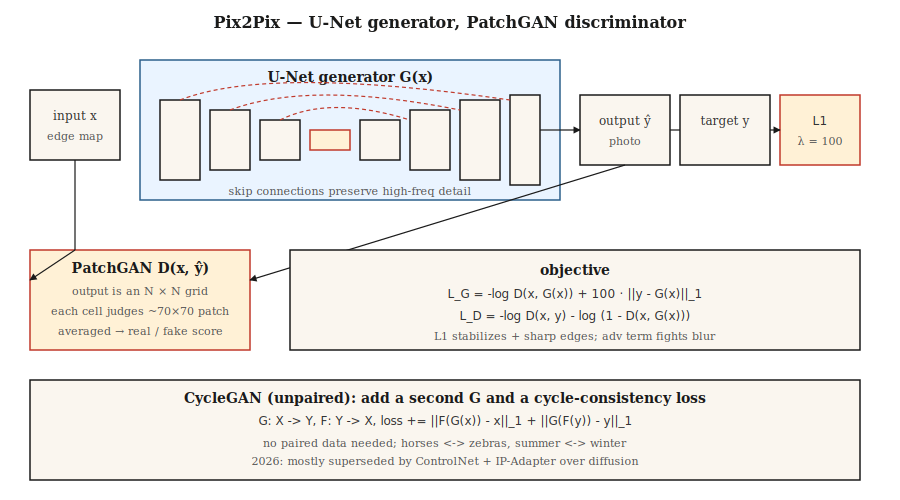

# Conditional GANs & Pix2Pix

> The first big breakthrough from 2014–2017 was controlling what a GAN produces. Attach a label, an image, or a sentence. Pix2Pix did the image version, and on narrow-domain image-to-image tasks it still beats every general-purpose text-to-image model today.

**Type:** Build
**Languages:** Python
**Prerequisites:** Phase 8 · 03 (GAN), Phase 4 · 06 (U-Net), Phase 3 · 07 (CNNs)
**Time:** ~75 minutes

## The Problem

An unconditional GAN samples arbitrary faces. Useful for demos, useless in production. What you want is: *map a sketch to a photo*, *map a map to aerial imagery*, *map daytime to nighttime*, *colorize grayscale*. In all of these, you have an input image `x` and must output a `y` that has some semantic correspondence to it. Each `x` maps to many plausible `y`s. Mean squared error averages them into mush. An adversarial loss doesn't, because "looks real" is sharp.

Conditional GAN (Mirza & Osindero, 2014) feeds a condition `c` to both `G` and `D`. Pix2Pix (Isola et al., 2017) specializes this: the condition is a full input image, the generator is a U-Net, the discriminator is a *patch-based* classifier (PatchGAN), and the loss is adversarial + L1. This recipe still beats training a text-to-image model from scratch on narrow-domain image-to-image in 2026, because it trains on *paired data*—the exact signal you have.

## The Concept



**Conditional G.** `G(x, z) → y`. In Pix2Pix, `z` is dropout inside G (no input noise—Isola found explicit noise gets ignored).

**Conditional D.** `D(x, y) → [0, 1]`. Input is the *pair* (condition, output). This is the key distinction: D must judge whether `y` is consistent with `x`, not just whether `y` looks real.

**U-Net generator.** Encoder-decoder with skip connections across the bottleneck. Critical for tasks where input and output share low-level structure (edges, contours). Without skip connections, high-frequency detail vanishes.

**PatchGAN discriminator.** D does not output a single real/fake score; instead it outputs an `N×N` grid, each cell classifying a ~70×70 pixel receptive field. Then averaged. This is a Markov random field assumption: realism is local. Trains much faster, fewer parameters, sharper outputs.

**Loss.**

```
loss_G = -log D(x, G(x)) + λ · ||y - G(x)||_1
loss_D = -log D(x, y) - log (1 - D(x, G(x)))
```

The L1 term stabilizes training and pushes G toward the known target. L1 gives sharper edges than L2 (takes the median, not the mean). `λ = 100` is the Pix2Pix default.

## CycleGAN — When You Have No Paired Data

Pix2Pix requires paired `(x, y)` data. CycleGAN (Zhu et al., 2017) drops this requirement at the cost of one extra loss: *cycle consistency*. Two generators `G: X → Y` and `F: Y → X`. Train them such that `F(G(x)) ≈ x` and `G(F(y)) ≈ y`. This lets you turn horses into zebras, summer into winter, without paired examples.

By 2026, unpaired image-to-image is mostly done with diffusion (ControlNet, IP-Adapter) rather than CycleGAN, but the cycle consistency idea lives on in nearly every unpaired domain adaptation paper.

## Build It

`code/main.py` implements a mini conditional GAN on 1D data. The condition `c` is a class label (0 or 1). Task: produce a sample from the conditional distribution for a given class.

### Step 1: Concatenate condition to G and D inputs

```python
def G(z, c, params):
    return mlp(concat([z, one_hot(c)]), params)

def D(x, c, params):
    return mlp(concat([x, one_hot(c)]), params)
```

One-hot is the simplest approach. Larger models use learned embeddings, FiLM modulation, or cross-attention.

### Step 2: Conditional training

```python
for step in range(steps):
    x, c = sample_real_conditional()
    noise = sample_noise()
    update_D(x_real=x, x_fake=G(noise, c), c=c)
    update_G(noise, c)
```

The generator must match the real distribution *conditioned on the class*, not the marginal.

### Step 3: Verify outputs per class

```python
for c in [0, 1]:
    samples = [G(noise, c) for noise in batch]
    mean_c = mean(samples)
    assert_near(mean_c, real_mean_for_class_c)
```

## Pitfalls

- **Condition ignored.** G learns to marginalize out, D never penalizes because the conditioning signal is too weak. Fix: condition D more aggressively (early layers, not just late), use projection discriminator (Miyato & Koyama 2018).
- **L1 weight too low.** G drifts toward arbitrary realistic-looking outputs rather than faithful ones. Start at λ≈100 for Pix2Pix-style tasks.
- **L1 weight too high.** G produces blurry outputs because L1 is still an L_p norm. Anneal it down after training stabilizes.
- **Ground-truth leakage in D.** Concatenate `(x, y)` as D's input, not just `y`. Without this, D cannot check consistency.
- **Per-class mode collapse.** Each class can independently collapse. Run per-class diversity checks.

## Use It

The 2026 landscape for image-to-image tasks:

| Task | Best approach |
|------|--------------|
| Sketch → photo, same domain, paired data | Pix2Pix / Pix2PixHD (still fast, still sharp) |
| Sketch → photo, unpaired | ControlNet with Scribble conditioning |
| Semantic segmentation → photo | SPADE / GauGAN2, or SD + ControlNet-Seg |
| Style transfer | Diffusion with IP-Adapter or LoRA; GAN methods are legacy |
| Depth → photo | ControlNet-Depth on Stable Diffusion |
| Super-resolution | Real-ESRGAN (GAN), ESRGAN-Plus, or SD-Upscale (diffusion) |
| Colorization | ColTran, diffusion-based colorizers, or Pix2Pix-color |
| Day → night, seasons, weather | CycleGAN or ControlNet-based methods |

Pix2Pix remains the right tool when (a) you have thousands of paired samples, (b) the task is narrow and repeatable, (c) you need fast inference. For general open-domain tasks, diffusion wins.

## Ship It

Save as `outputs/skill-img2img-chooser.md`. The skill takes a task description, data availability (paired vs unpaired, N samples), and a latency/quality budget, then outputs: approach (Pix2Pix, CycleGAN, a ControlNet variant, SDXL + IP-Adapter), training data requirements, inference cost, and an evaluation protocol (LPIPS, FID, task-specific metrics).

## Exercises

1. **Easy.** Modify `code/main.py` to add a third class. Confirm G still maps noise for each class to the correct mode.
2. **Medium.** Replace L1 with a perceptual-style loss in this 1D setting (e.g., use a small frozen D as feature extractor). Does it change the sharpness of the conditional distribution?
3. **Hard.** Sketch a CycleGAN in the 1D setting: two distributions, two generators, cycle loss. Show it can learn the mapping between them without paired data.

## Key Terms

| Term | What people say | What it actually means |
|------|-----------------|----------------------|
| Conditional GAN | "GAN with labels" | G(z, c), D(x, c). Both networks see the condition. |
| Pix2Pix | "Image-to-image GAN" | Paired cGAN with U-Net G and PatchGAN D + L1 loss. |
| U-Net | "Encoder-decoder with skips" | Symmetric conv net; skip connections preserve high frequencies. |
| PatchGAN | "Local realism classifier" | D outputs per-patch scores rather than a global score. |
| CycleGAN | "Unpaired image translation" | Two Gs + cycle consistency loss; no paired data needed. |
| SPADE | "GauGAN" | Normalizes intermediate activations with the semantic map; segmentation-to-image. |
| FiLM | "Feature-wise linear modulation" | Per-feature affine transform derived from the condition; cheap conditioning. |

## Production Notes: Pix2Pix as a Latency-Bound Baseline

When you have paired data and a narrow task (sketch → render, segmentation → photo, day → night), Pix2Pix's one-shot inference is an order of magnitude faster in latency than diffusion. The production comparison is typically:

| Path | Steps | Typical latency at 512² on a single L4 |
|------|-------|----------------------------------------|
| Pix2Pix (U-Net forward) | 1 | ~30 ms |
| SD-Inpaint or SD-Img2Img | 20 | ~1.2 s |
| SDXL-Turbo Img2Img | 1-4 | ~0.15-0.35 s |
| ControlNet + SDXL base | 20-30 | ~3-5 s |

Pix2Pix wins on throughput in static batches (same FLOPs per request). Diffusion wins on quality and generalization. The modern play is often: ship a Pix2Pix-style distilled model for narrow tasks, with a diffusion fallback for long-tail inputs.

## Further Reading

- [Mirza & Osindero (2014). Conditional Generative Adversarial Nets](https://arxiv.org/abs/1411.1784) — The cGAN paper.
- [Isola et al. (2017). Image-to-Image Translation with Conditional Adversarial Networks](https://arxiv.org/abs/1611.07004) — Pix2Pix.
- [Zhu et al. (2017). Unpaired Image-to-Image Translation using Cycle-Consistent Adversarial Networks](https://arxiv.org/abs/1703.10593) — CycleGAN.
- [Wang et al. (2018). High-Resolution Image Synthesis with Conditional GANs](https://arxiv.org/abs/1711.11585) — Pix2PixHD.
- [Park et al. (2019). Semantic Image Synthesis with Spatially-Adaptive Normalization](https://arxiv.org/abs/1903.07291) — SPADE / GauGAN.
- [Miyato & Koyama (2018). cGANs with Projection Discriminator](https://arxiv.org/abs/1802.05637) — Projection D.
