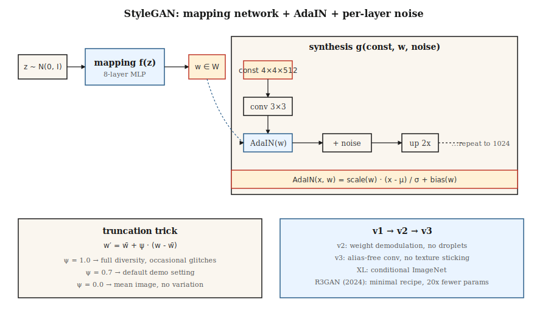

# StyleGAN

> Most generators stir `z` into every layer at once. StyleGAN breaks it apart: map `z` to an intermediate `w`, then *inject* `w` via AdaIN at each resolution level. That single change untangles the latent space and makes photorealistic faces a solved problem for seven consecutive years.

**Type:** Build
**Languages:** Python
**Prerequisites:** Phase 8 · 03 (GAN), Phase 4 · 08 (Normalization), Phase 3 · 07 (CNNs)
**Time:** ~45 minutes

## The Problem

DCGAN maps `z` through a stack of transposed convolutions to produce an image. The problem: `z` controls everything—pose, lighting, identity, background—all entangled. Move along one axis of `z` and all four change together. You cannot tell the model "same person, different pose" because the representation simply isn't factored that way.

Karras et al. (2019, NVIDIA) proposed: stop feeding `z` directly into convolution layers. Start with a constant `4×4×512` tensor as the network input. Learn an 8-layer MLP that maps `z ∈ Z → w ∈ W`. Inject `w` at each resolution via *adaptive instance normalization* (AdaIN): normalize each conv feature map, then scale and shift it with an affine projection of `w`. Add per-layer noise to produce stochastic detail (skin pores, hair strands).

The result: `W` has roughly orthogonal axes that separately control "coarse style" (pose, identity) and "fine style" (lighting, color). You can swap styles between two images—use image A's `w` for low-resolution layers, image B's `w` for high-resolution layers. This unlocks editing, cross-domain stylization, and the entire "StyleGAN inversion" research line.

## The Concept



**Mapping network.** `f: Z → W`, an 8-layer MLP. `Z = N(0, I)^512`. `W` is not forced to be Gaussian—it learns a shape that fits the data.

**Synthesis network.** Starts from a learned constant `4×4×512`. Each resolution block: `upsample → conv → AdaIN(w_i) → noise → conv → AdaIN(w_i) → noise`. Resolution doubles: 4, 8, 16, 32, 64, 128, 256, 512, 1024.

**AdaIN.**

```
AdaIN(x, y) = y_scale · (x - mean(x)) / std(x) + y_bias
```

where `y_scale` and `y_bias` come from an affine projection of `w`. Per-feature-map normalization, then re-styled. "Style" here is the first- and second-order statistics of feature maps.

**Per-layer noise.** Single-channel Gaussian noise added to each feature map, scaled by a learned per-channel factor. Controls stochastic detail without affecting global structure.

**Truncation trick.** At inference, sample `z`, compute `w = mapping(z)`, then `w' = ŵ + ψ·(w - ŵ)` where `ŵ` is the mean of `w` over many samples. `ψ < 1` trades diversity for quality. Nearly every StyleGAN demo uses `ψ ≈ 0.7`.

## StyleGAN 1 → 2 → 3

| Version | Year | Innovation |
|---------|------|-----------|
| StyleGAN | 2019 | Mapping network + AdaIN + noise + progressive growing. |
| StyleGAN2 | 2020 | Weight demodulation replaces AdaIN (fixes droplet artifacts); skip/residual architecture; path length regularization. |
| StyleGAN3 | 2021 | Alias-free convolutions + equivariant kernels; eliminates texture sticking to pixel grid. |
| StyleGAN-XL | 2022 | Class-conditional, 1024², ImageNet. |
| R3GAN | 2024 | Repackaged with stronger regularization; matches diffusion on FFHQ-1024 with 20× fewer parameters. |

By 2026, StyleGAN3 remains the default for: (a) narrow-domain photorealism at high frame rates, (b) few-shot domain adaptation (train on a new dataset with 100 images, freeze mapping network), (c) inversion-based editing (find the `w` that reconstructs a real photo, then edit `w`). For open-domain text-to-image, it's not the right tool—diffusion is.

## Build It

`code/main.py` implements a toy "style-GAN lite" in 1D: a mapping MLP, a synthesis function (takes a learned constant vector, modulates it with scale/bias derived from `w`), and per-layer noise. It demonstrates that injecting `w` via affine modulation matches or beats concatenating `z` into the generator input.

### Step 1: Mapping network

```python
def mapping(z, M):
    h = z
    for i in range(num_layers):
        h = leaky_relu(add(matmul(M[f"W{i}"], h), M[f"b{i}"]))
    return h
```

### Step 2: Adaptive instance normalization

```python
def adain(x, w_scale, w_bias):
    mu = mean(x)
    sd = std(x)
    x_norm = [(xi - mu) / (sd + 1e-8) for xi in x]
    return [w_scale * xi + w_bias for xi in x_norm]
```

Per-feature-map scale and bias are derived from `w` via linear projection.

### Step 3: Per-layer noise

```python
def add_noise(x, sigma, rng):
    return [xi + sigma * rng.gauss(0, 1) for xi in x]
```

Per-channel sigma is learnable.

## Pitfalls

- **Droplet artifacts.** StyleGAN 1 produces a blob-like droplet in feature maps because AdaIN zeros the mean. StyleGAN 2's weight demodulation fixes this by scaling convolution weights instead.
- **Texture sticking.** StyleGAN 1 and 2 textures follow pixel coordinates rather than object coordinates (visible when interpolating). StyleGAN 3's alias-free convolution with windowed sinc filters fixes it.
- **Mode coverage.** Truncation `ψ < 0.7` looks clean but samples from a narrow cone; use `ψ = 1.0` if you need diversity.
- **Inversion is lossy.** Inverting a real photo into `W` usually relies on optimization or an encoder (e4e, ReStyle, HyperStyle). Results drift over multiple iterations.

## Use It

| Use case | Approach |
|----------|----------|
| Photorealistic faces (anime, product, narrow domain) | StyleGAN3 FFHQ / custom fine-tune |
| Face editing from a photo | e4e inversion + StyleSpace / InterFaceGAN directions |
| Face swapping / expression reenactment | StyleGAN + encoder + blending |
| Avatar pipeline | StyleGAN3 with ADA for low-data fine-tuning |
| Domain adaptation from few images | Freeze mapping network, fine-tune synthesis |
| Multimodal or text-conditioned generation | Don't—use diffusion |

For product demos where the answer is "a photo of some face," StyleGAN beats diffusion on inference cost (single forward, <10ms on a 4090) and sharpness at the same quality threshold.

## Ship It

Save as `outputs/skill-stylegan-inversion.md`. The skill takes a real photo and outputs: inversion method (e4e / ReStyle / HyperStyle), expected latent loss, editing budget (how far you can move in `W` before artifacts appear), and a list of known-good editing directions (age, expression, pose).

## Exercises

1. **Easy.** Run `code/main.py` with `adain_on=True` and `adain_on=False`. Compare the spread of outputs under fixed vs perturbed latents.
2. **Medium.** Implement style mixing regularization: for one training batch, compute `w_a`, `w_b`, use `w_a` for the first half of synthesis and `w_b` for the second half. Does the decoder learn disentangled styles?
3. **Hard.** Take a pretrained StyleGAN3 FFHQ model (ffhq-1024.pkl). Train an SVM on labeled samples to find the `w`-direction that controls "smiling"; report how far you can push before identity starts drifting.

## Key Terms

| Term | What people say | What it actually means |
|------|-----------------|----------------------|
| Mapping network | "The MLP" | `f: Z → W`, 8 layers, decouples latent geometry from data statistics. |
| W space | "Style space" | Output of the mapping network; approximately disentangled. |
| AdaIN | "Adaptive instance normalization" | Normalizes feature maps, then scales + shifts with `w` projection. |
| Truncation trick | "Psi" | `w = mean + ψ·(w - mean)`, ψ<1 trades diversity for quality. |
| Path length regularization | "PL reg" | Penalizes large image changes from unit `w` changes; makes `W` smoother. |
| Weight demodulation | "StyleGAN2's fix" | Normalizes conv weights instead of activations; kills droplet artifacts. |
| Alias-free | "StyleGAN3's trick" | Windowed sinc filters; eliminates texture sticking to pixel grid. |
| Inversion | "Finding w for a real image" | Optimize or encode `x → w` such that `G(w) ≈ x`. |

## Production Notes: Why StyleGAN Still Ships in 2026

StyleGAN3 generates a 1024² FFHQ face in under 10 ms on a 4090—`num_steps = 1`, no VAE decode, no cross-attention pass. In production terms, this is the latency floor for any image generator. A 50-step SDXL pipeline + VAE decode at the same resolution takes ~3 seconds. That's a **300× gap**, and for narrow-domain products (avatar services, ID-photo pipelines, stock face generation) it wins on TCO.

Two operational consequences:

- **No scheduler, no batcher.** Running a static batch at target occupancy is optimal. Continuous batching (critical for LLMs and diffusion) yields zero benefit here because every request costs identical FLOPs.
- **Truncation `ψ` is the safety knob.** `ψ < 0.7` samples from a narrow cone in the mapping network's range. This is the serving layer's only lever on sample variance. Turn `ψ` down during peak load, up for premium users.

## Further Reading

- [Karras et al. (2019). A Style-Based Generator Architecture for GANs](https://arxiv.org/abs/1812.04948) — StyleGAN.
- [Karras et al. (2020). Analyzing and Improving the Image Quality of StyleGAN](https://arxiv.org/abs/1912.04958) — StyleGAN2.
- [Karras et al. (2021). Alias-Free Generative Adversarial Networks](https://arxiv.org/abs/2106.12423) — StyleGAN3.
- [Tov et al. (2021). Designing an Encoder for StyleGAN Image Manipulation](https://arxiv.org/abs/2102.02766) — e4e inversion.
- [Sauer et al. (2022). StyleGAN-XL: Scaling StyleGAN to Large Diverse Datasets](https://arxiv.org/abs/2202.00273) — StyleGAN-XL.
- [Huang et al. (2024). R3GAN: The GAN is dead; long live the GAN!](https://arxiv.org/abs/2501.05441) — Modern minimalist GAN recipe.
