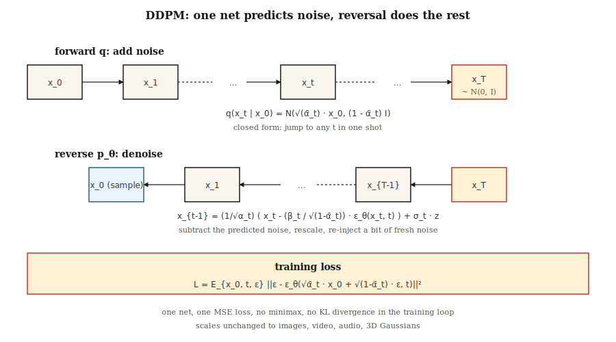

# Diffusion Models — DDPM from Scratch

> Ho, Jain, and Abbeel (2020) gave the field an addictive recipe. Destroy data with noise over thousands of small steps. Train a neural network to predict that noise. Reverse the process at inference. Today every mainstream image, video, 3D, and music model runs on this loop—possibly with flow matching or consistency tricks stacked on top.

**Type:** Build
**Languages:** Python
**Prerequisites:** Phase 3 · 02 (Backpropagation), Phase 8 · 02 (VAE)
**Time:** ~75 minutes

## The Problem

You want a sampler for `p_data(x)`. GANs play a minimax game that often diverges. VAEs produce blurry samples from Gaussian decoders. What you really want is a training objective that (a) is a single stable loss (no saddle points, no minimax), (b) is a lower bound on `log p(x)` (so you have likelihood), (c) produces samples matching SOTA quality.

Sohl-Dickstein et al. (2015) had a theoretical answer: define a Markov chain `q(x_t | x_{t-1})` that gradually adds Gaussian noise, then train a reverse chain `p_θ(x_{t-1} | x_t)` to denoise. Ho, Jain, and Abbeel (2020) showed this loss simplifies to a single line—predict the noise—and cleaned up the math. In 2020 this was a curiosity. In 2021 it produced SOTA samples. In 2022 it became Stable Diffusion. In 2026 it is the foundation.

## The Concept



**Forward process `q`.** Add Gaussian noise over `T` small steps. The closed-form solution—the reason the math is tractable—is that the cumulative result is also Gaussian:

```
q(x_t | x_0) = N( sqrt(α̅_t) · x_0,  (1 - α̅_t) · I )
```

where for a schedule of `β_t`, `α̅_t = ∏_{s=1..t} (1 - β_s)`. Linearly spacing `β_t` from 1e-4 to 0.02 over T=1000 steps makes `x_T` approximately `N(0, I)`.

**Reverse process `p_θ`.** Learn a neural network `ε_θ(x_t, t)` to predict the noise that was added. Given `x_t`, denoise like this:

```
x_{t-1} = (1 / sqrt(α_t)) · ( x_t - (β_t / sqrt(1 - α̅_t)) · ε_θ(x_t, t) )  +  σ_t · z
```

where `σ_t` is either `sqrt(β_t)` or a learned variance. The formula is ugly, but it is just algebra—solving for `x_{t-1}` given the posterior `q(x_{t-1} | x_t, x_0)`, then substituting `x_0` with its noise-prediction estimate.

**Training loss.**

```
L_simple = E_{x_0, t, ε} [ || ε - ε_θ( sqrt(α̅_t) · x_0 + sqrt(1 - α̅_t) · ε,  t ) ||² ]
```

Sample `x_0` from data, pick a random `t`, sample `ε ~ N(0, I)`, compute the noisy `x_t` in closed form, and regress on the noise. One loss, no minimax, no KL, no reparameterization trick.

**Sampling.** Start from `x_T ~ N(0, I)`. Iterate the reverse step from `t = T` down to `1`. Done.

## Why It Works

Three intuitions:

1. **Denoising is easy; generation is hard.** At `t=T` data is pure noise—the network solves a trivial problem. At `t=0` the network only needs to clean up a few pixels. At intermediate `t`, the problem is hard, but many gradients flow through the same set of weights at each noise level.

2. **Score matching in disguise.** Vincent (2011) showed that predicting noise is equivalent to estimating `∇_x log q(x_t | x_0)`, the *score*. The reverse SDE uses this score to walk up the density gradient—a guided random walk toward high-probability regions.

3. **ELBO degenerates to simple MSE.** The full variational lower bound has one KL term per timestep. Under DDPM's parameterization, these KL terms reduce to noise-prediction MSE with specific coefficients; Ho dropped the coefficients (calling it the "simple" loss), and quality actually *improved*.

## Build It

`code/main.py` implements a 1-D DDPM. Data is a bimodal mixture. The "network" is a mini MLP taking `(x_t, t)` and outputting predicted noise. Training is that one-line loss. Sampling iterates the reverse chain.

### Step 1: Forward schedule (closed form)

```python
betas = [1e-4 + (0.02 - 1e-4) * t / (T - 1) for t in range(T)]
alphas = [1 - b for b in betas]
alpha_bars = []
cum = 1.0
for a in alphas:
    cum *= a
    alpha_bars.append(cum)
```

### Step 2: One-shot sampling of `x_t`

```python
def forward_sample(x0, t, alpha_bars, rng):
    a_bar = alpha_bars[t]
    eps = rng.gauss(0, 1)
    x_t = math.sqrt(a_bar) * x0 + math.sqrt(1 - a_bar) * eps
    return x_t, eps
```

### Step 3: One training step

```python
def train_step(x0, model, alpha_bars, rng):
    t = rng.randrange(T)
    x_t, eps = forward_sample(x0, t, alpha_bars, rng)
    eps_hat = model_forward(model, x_t, t)
    loss = (eps - eps_hat) ** 2
    return loss, gradient_step(model, ...)
```

### Step 4: Reverse sampling

```python
def sample(model, alpha_bars, T, rng):
    x = rng.gauss(0, 1)
    for t in range(T - 1, -1, -1):
        eps_hat = model_forward(model, x, t)
        beta_t = 1 - alphas[t]
        x = (x - beta_t / math.sqrt(1 - alpha_bars[t]) * eps_hat) / math.sqrt(alphas[t])
        if t > 0:
            x += math.sqrt(beta_t) * rng.gauss(0, 1)
    return x
```

For a 1-D problem with 40 timesteps and a 24-unit MLP, this learns the bimodal mixture in about 200 epochs.

## Time Conditioning

The network needs to know which timestep it is denoising. Two standard options:

- **Sinusoidal embedding.** Like a Transformer positional encoding. `embed(t) = [sin(t/ω_0), cos(t/ω_0), sin(t/ω_1), ...]`. Pass through an MLP, broadcast into the network.
- **FiLM / group-norm conditioning.** Project the embedding into per-channel scale/bias for each block (FiLM).

Our toy code uses sinusoidal → concatenation. Production U-Nets use FiLM.

## Pitfalls

- **The schedule matters enormously.** Linear `β` is the DDPM default, but cosine schedule (Nichol & Dhariwal, 2021) gives better FID at the same compute. Switch schedules when quality plateaus.
- **Timestep embedding is fragile.** Passing raw `t` as a float works for toy 1-D but fails for images; always use a proper embedding.
- **V-prediction vs ε-prediction.** For extreme ranges (very small or very large t), `ε` has poor signal-to-noise ratio. V-prediction (`v = α·ε - σ·x`) is more stable; SDXL, SD3, and Flux all use it.
- **Classifier-free guidance.** At inference compute both conditional and unconditional `ε`, then `ε_cfg = (1 + w) · ε_cond - w · ε_uncond`, `w ≈ 3-7`. Covered in Lesson 08.
- **1000 steps is a lot.** Production uses DDIM (20-50 steps), DPM-Solver (10-20 steps), or distillation (1-4 steps). See Lesson 12.

## Real-World Usage

| Role | Typical 2026 Stack |
|------|-----------------------|
| Pixel-space image diffusion (small, toy) | DDPM + U-Net |
| Image latent-space diffusion | VAE encoder + U-Net or DiT (Lesson 07) |
| Video latent-space diffusion | Spatiotemporal DiT (Sora, Veo, WAN) |
| Audio latent-space diffusion | Encodec + diffusion transformer |
| Scientific (molecules, proteins, physics) | Equivariant diffusion (EDM, RFdiffusion, AlphaFold3) |

Diffusion is the universal generative backbone. Flow matching (Lesson 13) is the 2024-2026 competitor, usually winning on inference speed at comparable quality.

## Ship It

Save as `outputs/skill-diffusion-trainer.md`. The skill accepts a dataset + compute budget and outputs: schedule (linear/cosine/sigmoid), prediction target (ε/v/x), number of steps, guidance strength, sampler family, and an evaluation pipeline.

## Exercises

1. **Easy.** Change T from 40 to 10 in `code/main.py`. How does sample quality (the output histogram) degrade? At what T does the bimodal structure collapse?
2. **Medium.** Switch from ε-prediction to v-prediction. Re-derive the reverse step. Compare final sample quality.
3. **Hard.** Add classifier-free guidance. Condition on a class label `c ∈ {0, 1}`, drop it 10% of the time during training, and sample with `ε = (1+w)·ε_cond - w·ε_uncond`. Measure the hit rate of the conditioned mode at `w = 0, 1, 3, 7`.

## Key Terms

| Term | What people say | What it actually means |
|------|-----------------|-----------------------|
| Forward process | "Adding noise" | The fixed Markov chain `q(x_t | x_{t-1})` that destroys data. |
| Reverse process | "Denoising" | The learned chain `p_θ(x_{t-1} | x_t)` that reconstructs data. |
| β schedule | "Noise ladder" | Per-step variance; linear, cosine, or sigmoid. |
| α̅ | "Alpha bar" | Cumulative product `∏(1 - β)`; gives closed-form `x_t` from `x_0`. |
| Simple loss | "MSE on noise" | `‖ε - ε_θ(x_t, t)‖²`; all variational derivations degenerate to this. |
| ε-prediction | "Predict the noise" | Output is the added noise; standard DDPM. |
| V-prediction | "Predict velocity" | Output is `α·ε - σ·x`; better conditioning across t. |
| DDPM | "That paper" | Ho et al. 2020; linear β, 1000 steps, U-Net. |
| DDIM | "Deterministic sampler" | Non-Markovian sampler, 20-50 steps, same training objective. |
| Classifier-free guidance | "CFG" | Blending conditional and unconditional noise predictions to amplify conditioning. |

## Production Notes: Diffusion Inference Is a Step-Count Problem

The DDPM paper runs T=1000 reverse steps. Nobody ships that. Every real inference stack picks from three strategies—and each maps cleanly to the production framework of "where does latency come from":

1. **Faster sampler, same model.** DDIM (20-50 steps), DPM-Solver++ (10-20), UniPC (8-16). Drop-in replacement for the reverse loop; the trained `ε_θ` weights stay unchanged. Latency cut 20-50×.
2. **Distillation.** Train a student to match the teacher in fewer steps: progressive distillation (2 → 1), consistency models (any → 1-4), LCM, SDXL-Turbo, SD3-Turbo. Latency cut another 5-10×, requires retraining.
3. **Caching & compilation.** `torch.compile(unet, mode="reduce-overhead")`, TensorRT-LLM's diffusion backend, `xformers`/SDPA attention, bf16 weights. ~2× per-step latency cut. Stackable on top of (1) and (2).

For a production diffusion server, the budgeting conversation is the same one the production literature describes for LLMs: latency is `num_steps × step_cost + VAE_decode`, throughput is `batch_size × (num_steps × step_cost)^-1`. TTFT is small (one step); the equivalent of TPOT is the entire response time, since from the user's perspective image generation is "all at once."

## Further Reading

- [Sohl-Dickstein et al. (2015). Deep Unsupervised Learning using Nonequilibrium Thermodynamics](https://arxiv.org/abs/1503.03585) — The diffusion paper, ahead of its time.
- [Ho, Jain, Abbeel (2020). Denoising Diffusion Probabilistic Models](https://arxiv.org/abs/2006.11239) — DDPM.
- [Song, Meng, Ermon (2021). Denoising Diffusion Implicit Models](https://arxiv.org/abs/2010.02502) — DDIM, fewer steps.
- [Nichol & Dhariwal (2021). Improved DDPM](https://arxiv.org/abs/2102.09672) — Cosine schedule, learned variance.
- [Dhariwal & Nichol (2021). Diffusion Models Beat GANs on Image Synthesis](https://arxiv.org/abs/2105.05233) — Classifier guidance.
- [Ho & Salimans (2022). Classifier-Free Diffusion Guidance](https://arxiv.org/abs/2207.12598) — CFG.
- [Karras et al. (2022). Elucidating the Design Space of Diffusion-Based Generative Models (EDM)](https://arxiv.org/abs/2206.00364) — Unified notation, cleanest recipe.
