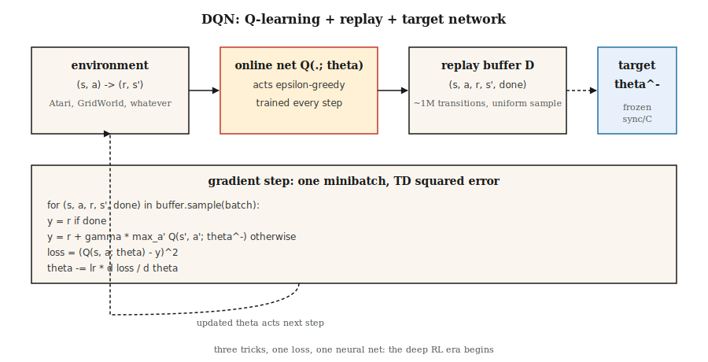

# Deep Q-Networks (DQN)

> 2013: Mnih trained a Q-learning network on raw pixels and beat every classical RL agent on seven Atari games. 2015: scaled to 49 games, published in Nature, ignited the deep RL era. DQN is Q-learning plus three tricks that stabilize function approximation.

**Type:** Build
**Languages:** Python
**Prerequisites:** Phase 3 · 03 (Backpropagation), Phase 9 · 04 (Q-learning, SARSA)
**Time:** ~75 minutes

## The Problem

Tabular Q-learning needs a separate Q-value for every (state, action) pair. A chess board has ~10⁴³ states. An Atari frame is 210×160×3 = 100800 features. Tabular RL collapses at a few thousand states, let alone billions.

The fix is obvious in hindsight: replace the Q-table with a neural network `Q(s, a; θ)`. But "obvious in hindsight" took decades. Q-learning with naive function approximation diverges because of the "deadly triad" — function approximation + bootstrapping + off-policy learning. Mnih et al. (2013, 2015) found three engineering tricks that stabilize learning:

1. **Experience replay** decorrelates transitions.
2. **Target network** freezes the bootstrap target.
3. **Reward clipping** normalizes gradient magnitudes.

DQN on Atari was the first time a single architecture with a single set of hyperparameters solved dozens of control problems from raw pixels. Every "deep RL" built since — DDQN, Rainbow, Dueling, Distributional, R2D2, Agent57 — stacks on top of this three-trick foundation.

## The Concept



**Objective.** DQN minimizes the one-step TD loss on a neural Q-function:

`L(θ) = E_{(s,a,r,s')~D} [ (r + γ max_{a'} Q(s', a'; θ^-) - Q(s, a; θ))² ]`

`θ` = online network, updated every step with gradient descent. `θ^-` = target network, periodically copied from `θ` (every ~10000 steps). `D` = replay buffer of past transitions.

**Three tricks, ranked by importance:**

**Experience replay.** A ring buffer of ~`10⁶` transitions. Each training step uniformly samples a minibatch. This breaks temporal correlations (consecutive frames are nearly identical), lets the network learn from rare rewarding transitions multiple times, and decorrelates successive gradient updates. Without it, neural networks with on-policy TD diverge on Atari.

**Target network.** Using the same network `Q(·; θ)` on both sides of the Bellman equation makes the target shift every update — "chasing its own tail." Fix: keep a second network `Q(·; θ^-)` with frozen weights. Every `C` steps, copy `θ → θ^-`. This stabilizes the regression target for thousands of gradient steps at a time. Soft update `θ^- ← τ θ + (1-τ) θ^-` (used in DDPG, SAC) is a smoother variant.

**Reward clipping.** Atari reward magnitudes range from 1 to 1000+. Clipping to `{-1, 0, +1}` prevents any single game from dominating gradients. Wrong to do when reward magnitude matters; fine for Atari which only cares about sign.

**Double DQN.** Hasselt (2016) fixes maximization bias: use the online network to *select* the action, the target network to *evaluate* it.

`target = r + γ Q(s', argmax_{a'} Q(s', a'; θ); θ^-)`

Drop-in replacement, stably better. Use it by default.

**Other improvements (Rainbow, 2017):** prioritized replay (sample high-TD-error transitions more), dueling architecture (separate `V(s)` and advantage heads), noisy networks (learned exploration), n-step returns, distributional Q (C51/QR-DQN), multi-step bootstrapping. Each adds a few percentage points; gains are roughly additive.

## Build It

The code here uses only stdlib, no numpy — we hand-roll a single-hidden-layer MLP on a tiny continuous GridWorld so every training step runs in microseconds. The algorithm is identical to full-scale Atari DQN.

### Step 1: Replay buffer

```python
class ReplayBuffer:
    def __init__(self, capacity):
        self.buf = []
        self.capacity = capacity
    def push(self, s, a, r, s_next, done):
        if len(self.buf) == self.capacity:
            self.buf.pop(0)
        self.buf.append((s, a, r, s_next, done))
    def sample(self, batch, rng):
        return rng.sample(self.buf, batch)
```

Atari uses ~50000 capacity; our toy environment needs 5000.

### Step 2: A minimal Q-network (hand-rolled MLP)

```python
class QNet:
    def __init__(self, n_in, n_hidden, n_actions, rng):
        self.W1 = [[rng.gauss(0, 0.3) for _ in range(n_in)] for _ in range(n_hidden)]
        self.b1 = [0.0] * n_hidden
        self.W2 = [[rng.gauss(0, 0.3) for _ in range(n_hidden)] for _ in range(n_actions)]
        self.b2 = [0.0] * n_actions
    def forward(self, x):
        h = [max(0.0, sum(w * xi for w, xi in zip(row, x)) + b) for row, b in zip(self.W1, self.b1)]
        q = [sum(w * hi for w, hi in zip(row, h)) + b for row, b in zip(self.W2, self.b2)]
        return q, h
```

Forward pass: linear → ReLU → linear. That's the entire network.

### Step 3: DQN update

```python
def train_step(online, target, batch, gamma, lr):
    grads = zeros_like(online)
    for s, a, r, s_next, done in batch:
        q, h = online.forward(s)
        if done:
            y = r
        else:
            q_next, _ = target.forward(s_next)
            y = r + gamma * max(q_next)
        td_error = q[a] - y
        accumulate_grads(grads, online, s, h, a, td_error)
    apply_sgd(online, grads, lr / len(batch))
```

The skeleton is Q-learning from lesson 04 with two differences: (a) we backpropagate through a differentiable `Q(·; θ)` instead of indexing a table; (b) the target uses `Q(·; θ^-)`.

### Step 4: Outer loop

Each episode, act ε-greedy on `Q(·; θ)`, push transitions into the buffer, sample a minibatch, take a gradient step, periodically sync `θ^- ← θ`. Pattern:

```python
for episode in range(N):
    s = env.reset()
    while not done:
        a = epsilon_greedy(online, s, epsilon)
        s_next, r, done = env.step(s, a)
        buffer.push(s, a, r, s_next, done)
        if len(buffer) >= batch:
            train_step(online, target, buffer.sample(batch), gamma, lr)
        if steps % sync_every == 0:
            target = copy(online)
        s = s_next
```

On our small GridWorld with 16-dim one-hot state, the agent learns near-optimal policy in ~500 episodes. On Atari, scale to 200M frames with a CNN feature extractor.

## Pitfalls

- **Deadly triad.** Function approximation + off-policy + bootstrapping can diverge. DQN mitigates with target network + replay; don't remove either.
- **Exploration.** ε must decay, typically from 1.0 to 0.01 over ~10% of training. Insufficient early exploration causes the Q-network to converge to a local basin.
- **Overestimation.** Taking `max` of noisy Q biases upward. Always use Double DQN in production.
- **Reward scale.** Clip or normalize rewards; gradient magnitudes are proportional to reward magnitude.
- **Replay buffer cold start.** Don't train until the buffer has a few thousand transitions. Early gradients on ~20 samples overfit.
- **Target sync frequency.** Too frequent ≈ no target network; too infrequent ≈ stale target. Atari DQN uses 10000 env steps. Rule of thumb: sync every ~1/100 of training horizon.
- **Observation preprocessing.** Atari DQN stacks 4 frames to make state Markovian. Any environment with velocity information needs frame stacking or recurrent state.

## Use It

By 2026, DQN is rarely SOTA but remains the reference off-policy algorithm:

| Task | Preferred method | Why not DQN? |
|------|------------------|--------------|
| Discrete action, Atari-like | Rainbow DQN or Muesli | Same framework, more tricks. |
| Continuous control | SAC / TD3 (Phase 9 · 07) | DQN lacks a policy network. |
| On-policy / high-throughput | PPO (Phase 9 · 08) | No replay buffer; easier to scale. |
| Offline RL | CQL / IQL / Decision Transformer | Conservative Q-targets, no bootstrap explosion. |
| Large discrete action spaces (recommendation) | DQN with action embeddings, or IMPALA | Possible; modifications matter. |
| LLM RL | PPO / GRPO | Sequence-level not step-level; different loss. |

The lessons remain universal. Replay and target networks appear in SAC, TD3, DDPG, SAC-X, AlphaZero's self-play buffer, and every offline RL method. Reward clipping survives as advantage normalization in PPO. The architecture is the blueprint.

## Ship It

Save as `outputs/skill-dqn-trainer.md`:

```markdown
---
name: dqn-trainer
description: Produce a DQN training config (buffer, target sync, ε schedule, reward clipping) for a discrete-action RL task.
version: 1.0.0
phase: 9
lesson: 5
tags: [rl, dqn, deep-rl]
---

Given a discrete-action environment (observation shape, action count, horizon, reward scale), output:

1. Network. Architecture (MLP / CNN / Transformer), feature dim, depth.
2. Replay buffer. Capacity, minibatch size, warmup size.
3. Target network. Sync strategy (hard every C steps or soft τ).
4. Exploration. ε start / end / schedule length.
5. Loss. Huber vs MSE, gradient clip value, reward clipping rule.
6. Double DQN. On by default unless explicit reason to disable.

Refuse to ship a DQN with no target network, no replay buffer, or ε held at 1. Refuse continuous-action tasks (route to SAC / TD3). Flag any reward range > 10× per-step mean as needing clipping or scale normalization.
```

## Exercises

1. **Easy.** Run `code/main.py`. Plot the per-episode return curve. After how many episodes does the sliding mean exceed -10?
2. **Medium.** Disable the target network (use online network for both sides of the Bellman target). Measure training instability — does the return oscillate or diverge?
3. **Hard.** Add Double DQN: use the online network to pick `argmax a'`, the target network to evaluate. On a noisy-reward GridWorld, compare the bias of `Q(s_0, best_a)` relative to true `V*(s_0)` with and without Double DQN after 1000 episodes.

## Key Terms

| Term | What people say | What it actually is |
|------|-----------------|-----------------------|
| DQN | "Deep Q-learning" | Q-learning with a neural Q-function, replay buffer, and target network. |
| Experience replay | "Shuffled transitions" | Ring buffer uniformly sampled each gradient step; decorrelates data. |
| Target network | "Frozen bootstrap" | Periodic copy of Q used in the Bellman target; stabilizes training. |
| Deadly triad | "Why RL diverges" | Function approximation + bootstrapping + off-policy = no convergence guarantee. |
| Double DQN | "Max-bias fix" | Online network selects actions, target network evaluates them. |
| Dueling DQN | "V and A heads" | Decompose Q = V + A - mean(A); same output, better gradient flow. |
| Rainbow | "All the tricks" | DDQN + PER + dueling + n-step + noisy + distributional combined. |
| PER | "Prioritized replay" | Sample transitions proportional to TD-error magnitude. |

## Further Reading

- [Mnih et al. (2013). Playing Atari with Deep Reinforcement Learning](https://arxiv.org/abs/1312.5602) — The 2013 NeurIPS workshop paper that started deep RL.
- [Mnih et al. (2015). Human-level control through deep reinforcement learning](https://www.nature.com/articles/nature14236) — The Nature paper, 49-game DQN.
- [Hasselt, Guez, Silver (2016). Deep Reinforcement Learning with Double Q-learning](https://arxiv.org/abs/1509.06461) — DDQN.
- [Wang et al. (2016). Dueling Network Architectures](https://arxiv.org/abs/1511.06581) — Dueling DQN.
- [Hessel et al. (2018). Rainbow: Combining Improvements in Deep RL](https://arxiv.org/abs/1710.02298) — The trick-stacking paper.
- [OpenAI Spinning Up — DQN](https://spinningup.openai.com/en/latest/algorithms/dqn.html) — Clear modern exposition.
- [Sutton & Barto (2018). Ch. 9 — On-policy Prediction with Approximation](http://incompleteideas.net/book/RLbook2020.pdf) — The textbook treatment of the "deadly triad" (function approximation + bootstrapping + off-policy) that DQN's target network and replay buffer were designed to tame.
- [CleanRL DQN implementation](https://docs.cleanrl.dev/rl-algorithms/dqn/) — Reference single-file DQN used in ablation studies; good to read alongside this lesson's from-scratch version.
