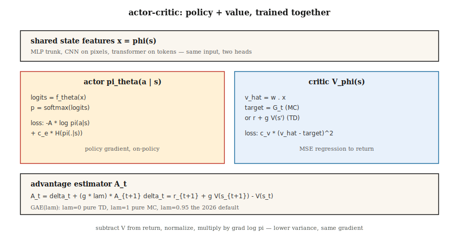

# Actor-Critic — A2C and A3C

> REINFORCE is noisy. Add a critic that learns `V̂(s)`, subtract it from the return, and you get an advantage with the same expectation but much lower variance. That's actor-critic. A2C runs it synchronously; A3C runs it across threads. Both are the mental model for every modern deep RL method.

**Type:** Build
**Languages:** Python
**Prerequisites:** Phase 9 · 04 (TD Learning), Phase 9 · 06 (REINFORCE)
**Time:** ~75 minutes

## The Problem

Vanilla REINFORCE works, but its variance is terrible. The Monte Carlo return `G_t` can swing tenfold across episodes. Multiply that noise by `∇ log π` and average — the resulting gradient estimator takes thousands of episodes to push the policy the same distance you could achieve with far fewer DQN updates.

The variance comes from using raw returns. If you subtract a baseline `b(s_t)` — any function of state, including a learned value — the expectation stays the same while variance drops. The best tractable baseline is `V̂(s_t)`. Now the quantity multiplying `∇ log π` is the *advantage*:

`A(s, a) = G - V̂(s)`

An action is good if it produces above-average return; bad if below. REINFORCE with a learned critic is *actor-critic*. The critic serves as a low-variance teacher for the actor. This is every deep policy method after 2015 (A2C, A3C, PPO, SAC, IMPALA).

## The Concept



**Two networks, one combined loss:**

- **Actor** `π_θ(a | s)`: the policy. Samples to act. Trained with policy gradients.
- **Critic** `V_φ(s)`: estimates expected return from a state. Trained to minimize `(V_φ(s) - target)²`.

**Advantage.** Two standard forms:

- *MC advantage:* `A_t = G_t - V_φ(s_t)`. Unbiased, higher variance.
- *TD advantage:* `A_t = r_{t+1} + γ V_φ(s_{t+1}) - V_φ(s_t)`. Biased (uses `V_φ`), much lower variance. Also called the *TD residual* `δ_t`.

**n-step advantage.** Interpolates between the two:

`A_t^{(n)} = r_{t+1} + γ r_{t+2} + … + γ^{n-1} r_{t+n} + γ^n V_φ(s_{t+n}) - V_φ(s_t)`

`n = 1` is pure TD. `n = ∞` is MC. Most implementations use `n = 5` for Atari, `n = 2048` for PPO on MuJoCo.

**Generalized Advantage Estimation (GAE).** Schulman et al. (2016) propose an exponentially-weighted average over all n-step advantages:

`A_t^{GAE} = Σ_{l=0}^{∞} (γλ)^l δ_{t+l}`

where `λ ∈ [0, 1]`. `λ = 0` is TD (low variance, high bias). `λ = 1` is MC (high variance, unbiased). `λ = 0.95` is the 2026 default — tune to park the bias/variance knob where you want it.

**A2C: Synchronous Advantage Actor-Critic.** Collect `T` steps across `N` parallel environments. Compute advantages for each step. Update actor and critic on the combined batch. Repeat. The simpler, more scalable sibling of A3C.

**A3C: Asynchronous Advantage Actor-Critic.** Mnih et al. (2016). Spin up `N` worker threads, each running its own environment. Each worker computes gradients locally on its own rollout, then asynchronously applies them to a shared parameter server. No replay buffer needed — workers decorrelate by running different trajectories. A3C proved you could train at scale on CPUs. By 2026, GPU-based A2C (batched parallel envs) dominates because GPUs want large batches.

**Combined loss.**

`L(θ, φ) = -E[ A_t · log π_θ(a_t | s_t) ]  +  c_v · E[(V_φ(s_t) - G_t)²]  -  c_e · E[H(π_θ(·|s_t))]`

Three terms: policy gradient loss, value regression, entropy bonus. `c_v ~ 0.5`, `c_e ~ 0.01` are classic starting points.

## Build It

### Step 1: A critic

Linear critic `V_φ(s) = w · features(s)` with MSE updates:

```python
def critic_update(w, x, target, lr):
    v_hat = dot(w, x)
    err = target - v_hat
    for j in range(len(w)):
        w[j] += lr * err * x[j]
    return v_hat
```

On tabular environments the critic converges in a few hundred episodes. On Atari, replace the linear critic with a shared CNN backbone + value head.

### Step 2: n-step advantage

Given a rollout of length `T` and a bootstrapped tail `V(s_T)`:

```python
def compute_advantages(rewards, values, gamma=0.99, lam=0.95, last_value=0.0):
    advantages = [0.0] * len(rewards)
    gae = 0.0
    for t in reversed(range(len(rewards))):
        next_v = values[t + 1] if t + 1 < len(values) else last_value
        delta = rewards[t] + gamma * next_v - values[t]
        gae = delta + gamma * lam * gae
        advantages[t] = gae
    returns = [a + v for a, v in zip(advantages, values)]
    return advantages, returns
```

`returns` are critic targets. `advantages` are what multiplies `∇ log π`.

### Step 3: Combined update

```python
for step_i, (x, a, _r, probs) in enumerate(traj):
    adv = advantages[step_i]
    target_v = returns[step_i]

    # critic
    critic_update(w, x, target_v, lr_v)

    # actor
    for i in range(N_ACTIONS):
        grad_logpi = (1.0 if i == a else 0.0) - probs[i]
        for j in range(N_FEAT):
            theta[i][j] += lr_a * adv * grad_logpi * x[j]
```

On-policy, one rollout per update, actor and critic with separate learning rates.

### Step 4: Parallelization (A3C vs A2C)

- **A3C:** Spin up `N` threads. Each runs its own env and its own forward pass. Periodically pushes gradient updates to a shared master. No locking on the master — races are fine, just more noise.
- **A2C:** Run `N` environment instances in a single process, stack observations into a `[N, obs_dim]` batch, batch forward, batch backward. Higher GPU utilization, deterministic, easier to reason about. The 2026 default.

Our toy code is single-threaded for clarity; rewriting as batched A2C is three lines of numpy.

## Pitfalls

- **Critic bias before actor gradients.** If the critic is random, its baseline is uninformative and you're training on pure noise. Warm up the critic for a few hundred steps before turning on policy gradients, or use a slow actor learning rate.
- **Advantage normalization.** Normalize advantages to zero-mean/unit-std within each batch. Nearly zero cost, dramatically stabilizes training.
- **Shared backbone.** On image inputs, actor and critic share a feature extractor. Separate heads. Shared features piggyback on both losses.
- **On-policy contract.** A2C reuses data for exactly one update. More gradient steps bias it (importance sampling corrections are precisely what PPO adds).
- **Entropy collapse.** Without `c_e > 0`, the policy becomes near-deterministic within a few hundred updates and stops exploring.
- **Reward scale.** Advantage magnitude depends on reward scale. Normalize rewards (e.g., divide by a running standard deviation) to keep gradient magnitudes consistent across tasks.

## Use It

A2C/A3C are rarely the final choice in 2026, but they are the architecture that everything after refines:

| Method | Relationship to A2C |
|--------|----------------|
| PPO | A2C + clipped importance ratio for multiple update epochs |
| IMPALA | A3C + V-trace off-policy correction |
| SAC (Phase 9 · 07) | Off-policy A2C with a soft-value critic (next lesson) |
| GRPO (Phase 9 · 12) | A2C without the critic — group-relative advantage |
| DPO | A2C collapsed into a preference ranking loss with no sampling |
| AlphaStar / OpenAI Five | A2C + league training + imitation pretraining |

If you see "advantage" in a 2026 paper, think actor-critic.

## Ship It

Save as `outputs/skill-actor-critic-trainer.md`:

```markdown
---
name: actor-critic-trainer
description: Produce an A2C / A3C / GAE configuration for a given environment, with advantage estimation and loss weights specified.
version: 1.0.0
phase: 9
lesson: 7
tags: [rl, actor-critic, gae]
---

Given an environment and compute budget, output:

1. Parallelism. A2C (GPU batched) vs A3C (CPU async) and the number of workers.
2. Rollout length T. Steps per env per update.
3. Advantage estimator. n-step or GAE(λ); specify λ.
4. Loss weights. `c_v` (value), `c_e` (entropy), gradient clip.
5. Learning rates. Actor and critic (separate if using).

Refuse single-worker A2C on environments with horizon > 1000 (too on-policy, too slow). Refuse to ship without advantage normalization. Flag any run with `c_e = 0` and observed entropy < 0.1 as entropy-collapsed.
```

## Exercises

1. **Easy.** Train an actor-critic on 4×4 GridWorld using MC advantage (`G_t - V(s_t)`). Compare sample efficiency against lesson 06's "REINFORCE with running-mean baseline."
2. **Medium.** Switch to TD residual advantage (`r + γ V(s') - V(s)`). Measure the variance of the advantage batch. How much does it drop?
3. **Hard.** Implement GAE(λ). Sweep `λ ∈ {0, 0.5, 0.9, 0.95, 1.0}`. Plot final return vs sample efficiency. Where is the bias/variance sweet spot for this task?

## Key Terms

| Term | How people say it | What it actually is |
|------|-------------------|---------------------|
| Actor | "policy network" | `π_θ(a|s)`, updated by policy gradient. |
| Critic | "value network" | `V_φ(s)`, updated by MSE regression on returns / TD targets. |
| Advantage | "how much better than average" | `A(s, a) = Q(s, a) - V(s)` or its estimator. Multiplier for `∇ log π`. |
| TD residual | "δ" | `δ_t = r + γ V(s') - V(s)`; one-step advantage estimate. |
| GAE | "interpolation knob" | Exponentially-weighted sum of n-step advantages, parameterized by `λ`. |
| A2C | "synchronous actor-critic" | Batched across envs; one gradient step per rollout. |
| A3C | "asynchronous actor-critic" | Worker threads push gradients to a shared parameter server. Original paper; less common in 2026. |
| Bootstrapping | "plugging V in at the horizon" | Truncating a rollout and adding `γ^n V(s_{t+n})` to close the sum. |

## Further Reading

- [Mnih et al. (2016). Asynchronous Methods for Deep Reinforcement Learning](https://arxiv.org/abs/1602.01783) — A3C, the original async actor-critic paper.
- [Schulman et al. (2016). High-Dimensional Continuous Control Using Generalized Advantage Estimation](https://arxiv.org/abs/1506.02438) — GAE.
- [Sutton & Barto (2018). Ch. 13 — Actor-Critic Methods](http://incompleteideas.net/book/RLbook2020.pdf) — Foundations; read alongside Ch. 9 on function approximation when the critic is a neural net.
- [Espeholt et al. (2018). IMPALA](https://arxiv.org/abs/1802.01561) — Scalable distributed actor-critic with V-trace off-policy correction.
- [OpenAI Baselines / Stable-Baselines3](https://stable-baselines3.readthedocs.io/) — Production-grade A2C/PPO implementations worth reading.
- [Konda & Tsitsiklis (2000). Actor-Critic Algorithms](https://papers.nips.cc/paper/1786-actor-critic-algorithms) — Foundational convergence results for the two-timescale actor-critic decomposition.
