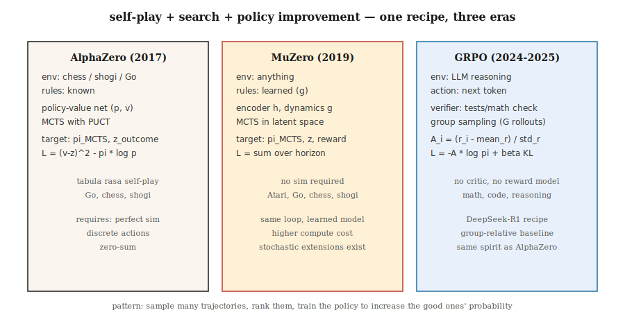

# RL for Games — AlphaZero, MuZero & the LLM Reasoning Era

> 1992: TD-Gammon beats human champions at backgammon with pure TD. 2016: AlphaGo beats Lee Sedol. 2017: AlphaZero masters chess, shogi, and Go from scratch. 2024: DeepSeek-R1 proves the same recipe (swapping PPO for GRPO) works for reasoning. Games are the benchmark that drove every breakthrough in this phase.

**Type:** Build
**Languages:** Python
**Prerequisites:** Phase 9 · 05 (DQN), Phase 9 · 08 (PPO), Phase 9 · 09 (RLHF), Phase 9 · 10 (MARL)
**Time:** ~120 minutes

## The Problem

Games have everything RL wants. Clean rewards (win/lose). Unlimited episodes (self-play resets automatically). Perfect simulation (the game *is* the simulator). Discrete or small continuous action spaces. Multi-agent structure that forces adversarial robustness.

And games are how every major RL breakthrough has been tested. TD-Gammon (backgammon, 1992). Atari-DQN (2013). AlphaGo (2016). AlphaZero (2017). OpenAI Five (Dota 2, 2019). AlphaStar (StarCraft II, 2019). MuZero (learned model, 2019). AlphaTensor (matrix multiplication, 2022). AlphaDev (sorting algorithms, 2023). DeepSeek-R1 (math reasoning, 2025) — the latest demonstration that game RL techniques work on text just as well.

This capstone lesson tours three milestone architectures — AlphaZero, MuZero, GRPO — through a unified lens: **self-play + search + policy improvement**. Each is a generalization of the previous; GRPO in particular is the AlphaZero recipe applied to LLM reasoning, with tokens as actions and math verification as the win signal.

## The Concept



**The unified loop.**

```
while True:
    trajectory = self_play(current_policy, search)     # play game against self
    policy_target = search.improved_policy(trajectory) # search improves raw policy
    policy_net.update(policy_target, value_target)     # supervised on search output
```

**AlphaZero (2017).** Silver et al. Given a game with known rules (chess, shogi, Go):

- Policy-value network: single tower `f_θ(s) → (p, v)`. `p` is a prior over legal moves. `v` is expected game outcome.
- Monte Carlo Tree Search (MCTS): at each move, expand a tree of possible continuations. Use `(p, v)` as prior + bootstrap. Select nodes with UCB (PUCT): `a* = argmax Q(s, a) + c · p(a|s) · √N(s) / (1 + N(s, a))`.
- Self-play: play the agent against itself. At turn `t`, the MCTS visit distribution `π_t` becomes the policy training target.
- Loss: `L = (v - z)² - π · log p + c · ||θ||²`. `z` is game outcome (+1 / 0 / -1).

Zero human knowledge. Zero hand-crafted heuristics. One recipe that masters chess, shogi, and Go after tens of millions of self-play games each.

**MuZero (2019).** Schrittwieser et al. Removes the requirement that rules are known.

- Instead of a fixed environment, learn a *latent dynamics model* `(h, g, f)`:
  - `h(s)`: encode observation into a latent state.
  - `g(s_latent, a)`: predict next latent state + reward.
  - `f(s_latent)`: predict policy prior + value.
- MCTS runs in the *learned latent space*. Same search, same training loop.
- Works on Go, chess, shogi *and* Atari — one algorithm, no rule knowledge needed.

**Stochastic MuZero (2022).** Adds stochastic dynamics and chance nodes; extends to games like backgammon.

**Muesli, Gumbel MuZero (2022-2024).** Improvements in sample efficiency and deterministic search.

**GRPO (2024-2025).** The DeepSeek-R1 recipe. The same AlphaZero-shaped loop, applied to language model reasoning:

- "Game": answer a math / coding / reasoning problem. "Win" = verifier (test cases pass, numeric answer matches) returns 1.
- Policy: LLM. Actions: tokens. State: prompt + response so far.
- No critic (PPO-style V_φ). Instead, for each prompt, sample `G` completions from the policy. Score each with the reward. Use **group-relative advantage** `A_i = (r_i - mean_r) / std_r` as the signal for a REINFORCE-style update.
- KL penalty to a reference policy, preventing drift (like RLHF).
- Full loss:

  `L_GRPO(θ) = -E_{q, {o_i}} [ (1/G) Σ_i A_i · log π_θ(o_i | q) ] + β · KL(π_θ || π_ref)`

No reward model, no critic, no MCTS. The group-relative baseline replaces all three in one stroke. Matches or exceeds PPO-RLHF quality on reasoning benchmarks at a fraction of the compute.

**The full R1 recipe.** DeepSeek-R1 (DeepSeek 2025) is two models in one paper:

- **R1-Zero.** Start from DeepSeek-V3 base model. No SFT. Apply GRPO directly with two reward components: *accuracy reward* (rule-based — does the final answer parse to the correct number / does the code pass unit tests) and *format reward* (does the completion wrap the chain-of-thought inside `<think>…</think>` tags). Over thousands of steps, average response length grows from ~100 to ~10000 tokens and math benchmark scores climb to near o1-preview levels. The model learns to reason from scratch. Downside: its chain-of-thought is often unreadable, mixes languages, and lacks stylistic polish.
- **R1.** Fixes R1-Zero's readability with a four-stage pipeline:
  1. **Cold-start SFT.** Collect a few thousand cleanly-formatted long chain-of-thought demonstrations. SFT the base model on them. This gives a readable starting point.
  2. **Reasoning-focused GRPO.** Apply GRPO with accuracy+format rewards, plus a *language consistency* reward to prevent language switching.
  3. **Rejection sampling + second SFT round.** Sample ~600k reasoning trajectories from the RL checkpoint, keep only those where the final answer is correct and the chain-of-thought is readable, then mix with ~200k non-reasoning SFT samples (writing, QA, self-knowledge). Fine-tune the base again.
  4. **All-spectrum GRPO.** One more RL round covering both reasoning (rule-based rewards) and general alignment (preference-based helpfulness/harmlessness rewards).

The result matches o1 on AIME and MATH-500 with open weights, and is small enough to distill. The same paper releases six distilled dense models (Qwen-1.5B through Llama-70B) by doing SFT on R1's reasoning traces — no RL on the student side. At student scale, distilling from a strong RL teacher consistently beats doing RL from scratch.

**Why GRPO over PPO for reasoning.** The DeepSeekMath paper (Feb 2024) gives three reasons: (1) no value network to train, halving memory; (2) the group baseline naturally handles the sparse, end-of-trajectory rewards that reasoning tasks produce; (3) per-prompt normalization makes advantages comparable across problems of wildly different difficulty, which a single PPO critic cannot do.

**Search vs no-search.** Games have already split:

- *Long-horizon perfect-information games* (Go, chess): still search. AlphaZero / MuZero dominate.
- *LLM reasoning*: no MCTS in production yet; GRPO over full rollouts, best-of-N at inference. Process reward models (PRM) hint that step-level search is being added back.

## Build It

The code in `code/main.py` implements **miniature GRPO** — a bandit with multiple group samples. The algorithm is identical to what runs on LLMs; only the policy and environment are simpler. It teaches what was novel in 2025: the *loss* and the *group-relative advantage*.

### Step 1: A minimal verifier environment

```python
QUESTIONS = [
    {"prompt": "q1", "correct": 3},
    {"prompt": "q2", "correct": 1},
]

def verify(prompt_idx, answer_token):
    return 1.0 if answer_token == QUESTIONS[prompt_idx]["correct"] else 0.0
```

In real GRPO the verifier runs unit tests or checks math equations.

### Step 2: Policy: softmax over K answer tokens per prompt

```python
def policy_probs(theta, p_idx):
    return softmax(theta[p_idx])
```

Equivalent to an LLM's final-layer output conditioned on the prompt.

### Step 3: Group sampling and group-relative advantage

```python
def grpo_step(theta, p_idx, G=8, beta=0.01, lr=0.1, rng=None):
    probs = policy_probs(theta, p_idx)
    samples = [sample(probs, rng) for _ in range(G)]
    rewards = [verify(p_idx, s) for s in samples]
    mean_r = sum(rewards) / G
    std_r = stddev(rewards) + 1e-8
    advs = [(r - mean_r) / std_r for r in rewards]

    for a, A in zip(samples, advs):
        grad = onehot(a) - probs
        for i in range(len(probs)):
            theta[p_idx][i] += lr * A * grad[i]
    # KL penalty: pull theta toward reference
    for i in range(len(probs)):
        theta[p_idx][i] -= beta * (theta[p_idx][i] - reference[p_idx][i])
```

Group-relative advantage is the 2024 DeepSeek trick. No critic needed. The "baseline" is the group mean, normalization is by group std.

### Step 4: Compare against REINFORCE baseline (no value)

Same setup, same compute, vanilla REINFORCE. GRPO converges faster and more stably.

### Step 5: Observe entropy and KL

Same diagnostics as RLHF: mean KL to reference, policy entropy, reward over time. When these stabilize, training is done.

## Pitfalls

- **Reward hacking via verifier cheats.** GRPO inherits RLHF's risk: if the verifier is wrong or exploitable, the LLM will find that exploit. Robust verifiers (multiple test cases, formal proofs) matter.
- **Group too small.** The group baseline's variance scales roughly as `1/√G`. Below `G = 4`, advantage signal is noisy; standard choices are `G = 8` to `64`.
- **Length bias.** LLM completions of different lengths have different log-probabilities. Normalize by token count, or use sequence-level log-prob, or truncate to max length.
- **Pure self-play cycles.** AlphaZero-style training can get stuck in a dominance cycle on general-sum games. Mitigate with diverse opponent pools (league play, lesson 10).
- **Search-policy mismatch.** AlphaZero trains the policy to imitate search output. If the policy network is too small to represent the search distribution, training stalls.
- **Compute threshold.** MuZero / AlphaZero require massive compute. A single ablation often costs hundreds of GPU-hours. Miniature demos (e.g., AlphaZero on Connect-4) exist for learning.
- **Verifier coverage.** Unit tests that pass for a buggy solution reinforce that bug. Design verifiers that catch edge cases.

## Use It

2026 game-RL landscape by domain:

| Domain | Dominant method |
|--------|-----------------|
| Two-player zero-sum board games (Go, chess, shogi) | AlphaZero / MuZero / KataGo |
| Imperfect-information card games (poker) | CFR + deep learning (DeepStack, Libratus, Pluribus) |
| Atari / pixel games | Muesli / MuZero / IMPALA-PPO |
| Large-scale multiplayer strategy (Dota, StarCraft) | PPO + self-play + league (OpenAI Five, AlphaStar) |
| LLM math/code reasoning | GRPO (DeepSeek-R1, Qwen-RL, open-source reproductions) |
| LLM alignment | DPO / RLHF-PPO (not GRPO; verifier is preference not verifiable) |
| Robotics | PPO + DR (not game RL, but same policy gradient tools) |
| Combinatorial problems | AlphaZero variants (AlphaTensor, AlphaDev) |

The *recipe* — self-play, search-augmented improvement, policy distillation — spans text, pixels, and physical control. GRPO is the youngest instance; more are coming.

## Ship It

Save as `outputs/skill-game-rl-designer.md`:

```markdown
---
name: game-rl-designer
description: Design a game-RL or reasoning-RL training pipeline (AlphaZero / MuZero / GRPO) for a given domain.
version: 1.0.0
phase: 9
lesson: 12
tags: [rl, alphazero, muzero, grpo, self-play]
---

Given a target (perfect-info game / imperfect-info / Atari / LLM reasoning / combinatorial), output:

1. Environment fit. Known rules? Markov? Stochastic? Multi-agent? Informs AlphaZero vs MuZero vs GRPO.
2. Search strategy. MCTS (PUCT with learned prior), Gumbel-sampled, best-of-N, or none.
3. Self-play plan. Symmetric self-play / league / offline data / verifier-generated.
4. Target signal. Game outcome / verifier reward / preference / learned model. Include robustness plan.
5. Diagnostics. Win rate vs baseline, ELO curve, verifier pass rate, KL to reference.

Refuse AlphaZero on imperfect-info games (route to CFR). Refuse GRPO without a trusted verifier. Refuse any game-RL pipeline without a fixed baseline opponent set (self-play ELO is uncalibrated otherwise).
```

## Exercises

1. **Easy.** Implement the GRPO bandit in `code/main.py`. Train on 2 prompts × 4 answer tokens each. Converge in < 1000 updates with `G=8`.
2. **Medium.** Plug in PPO (clipped) and vanilla REINFORCE. Compare sample efficiency and reward variance against GRPO on the same bandit.
3. **Hard.** Extend to a 2-step "reasoning chain": the agent emits two tokens, and the verifier rewards the pair. Measure how GRPO handles credit assignment over a 2-step sequence. (Hint: compute group advantage for each *full sequence*, propagate to both token positions.)

## Key Terms

| Term | How people say it | What it actually is |
|------|-------------------|---------------------|
| MCTS | "tree search with learned nets" | Monte Carlo Tree Search; UCB1/PUCT selection with learned `(p, v)` priors. |
| AlphaZero | "self-play + MCTS" | Policy-value net trained to match MCTS visits and game outcomes. |
| MuZero | "AlphaZero with a learned model" | Same loop but runs in latent space via learned dynamics. |
| GRPO | "critic-free PPO" | Group Relative Policy Optimization; REINFORCE with group-mean baseline + KL. |
| PUCT | "AlphaZero's UCB" | `Q + c · p · √N / (1 + N_a)` — balances value estimate and prior. |
| Self-play | "agent vs past self" | Standard for zero-sum; symmetric training signal. |
| League play | "population-based self-play" | Sample opponents from past + current + exploiters. |
| Verifier reward | "verifiable RL" | Reward from a deterministic checker (test passes, answer matches). |
| Process reward | "PRM" | Scores each reasoning step, not just the final answer. |

## Further Reading

- [Silver et al. (2017). Mastering the game of Go without human knowledge (AlphaGo Zero)](https://www.nature.com/articles/nature24270).
- [Silver et al. (2018). A general reinforcement learning algorithm that masters chess, shogi, and Go through self-play (AlphaZero)](https://www.science.org/doi/10.1126/science.aar6404).
- [Schrittwieser et al. (2020). Mastering Atari, Go, chess and shogi by planning with a learned model (MuZero)](https://www.nature.com/articles/s41586-020-03051-4).
- [Vinyals et al. (2019). Grandmaster level in StarCraft II (AlphaStar)](https://www.nature.com/articles/s41586-019-1724-z).
- [DeepSeek-AI (2024). DeepSeekMath: Pushing the Limits of Mathematical Reasoning in Open Language Models (GRPO)](https://arxiv.org/abs/2402.03300) — The paper introducing GRPO and the group-relative baseline.
- [DeepSeek-AI (2025). DeepSeek-R1: Incentivizing Reasoning Capability in LLMs via Reinforcement Learning](https://arxiv.org/abs/2501.12948) — Full four-stage R1 recipe plus R1-Zero ablation.
- [Brown et al. (2019). Superhuman AI for multiplayer poker (Pluribus)](https://www.science.org/doi/10.1126/science.aay2400) — Large-scale CFR + deep learning.
- [Tesauro (1995). Temporal Difference Learning and TD-Gammon](https://dl.acm.org/doi/10.1145/203330.203343) — The paper that started it all.
- [Hugging Face TRL — GRPOTrainer](https://huggingface.co/docs/trl/main/en/grpo_trainer) — Production reference for applying GRPO with custom reward functions.
- [Qwen Team (2024). Qwen2.5-Math — GRPO replication](https://github.com/QwenLM/Qwen2.5-Math) — Open-source reproduction of the R1 recipe at multiple scales.
- [Sutton & Barto (2018). Ch. 17 — Frontiers of Reinforcement Learning](http://incompleteideas.net/book/RLbook2020.pdf) — The textbook framework for self-play, search, and "designed rewards" that R1 instantiates at LLM scale.
