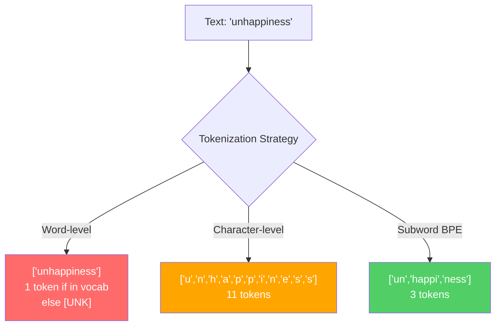
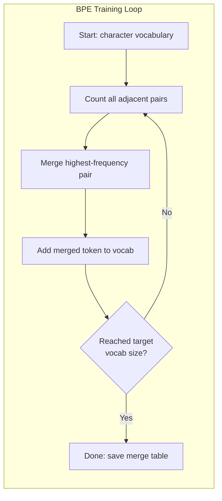
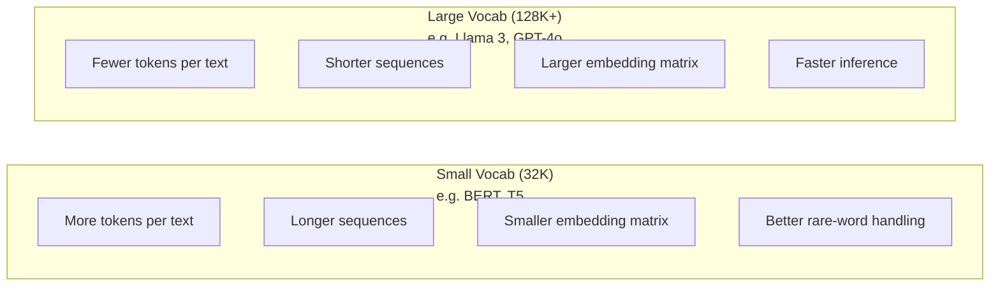

# Tokenizers: BPE, WordPiece, SentencePiece

> Your LLM doesn't read English — it reads integers. The tokenizer decides whether those integers carry meaning or waste capacity.

**Type:** Build
**Languages:** Python
**Prerequisites:** Phase 05 (NLP Foundations)
**Time:** ~90 minutes

## Learning Objectives

- Implement BPE, WordPiece, and Unigram tokenization from scratch, comparing their merge strategies
- Explain how vocabulary size affects model efficiency: too small produces overly long sequences, too large wastes embedding parameters
- Analyze tokenization artifacts across languages and code, identifying where specific tokenizers fail
- Tokenize text with tiktoken and sentencepiece libraries, inspecting the resulting token IDs

## The Problem

Your LLM doesn't read English. It doesn't read any language. It reads numbers.

The gap between "Hello, world!" and [15496, 11, 995, 0] is the tokenizer. Every word, every space, every punctuation mark must become an integer before the model can process it. This conversion is not neutral. It bakes assumptions into the model that can never be undone.

Get it wrong, and your model wastes capacity encoding common words with multiple tokens. "unfortunately" becomes four tokens instead of one. Your 128K context window shrinks 75% on text dense with polysyllabic words. Get it right, and the same context window fits twice the meaning. The difference between "this model handles code well" and "this model chokes on Python" often comes down to how the tokenizer was trained.

Every API call you make to GPT-4 or Claude is priced per token. Every token your model generates costs compute. Fewer tokens to represent a given output means faster end-to-end inference. Tokenization is not preprocessing — it's architecture.

## The Concept

### Three approaches that fail (and one that wins)

There are three obvious ways to convert text into numbers. Two of them break at scale.

**Word-level tokenization** splits on spaces and punctuation. "The cat sat" becomes ["The", "cat", "sat"]. Simple. But what about "tokenization"? "GPT-4o"? The German compound "Geschwindigkeitsbegrenzung"? Word-level tokenization requires an enormous vocabulary to cover every word in every language. Miss one, and you get the dreaded `[UNK]` token — the model saying "I have no idea what this is." English alone has over a million word forms. Add code, URLs, scientific notation, and hundreds of other languages, and you need an infinite vocabulary.

**Character-level tokenization** goes to the other extreme. "hello" becomes ["h", "e", "l", "l", "o"]. Tiny vocabulary (a few hundred characters). Never an unknown token. But sequences become extremely long. A sentence that's 10 word-level tokens becomes 50 character tokens. The model must learn that "t", "h", "e" together mean "the" — burning attention capacity on something humans learn at age three.

**Subword tokenization** finds the sweet spot. Common words stay intact: "the" is one token. Rare words split into meaningful pieces: "unhappiness" becomes ["un", "happi", "ness"]. Vocabulary size is manageable (30K to 128K tokens). Sequences stay short. Unknown tokens essentially vanish because any word can be composed from subword pieces.

Every modern LLM uses subword tokenization. GPT-2, GPT-4, BERT, Llama 3, Claude — all of them. The only question is which algorithm.



### BPE: Byte Pair Encoding

BPE is a greedy compression algorithm repurposed for tokenization. The idea is simple enough to fit on a napkin.

Start with individual characters. Count every pair of adjacent characters in the training corpus. Merge the most frequent pair into a new token. Repeat until you reach your target vocabulary size.

```figure
tokenizer-bpe
```

Here's BPE running on a tiny corpus of just three words — "lower", "lowest", "newest":

```
Corpus (with word frequencies):
  "lower"  x5
  "lowest" x2
  "newest" x6

Step 0 -- Start with characters:
  l o w e r       (x5)
  l o w e s t     (x2)
  n e w e s t     (x6)

Step 1 -- Count adjacent pairs:
  (e,s): 8    (s,t): 8    (l,o): 7    (o,w): 7
  (w,e): 13   (e,r): 5    (n,e): 6    ...

Step 2 -- Merge most frequent pair (w,e) -> "we":
  l o we r        (x5)
  l o we s t      (x2)
  n e we s t      (x6)

Step 3 -- Recount and merge (e,s) -> "es":
  l o we r        (x5)
  l o we s t      (x2)    <- 'es' only forms from 'e'+'s', not 'we'+'s'
  n e we s t      (x6)    <- wait, the 'e' before 'we' and 's' after 'we'

Actually tracking this precisely:
  After "we" merge, remaining pairs:
  (l,o): 7   (o,we): 7   (we,r): 5   (we,s): 8
  (s,t): 8   (n,e): 6    (e,we): 6

Step 3 -- Merge (we,s) -> "wes" or (s,t) -> "st" (tied at 8, pick first):
  Merge (we,s) -> "wes":
  l o we r        (x5)
  l o wes t       (x2)
  n e wes t       (x6)

Step 4 -- Merge (wes,t) -> "west":
  l o we r        (x5)
  l o west        (x2)
  n e west        (x6)

...continue until target vocab size reached.
```

The merge table is the tokenizer. To encode new text, apply those merges in the learned order. The training corpus determines which merges exist, and that choice permanently shapes what the model sees.



### Byte-level BPE (GPT-2, GPT-3, GPT-4)

Standard BPE works on Unicode characters. Byte-level BPE works on raw bytes (0-255). This gives you a base vocabulary of exactly 256 that handles any language or encoding and never produces unknown tokens.

GPT-2 introduced this. The base vocabulary covers every possible byte. BPE merges build on top of it. OpenAI's tiktoken library implements byte-level BPE with these vocabulary sizes:

- GPT-2: 50,257 tokens
- GPT-3.5/GPT-4: ~100,256 tokens (cl100k_base encoding)
- GPT-4o: 200,019 tokens (o200k_base encoding)

### WordPiece (BERT)

WordPiece looks like BPE but selects merges differently. Instead of raw frequency, it maximizes the likelihood of the training data:

```
BPE merge criterion:      count(A, B)
WordPiece merge criterion: count(AB) / (count(A) * count(B))
```

BPE asks: "Which pair occurs most often?" WordPiece asks: "Which pair co-occurs more than you'd expect by chance?" This subtle difference produces different vocabularies. WordPiece prefers merges whose co-occurrence is surprising, not merely frequent.

WordPiece also marks continuation subwords with a "##" prefix:

```
"unhappiness" -> ["un", "##happi", "##ness"]
"embedding"   -> ["em", "##bed", "##ding"]
```

The "##" prefix tells you this piece continues the previous token. BERT uses WordPiece with a 30,522-token vocabulary. Every BERT variant — DistilBERT, RoBERTa's tokenizer is actually BPE, but BERT itself uses WordPiece.

### SentencePiece (Llama, T5)

SentencePiece treats the input as a raw Unicode character stream, whitespace included. No pre-tokenization step. No language-specific rules about word boundaries. This makes it truly language-agnostic — it works on Chinese, Japanese, Thai, and other languages that don't use spaces to separate words.

SentencePiece supports two algorithms:
- **BPE mode**: Same merge logic as standard BPE, applied to raw character sequences
- **Unigram mode**: Starts from a large vocabulary and iteratively removes tokens whose removal least impacts overall likelihood. The reverse of BPE — pruning instead of merging.

Llama 2 uses SentencePiece BPE with a 32,000-token vocabulary. T5 uses SentencePiece Unigram with 32,000 tokens. Note: Llama 3 switched to a tiktoken-based byte-level BPE tokenizer with 128,256 tokens.

### Vocabulary size tradeoffs

This is a real engineering decision with measurable consequences.



Concrete numbers. For a model with 128K vocabulary and 4,096-dimensional embeddings, the embedding matrix alone is 128,000 × 4,096 = 524 million parameters. With a 32K vocabulary, it's 131 million parameters. That's a 400-million parameter difference from the tokenizer choice alone.

But larger vocabularies compress text more aggressively. The same English passage that takes 100 tokens with a 32K vocabulary might take only 70 tokens with 128K. That's 30% fewer forward passes during generation. For a model serving millions of requests, that's a direct cut in compute cost.

The trend is clear: vocabulary sizes are growing. GPT-2 used 50,257. GPT-4 uses ~100K. Llama 3 uses 128K. GPT-4o uses 200K.

| Model | Vocab Size | Tokenizer Type | Avg Tokens per English Word |
|-------|-----------|----------------|---------------------------|
| BERT | 30,522 | WordPiece | ~1.4 |
| GPT-2 | 50,257 | Byte-level BPE | ~1.3 |
| Llama 2 | 32,000 | SentencePiece BPE | ~1.4 |
| GPT-4 | ~100,256 | Byte-level BPE | ~1.2 |
| Llama 3 | 128,256 | Byte-level BPE (tiktoken) | ~1.1 |
| GPT-4o | 200,019 | Byte-level BPE | ~1.0 |

### The multilingual tax

Tokenizers trained primarily on English treat other languages harshly. Korean text averages 2-3 tokens per word in GPT-2's tokenizer. Chinese can be worse. This means a Korean user effectively has half the context window of an English user — paying the same price for less information density.

This is why Llama 3 quadrupled vocabulary from 32K to 128K. Allocating more tokens to non-English scripts means fairer compression across languages.

## Build It

### Step 1: Character-level tokenizer

Start from the foundation. A character-level tokenizer maps each character to its Unicode codepoint. No training needed. No unknown tokens. Just a direct mapping.

```python
class CharTokenizer:
    def encode(self, text):
        return [ord(c) for c in text]

    def decode(self, tokens):
        return "".join(chr(t) for t in tokens)
```

"hello" becomes [104, 101, 108, 108, 111]. Each character is its own token. This is the baseline we'll improve on.

### Step 2: BPE tokenizer from scratch

The real implementation. We train on raw bytes (like GPT-2), count byte pairs, merge the most frequent pair, and record each merge in order. The merge table is the tokenizer.

```python
from collections import Counter

class BPETokenizer:
    def __init__(self):
        self.merges = {}
        self.vocab = {}

    def _get_pairs(self, tokens):
        pairs = Counter()
        for i in range(len(tokens) - 1):
            pairs[(tokens[i], tokens[i + 1])] += 1
        return pairs

    def _merge_pair(self, tokens, pair, new_token):
        merged = []
        i = 0
        while i < len(tokens):
            if i < len(tokens) - 1 and tokens[i] == pair[0] and tokens[i + 1] == pair[1]:
                merged.append(new_token)
                i += 2
            else:
                merged.append(tokens[i])
                i += 1
        return merged

    def train(self, text, num_merges):
        tokens = list(text.encode("utf-8"))
        self.vocab = {i: bytes([i]) for i in range(256)}

        for i in range(num_merges):
            pairs = self._get_pairs(tokens)
            if not pairs:
                break
            best_pair = max(pairs, key=pairs.get)
            new_token = 256 + i
            tokens = self._merge_pair(tokens, best_pair, new_token)
            self.merges[best_pair] = new_token
            self.vocab[new_token] = self.vocab[best_pair[0]] + self.vocab[best_pair[1]]

        return self

    def encode(self, text):
        tokens = list(text.encode("utf-8"))
        for pair, new_token in self.merges.items():
            tokens = self._merge_pair(tokens, pair, new_token)
        return tokens

    def decode(self, tokens):
        byte_sequence = b"".join(self.vocab[t] for t in tokens)
        return byte_sequence.decode("utf-8", errors="replace")
```

The training loop is the heart of BPE: count byte pairs, merge the winner, repeat. Each merge reduces total token count. After `num_merges` iterations, the vocabulary grows from 256 (base bytes) to 256 + num_merges.

Encoding applies merges strictly in the learned order. This is critical. If merge 1 created "th" and merge 5 created "the", encoding must apply merge 1 first so "the" can form from "th" + "e" at merge 5.

Decoding is the inverse: look up each token ID in the vocab, concatenate the bytes, decode to UTF-8.

### Step 3: Encode-decode round trip

```python
corpus = (
    "The cat sat on the mat. The cat ate the rat. "
    "The dog sat on the log. The dog ate the frog. "
    "Natural language processing is the study of how computers "
    "understand and generate human language. "
    "Tokenization is the first step in any NLP pipeline."
)

tokenizer = BPETokenizer()
tokenizer.train(corpus, num_merges=40)

test_sentences = [
    "The cat sat on the mat.",
    "Natural language processing",
    "tokenization pipeline",
    "unhappiness",
]

for sentence in test_sentences:
    encoded = tokenizer.encode(sentence)
    decoded = tokenizer.decode(encoded)
    raw_bytes = len(sentence.encode("utf-8"))
    ratio = len(encoded) / raw_bytes
    print(f"'{sentence}'")
    print(f"  Tokens: {len(encoded)} (from {raw_bytes} bytes) -- ratio: {ratio:.2f}")
    print(f"  Roundtrip: {'PASS' if decoded == sentence else 'FAIL'}")
```

The compression ratio tells you how effective the tokenizer is. A ratio of 0.50 means the tokenizer compressed text to half the raw byte count in tokens. Lower is better. On the training corpus, the ratio will be decent. On out-of-distribution text like "unhappiness" (which didn't appear in the corpus), the ratio will be worse — the tokenizer falls back to character-level encoding for patterns it hasn't seen.

### Step 4: Compare with tiktoken

```python
import tiktoken

enc = tiktoken.get_encoding("cl100k_base")

texts = [
    "The cat sat on the mat.",
    "unhappiness",
    "Hello, world!",
    "def fibonacci(n): return n if n < 2 else fibonacci(n-1) + fibonacci(n-2)",
    "Geschwindigkeitsbegrenzung",
]

for text in texts:
    our_tokens = tokenizer.encode(text)
    tiktoken_tokens = enc.encode(text)
    tiktoken_pieces = [enc.decode([t]) for t in tiktoken_tokens]
    print(f"'{text}'")
    print(f"  Our BPE:   {len(our_tokens)} tokens")
    print(f"  tiktoken:  {len(tiktoken_tokens)} tokens -> {tiktoken_pieces}")
```

tiktoken uses the exact same algorithm but trained on hundreds of gigabytes of text with 100,000 merges. The algorithm is identical. The difference is training data and merge count. Your tokenizer trained on a paragraph with 40 merges can't compete with tiktoken's 100K merges on massive corpora. But the mechanics are the same.

### Step 5: Vocabulary analysis

```python
def analyze_vocabulary(tokenizer, test_texts):
    total_tokens = 0
    total_chars = 0
    token_usage = Counter()

    for text in test_texts:
        encoded = tokenizer.encode(text)
        total_tokens += len(encoded)
        total_chars += len(text)
        for t in encoded:
            token_usage[t] += 1

    print(f"Vocabulary size: {len(tokenizer.vocab)}")
    print(f"Total tokens across all texts: {total_tokens}")
    print(f"Total characters: {total_chars}")
    print(f"Avg tokens per character: {total_tokens / total_chars:.2f}")

    print(f"\nMost used tokens:")
    for token_id, count in token_usage.most_common(10):
        token_bytes = tokenizer.vocab[token_id]
        display = token_bytes.decode("utf-8", errors="replace")
        print(f"  Token {token_id:4d}: '{display}' (used {count} times)")

    unused = [t for t in tokenizer.vocab if t not in token_usage]
    print(f"\nUnused tokens: {len(unused)} out of {len(tokenizer.vocab)}")
```

This reveals the Zipf distribution in your vocabulary. A few tokens dominate (space, "the", "e"). Most tokens are rarely used. Production tokenizers optimize for this distribution — common patterns get short token IDs, rare patterns use longer representations.

## Use It

Your from-scratch BPE works. Now see what production tools look like.

### tiktoken (OpenAI)

```python
import tiktoken

enc = tiktoken.get_encoding("cl100k_base")

text = "Tokenizers convert text to integers"
tokens = enc.encode(text)
print(f"Tokens: {tokens}")
print(f"Pieces: {[enc.decode([t]) for t in tokens]}")
print(f"Roundtrip: {enc.decode(tokens)}")
```

tiktoken is written in Rust with Python bindings. It encodes millions of tokens per second. Same BPE algorithm, industrial-grade implementation.

### Hugging Face tokenizers

```python
from tokenizers import Tokenizer
from tokenizers.models import BPE
from tokenizers.trainers import BpeTrainer
from tokenizers.pre_tokenizers import ByteLevel

tokenizer = Tokenizer(BPE())
tokenizer.pre_tokenizer = ByteLevel()

trainer = BpeTrainer(vocab_size=1000, special_tokens=["<pad>", "<eos>", "<unk>"])
tokenizer.train(["corpus.txt"], trainer)

output = tokenizer.encode("The cat sat on the mat.")
print(f"Tokens: {output.tokens}")
print(f"IDs: {output.ids}")
```

The Hugging Face tokenizers library is also Rust under the hood. It can train BPE on gigabyte-scale corpora in seconds. This is what you'd use when training your own model.

### Loading Llama's tokenizer

```python
from transformers import AutoTokenizer

tokenizer = AutoTokenizer.from_pretrained("meta-llama/Llama-3.1-8B")

text = "Tokenizers are the unsung heroes of LLMs"
tokens = tokenizer.encode(text)
print(f"Token IDs: {tokens}")
print(f"Tokens: {tokenizer.convert_ids_to_tokens(tokens)}")
print(f"Vocab size: {tokenizer.vocab_size}")

multilingual = ["Hello world", "Hola mundo", "Bonjour le monde"]
for text in multilingual:
    ids = tokenizer.encode(text)
    print(f"'{text}' -> {len(ids)} tokens")
```

Llama 3's 128K vocabulary compresses non-English text noticeably better than GPT-2's 50K vocabulary. You can verify this yourself — encode the same sentence in multiple languages and count tokens.

## Ship It

This lesson produces `outputs/prompt-tokenizer-analyzer.md` — a reusable prompt that analyzes tokenization efficiency for any text and model combination. Feed it a text sample and it tells you which model's tokenizer handles it best.

## Exercises

1. Modify the BPE tokenizer to print the vocabulary at each merge step. Watch "t" + "h" become "th", then "th" + "e" become "the". Trace how common English words assemble piece by piece.

2. Add special tokens (`<pad>`, `<eos>`, `<unk>`) to the BPE tokenizer. Assign them IDs 0, 1, 2 and shift all other tokens accordingly. Implement a pre-tokenization step that splits on whitespace before running BPE.

3. Implement WordPiece's merge criterion (likelihood ratio instead of frequency). Train both BPE and WordPiece on the same corpus with the same number of merges. Compare the resulting vocabularies — which produces more linguistically meaningful subwords?

4. Build a multilingual tokenizer efficiency benchmark. Take 10 sentences each in English, Spanish, Chinese, Korean, and Arabic. Tokenize with tiktoken (cl100k_base) and measure average tokens per character for each language. Quantify the "multilingual tax" per language.

5. Train your BPE tokenizer on a larger corpus (download a Wikipedia article). Tune the number of merges until compression ratio falls within 10% of tiktoken on the same text. This forces you to understand the relationship between corpus size, merge count, and compression quality.

## Key Terms

| Term | What people say | What it actually is |
|------|----------------|----------------------|
| Token | "a word" | A unit in the model's vocabulary — can be a character, subword, word, or multi-word chunk |
| BPE | "some compression thing" | Byte Pair Encoding — iteratively merges the most frequent adjacent token pair until target vocab size |
| WordPiece | "BERT's tokenizer" | Like BPE but merges maximize likelihood ratio count(AB)/(count(A)*count(B)) instead of raw frequency |
| SentencePiece | "a tokenizer library" | A language-agnostic tokenizer that works directly on raw Unicode without pre-tokenization, supporting both BPE and Unigram algorithms |
| Vocab size | "how many words it knows" | Total unique tokens: GPT-2 has 50,257, BERT has 30,522, Llama 3 has 128,256 |
| Fertility | "not a tokenizer term" | Average tokens per word — measures tokenizer efficiency across languages (1.0 is perfect, 3.0 means model works 3x harder) |
| Byte-level BPE | "GPT's tokenizer" | BPE operating on raw bytes (0-255) instead of Unicode characters, guaranteeing no unknown tokens for any input |
| Merge table | "that tokenizer file" | The ordered list of byte-pair merges learned during training — it is the tokenizer, and order matters |
| Pre-tokenization | "splitting on spaces" | Rules applied before subword tokenization: whitespace splitting, digit separation, punctuation handling |
| Compression ratio | "how efficient the tokenizer is" | Output token count divided by input byte count — lower means better compression, faster inference |

## Further Reading

- [Sennrich et al., 2016 -- "Neural Machine Translation of Rare Words with Subword Units"](https://arxiv.org/abs/1508.07909) -- The paper that introduced BPE to NLP, turning a 1994 compression algorithm into the foundation of modern tokenization
- [Kudo & Richardson, 2018 -- "SentencePiece: A simple and language independent subword tokenizer"](https://arxiv.org/abs/1808.06226) -- Language-agnostic tokenization that made multilingual models practical
- [OpenAI tiktoken repository](https://github.com/openai/tiktoken) -- Production BPE in Rust with Python bindings, used by GPT-3.5/4/4o
- [Hugging Face Tokenizers documentation](https://huggingface.co/docs/tokenizers) -- Production tokenizer training with Rust performance
