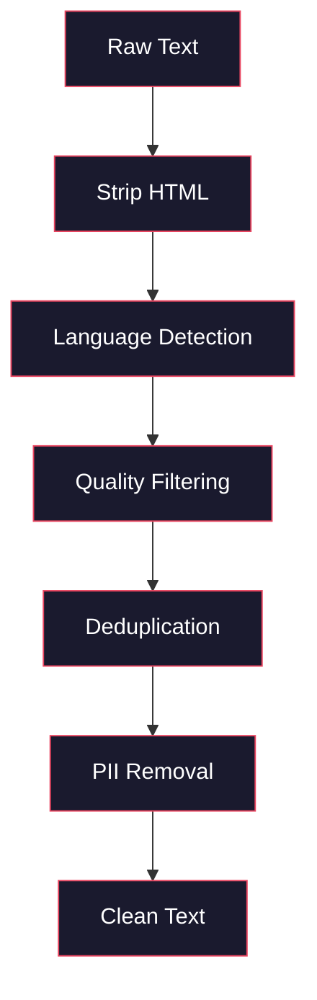
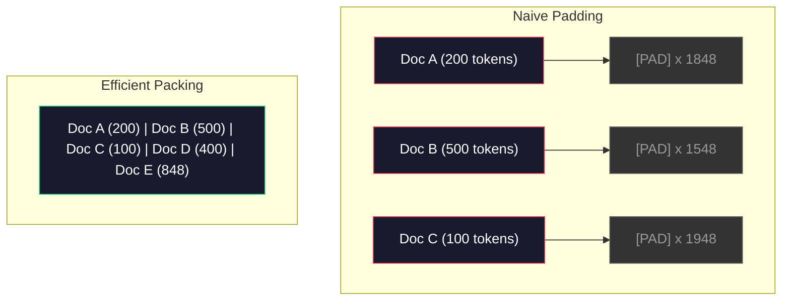

# Data Pipelines for Pre-training

> The model is a mirror. Feed it garbage, and it reflects garbage with perfect fluency.

**Type:** Build
**Languages:** Python
**Prerequisites:** Phase 10, Lessons 01-02 (Tokenizers, Building a Tokenizer from Scratch)
**Time:** ~90 minutes

## Learning Objectives

- Build a streaming data pipeline that tokenizes, chunks, shuffles, and batches TB-scale text without loading it all into memory
- Implement data quality filters used in real pre-training pipelines (deduplication, language detection, content filtering)
- Create fixed-length training sequences with correct attention masks and document boundary handling
- Profile pipeline throughput to ensure the dataloader keeps up with GPU training speed

## The Problem

You have a tokenizer. Now you need data.

Not a dataset. Not a CSV file. Terabytes of text — cleaned, deduplicated, quality-filtered, tokenized into fixed-length sequences, and served in randomized batches fast enough that your 8-GPU cluster never waits for the next batch.

Most people think training an LLM is about the model architecture. It's not. Llama 3 used 15.6 trillion tokens. GPT-3 used 300 billion. DeepSeek-V2 used 8.1 trillion. All three have roughly the same architecture: stacked transformer blocks with attention and feedforward layers. The difference in output quality comes overwhelmingly from the data.

DeepMind's Chinchilla paper made this precise. For a given compute budget, there's an optimal ratio between model parameters and training tokens. Chinchilla showed that most models in 2022 were severely undertrained — too many parameters for the amount of data they saw. A 70B model trained on 1.4 trillion tokens (Chinchilla-optimal) outperformed a 280B model trained on 300 billion tokens (Gopher).

Your data pipeline determines whether your model learns language or noise.

## The Concept

### Where data comes from

Every large language model trains on a mixture of sources. The exact ratios are closely guarded secrets for most labs, but we know enough about the categories.

| Source | Scale | Quality | Who uses it |
|--------|------|---------|---------|
| Common Crawl | ~250 TB raw | Low (needs heavy filtering) | GPT-3, Llama, most open models |
| Wikipedia | ~20 GB | High | Every major LLM |
| GitHub code | ~1 TB+ | Medium (lots of duplication, dead code) | StarCoder, CodeLlama, DeepSeek-Coder |
| Books (BookCorpus, Pile) | ~100 GB | High | GPT-2, GPT-3, early models |
| Academic papers (arXiv, S2ORC) | ~100 GB | High for STEM | Llama, Galactica |
| StackOverflow, Reddit | ~100 GB | Medium | Llama, Falcon |
| Curated web (C4, RefinedWeb) | ~5 TB | Medium-High (pre-filtered) | T5, Falcon |

Llama 3 published its data mix: roughly 50% web data, 25% code, 13% books and academic papers, 8% math data, 4% multilingual web. The total is 15.6 trillion tokens from over 5 TB of raw text sources.

The mix matters as much as the volume. Too much web data and the model becomes a Reddit parrot. Too little code and it can't program. Too little math and it fails at reasoning. Getting this ratio right is one of the hardest parts of training an LLM, and there's no formula — it requires experimentation and evaluation.

### Data cleaning

Raw web data is filthy. A typical Common Crawl dump contains:

- HTML tags and JavaScript
- Boilerplate headers, footers, navigation menus
- Duplicate pages (exact and near-duplicate)
- Machine-generated spam
- Personally identifiable information (PII)
- Low-quality text (keyword stuffing, SEO spam)
- Non-textual content encoded as text

Cleaning it is not optional. It's the difference between "a model that generates coherent paragraphs" and "a model that outputs HTML tags mixed with product listings."



Each step eliminates a class of noise:

**HTML stripping:** Remove all markup. Keep only visible text content. Libraries like `trafilatura` or `readability` extract article body while discarding navigation, ads, and boilerplate.

**Language detection:** Classify each document using fastText's language identification model (lid.176.bin). Filter to your target languages. A document classified as English with confidence below 0.8 is probably not clean English.

**Quality filtering:** This is where it gets interesting. RefinedWeb (the dataset behind Falcon) uses a perplexity-based filter: train a small language model on Wikipedia, then score each document. High perplexity means the document doesn't look like Wikipedia — probably spam, keyword lists, or machine-generated content. Documents above a perplexity threshold are removed.

**Deduplication:** The single highest-impact cleaning step. Common Crawl contains massive amounts of duplicated pages — legal disclaimers, cookie notices, terms of service. Training on duplicated content wastes compute and can cause the model to memorize and regurgitate specific passages verbatim.

**PII removal:** Names, email addresses, phone numbers, social security numbers. Regex-based detection for structured PII, NER models for names in context.

### Deduplication with MinHash

Exact deduplication is easy: hash each document, remove duplicates. But near-duplicates are the real problem. Two copies of the same news article with slightly different surrounding ads are near-duplicates. 95% identical content, but byte-for-byte they're different.

MinHash + Locality-Sensitive Hashing (LSH) solves this efficiently.


The idea:

1. **Shingling:** Convert each document into a set of n-grams (e.g., 5-grams of words or characters). "the quick brown fox" with 3-word shingles becomes {"the quick brown", "quick brown fox"}.

2. **MinHash:** For each document's shingle set, compute k hash values. Each hash value is the minimum hash across all shingles under a different hash function. This forms a fixed-length "signature" that approximates Jaccard similarity between any two documents.

3. **LSH:** Bucket documents by bands of their MinHash signature. Documents in the same bucket are candidate near-duplicates. This avoids all-pairs comparison — you only compare candidate pairs.

4. **Verification:** For each candidate pair, compute exact Jaccard similarity. If above threshold (typically 0.8), remove one copy.

The Llama team reported removing approximately 38% of web data through deduplication. That's not a small number. More than a third of Common Crawl is duplicate or near-duplicate content.

### Sequence packing

Your model expects fixed-length input sequences. Your documents have variable lengths. Some are 50 tokens. Some are 50,000 tokens.

Naive approach: pad every document to max sequence length. This wastes enormous compute on padding tokens that contribute nothing to learning.

Better approach: pack multiple documents into a single sequence, separated by end-of-sequence tokens. A single 2048-token sequence might contain three short documents concatenated with [EOS] tokens.



The attention mask must be set correctly. Within a packed sequence, tokens from document A should not attend to tokens from document B. This requires a block-diagonal attention mask.

Long documents are truncated or chunked at sequence boundaries. The cut point matters: cutting in the middle of a sentence forces the model to see incomplete thoughts. Some pipelines align cut points to paragraph or sentence boundaries when possible.

### Chinchilla scaling laws

For a fixed compute budget C (in FLOPs), optimal model size N and dataset size D follow:

```
N_opt ~ C^0.5
D_opt ~ C^0.5
```

In practice, this means you should scale model size and dataset size roughly proportionally. A model with 10x more parameters needs roughly 10x more training tokens to reach the same loss.

| Model | Parameters | Training Tokens | Chinchilla-Optimal? |
|-------|-----------|----------------|-------------------|
| GPT-3 | 175B | 300B | No (undertrained 3-4x) |
| Chinchilla | 70B | 1.4T | Yes (by design) |
| Llama 2 | 70B | 2T | Over-trained (intentional) |
| Llama 3 | 70B | 15T | Massively over-trained |

Llama 3 intentionally violates Chinchilla. Meta found that over-training — training far beyond the compute-optimal ratio — produces better models at inference time. The extra training cost is paid once, but the smaller model is cheaper to serve forever. This is sometimes called the "inference-optimal" scaling approach and has become the industry standard since 2024.

## Build It

### Step 1: Text cleaning

Strip HTML, normalize whitespace, remove non-textual content. We use a public domain text (Project Gutenberg) as a small corpus.

```python
import re

def clean_text(text):
    text = re.sub(r"<[^>]+>", "", text)
    text = re.sub(r"http\S+", "", text)
    text = re.sub(r"[^\x20-\x7E\n]", "", text)
    text = re.sub(r"\n{3,}", "\n\n", text)
    text = re.sub(r" {2,}", " ", text)
    return text.strip()

def quality_filter(text, min_words=50, max_ratio_caps=0.3, max_ratio_special=0.1):
    words = text.split()
    if len(words) < min_words:
        return False
    caps_ratio = sum(1 for w in words if w.isupper()) / len(words)
    if caps_ratio > max_ratio_caps:
        return False
    special_chars = sum(1 for c in text if not c.isalnum() and not c.isspace())
    if special_chars / max(len(text), 1) > max_ratio_special:
        return False
    return True
```

The quality filter catches SEO spam (all caps), machine-generated noise (high special character ratio), and stub pages (too short). These three checks alone remove a surprising amount of junk from web crawl data.

### Step 2: MinHash deduplication

Implement MinHash from scratch. No external libraries needed — just `hashlib`.

```python
import hashlib
from collections import defaultdict

def get_shingles(text, k=5):
    words = text.lower().split()
    if len(words) < k:
        return set()
    return {" ".join(words[i:i+k]) for i in range(len(words) - k + 1)}

def minhash_signature(shingles, num_hashes=128):
    signature = []
    for i in range(num_hashes):
        min_hash = float("inf")
        for shingle in shingles:
            h = int(hashlib.sha256(f"{i}:{shingle}".encode()).hexdigest(), 16)
            min_hash = min(min_hash, h)
        signature.append(min_hash)
    return signature

def lsh_buckets(signature, bands=16):
    rows_per_band = len(signature) // bands
    buckets = []
    for b in range(bands):
        start = b * rows_per_band
        band_data = tuple(signature[start:start + rows_per_band])
        bucket_hash = hashlib.md5(str(band_data).encode()).hexdigest()
        buckets.append((b, bucket_hash))
    return buckets

def deduplicate(documents, threshold=0.8, num_hashes=128, bands=16):
    signatures = []
    shingle_sets = []
    for doc in documents:
        shingles = get_shingles(doc)
        shingle_sets.append(shingles)
        signatures.append(minhash_signature(shingles, num_hashes))

    bucket_map = defaultdict(list)
    for doc_idx, sig in enumerate(signatures):
        for band_id, bucket_hash in lsh_buckets(sig, bands):
            bucket_map[(band_id, bucket_hash)].append(doc_idx)

    duplicate_pairs = set()
    for bucket_docs in bucket_map.values():
        if len(bucket_docs) < 2:
            continue
        for i in range(len(bucket_docs)):
            for j in range(i + 1, len(bucket_docs)):
                duplicate_pairs.add((bucket_docs[i], bucket_docs[j]))

    removed = set()
    for i, j in duplicate_pairs:
        if i in removed or j in removed:
            continue
        s1, s2 = shingle_sets[i], shingle_sets[j]
        if not s1 or not s2:
            continue
        jaccard = len(s1 & s2) / len(s1 | s2)
        if jaccard >= threshold:
            removed.add(j)

    return [doc for idx, doc in enumerate(documents) if idx not in removed], len(removed)
```

The parameters `num_hashes=128` and `bands=16` control the precision-recall tradeoff. More hashes means more accurate similarity estimates. More bands means higher recall (catching more duplicates) at the cost of more false positives. These values work well for typical web text.

### Step 3: Tokenize and pack sequences

Take clean, deduplicated text, tokenize it, and pack into fixed-length sequences for training.

```python
def tokenize_corpus(documents, tokenizer):
    all_tokens = []
    for doc in documents:
        tokens = tokenizer.encode(doc)
        all_tokens.extend(tokens)
        all_tokens.append(tokenizer.eos_id)
    return all_tokens

def pack_sequences(token_ids, seq_length, pad_id=0):
    sequences = []
    attention_masks = []
    for i in range(0, len(token_ids), seq_length):
        seq = token_ids[i:i + seq_length]
        mask = [1] * len(seq)
        if len(seq) < seq_length:
            pad_count = seq_length - len(seq)
            seq = seq + [pad_id] * pad_count
            mask = mask + [0] * pad_count
        sequences.append(seq)
        attention_masks.append(mask)
    return sequences, attention_masks
```

### Step 4: DataLoader for training

Yield randomized batches of packed sequences. This is what the training loop consumes.

```python
import random

class PreTrainingDataLoader:
    def __init__(self, sequences, attention_masks, batch_size, shuffle=True):
        self.sequences = sequences
        self.attention_masks = attention_masks
        self.batch_size = batch_size
        self.shuffle = shuffle

    def __len__(self):
        return (len(self.sequences) + self.batch_size - 1) // self.batch_size

    def __iter__(self):
        indices = list(range(len(self.sequences)))
        if self.shuffle:
            random.shuffle(indices)
        for start in range(0, len(indices), self.batch_size):
            batch_idx = indices[start:start + self.batch_size]
            batch_seqs = [self.sequences[i] for i in batch_idx]
            batch_masks = [self.attention_masks[i] for i in batch_idx]
            yield batch_seqs, batch_masks
```

### Step 5: Dataset statistics

Compute key numbers: total tokens, unique tokens, compression ratio, document length distribution.

```python
from collections import Counter

def compute_statistics(documents, token_ids, sequences, tokenizer_vocab_size):
    total_chars = sum(len(d) for d in documents)
    total_tokens = len(token_ids)
    unique_tokens = len(set(token_ids))
    compression_ratio = total_chars / total_tokens

    doc_lengths = [len(d.split()) for d in documents]
    avg_doc_length = sum(doc_lengths) / max(len(doc_lengths), 1)
    max_doc_length = max(doc_lengths) if doc_lengths else 0
    min_doc_length = min(doc_lengths) if doc_lengths else 0

    token_counts = Counter(token_ids)
    top_tokens = token_counts.most_common(10)

    non_pad_tokens = sum(sum(1 for t in seq if t != 0) for seq in sequences)
    total_positions = sum(len(seq) for seq in sequences)
    utilization = non_pad_tokens / max(total_positions, 1)

    stats = {
        "total_documents": len(documents),
        "total_characters": total_chars,
        "total_tokens": total_tokens,
        "unique_tokens": unique_tokens,
        "vocab_utilization": unique_tokens / tokenizer_vocab_size,
        "compression_ratio": compression_ratio,
        "avg_doc_length_words": avg_doc_length,
        "max_doc_length_words": max_doc_length,
        "min_doc_length_words": min_doc_length,
        "num_sequences": len(sequences),
        "sequence_utilization": utilization,
        "top_10_tokens": top_tokens,
    }
    return stats
```

The compression ratio tells you how efficient the tokenizer is on this corpus. English text typically compresses to about 3-4 characters per token. If you see 1.5 characters per token, your tokenizer is splitting too aggressively. If you see 8+, it's learned very domain-specific merges.

Sequence utilization tells you how much of your packed sequences is real data vs. padding. Below 90% means your packing is inefficient — you're wasting compute on padding tokens.

## Use It

### Comparing with HuggingFace Datasets

Load the same corpus through HuggingFace's datasets library and compare pipeline speed.

```python
from datasets import load_dataset
from transformers import AutoTokenizer

ds = load_dataset("wikitext", "wikitext-2-raw-v1", split="train")
tokenizer = AutoTokenizer.from_pretrained("meta-llama/Meta-Llama-3-8B")

import time

start = time.time()
tokenized = ds.map(
    lambda x: tokenizer(x["text"], truncation=True, max_length=2048),
    batched=True,
    num_proc=4,
)
hf_time = time.time() - start
total_tokens = sum(len(t) for t in tokenized["input_ids"])
print(f"HuggingFace: {total_tokens:,} tokens in {hf_time:.2f}s ({total_tokens/hf_time:,.0f} tokens/sec)")
```

The HuggingFace pipeline uses Rust tokenizers under the hood and parallelizes across 4 cores. Your pure Python pipeline will be 10-50x slower. This gap is why production teams use compiled tokenizers. The algorithm is the same. The difference is implementation language.

## Ship It

This lesson produces a prompt for validating and debugging data quality in LLM training pipelines. See `outputs/prompt-data-quality-checker.md`.

## Exercises

1. **Easy:** Add language detection to the cleaning pipeline using a simple heuristic (character set analysis). Filter to English-only documents and measure how many documents are removed.
2. **Medium:** Implement exact deduplication using SHA-256 hashing in addition to MinHash near-deduplication. Compare how many duplicates each method catches on a web crawl corpus.
3. **Hard:** Build a perplexity-based quality filter. Train a small bigram language model on Wikipedia text, score each document by perplexity, and remove the worst 20%. Compare model output quality when trained on filtered vs. unfiltered data.

## Key Terms

| Term | What people say | What it actually is |
|------|----------------|----------------------|
| Common Crawl | "the internet" | A nonprofit that crawls the web monthly — ~250TB raw, the starting point for most LLM training data |
| MinHash | "some hashing trick" | A technique for estimating Jaccard similarity between sets using fixed-length signatures — enables near-duplicate detection at scale |
| LSH | "Locality-Sensitive Hashing" | A method that buckets similar items together — reduces all-pairs comparison from O(n²) to near-linear |
| Sequence packing | "concatenating documents" | Stuffing multiple documents into fixed-length sequences with correct attention masks — eliminates padding waste |
| Chinchilla scaling | "train with more data" | For fixed compute, optimal performance requires scaling model size and training tokens roughly proportionally |
| Fertility | "tokens per word" | Average tokens per word — GPT-4 is 1.3 for English, higher for non-Latin scripts |
| Data mix | "choosing training data" | The ratio of code vs. text vs. math vs. multilingual data — no formula, requires experimentation |
| Perplexity filtering | "quality scoring" | Using a small language model to score documents — high perplexity means text unlike clean reference data |
| Deduplication | "removing copies" | Eliminating exact and near-duplicate documents — typically removes 30-40% of raw web data |
| Attention mask | "which tokens to look at" | A binary mask that prevents attention across document boundaries in packed sequences |

## Further Reading

- [Hoffmann et al., 2022 -- Training Compute-Optimal Large Language Models (Chinchilla)](https://arxiv.org/abs/2203.15556) -- The paper that changed how we think about data scale
- [Penedo et al., 2023 -- The RefinedWeb Dataset for Falcon LLM](https://arxiv.org/abs/2306.01116) -- How to filter Common Crawl to high quality
- [Touvron et al., 2023 -- Llama 2: Open Foundation and Fine-Tuned Chat Models](https://arxiv.org/abs/2307.09288) -- Llama 2 data pipeline details
- [Lee et al., 2022 -- Deduplicating Training Data Makes Language Models Better](https://arxiv.org/abs/2107.06499) -- Why deduplication matters more than you think
- [Broder, 1997 -- On the Resemblance and Containment of Documents](https://ieeexplore.ieee.org/document/666900) -- The original MinHash paper
- [Meta, 2024 -- Llama 3 Technical Report](https://arxiv.org/abs/2407.21783) -- 15.6T tokens, data mix ratios, filtering pipeline
