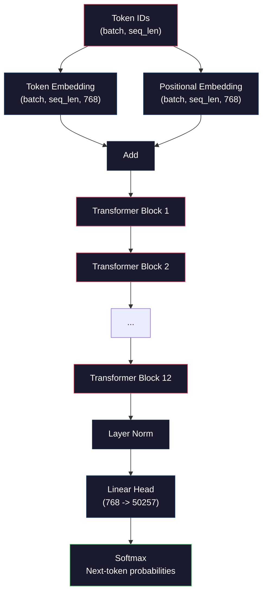
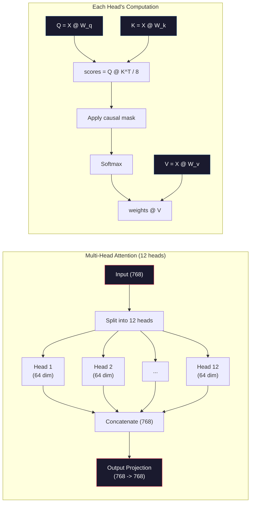
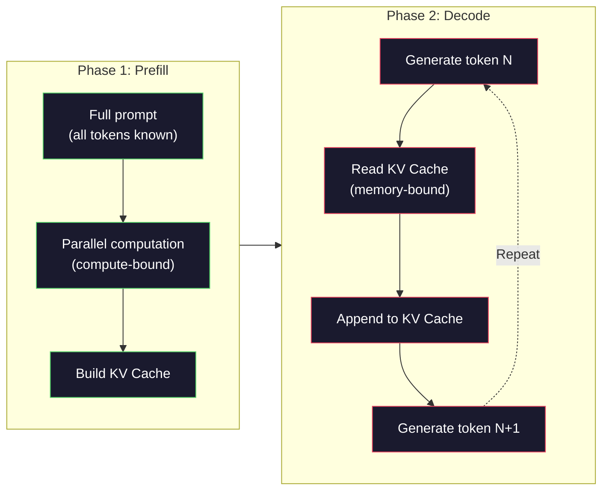

# Pre-training a Mini GPT (124M Parameters)

> GPT-2 Small has 124 million parameters. That's 12 transformer layers, 12 attention heads, 768-dimensional embeddings. You can train it from scratch on a single GPU in a few hours. Most people never do. They use pre-trained checkpoints. But if you don't train one yourself, you don't truly understand what's happening inside the model you're building products with.

**Type:** Build
**Languages:** Python (with numpy)
**Prerequisites:** Phase 10, Lessons 01-03 (Tokenizers, Building a Tokenizer from Scratch, Data Pipelines)
**Time:** ~120 minutes

## Learning Objectives

- Implement the complete GPT-2 architecture (124M parameters) from scratch: token embeddings, positional embeddings, transformer blocks, and language model head
- Train a GPT model on a text corpus using next-token prediction with cross-entropy loss
- Implement autoregressive text generation with temperature sampling and top-k/top-p filtering
- Monitor training loss curves and verify the model learns coherent language patterns

## The Problem

You know what a transformer is. You've seen the diagrams. You can recite "attention is all you need" and draw boxes labeled "Multi-Head Attention" on a whiteboard.

None of that means you understand what happens when the model generates text.

GPT-2 Small has 124,438,272 parameters (with weight tying). Every one of them was set by running a training loop: forward pass, compute loss, backward pass, update weights. 12 transformer blocks. 12 attention heads per block. A 768-dimensional embedding space. A vocabulary of 50,257 tokens. Every time the model generates a token, all 124 million parameters participate in a chain of matrix multiplications that takes a sequence of token IDs and produces a probability distribution over the next token.

If you've never built this yourself, you're working with a black box. You can use APIs. You can fine-tune. But when things go wrong — when the model hallucinates, when it repeats itself, when it refuses to follow instructions — you have no mental model for *why*.

This lesson builds GPT-2 Small from scratch. No PyTorch. Numpy. Every matrix multiplication is visible. Every gradient is computed by your code. You'll see exactly how 124 million numbers conspire to predict the next word.

## The Concept

### The GPT architecture

GPT is an autoregressive language model. "Autoregressive" means it generates one token at a time, each conditioned on all previous tokens. The architecture is a stack of transformer decoder blocks.

Here's the complete computation graph from token IDs to next-token probabilities:

1. Token IDs come in. Shape: (batch_size, seq_len).
2. Token embedding lookup. Each ID maps to a 768-dimensional vector. Shape: (batch_size, seq_len, 768).
3. Positional embedding lookup. Each position (0, 1, 2, ...) maps to a 768-dimensional vector. Same shape.
4. Add token embedding + positional embedding.
5. Pass through 12 transformer blocks.
6. Final layer normalization.
7. Linear projection to vocabulary size. Shape: (batch_size, seq_len, vocab_size).
8. Softmax to get probabilities.

That's the entire model. No convolutions. No recurrence. Just embeddings, attention, feedforward networks, and layer norms stacked 12 times.



### The transformer block

Each of the 12 blocks follows the same pattern. Pre-norm architecture (GPT-2 uses pre-norm, not post-norm like the original transformer):

1. LayerNorm
2. Multi-head self-attention
3. Residual connection (add input back)
4. LayerNorm
5. Feedforward network (MLP)
6. Residual connection (add input back)

Residual connections are critical. Without them, gradients vanish by the time backpropagation reaches block 1. With them, gradients can flow through the "skip" path directly from loss to any layer. This is why you can stack 12, 32, or even 96 blocks (GPT-4 reportedly uses 120).

### Attention: the core mechanism

Self-attention lets every token look at every previous token and decide how much attention to pay to each one. Here's the math.

For each token position, compute three vectors from the input:
- **Query (Q)**: "What am I looking for?"
- **Key (K)**: "What do I contain?"
- **Value (V)**: "What information do I carry?"

```
Q = input @ W_q    (768 -> 768)
K = input @ W_k    (768 -> 768)
V = input @ W_v    (768 -> 768)

attention_scores = Q @ K^T / sqrt(d_k)
attention_scores = mask(attention_scores)   # causal mask: -inf for future positions
attention_weights = softmax(attention_scores)
output = attention_weights @ V
```

The causal mask is what makes GPT autoregressive. Position 5 can attend to positions 0-5 but not 6, 7, 8, etc. This prevents the model from "cheating" by peeking at future tokens during training.

**Multi-head attention** splits the 768-dimensional space into 12 heads of 64 dimensions each. Each head learns a different attention pattern. One head might track syntactic relationships (subject-verb agreement). Another might track semantic similarity (synonyms). Another might track positional proximity (nearby words). All 12 heads' outputs are concatenated and projected back to 768 dimensions.



Division by sqrt(d_k) — sqrt(64) = 8 — is scaling. Without it, dot products of high-dimensional vectors get large, pushing softmax into regions where gradients are near zero. This is one of the key insights from the original "Attention Is All You Need" paper.

### KV Cache: why inference is fast

During training, you process entire sequences at once. During inference, you generate one token at a time. Without optimization, generating token N requires recomputing attention over all N-1 previous tokens. That's O(N²) per generated token, or O(N³) total for a sequence of length N.

KV Cache solves this. After computing K and V for each token, store them. When generating token N+1, you only need to compute Q for the new token and look up the cached K and V from all previous tokens. This reduces per-token cost of K and V computation from O(N) to O(1). The attention score computation remains O(N) since you attend to all previous positions, but you avoid redundant matrix multiplications on the input.

For GPT-2 with 12 layers and 12 heads, the KV cache stores 2 (K + V) × 12 layers × 12 heads × 64 dims = 18,432 values per token. For a 1024-token sequence, that's ~75MB in FP32. For Llama 3 405B with 128 layers, the KV cache for a single sequence can exceed 10GB. This is why long-context inference is memory-bound.

### Prefill vs Decode: the two phases of inference

When you send a prompt to an LLM, inference has two distinct phases.

**Prefill** processes your entire prompt in parallel. All tokens are known, so the model can compute attention for all positions simultaneously. This phase is compute-bound — the GPU runs matrix multiplications at full throughput. On an A100, a 1000-token prompt takes ~20-50ms for prefill.

**Decode** generates one token at a time. Each new token depends on all previous tokens. This phase is memory-bound — the bottleneck is reading model weights and KV cache from GPU memory, not the matrix operations themselves. GPU compute cores sit mostly idle waiting for memory reads. For GPT-2, each decode step takes roughly the same time regardless of how many FLOPs the matmul needs, because the constraint is memory bandwidth.

This distinction matters for production systems. Prefill throughput scales with GPU compute (more FLOPS = faster prefill). Decode throughput scales with memory bandwidth (faster memory = faster decode). This is why NVIDIA's H100 emphasizes memory bandwidth improvements over A100 — it directly accelerates token generation.



### The training loop

Training an LLM is next-token prediction. Given tokens [0, 1, 2, ..., N-1], predict tokens [1, 2, 3, ..., N]. The loss function is cross-entropy between the model's predicted probability distribution and the true next token.

One training step:

1. **Forward pass**: Run the batch through all 12 blocks. Get logits (scores before softmax) at each position.
2. **Compute loss**: Cross-entropy between logits and target tokens (input shifted right by one).
3. **Backward pass**: Compute gradients for all 124M parameters using backpropagation.
4. **Optimizer step**: Update weights. GPT-2 uses Adam with learning rate warmup and cosine decay.

The learning rate schedule matters more than you'd think. GPT-2 warms up from 0 to peak learning rate over the first 2,000 steps, then decays following a cosine curve. High learning rate at the start causes divergence. High learning rate throughout causes oscillation in late training. The warmup-then-decay pattern is adopted by every major LLM.

### GPT-2 Small: the numbers

| Component | Shape | Parameters |
|-----------|-------|------------|
| Token embedding | (50257, 768) | 38,597,376 |
| Positional embedding | (1024, 768) | 786,432 |
| Per-block attention (W_q, W_k, W_v, W_out) | 4 × (768, 768) | 2,359,296 |
| Per-block FFN (up + down) | (768, 3072) + (3072, 768) | 4,718,592 |
| Per-block LayerNorm (2) | 2 × 768 × 2 | 3,072 |
| Final LayerNorm | 768 × 2 | 1,536 |
| **Per-block total** | | **7,080,960** |
| **Grand total (12 blocks)** | | **85,054,464 + 39,383,808 = 124,438,272** |

The output projection (logits head) shares weights with the token embedding matrix. This is called weight tying — it reduces 38M parameters and improves performance because it forces the model to use the same representation space for input and output.

## Build It

### Step 1: Embedding layer

Token embeddings map each of the 50,257 possible tokens to a 768-dimensional vector. Positional embeddings add information about each token's position in the sequence. Both are summed.

```python
import numpy as np

class Embedding:
    def __init__(self, vocab_size, embed_dim, max_seq_len):
        self.token_embed = np.random.randn(vocab_size, embed_dim) * 0.02
        self.pos_embed = np.random.randn(max_seq_len, embed_dim) * 0.02

    def forward(self, token_ids):
        seq_len = token_ids.shape[-1]
        tok_emb = self.token_embed[token_ids]
        pos_emb = self.pos_embed[:seq_len]
        return tok_emb + pos_emb
```

The 0.02 standard deviation for initialization comes from the GPT-2 paper. Too large, and the initial forward pass produces extreme values that destabilize training. Too small, and the initial outputs are nearly identical for all inputs, making early gradient signals useless.

### Step 2: Self-attention with causal mask

Single-head attention first. The causal mask sets future positions to negative infinity before softmax, ensuring each position can only attend to itself and earlier positions.

```python
def attention(Q, K, V, mask=None):
    d_k = Q.shape[-1]
    scores = Q @ K.transpose(0, -1, -2 if Q.ndim == 4 else 1) / np.sqrt(d_k)
    if mask is not None:
        scores = scores + mask
    weights = np.exp(scores - scores.max(axis=-1, keepdims=True))
    weights = weights / weights.sum(axis=-1, keepdims=True)
    return weights @ V
```

The softmax implementation subtracts the max before exponentiating. Without this, exp(large_number) overflows to infinity. This is a numerical stability trick that doesn't change the output because softmax(x - c) = softmax(x) for any constant c.

### Step 3: Multi-head attention

Split the 768-dimensional input into 12 heads of 64 dimensions each. Each head computes attention independently. Concatenate results and project back to 768.

```python
class MultiHeadAttention:
    def __init__(self, embed_dim, num_heads):
        self.num_heads = num_heads
        self.head_dim = embed_dim // num_heads
        self.W_q = np.random.randn(embed_dim, embed_dim) * 0.02
        self.W_k = np.random.randn(embed_dim, embed_dim) * 0.02
        self.W_v = np.random.randn(embed_dim, embed_dim) * 0.02
        self.W_out = np.random.randn(embed_dim, embed_dim) * 0.02

    def forward(self, x, mask=None):
        batch, seq_len, d = x.shape
        Q = (x @ self.W_q).reshape(batch, seq_len, self.num_heads, self.head_dim).transpose(0, 2, 1, 3)
        K = (x @ self.W_k).reshape(batch, seq_len, self.num_heads, self.head_dim).transpose(0, 2, 1, 3)
        V = (x @ self.W_v).reshape(batch, seq_len, self.num_heads, self.head_dim).transpose(0, 2, 1, 3)

        scores = Q @ K.transpose(0, 1, 3, 2) / np.sqrt(self.head_dim)
        if mask is not None:
            scores = scores + mask
        weights = np.exp(scores - scores.max(axis=-1, keepdims=True))
        weights = weights / weights.sum(axis=-1, keepdims=True)
        attn_out = weights @ V

        attn_out = attn_out.transpose(0, 2, 1, 3).reshape(batch, seq_len, d)
        return attn_out @ self.W_out
```

The reshape-transpose-reshape dance is the most confusing part of multi-head attention. Here's what happens: the (batch, seq_len, 768) tensor becomes (batch, seq_len, 12, 64), then (batch, 12, seq_len, 64). Now each of the 12 heads has its own (seq_len, 64) matrix to run attention on. After attention, we reverse: (batch, 12, seq_len, 64) back to (batch, seq_len, 12, 64) back to (batch, seq_len, 768).

### Step 4: Transformer block

A complete transformer block: LayerNorm, multi-head attention with residual, LayerNorm, feedforward with residual.

```python
class LayerNorm:
    def __init__(self, dim, eps=1e-5):
        self.gamma = np.ones(dim)
        self.beta = np.zeros(dim)
        self.eps = eps

    def forward(self, x):
        mean = x.mean(axis=-1, keepdims=True)
        var = x.var(axis=-1, keepdims=True)
        return self.gamma * (x - mean) / np.sqrt(var + self.eps) + self.beta


class FeedForward:
    def __init__(self, embed_dim, ff_dim):
        self.W1 = np.random.randn(embed_dim, ff_dim) * 0.02
        self.b1 = np.zeros(ff_dim)
        self.W2 = np.random.randn(ff_dim, embed_dim) * 0.02
        self.b2 = np.zeros(embed_dim)

    def forward(self, x):
        h = x @ self.W1 + self.b1
        h = np.maximum(0, h)  # GELU approximation: using ReLU for simplicity
        return h @ self.W2 + self.b2


class TransformerBlock:
    def __init__(self, embed_dim, num_heads, ff_dim):
        self.ln1 = LayerNorm(embed_dim)
        self.attn = MultiHeadAttention(embed_dim, num_heads)
        self.ln2 = LayerNorm(embed_dim)
        self.ffn = FeedForward(embed_dim, ff_dim)

    def forward(self, x, mask=None):
        x = x + self.attn.forward(self.ln1.forward(x), mask)
        x = x + self.ffn.forward(self.ln2.forward(x))
        return x
```

The feedforward network expands the 768-dimensional input to 3,072 dimensions (4x), applies a nonlinearity, and projects back to 768. This expand-contract pattern gives the model a "wider" internal representation to work with at each position. GPT-2 uses GELU activation, but we use ReLU here for simplicity — the difference is minimal for understanding the architecture.

### Step 5: Complete GPT model

Stack 12 transformer blocks. Add embedding layer in front, output projection at the end.

```python
class MiniGPT:
    def __init__(self, vocab_size=50257, embed_dim=768, num_heads=12,
                 num_layers=12, max_seq_len=1024, ff_dim=3072):
        self.embedding = Embedding(vocab_size, embed_dim, max_seq_len)
        self.blocks = [
            TransformerBlock(embed_dim, num_heads, ff_dim)
            for _ in range(num_layers)
        ]
        self.ln_f = LayerNorm(embed_dim)
        self.vocab_size = vocab_size
        self.embed_dim = embed_dim

    def forward(self, token_ids):
        seq_len = token_ids.shape[-1]
        mask = np.triu(np.full((seq_len, seq_len), -1e9), k=1)

        x = self.embedding.forward(token_ids)
        for block in self.blocks:
            x = block.forward(x, mask)
        x = self.ln_f.forward(x)

        logits = x @ self.embedding.token_embed.T
        return logits

    def count_parameters(self):
        total = 0
        total += self.embedding.token_embed.size
        total += self.embedding.pos_embed.size
        for block in self.blocks:
            total += block.attn.W_q.size + block.attn.W_k.size
            total += block.attn.W_v.size + block.attn.W_out.size
            total += block.ffn.W1.size + block.ffn.b1.size
            total += block.ffn.W2.size + block.ffn.b2.size
            total += block.ln1.gamma.size + block.ln1.beta.size
            total += block.ln2.gamma.size + block.ln2.beta.size
        total += self.ln_f.gamma.size + self.ln_f.beta.size
        return total
```

Note the weight tying: `logits = x @ self.embedding.token_embed.T`. The output projection reuses the token embedding matrix (transposed). This isn't just a parameter-saving trick. It means the model uses the same vector space to understand tokens (embedding) and predict them (output).

### Step 6: Training loop

To actually train on 124M parameters, you need a GPU and PyTorch. This training loop demonstrates the mechanics on a tiny model that runs in pure numpy. We use a minimal model (4 layers, 4 heads, 128 dims) to make it tractable.

```python
def cross_entropy_loss(logits, targets):
    batch, seq_len, vocab_size = logits.shape
    logits_flat = logits.reshape(-1, vocab_size)
    targets_flat = targets.reshape(-1)

    max_logits = logits_flat.max(axis=-1, keepdims=True)
    log_softmax = logits_flat - max_logits - np.log(
        np.exp(logits_flat - max_logits).sum(axis=-1, keepdims=True)
    )

    loss = -log_softmax[np.arange(len(targets_flat)), targets_flat].mean()
    return loss


def train_mini_gpt(text, vocab_size=256, embed_dim=128, num_heads=4,
                   num_layers=4, seq_len=64, num_steps=200, lr=3e-4):
    tokens = np.array(list(text.encode("utf-8")[:2048]))
    model = MiniGPT(
        vocab_size=vocab_size, embed_dim=embed_dim, num_heads=num_heads,
        num_layers=num_layers, max_seq_len=seq_len, ff_dim=embed_dim * 4
    )

    print(f"Model parameters: {model.count_parameters():,}")
    print(f"Training tokens: {len(tokens):,}")
    print(f"Config: {num_layers} layers, {num_heads} heads, {embed_dim} dims")
    print()

    for step in range(num_steps):
        start_idx = np.random.randint(0, max(1, len(tokens) - seq_len - 1))
        batch_tokens = tokens[start_idx:start_idx + seq_len + 1]

        input_ids = batch_tokens[:-1].reshape(1, -1)
        target_ids = batch_tokens[1:].reshape(1, -1)

        logits = model.forward(input_ids)
        loss = cross_entropy_loss(logits, target_ids)

        if step % 20 == 0:
            print(f"Step {step:4d} | Loss: {loss:.4f}")

    return model
```

Loss starts near ln(vocab_size) — for a 256-token byte-level vocabulary, that's ln(256) = 5.55. A random model assigns equal probability to every token. As training progresses, loss drops as the model learns to predict common patterns: "th" after "t", space after period, etc.

In production, you'd use Adam optimizer with gradient accumulation, learning rate warmup, and gradient clipping. The forward-loss-backward-update loop is identical. The optimizer is just more sophisticated.

### Step 7: Text generation

Generation uses the trained model to predict one token at a time. Each prediction samples from the output distribution (or greedily takes the argmax).

```python
def generate(model, prompt_tokens, max_new_tokens=100, temperature=0.8):
    tokens = list(prompt_tokens)
    seq_len = model.embedding.pos_embed.shape[0]

    for _ in range(max_new_tokens):
        context = np.array(tokens[-seq_len:]).reshape(1, -1)
        logits = model.forward(context)
        next_logits = logits[0, -1, :]

        next_logits = next_logits / temperature
        probs = np.exp(next_logits - next_logits.max())
        probs = probs / probs.sum()

        next_token = np.random.choice(len(probs), p=probs)
        tokens.append(next_token)

    return tokens
```

Temperature controls randomness. Temperature 1.0 uses the raw distribution. Temperature 0.5 sharpens it (more deterministic — the model picks its top choice more often). Temperature 1.5 flattens it (more random — low-probability tokens get a bigger chance). Temperature 0.0 is greedy decoding (always pick the highest-probability token).

The `tokens[-seq_len:]` window is necessary because the model has a maximum context length (1024 for GPT-2). Once you exceed it, you must drop the oldest tokens. This is what everyone refers to as the "context window."

## Use It

### Complete training and generation demo

```python
corpus = """The transformer architecture has revolutionized natural language processing.
Attention mechanisms allow the model to focus on relevant parts of the input.
Self-attention computes relationships between all pairs of positions in a sequence.
Multi-head attention splits the representation into multiple subspaces.
Each attention head can learn different types of relationships.
The feedforward network provides nonlinear transformations at each position.
Residual connections enable gradient flow through deep networks.
Layer normalization stabilizes training by normalizing activations.
Position embeddings give the model information about token ordering.
The causal mask ensures autoregressive generation during training.
Pre-training on large text corpora teaches the model general language understanding.
Fine-tuning adapts the pre-trained model to specific downstream tasks."""

model = train_mini_gpt(corpus, num_steps=200)

prompt = list("The transformer".encode("utf-8"))
output_tokens = generate(model, prompt, max_new_tokens=100, temperature=0.8)
generated_text = bytes(output_tokens).decode("utf-8", errors="replace")
print(f"\nGenerated: {generated_text}")
```

On a tiny corpus with a tiny model, the generated text will be semi-coherent at best. It will pick up some byte-level patterns from the training text but can't generalize the way GPT-2 does — that one has 40GB of training data and the full 124M parameter architecture. The point is not output quality. The point is that you can trace every step: embedding lookup, attention computation, feedforward transformation, logit projection, softmax, and sampling. Every operation is visible.

## Ship It

This lesson produces `outputs/prompt-gpt-architecture-analyzer.md` — a prompt that analyzes the architecture choices of any GPT-style model. Feed it a model card or technical report and it breaks down parameter allocation, attention design, and scaling decisions.

## Exercises

1. Change the model to use 24 layers and 16 heads instead of 12/12. Count parameters. How does doubling depth compare to doubling width (embedding dimension)?

2. Implement GELU activation (GELU(x) = x * 0.5 * (1 + erf(x / sqrt(2)))) to replace ReLU in the feedforward network. Run training for 500 steps with each activation and compare final loss.

3. Add a KV cache to the generate function. Store K and V tensors from each layer after the first forward pass and reuse them for subsequent tokens. Measure speedup: generate 200 tokens with and without cache, compare wall-clock time.

4. Implement top-k sampling (only consider the k most probable tokens) and top-p sampling (nucleus sampling: consider the smallest set of tokens whose cumulative probability exceeds p). Compare output quality of top-k=50 vs top-p=0.95 at temperature 0.8.

5. Build a training loss curve plotter. Train the model for 1000 steps and plot loss vs. step. Identify three phases: rapid initial descent (learning common bytes), slower middle (learning byte patterns), and plateau (overfitting on small corpus). The shape of this curve is the same whether you train a 128-dim model or GPT-4.

## Key Terms

| Term | What people say | What it actually is |
|------|----------------|----------------------|
| Autoregressive | "it generates one word at a time" | Each output token is conditioned on all previous tokens — the model predicts P(token_n \| token_0, ..., token_{n-1}) |
| Causal mask | "it can't see the future" | An upper-triangular matrix of negative infinity values that prevents attention to future positions during training |
| Multi-head attention | "multiple attention patterns" | Splitting Q, K, V into parallel heads (e.g., 12 heads of 64 dims for GPT-2) so each head learns different types of relationships |
| KV Cache | "caching for speed" | Storing previously-computed Key and Value tensors to avoid redundant computation during autoregressive generation |
| Prefill | "processing the prompt" | First inference phase where all prompt tokens are processed in parallel — compute-bound on GPU FLOPS |
| Decode | "generating tokens" | Second inference phase where tokens are generated one at a time — memory-bound on GPU bandwidth |
| Weight tying | "shared embedding" | Using the same matrix for input token embedding and output prediction head — saves 38M parameters in GPT-2 |
| Residual connection | "skip connection" | Adding the input directly to a sublayer's output (x + sublayer(x)) — enables gradient flow in deep networks |
| Layer normalization | "normalizing activations" | Normalizing to mean 0, variance 1 across the feature dimension, with learnable scale and shift parameters |
| Cross-entropy loss | "how wrong the prediction is" | -log(probability assigned to correct next token), averaged over all positions — the standard LLM training objective |

## Further Reading

- [Radford et al., 2019 -- "Language Models are Unsupervised Multitask Learners" (GPT-2)](https://cdn.openai.com/better-language-models/language_models_are_unsupervised_multitask_learners.pdf) -- The GPT-2 paper introducing the 124M to 1.5B parameter family
- [Vaswani et al., 2017 -- "Attention Is All You Need"](https://arxiv.org/abs/1706.03762) -- The original transformer paper with scaled dot-product attention and multi-head attention
- [Llama 3 Technical Report](https://arxiv.org/abs/2407.21783) -- How Meta scaled the GPT architecture to 405B parameters across 16K GPUs
- [Pope et al., 2022 -- "Efficiently Scaling Transformer Inference"](https://arxiv.org/abs/2211.05102) -- The paper that formalized prefill vs decode and KV cache analysis
