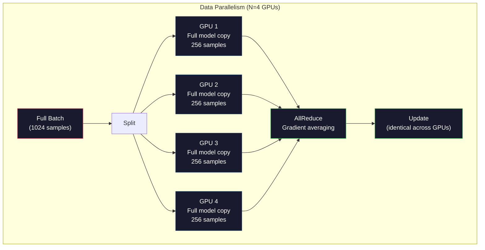
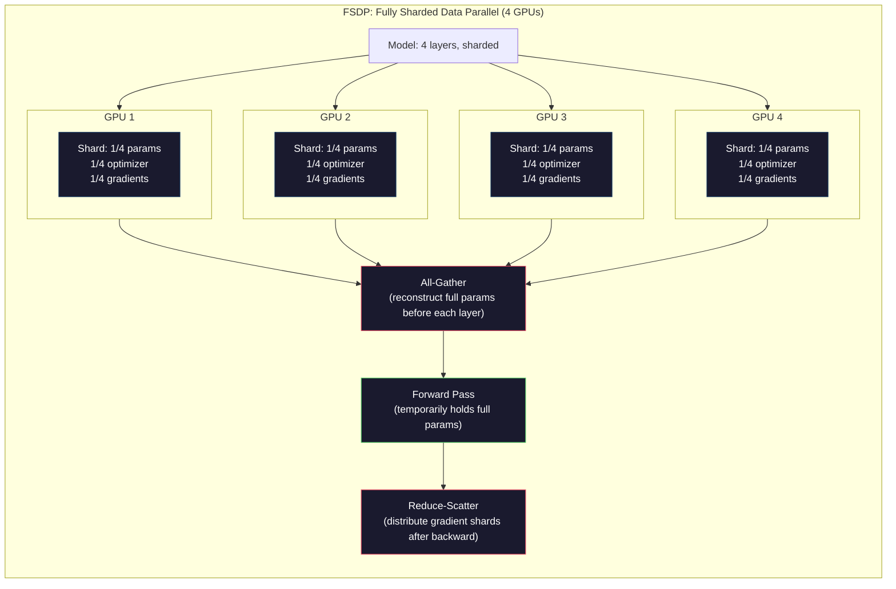
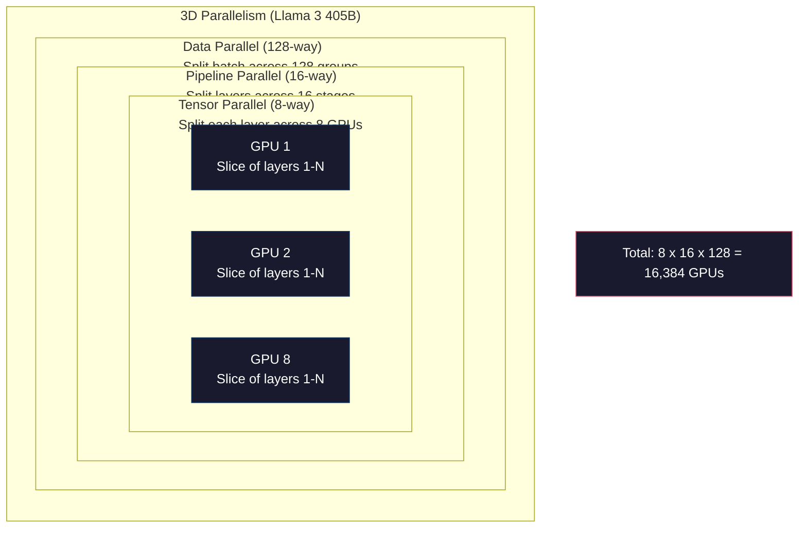

# Scaling: Distributed Training, FSDP, DeepSpeed

> Your 124M model trained on one GPU. Now try 7 billion parameters. The model doesn't fit in memory. Data takes weeks on a single machine. At scale, distributed training isn't optional. It's the only way.

**Type:** Build
**Languages:** Python
**Prerequisites:** Phase 10, Lesson 04 (Pre-training a Mini GPT)
**Time:** ~120 minutes

## Learning Objectives

- Explain three types of parallelism (data, tensor, pipeline) and when each becomes necessary given model and cluster size
- Implement data-parallel training with PyTorch DDP, synchronizing gradients across multiple GPUs
- Calculate memory budgets for a given model size (weights + optimizer states + gradients + activations) and determine minimum hardware requirements
- Configure FSDP or DeepSpeed ZeRO stages to shard model state across GPUs, fitting models that exceed single-GPU memory

## The Problem

A 7B parameter model in FP16 requires 14GB for weights alone. Adam optimizer stores two copies per parameter (first and second moment estimates). That's another 28GB. Gradients during backpropagation add 14GB. Before storing a single activation, you're at 56GB.

A single NVIDIA A100 has 80GB of memory.

56GB out of 80GB consumed. 24GB left for activations — the intermediate values computed during the forward pass that must be retained for backpropagation. For a 2048-token sequence with a 4096-dimensional model, a single layer's activations use approximately 64MB. With 32 layers, that's 2GB per sample. Batch size 8 needs 16GB. You have 24GB. Batch size 12 blows up.

Now try 70B parameters. Weights alone: 140GB in FP16. One GPU can't hold it. You need at least 2 A100s (2 × 80GB = 160GB) just for weights. Add optimizer states and gradients, and you need far more: minimum 3+ GPUs, realistically 8-16 depending on sharding strategy.

Llama 3 405B trained on 16,384 NVIDIA H100s. The compute cost of this training run is estimated at $100 million. DeepSeek V3 trained a comparable model for ~$5.6 million by being clever about architecture (Mixture of Experts means only a fraction of parameters activate per token) and training efficiency.

This lesson covers the four strategies that make large-scale training possible: data parallelism, tensor parallelism, pipeline parallelism, and fully sharded data parallelism. You'll simulate each in pure Python, understanding the mechanics before touching any distributed training framework.

## The Concept

### Why distribution is mandatory

Here's the memory accounting for real models. Every number is calculated, not estimated.

| Model | Params | Weights (FP16) | Adam States | Gradients (FP16) | Total (no activations) |
|-------|--------|----------------|-------------|------------------|----------------------|
| GPT-2 Small | 124M | 248 MB | 992 MB | 248 MB | 1.5 GB |
| Llama 3 8B | 8B | 16 GB | 64 GB | 16 GB | 96 GB |
| Llama 3 70B | 70B | 140 GB | 560 GB | 140 GB | 840 GB |
| Llama 3 405B | 405B | 810 GB | 3,240 GB | 810 GB | 4,860 GB |

The "Adam States" column is the killer. Adam stores a running mean (m) and running variance (v) for each parameter, both in FP32. For a 70B model, that's 70B × 4 bytes × 2 = 560GB. The optimizer alone needs seven A100s.

A single H100 has 80GB. Llama 3 405B needs at least 61 H100s just to hold weights, optimizer, and gradients. Activations push the number higher. Meta used 16,384 GPUs not because they wanted to — because they had to.

### Data parallelism

The simplest distributed strategy. Copy the entire model to N GPUs. Split each training batch into N equal shards. Each GPU runs forward and backward on its shard of data. After backward, average gradients across all GPUs. Each GPU updates its copy of the weights with the same averaged gradient, keeping all replicas in sync.

**Advantage:** Throughput scales linearly. N GPUs process N× the data per step. Communication is limited to gradient averaging, which can overlap with computation.

**Disadvantage:** Every GPU holds a full copy of the model, optimizer states, and gradients. For a 70B model, each GPU needs 840GB. Data parallelism doesn't reduce per-GPU memory at all. It only reduces training time.

**The math:** Effective batch size = per_gpu_batch_size × N. With N=64 GPUs and per-GPU batch 16, effective batch is 1,024. Llama 3 used an effective batch size of 16 million tokens per step.



### Tensor parallelism

Split individual layers across GPUs. A single matrix multiplication is distributed across GPUs, each computing part of the result.

Consider a weight matrix of shape (8192, 8192) in a feedforward layer. With 4-way tensor parallelism, each GPU holds an (8192, 2048) shard. Each GPU multiplies input by its shard, producing a partial result. These partial results are combined (via all-reduce or all-gather) into the full output.

**Advantage:** Reduces per-GPU model weight memory. A 70B model split across 8 GPUs means each GPU holds only ~8.75B parameters worth of weights.

**Disadvantage:** Requires fast inter-GPU communication after every layer. The all-reduce after each matmul adds latency. This works well on NVLink (900 GB/s between GPUs in the same node) but poorly across InfiniBand connections between nodes (400 Gb/s, ~50 GB/s). Tensor parallelism is almost always limited to within a single node (8 GPUs).

**Real-world use:** Megatron-LM pioneered tensor parallelism. Llama 3 405B uses 8-way tensor parallelism within each node.

### Pipeline parallelism

Split the model by layers. GPU 1 runs layers 1-8. GPU 2 runs layers 9-16. GPU 3 runs layers 17-24. GPU 4 runs layers 25-32. Data flows through the pipeline: GPU 1 computes its layers, sends activations to GPU 2, which computes its layers and sends to GPU 3, etc.

**Advantage:** Minimal inter-GPU communication — only activations at layer boundaries, which are small compared to gradients or weights. Works across nodes because bandwidth requirements are low.

**Disadvantage:** Pipeline bubbles. When GPU 4 is doing forward on micro-batch 1, GPUs 1, 2, 3 are idle (they've already done their forward part). During backward, the pattern reverses. With naive pipelining, GPU utilization is only 1/N for N pipeline stages.

**GPipe and PipeDream** solve bubbles by splitting batches into micro-batches. GPU 1 starts micro-batch 2 immediately after finishing forward on micro-batch 1. This overlaps computation across pipeline stages. With M micro-batches and N stages, bubble fraction drops to (N-1)/M. With M=16 micro-batches and N=4 stages, the bubble is 3/16 = 18.75% idle time.

### FSDP: Fully Sharded Data Parallelism

FSDP combines data parallelism's scalability with sharding's memory efficiency. Instead of each GPU holding a full copy of the model, each holds only 1/N of the parameters, gradients, and optimizer states.

Before a layer's forward pass, FSDP runs an **all-gather** to collect full parameters from all GPUs into each GPU's memory. After forward, each GPU discards the non-local parameters. During backward, all-gather runs again to reconstruct parameters for gradient computation. After backward, a **reduce-scatter** distributes gradient shards so each GPU stores only 1/N of the gradients.

**The math for a 70B model on 8 GPUs:**

| Component | Without FSDP | With FSDP |
|-----------|-------------|-----------|
| Weights (FP16) | 140 GB per GPU | 17.5 GB per GPU |
| Adam States (FP32) | 560 GB per GPU | 70 GB per GPU |
| Gradients (FP16) | 140 GB per GPU | 17.5 GB per GPU |
| **Total** | **840 GB per GPU** | **105 GB per GPU** |

Without FSDP, you can't fit a 70B model on a single 80GB GPU. With FSDP on 8 GPUs, each GPU uses 105GB — wait, that still doesn't fit. You need at least 16 GPUs to get per-GPU below 80GB, or combine FSDP with activation checkpointing (recomputing activations during backward instead of storing them).

Communication cost is higher than plain data parallelism because of the all-gather before each layer. But the memory savings make previously impossible training runs feasible.



### DeepSpeed ZeRO

DeepSpeed's ZeRO (Zero Redundancy Optimizer) is conceptually identical to FSDP but developed independently by Microsoft. It defines three stages, each sharding more aggressively:

| Stage | What's sharded | Memory savings | Communication |
|-------|--------|---------------|---------------|
| ZeRO-1 | Optimizer states only | ~4x reduction | Same as data parallelism |
| ZeRO-2 | + Gradients | ~8x reduction | Slightly more |
| ZeRO-3 | + Parameters | ~Nx reduction (N GPUs) | All-gather per layer |

ZeRO-3 is equivalent to FSDP. Different names, same mechanism. DeepSpeed proved the concept, then PyTorch added FSDP as a native implementation.

DeepSpeed also introduced ZeRO-Offload (offload optimizer states to CPU memory, which is cheaper and larger) and ZeRO-Infinity (offload to NVMe SSDs). These trade compute speed for memory capacity — offloaded operations are slower but free up GPU memory.

### Mixed precision training

Modern training uses multiple floating-point formats simultaneously:

- **Forward pass**: FP16 or BF16 (16-bit). Half the memory of FP32. 2x faster matmuls on tensor cores.
- **Master weights**: FP32 (32-bit). Maintained by the optimizer for numerical precision during weight updates.
- **Loss scaling**: Multiply loss by a large constant before backward to prevent FP16 gradients from underflowing to zero. Divide by the same constant before the optimizer step.

BF16 (Brain Float 16) has the same exponent range as FP32 (8 exponent bits) but lower precision (7 mantissa bits vs FP32's 23). It rarely needs loss scaling because it can represent the same range of values. FP16 has 5 exponent bits and 10 mantissa bits — it can represent fine-grained values but overflows/underflows at extreme magnitudes.

Google's TPUs natively use BF16. NVIDIA's A100 and H100 support both FP16 and BF16. The industry has largely moved to BF16 because it eliminates the loss scaling hassle.

**Memory comparison for a 7B model:**

| Precision | Weights | Optimizer | Gradients | Total |
|-----------|---------|-----------|-----------|-------|
| FP32 everywhere | 28 GB | 56 GB | 28 GB | 112 GB |
| Mixed (BF16 + FP32 master) | 14 GB | 56 GB | 14 GB | 84 GB |

Mixed precision saves 28GB on this model. Optimizer states stay in FP32 regardless — that's where most memory goes.

### Megatron-LM and 3D parallelism

Real large-scale training combines all three parallelism types:

- **Data parallelism** across node groups (scales batch size)
- **Tensor parallelism** within nodes (splits layers across 8 GPUs)
- **Pipeline parallelism** across nodes (splits layer groups across machines)

Llama 3 405B on 16,384 H100s:
- 8-way tensor parallelism within each node (8 GPUs per node)
- 16-way pipeline parallelism across nodes (16 pipeline stages)
- 128-way data parallelism across the remaining dimension (16,384 / 8 / 16 = 128)

This 3D decomposition (8 × 16 × 128 = 16,384) is how you scale to thousands of GPUs. Each GPU sees a different data shard (data parallel), holds a slice of each layer (tensor parallel), and computes a different group of layers (pipeline parallel).

DeepSeek V3 took a different path. Their Mixture of Experts architecture activates only 37B of 671B parameters per token. This means each GPU only needs to compute (and store activations for) the activated parameters. They trained on 2,048 H800 GPUs — less than 1/8 of Meta's GPU count — for $5.6 million vs Meta's estimated $100 million.



## Build It

### Step 1: Simulate data parallelism

Split a batch across simulated GPUs. Each GPU runs forward on its shard. Average the "gradients" (we simulate with loss values).

```python
import numpy as np

def simulate_data_parallelism(data, num_gpus, model_fn):
    batch_size = len(data)
    shard_size = batch_size // num_gpus
    remainder = batch_size % num_gpus

    gpu_losses = []
    gpu_gradients = []

    offset = 0
    for gpu_id in range(num_gpus):
        extra = 1 if gpu_id < remainder else 0
        shard = data[offset:offset + shard_size + extra]
        offset += shard_size + extra

        loss, grad = model_fn(shard)
        gpu_losses.append(loss)
        gpu_gradients.append(grad)

    avg_loss = np.mean(gpu_losses)
    avg_gradient = np.mean(gpu_gradients, axis=0)

    return avg_loss, avg_gradient
```

The all-reduce operation (gradient averaging) is the only communication in data parallelism. In practice, this uses NCCL on NVIDIA GPUs, which implements ring all-reduce: each GPU sends 1/N of its gradients to a neighbor and receives 1/N from another, and after N-1 steps every GPU has the full average. Total communication: 2 × gradient_size × (N-1)/N, approaching 2× gradient size for large N.

### Step 2: Simulate tensor parallelism

Split a weight matrix across GPUs. Each GPU computes a partial matrix multiplication. Combine results.

```python
def simulate_tensor_parallelism(input_data, weight_matrix, num_gpus):
    d_in, d_out = weight_matrix.shape
    assert d_out % num_gpus == 0, f"d_out {d_out} not divisible by num_gpus {num_gpus}"
    shard_size = d_out // num_gpus

    partial_results = []
    for gpu_id in range(num_gpus):
        start = gpu_id * shard_size
        end = start + shard_size
        weight_shard = weight_matrix[:, start:end]

        partial = input_data @ weight_shard
        partial_results.append(partial)

    full_output = np.concatenate(partial_results, axis=-1)

    direct_output = input_data @ weight_matrix
    error = np.abs(full_output - direct_output).max()

    return full_output, error
```

The error should be exactly zero (or machine epsilon). Tensor parallelism is mathematically exact — it produces the same result as computing the full matmul on a single GPU. The split is along the output dimension, so each GPU produces different column blocks that concatenate to reconstruct the full result.

For column-parallel linear layers (splitting output dimension), you concatenate. For row-parallel (splitting input dimension), you sum. In transformer FFNs, the first linear layer (expand) uses column parallel, the second (contract) uses row parallel. This avoids an all-reduce between the two layers.

### Step 3: Simulate pipeline parallelism

Split a model's layers across virtual GPUs. Show the bubble problem — early stages idle while later stages compute.

```python
def simulate_pipeline_parallelism(num_layers, num_stages, num_microbatches):
    layers_per_stage = num_layers // num_stages

    timeline = {}
    clock = 0

    for mb in range(num_microbatches):
        for stage in range(num_stages):
            start_time = max(
                timeline.get((stage, mb - 1, "fwd"), (0, 0))[1] if mb > 0 else 0,
                timeline.get((stage - 1, mb, "fwd"), (0, 0))[1] if stage > 0 else 0,
            )
            end_time = start_time + layers_per_stage
            timeline[(stage, mb, "fwd")] = (start_time, end_time)

    last_fwd_end = max(v[1] for v in timeline.values())

    for mb in range(num_microbatches - 1, -1, -1):
        for stage in range(num_stages - 1, -1, -1):
            deps = [last_fwd_end]
            if mb < num_microbatches - 1 and (stage, mb + 1, "bwd") in timeline:
                deps.append(timeline[(stage, mb + 1, "bwd")][1])
            if stage < num_stages - 1 and (stage + 1, mb, "bwd") in timeline:
                deps.append(timeline[(stage + 1, mb, "bwd")][1])
            start_time = max(deps)
            end_time = start_time + layers_per_stage
            timeline[(stage, mb, "bwd")] = (start_time, end_time)

    total_time = max(v[1] for v in timeline.values())
    compute_time = num_microbatches * num_stages * layers_per_stage * 2
    bubble_fraction = 1.0 - compute_time / (total_time * num_stages)

    return timeline, total_time, bubble_fraction
```

With 4 stages and 1 micro-batch, bubble fraction is 75% — three of four GPUs are idle at any moment. With 16 micro-batches, it drops to ~19%. The cost of eliminating bubbles is memory: you must store activations for all in-flight micro-batches simultaneously.

### Step 4: Memory calculator

Compute exact memory requirements for any model size.

```python
def memory_calculator(
    params_billions,
    precision_bytes=2,
    optimizer="adam",
    num_gpus=1,
    sharding="none",
    sequence_length=2048,
    batch_size_per_gpu=1,
    hidden_dim=None,
    num_layers=None,
):
    params = params_billions * 1e9

    weight_memory = params * precision_bytes

    if optimizer == "adam":
        optimizer_memory = params * 4 * 2
    elif optimizer == "sgd":
        optimizer_memory = params * 4
    else:
        optimizer_memory = 0

    gradient_memory = params * precision_bytes

    total_no_activation = weight_memory + optimizer_memory + gradient_memory

    if hidden_dim and num_layers:
        activation_per_layer = (
            sequence_length * batch_size_per_gpu * hidden_dim * precision_bytes * 4
        )
        activation_memory = activation_per_layer * num_layers
    else:
        activation_memory = params * precision_bytes * 0.5

    if sharding == "fsdp" or sharding == "zero3":
        weight_memory /= num_gpus
        optimizer_memory /= num_gpus
        gradient_memory /= num_gpus
    elif sharding == "zero2":
        optimizer_memory /= num_gpus
        gradient_memory /= num_gpus
    elif sharding == "zero1":
        optimizer_memory /= num_gpus

    per_gpu_total = weight_memory + optimizer_memory + gradient_memory + activation_memory

    return {
        "params_billions": params_billions,
        "weights_gb": weight_memory / 1e9,
        "optimizer_gb": optimizer_memory / 1e9,
        "gradients_gb": gradient_memory / 1e9,
        "activations_gb": activation_memory / 1e9,
        "per_gpu_total_gb": per_gpu_total / 1e9,
        "total_across_gpus_gb": per_gpu_total * num_gpus / 1e9,
        "fits_on_80gb": per_gpu_total / 1e9 <= 80,
        "num_gpus": num_gpus,
        "sharding": sharding,
    }
```

This calculator answers the question every ML engineer asks: "How many GPUs do I need?" Feed it your model size, see if it fits. Adjust sharding strategy until per-GPU total drops below 80GB.

### Step 5: Mixed precision simulation

Compare memory usage between FP32, FP16, and mixed precision training.

```python
def mixed_precision_comparison(params_billions):
    params = params_billions * 1e9

    fp32_weights = params * 4
    fp32_optimizer = params * 4 * 2
    fp32_gradients = params * 4
    fp32_total = fp32_weights + fp32_optimizer + fp32_gradients

    fp16_weights = params * 2
    fp16_master = params * 4
    fp16_optimizer = params * 4 * 2
    fp16_gradients = params * 2
    fp16_total = fp16_weights + fp16_master + fp16_optimizer + fp16_gradients

    mixed_weights = params * 2
    mixed_optimizer = params * 4 * 2
    mixed_gradients = params * 2
    mixed_total = mixed_weights + mixed_optimizer + mixed_gradients

    return {
        "fp32_total_gb": fp32_total / 1e9,
        "fp16_with_master_gb": fp16_total / 1e9,
        "mixed_bf16_gb": mixed_total / 1e9,
        "savings_vs_fp32": 1 - mixed_total / fp32_total,
    }
```

The biggest surprise for most people: mixed precision doesn't halve memory. Optimizer states (Adam's m and v) stay in FP32 regardless of precision. For a 7B model, FP32 training uses 112GB. Mixed precision uses 84GB. That's a 25% reduction, not 50%. The optimizer dominates.

## Use It

### Run all simulations

```python
def run_all_demos():
    print("=" * 70)
    print("DATA PARALLELISM SIMULATION")
    print("=" * 70)

    np.random.seed(42)
    data = np.random.randn(64, 32)
    weight = np.random.randn(32, 16)

    def model_fn(batch):
        output = batch @ weight
        loss = np.mean(output ** 2)
        grad = 2 * batch.T @ (batch @ weight) / len(batch)
        return loss, grad

    for n_gpus in [1, 2, 4, 8]:
        loss, grad = simulate_data_parallelism(data, n_gpus, model_fn)
        print(f"  {n_gpus} GPUs: loss={loss:.4f}, grad_norm={np.linalg.norm(grad):.4f}")

    print()
    print("=" * 70)
    print("TENSOR PARALLELISM SIMULATION")
    print("=" * 70)

    x = np.random.randn(4, 8192)
    W = np.random.randn(8192, 8192)

    for n_gpus in [1, 2, 4, 8]:
        output, error = simulate_tensor_parallelism(x, W, n_gpus)
        print(f"  {n_gpus} GPUs: output_shape={output.shape}, max_error={error:.2e}")

    print()
    print("=" * 70)
    print("PIPELINE PARALLELISM SIMULATION")
    print("=" * 70)

    for n_mb in [1, 4, 8, 16, 32]:
        _, total_t, bubble = simulate_pipeline_parallelism(32, 4, n_mb)
        print(f"  {n_mb:2d} micro-batches: total_time={total_t:4d}, bubble={bubble:.1%}")

    print()
    print("=" * 70)
    print("MEMORY CALCULATOR")
    print("=" * 70)

    configs = [
        (7, "none", 1),
        (7, "fsdp", 8),
        (70, "none", 1),
        (70, "fsdp", 8),
        (70, "fsdp", 16),
        (405, "fsdp", 64),
        (405, "fsdp", 128),
    ]

    print(f"  {'Model':>8} {'Sharding':>8} {'GPUs':>5} {'Per-GPU':>10} {'Fits 80GB':>10}")
    print("  " + "-" * 50)
    for params, shard, gpus in configs:
        result = memory_calculator(params, num_gpus=gpus, sharding=shard)
        fits = "Yes" if result["fits_on_80gb"] else "No"
        print(f"  {params:>6}B {shard:>8} {gpus:>5} {result['per_gpu_total_gb']:>8.1f}GB {fits:>10}")

    print()
    print("=" * 70)
    print("MIXED PRECISION COMPARISON")
    print("=" * 70)

    for params_b in [7, 13, 70, 405]:
        result = mixed_precision_comparison(params_b)
        print(f"  {params_b}B: FP32={result['fp32_total_gb']:.0f}GB, "
              f"Mixed BF16={result['mixed_bf16_gb']:.0f}GB, "
              f"Savings={result['savings_vs_fp32']:.0%}")
```

## Ship It

This lesson produces `outputs/prompt-distributed-training-planner.md` — a prompt that takes a model size and available hardware, then produces a complete distributed training plan: parallelism strategies, memory budgets, communication overhead, and expected throughput.

## Exercises

1. Modify the memory calculator to account for activation checkpointing. With checkpointing, activations are stored only every K layers (typical K=1, meaning full recomputation). Show the memory-compute tradeoff: how much memory does checkpointing save, and how much slower does it make training (~33% more compute for full checkpointing)?

2. Extend the pipeline parallelism simulation to implement PipeDream's 1F1B (one forward one backward) schedule. For 4 stages and 8 micro-batches, compare bubble fraction with the naive schedule. The 1F1B schedule should have lower peak memory because it starts backward earlier.

3. Implement a gradient accumulation simulator. Instead of all-reducing after every micro-batch, accumulate gradients locally for K steps, then all-reduce. Show how this reduces communication by K× but produces the exact same final gradients (and therefore identical training).

4. Build a cost estimator. Given model size, target token count, GPU type (A100 at $2/hr, H100 at $3.50/hr), and parallelism strategy, estimate total training cost in dollars. Validate against known costs: Llama 3 405B reportedly cost ~$100M, DeepSeek V3 cost ~$5.6M.

5. Add ZeRO-Offload to the memory calculator. Assume 512GB CPU memory per node and 2TB NVMe. Show how offloading optimizer states to CPU lets a 70B model train on 4 GPUs (instead of 16), at the cost of 30-50% slower optimizer steps.

## Key Terms

| Term | What people say | What it actually is |
|------|----------------|----------------------|
| Data parallelism | "copy the model to each GPU" | Each GPU processes a different data shard; gradients are averaged via all-reduce after each step |
| Tensor parallelism | "split a layer across GPUs" | Shard weight matrices so each GPU computes part of the matmul; requires fast NVLink interconnect |
| Pipeline parallelism | "split layers across GPUs" | Each GPU runs a different group of layers; data flows through in micro-batches to reduce bubbles |
| FSDP | "shard everything" | Fully Sharded Data Parallel — each GPU holds 1/N of weights, gradients, and optimizer states; all-gather before compute |
| ZeRO | "DeepSpeed's version of FSDP" | Zero Redundancy Optimizer with three stages: shard optimizer (stage 1), + gradients (stage 2), + parameters (stage 3) |
| All-reduce | "average across GPUs" | A collective operation where each GPU ends up with the sum (or mean) of all GPUs' inputs — typically ring all-reduce |
| All-gather | "collect from all GPUs" | A collective operation where each GPU ends up with the concatenation of all GPUs' data — used in FSDP to reconstruct full parameters |
| Reduce-scatter | "sum and distribute" | A collective operation that reduces (sums) data and scatters different chunks to different GPUs — used in FSDP for gradient sharding |
| Mixed precision | "train in half precision" | Forward/backward in FP16/BF16, optimizer states in FP32 — saves ~25% memory not 50%, because the optimizer dominates |
| Pipeline bubble | "idle time in the pipeline" | Fraction of time GPUs sit idle waiting for data from previous stages — reduced with more micro-batches |

## Further Reading

- [Rajbhandari et al., 2020 -- "ZeRO: Memory Optimizations Toward Training Trillion Parameter Models"](https://arxiv.org/abs/1910.02054) -- The DeepSpeed ZeRO paper that defined three stages of sharding
- [Shoeybi et al., 2020 -- "Megatron-LM: Training Multi-Billion Parameter Language Models Using Model Parallelism"](https://arxiv.org/abs/1909.08053) -- NVIDIA's tensor parallelism for transformers
- [Narayanan et al., 2021 -- "Efficient Large-Scale Language Model Training on GPU Clusters Using Megatron-LM"](https://arxiv.org/abs/2104.04473) -- 3D parallelism combining data, tensor, and pipeline
- [Zhao et al., 2023 -- "PyTorch FSDP: Experiences on Scaling Fully Sharded Data Parallel"](https://arxiv.org/abs/2304.11277) -- PyTorch's native FSDP implementation
- [Llama 3 Technical Report](https://arxiv.org/abs/2407.21783) -- 3D parallelism details for 16,384 GPU training
- [DeepSeek-V3 Technical Report](https://arxiv.org/abs/2412.19437) -- How MoE architecture reduces training cost by an order of magnitude
