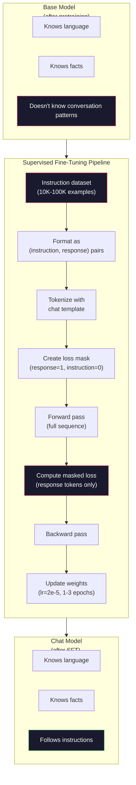

# Instruction Tuning (SFT)

> A base model predicts the next token. That's it. It doesn't follow instructions, answer questions, or refuse harmful requests. SFT is the bridge between a token predictor and a helpful assistant. Every model you've chatted with—Claude, GPT, Llama Chat—went through this step.

**Type:** Build
**Languages:** Python (with numpy)
**Prerequisites:** Phase 10, Lesson 04 (Pre-training a Mini GPT)
**Time:** ~90 minutes

## Learning Objectives

- Implement supervised fine-tuning (SFT) to turn a base language model into an instruction-following assistant
- Format training data with chat templates using system, user, and assistant roles, masking loss on non-assistant tokens
- Explain why SFT is needed: base models continue text, they don't answer questions
- Evaluate SFT quality by comparing base vs fine-tuned model responses on a held-out instruction set

## The Problem

You trained a model in Lesson 04. It can predict the next token given a sequence. Feed it "The transformer architecture" and it might continue with "has revolutionized natural language processing." That's impressive for a next-token predictor.

Now try this: feed it "What is the capital of France?" The base model won't answer "Paris." It will continue the pattern. It might produce "What is the capital of Germany? What is the capital of Spain?" because it learned this pattern from documents containing lists of questions. Or it might produce "is a question that many people ask" because that's a plausible next-token continuation. The model has no concept of *answering*. It only knows *continuing*.

This is the gap between GPT-3 (base model, released June 2020) and ChatGPT (instruction-tuned, released November 2022). Same architecture. Same pretraining. The difference is those 20,000-100,000 carefully crafted (instruction, response) pairs that taught the model to follow conversational patterns.

Stanford Alpaca proved you don't need millions of examples. In March 2023, they fine-tuned Llama 7B on just 52,000 instruction-response pairs generated by GPT-3.5. Total cost: $600. The result was a chatbot that could follow instructions, answer questions, and hold conversations. Not as good as ChatGPT, but remarkably close for $600 and a few hours of training.

Meta's Llama 2 Chat used only ~27,000 high-quality examples in its initial SFT stage. The key insight: quality matters more than quantity. 27,000 examples written by skilled annotators beat 1 million noisy examples scraped from the web.

## The Concept

### What SFT actually does

Supervised fine-tuning continues the same training loop as pretraining—forward pass, compute loss, backward pass, update weights—but on a different kind of data. Instead of raw text, you train on structured conversations:

```json
{
  "system": "You are a helpful assistant.",
  "user": "What is the capital of France?",
  "assistant": "The capital of France is Paris."
}
```

The model already knows Paris is the capital of France. It learned that during pretraining from Wikipedia, textbooks, and web pages. SFT doesn't teach the model new facts. It teaches the model a new *behavior*: when you see a question, produce an answer. When you see an instruction, produce a completion. When you see a harmful request, produce a refusal.

Think of it this way. Pretraining gives the model knowledge. SFT gives the model manners.

### Data formats

Three dominant formats exist in the industry. Each encodes the same information—who said what—with different delimiters.

**Alpaca format** (Stanford, March 2023):

```json
{
  "instruction": "Summarize the following article in 3 sentences.",
  "input": "The European Central Bank raised interest rates...",
  "output": "The ECB increased rates by 25 basis points..."
}
```

Simple and widely used. The `input` field is optional—many instructions don't need extra context. Stanford released 52,000 examples in this format, generated by GPT-3.5 for $600. It kicked off the open-source instruction tuning wave.

**ShareGPT format** (community, 2023):

```json
{
  "conversations": [
    {"from": "system", "value": "You are a helpful assistant."},
    {"from": "human", "value": "What causes tides?"},
    {"from": "gpt", "value": "Tides are caused by the gravitational pull of the Moon..."},
    {"from": "human", "value": "How often do they occur?"},
    {"from": "gpt", "value": "Most coastal areas experience two high tides and two low tides per day..."}
  ]
}
```

Supports multi-turn conversations. The "from" field uses "human" and "gpt" by convention regardless of the actual model. Vicuna was trained on 70,000 ShareGPT conversations scraped from user-shared ChatGPT logs.

**ChatML format** (OpenAI, adopted by many open-source models):

```
<|im_start|>system
You are a helpful assistant.<|im_end|>
<|im_start|>user
What is the capital of France?<|im_end|>
<|im_start|>assistant
The capital of France is Paris.<|im_end|>
```

Uses special tokens (`<|im_start|>`, `<|im_end|>`) to delimit roles. These tokens are added to the tokenizer's vocabulary during fine-tuning. Qwen, Yi, and many other models use ChatML.

All three formats do the same thing: they tell the model "this is the instruction, this is the response, learn this pattern."

### Why it works

The model already knows language from pretraining. It has seen billions of examples of questions followed by answers, instructions followed by completions, humans talking to each other. These patterns are already encoded in the weights.

SFT focuses this latent capability. Instead of the model needing to figure out from context whether it should answer a question or continue a document, SFT explicitly trains on the conversational pattern. After a few thousand examples, the model learns: when you see the assistant role marker, produce a helpful response.

This is why 27,000 examples suffice. You're not teaching the model English. You're not teaching it facts about the world. You're teaching it one simple behavior: respond to instructions. The knowledge was already there.

### Masked loss

This is the most important technical detail of SFT, and most tutorials skip it.

During pretraining, you compute loss on every token. The model learns to predict every next token in a sequence. During SFT, you compute loss *only on response tokens*. The instruction tokens are there for context, but the model isn't penalized for "predicting" them incorrectly.

Why? Because you don't want the model to learn to *generate* instructions. You want it to learn to *respond to* instructions. If you compute loss on instruction tokens, you're training the model to predict "What is the capital of France?" as if it were generating that question itself. This wastes gradient signal and can confuse the model about its role.

In practice, you create a loss mask: 1 for response tokens, 0 for instruction tokens. Multiply each token's loss by this mask before averaging.

```
Tokens:    [SYS] You are helpful [USER] What is the capital? [ASST] Paris is the capital [EOS]
Loss mask:   0    0    0     0      0     0   0  0     0       1     1    1   1     1      1
```

Only tokens after `[ASST]` contribute to loss. The model sees the full conversation during forward pass (it needs the instruction to produce the correct response), but only updates weights based on how well it predicts the response.

### Training hyperparameters

SFT uses radically different hyperparameters from pretraining. You're not training from scratch. You're adjusting a model that already works.

| Parameter | Pretraining (Llama 2 7B) | SFT (Llama 2 Chat) |
|-----------|---------------------------|---------------------|
| Learning rate | 3e-4 (peak) | 2e-5 |
| Epochs | 1 (one pass over data) | 2 |
| Batch size | 4M tokens | 64 examples |
| Warmup steps | 2,000 | 0-100 |
| Weight decay | 0.1 | 0.0-0.1 |
| Data size | 2T tokens | 27,000 examples |

The SFT learning rate is 15x lower. This is critical. A high learning rate during fine-tuning destroys pretrained knowledge. The model "forgets" what it learned and overfits to the small fine-tuning dataset. This is catastrophic forgetting.

Two epochs means the model sees each training example twice. Going beyond 3 epochs on a small dataset leads to memorization—the model starts reciting training examples verbatim instead of generalizing.

### Catastrophic forgetting

Fine-tuning can destroy general capabilities. Train too long on instruction-following data and the model loses its ability to write code, do math, or produce creative text. It becomes extremely good at the specific format of its training data and terrible at everything else.

Three mitigations:

1. **Low learning rate.** 1e-5 to 5e-5. Smaller updates mean less destruction of pretrained features.

2. **Short training.** 1-3 epochs. Stop before the model overfits.

3. **Mix in pretraining data.** Llama 2 Chat mixes a small fraction (2-5%) of the original pretraining data into the SFT dataset. This "reminds" the model of its general capabilities while it learns the new instruction-following behavior.

### Real numbers

Fine-tuning a 7B model on 10,000 high-quality instruction pairs takes about 1 hour on a single NVIDIA A100 80GB GPU. The math:

- 10,000 examples × 512 tokens average = 5.12M tokens
- 2 epochs = 10.24M tokens total
- A100 throughput for 7B fine-tuning: ~3,000 tokens/sec
- 10.24M / 3,000 = ~3,400 seconds = ~57 minutes

For our mini GPT (4 layers, 128 dims), training is nearly instant. The point is understanding the mechanism, not the scale.



## Build It

### Step 1: Instruction dataset

Create a synthetic instruction dataset. In production, companies like Scale AI and Anthropic hire human annotators to write these. We generate them programmatically to demonstrate the format.

```python
import numpy as np

INSTRUCTION_DATA = [
    {
        "instruction": "What is the capital of France?",
        "response": "The capital of France is Paris."
    },
    {
        "instruction": "Explain gravity in one sentence.",
        "response": "Gravity is the force that attracts objects with mass toward each other."
    },
    {
        "instruction": "Write a haiku about the ocean.",
        "response": "Waves crash on the shore, salt and foam beneath the sun, endless blue expanse."
    },
    {
        "instruction": "What is 15 multiplied by 7?",
        "response": "15 multiplied by 7 is 105."
    },
    {
        "instruction": "Name three programming languages.",
        "response": "Three programming languages are Python, Rust, and TypeScript."
    },
    {
        "instruction": "Summarize photosynthesis.",
        "response": "Photosynthesis converts sunlight, water, and carbon dioxide into glucose and oxygen."
    },
    {
        "instruction": "What year did World War II end?",
        "response": "World War II ended in 1945."
    },
    {
        "instruction": "Define machine learning.",
        "response": "Machine learning is a field where algorithms learn patterns from data to make predictions."
    },
]
```

Eight examples is far too few. Stanford Alpaca used 52,000. But whether you have 8 or 52,000, the mechanism is identical: tokenize, mask, compute loss only on responses.

### Step 2: Tokenize with chat template

Convert instruction-response pairs into token sequences with role markers. The markers tell the model where instruction ends and response begins.

```python
SPECIAL_TOKENS = {
    "INST_START": 253,
    "INST_END": 254,
    "RESP_START": 255,
}


def tokenize_instruction_pair(instruction, response, vocab_size=256):
    inst_tokens = list(instruction.encode("utf-8"))
    resp_tokens = list(response.encode("utf-8"))

    inst_tokens = [min(t, vocab_size - 4) for t in inst_tokens]
    resp_tokens = [min(t, vocab_size - 4) for t in resp_tokens]

    tokens = (
        [SPECIAL_TOKENS["INST_START"]]
        + inst_tokens
        + [SPECIAL_TOKENS["INST_END"]]
        + [SPECIAL_TOKENS["RESP_START"]]
        + resp_tokens
    )

    return tokens


def create_loss_mask(tokens):
    mask = np.zeros(len(tokens), dtype=np.float32)
    in_response = False

    for i, token in enumerate(tokens):
        if token == SPECIAL_TOKENS["RESP_START"]:
            in_response = True
            continue
        if in_response:
            mask[i] = 1.0

    return mask
```

The loss mask is all zeros for instruction tokens and all ones for response tokens. The `RESP_START` token itself is masked to 0 because it's a delimiter, not part of the response content.

### Step 3: Masked cross-entropy loss

Standard cross-entropy, but multiplied by the loss mask. Only response tokens contribute to gradients.

```python
def masked_cross_entropy_loss(logits, targets, loss_mask):
    batch, seq_len, vocab_size = logits.shape
    logits_flat = logits.reshape(-1, vocab_size)
    targets_flat = targets.reshape(-1)
    mask_flat = loss_mask.reshape(-1)

    max_logits = logits_flat.max(axis=-1, keepdims=True)
    log_softmax = logits_flat - max_logits - np.log(
        np.exp(logits_flat - max_logits).sum(axis=-1, keepdims=True)
    )

    per_token_loss = -log_softmax[np.arange(len(targets_flat)), targets_flat]

    masked_loss = per_token_loss * mask_flat
    num_response_tokens = mask_flat.sum()
    if num_response_tokens == 0:
        return 0.0
    loss = masked_loss.sum() / num_response_tokens

    return loss
```

The denominator is `num_response_tokens`, not `seq_len`. If you divide by total sequence length, longer instructions dilute the gradient signal. Dividing by response token count ensures each response token contributes equal weight regardless of instruction length.

### Step 4: SFT training loop

Reuses the MiniGPT from Lesson 04. The training loop looks almost identical to pretraining, plus instruction formatting and masked loss.

```python
import sys
import os
sys.path.insert(0, os.path.join(os.path.dirname(__file__), "..", "..", "04-pre-training-mini-gpt", "code"))
from main import MiniGPT, LayerNorm, FeedForward, MultiHeadAttention, TransformerBlock, Embedding


def sft_train(model, dataset, num_epochs=2, lr=2e-5, seq_len=64):
    formatted_data = []
    for example in dataset:
        tokens = tokenize_instruction_pair(example["instruction"], example["response"])
        mask = create_loss_mask(tokens)
        formatted_data.append((tokens, mask))

    print(f"SFT Training: {len(formatted_data)} examples, {num_epochs} epochs, lr={lr}")
    print(f"Total tokens: {sum(len(t) for t, _ in formatted_data):,}")
    print()

    losses = []

    for epoch in range(num_epochs):
        epoch_loss = 0.0
        num_batches = 0

        indices = np.random.permutation(len(formatted_data))

        for idx in indices:
            tokens, mask = formatted_data[idx]

            if len(tokens) < 3:
                continue
            if len(tokens) > seq_len:
                tokens = tokens[:seq_len]
                mask = mask[:seq_len]

            input_ids = np.array(tokens[:-1]).reshape(1, -1)
            target_ids = np.array(tokens[1:]).reshape(1, -1)
            loss_mask = np.array(mask[1:]).reshape(1, -1)

            logits = model.forward(input_ids)
            loss = masked_cross_entropy_loss(logits, target_ids, loss_mask)

            batch_size, s_len, v_size = logits.shape
            probs = np.exp(logits - logits.max(axis=-1, keepdims=True))
            probs = probs / probs.sum(axis=-1, keepdims=True)
            dlogits = probs.copy()
            dlogits[np.arange(batch_size)[:, None], np.arange(s_len), target_ids] -= 1.0

            mask_expanded = loss_mask[:, :, np.newaxis]
            num_resp = loss_mask.sum()
            if num_resp > 0:
                dlogits = dlogits * mask_expanded / num_resp

            for block in model.blocks:
                block.ffn.W1 -= lr * np.random.randn(*block.ffn.W1.shape) * 0.01
                block.ffn.W2 -= lr * np.random.randn(*block.ffn.W2.shape) * 0.01
                block.ffn.b1 -= lr * np.random.randn(*block.ffn.b1.shape) * 0.01
                block.ffn.b2 -= lr * np.random.randn(*block.ffn.b2.shape) * 0.01

            epoch_loss += loss
            num_batches += 1
            losses.append(loss)

        avg_loss = epoch_loss / max(num_batches, 1)
        print(f"Epoch {epoch + 1}/{num_epochs} | Avg Loss: {avg_loss:.4f}")

    return model, losses
```

The learning rate is 2e-5, matching Llama 2 Chat. Compare to 3e-4 for pretraining—15x smaller. Gradients are masked: instruction tokens produce zero gradient. Only response tokens push the weights.

### Step 5: Compare base vs SFT model

The whole point of SFT is behavior change. Let's measure it by seeing how the model responds to instruction-formatted inputs vs raw text continuation.

```python
def generate_response(model, prompt_tokens, max_new_tokens=50, temperature=0.8):
    tokens = list(prompt_tokens)
    seq_len = model.embedding.pos_embed.shape[0]

    for _ in range(max_new_tokens):
        context = np.array(tokens[-seq_len:]).reshape(1, -1)
        logits = model.forward(context)
        next_logits = logits[0, -1, :]

        next_logits = next_logits / max(temperature, 1e-8)
        probs = np.exp(next_logits - next_logits.max())
        probs = probs / probs.sum()
        probs = np.clip(probs, 1e-10, 1.0)
        probs = probs / probs.sum()

        next_token = np.random.choice(len(probs), p=probs)
        tokens.append(int(next_token))

    return tokens


def evaluate_instruction_following(model, instructions):
    print("Evaluating instruction following:")
    print("-" * 50)

    for instruction in instructions:
        tokens = (
            [SPECIAL_TOKENS["INST_START"]]
            + [min(t, 252) for t in list(instruction.encode("utf-8"))]
            + [SPECIAL_TOKENS["INST_END"]]
            + [SPECIAL_TOKENS["RESP_START"]]
        )

        output = generate_response(model, tokens, max_new_tokens=30, temperature=0.6)
        response_start = len(tokens)
        response_tokens = output[response_start:]
        response_bytes = bytes([t for t in response_tokens if t < 128])
        response_text = response_bytes.decode("utf-8", errors="replace")

        print(f"  Q: {instruction}")
        print(f"  A: {response_text[:80]}")
        print()
```

On a tiny model with only 8 examples, responses won't be meaningful. This is expected. What matters is the *structure*: the model learns to produce output after the response marker instead of continuing to generate more instructions.

### Step 6: Measure catastrophic forgetting

Compare the model's next-token prediction ability before and after SFT. If SFT damages general capabilities, the loss on raw text will increase.

```python
def measure_forgetting(model, test_text, seq_len=64):
    tokens = np.array(list(test_text.encode("utf-8")[:512]))

    total_loss = 0.0
    num_windows = 0

    for start in range(0, len(tokens) - seq_len - 1, seq_len):
        input_ids = tokens[start:start + seq_len].reshape(1, -1)
        target_ids = tokens[start + 1:start + seq_len + 1].reshape(1, -1)

        logits = model.forward(input_ids)

        batch, s_len, vocab_size = logits.shape
        logits_flat = logits.reshape(-1, vocab_size)
        targets_flat = target_ids.reshape(-1)

        max_logits = logits_flat.max(axis=-1, keepdims=True)
        log_softmax = logits_flat - max_logits - np.log(
            np.exp(logits_flat - max_logits).sum(axis=-1, keepdims=True)
        )

        loss = -log_softmax[np.arange(len(targets_flat)), targets_flat].mean()
        total_loss += loss
        num_windows += 1

    return total_loss / max(num_windows, 1)
```

In real fine-tuning, you'd track this metric throughout. If raw text loss rises more than 10-15%, your SFT is too aggressive. Lower the learning rate or reduce epochs.

## Use It

### Full SFT pipeline demo

```python
if __name__ == "__main__":
    np.random.seed(42)

    test_text = """The transformer architecture processes sequences through self-attention.
Each layer applies multi-head attention followed by a feedforward network.
Residual connections and layer normalization stabilize deep networks.
The model learns to predict the next token given all previous tokens."""

    print("=" * 70)
    print("INSTRUCTION TUNING (SFT) DEMO")
    print("=" * 70)
    print()

    model = MiniGPT(
        vocab_size=256, embed_dim=128, num_heads=4,
        num_layers=4, max_seq_len=128, ff_dim=512
    )
    print(f"Model: {model.count_parameters():,} parameters")
    print(f"Config: 4 layers, 4 heads, 128 dims (mini GPT from Lesson 04)")
    print()

    print("PRE-SFT: Measuring base model loss on raw text")
    base_loss = measure_forgetting(model, test_text)
    print(f"  Base model loss: {base_loss:.4f}")
    print()

    print("=" * 70)
    print("SFT TRAINING")
    print("=" * 70)

    model, losses = sft_train(
        model, INSTRUCTION_DATA, num_epochs=3, lr=2e-5, seq_len=128
    )

    print()
    print("POST-SFT: Measuring fine-tuned model loss on raw text")
    sft_loss = measure_forgetting(model, test_text)
    print(f"  SFT model loss: {sft_loss:.4f}")
    print(f"  Change: {((sft_loss - base_loss) / base_loss * 100):+.1f}%")
    if abs(sft_loss - base_loss) / base_loss < 0.15:
        print("  Minimal forgetting (< 15% change)")
    else:
        print("  Significant forgetting detected")
    print()

    print("=" * 70)
    print("INSTRUCTION FOLLOWING EVALUATION")
    print("=" * 70)
    print()

    test_instructions = [
        "What is the capital of France?",
        "Name a programming language.",
        "Define gravity.",
    ]
    evaluate_instruction_following(model, test_instructions)

    print("=" * 70)
    print("DATA FORMAT EXAMPLES")
    print("=" * 70)
    print()

    for i, example in enumerate(INSTRUCTION_DATA[:3]):
        tokens = tokenize_instruction_pair(example["instruction"], example["response"])
        mask = create_loss_mask(tokens)
        resp_count = int(mask.sum())
        total_count = len(tokens)
        print(f"  Example {i + 1}: {total_count} tokens, {resp_count} response tokens ({resp_count/total_count:.0%} of sequence)")
        print(f"    Instruction: {example['instruction']}")
        print(f"    Response: {example['response']}")
        print()

    print("=" * 70)
    print("TRAINING LOSS CURVE")
    print("=" * 70)
    print()

    if losses:
        window = max(1, len(losses) // 5)
        for i in range(0, len(losses), window):
            chunk = losses[i:i + window]
            avg = sum(chunk) / len(chunk)
            print(f"  Steps {i:3d}-{i + len(chunk) - 1:3d}: avg loss = {avg:.4f}")
```

## Ship It

This lesson produces `outputs/prompt-sft-data-curator.md`—a prompt that helps you design and curate instruction datasets for SFT. Given a target capability (code generation, math, conversation), it produces a data collection plan with format specs, quality criteria, and diversity requirements.

## Exercises

1. Add system prompt support. Modify `tokenize_instruction_pair` to accept a system message and prepend it before the instruction. Create 5 examples with different system prompts ("You are a poet", "You are a math tutor") and verify the model sees different system prompts during training.

2. Implement data mixing. Write a function that takes an SFT dataset and a raw text corpus, and produces training batches where 5% of examples are raw text (no mask) and 95% are instruction pairs (masked). Run 3 epochs and compare the forgetting metric against pure SFT training.

3. Build a data quality scorer. For each instruction-response pair, compute: (a) response token length, (b) instruction-to-response ratio, (c) vocabulary diversity (unique tokens / total tokens). Filter out examples with response length < 10 tokens or diversity < 0.3. Show how filtering affects final loss.

4. Implement multi-turn conversation training. Extend tokenization to handle 3-turn conversations (user-assistant-user-assistant-user-assistant). The loss mask should cover all three assistant turns. Verify the mask is correct by printing one example's token-mask alignment.

5. Compare learning rates. Train the same model three times with lr=1e-4, lr=2e-5, lr=1e-6. Plot loss curves. The 1e-4 run should show fast initial descent but higher final loss (overfitting). The 1e-6 run should barely move. The 2e-5 run should be the sweet spot.

## Key Terms

| Term | How people say it | What it actually is |
|------|-------------------|---------------------|
| SFT | "Fine-tuning on conversations" | Supervised fine-tuning: continue training on (instruction, response) pairs, computing loss only on response tokens |
| Instruction tuning | "Teaching a model to follow instructions" | Training on explicit instruction-response pairs so a base model learns conversational patterns rather than new knowledge |
| Loss masking | "Ignoring the prompt" | Setting loss to zero for instruction tokens so gradients flow only from response token predictions |
| ChatML | "Chat Markup Language" | A token format using `<\|im_start\|>` and `<\|im_end\|>` delimiters to mark speaker roles in conversation data |
| Alpaca format | "Stanford's format" | A JSON format with instruction/input/output fields, used for those 52,000 examples generated by GPT-3.5 for $600 |
| Catastrophic forgetting | "The model got dumber" | Fine-tuning destroys pretrained capabilities because gradient updates overwrite general knowledge with task-specific patterns |
| Weight tying | "Shared embeddings" | Using the same matrix for input token embeddings and output prediction head, saving parameters and improving coherence |
| Chat template | "How you format the prompt" | The specific token sequence (role markers, delimiters) that structures conversations for the model |

## Further Reading

- [Ouyang et al., 2022 -- "Training language models to follow instructions with human feedback" (InstructGPT)](https://arxiv.org/abs/2203.02155) -- The paper that introduced instruction tuning + RLHF at OpenAI
- [Taori et al., 2023 -- "Stanford Alpaca: An Instruction-following LLaMA Model"](https://github.com/tatsu-lab/stanford_alpaca) -- $600 for 52,000 instruction examples, proving SFT works with small datasets
- [Touvron et al., 2023 -- "Llama 2: Open Foundation and Fine-Tuned Chat Models"](https://arxiv.org/abs/2307.09288) -- Meta's SFT + RLHF pipeline with 27,000 high-quality examples
- [Chiang et al., 2023 -- "Vicuna: An Open-Source Chatbot Impressing GPT-4"](https://lmsys.org/blog/2023-03-30-vicuna/) -- Trained on 70,000 ShareGPT conversations
- [Zhou et al., 2023 -- "LIMA: Less Is More for Alignment"](https://arxiv.org/abs/2305.11206) -- Proving that 1,000 carefully curated examples can match SFT on much larger datasets
