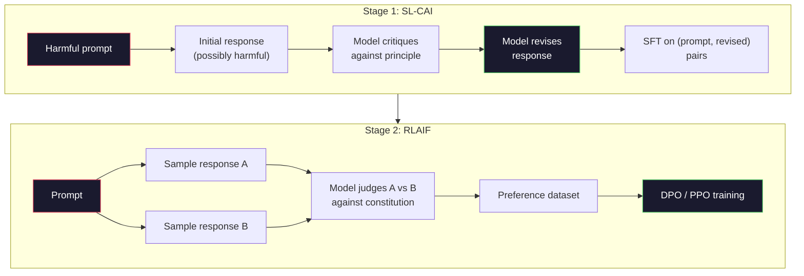
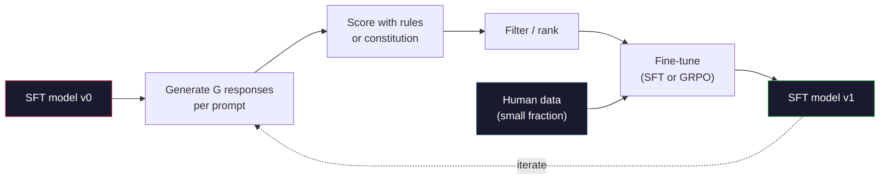

# Constitutional AI and Self-Improvement

> RLHF needs humans in the loop. Constitutional AI replaces most of them with the model itself. Write a list of principles, let the model critique its own outputs against those principles, and train on the critiques. DeepSeek-R1 pushed this further in 2025: let the model generate millions of reasoning traces, score them with a single rule, and run GRPO on the results. By 2026, most "alignment work" in frontier models is models aligning themselves. This lesson builds both loops.

**Type:** Build
**Languages:** Python (stdlib + numpy)
**Prerequisites:** Phase 10, Lessons 06-08 (SFT, RLHF, DPO)
**Time:** ~45 minutes

## Learning Objectives

- Implement Constitutional AI's two-stage loop: self-critique plus self-revision, then preference training on the revised pairs
- Derive the GRPO objective (DeepSeek-R1's group-relative policy optimization) and contrast it with PPO's value-function baseline
- Generate verifiable reasoning traces with rule-based outcome rewards and score them without a separate reward model
- Identify when self-improvement beats human preference data and when it collapses into mode seeking

## The Problem

You built RLHF in Lesson 07 and DPO in Lesson 08. Both depend on the same expensive input: human preference pairs. Anthropic's InstructGPT-era pipeline used about 33,000 comparisons. Llama 2 Chat used over 1.5 million. Claude 3 used more. This data is slow, expensive, and biased toward whatever the annotators happened to believe on the day they were scoring.

The 2022 Constitutional AI paper asked a simple question. What if the model generated the preference labels itself? Give it a written list of principles—the "constitution"—and let it critique its own responses. The critiques become the training signal.

In 2024, DeepSeek pushed this idea further. They showed that for any task with a verifiable outcome (math with known answers, code that either passes tests or doesn't, games that are won or lost), you can skip the critic entirely. Generate many candidate solutions. Score each with a single deterministic rule. Run a policy gradient algorithm on the rewards. DeepSeek-R1 was trained this way, using almost no human preference data, yet matching o1-level reasoning performance.

These two loops—Constitutional AI for subjective behavior, rule-based RL for verifiable behavior—are the dominant alignment recipe by 2026. The human preference budget that used to go into RLHF now goes into a much smaller step: choosing the constitution and choosing the reward rules.

## The Concept

### The Constitutional AI Loop

Bai et al. (2022) split the pipeline into two stages.

**Stage 1: Supervised learning from AI feedback (SL-CAI).** Start with a helpful but potentially harmful SFT model. Prompt it with potentially harmful requests. For each response, have *the same model* critique its response against a constitutional principle, then revise. Fine-tune on the revised responses. The dataset is (prompt, revised_response) pairs.

**Stage 2: Reinforcement learning from AI feedback (RLAIF).** Sample paired responses. Ask the model which better follows the constitution. The pairwise preferences train a reward model. Then run PPO or DPO on the model with that reward. The key difference from RLHF: the preferences come from the model, not from humans.



The constitution is the lever. Anthropic's original had 16 principles (later expanded). A principle reads like "Please choose the response that is least likely to be offensive to anyone from any cultural background." You pick one principle for each step, sometimes randomly, sometimes based on prompt category.

### What the Constitution Actually Does

The constitution moves the alignment contract from *data* to *text*. Under RLHF, changing behavior means re-labeling thousands of pairs. Under CAI, changing behavior means editing a paragraph. That's the main practical gain.

It has a cost. The model's self-judgment is only as good as its starting calibration. If the SFT model has blind spots—say it can't recognize manipulative framing—the critique step inherits those blind spots. CAI compresses the alignment loop but can't amplify signal beyond the base model's ceiling. That's why every production CAI pipeline still uses some human preference data, typically 5-10% of pure RLHF volume.

### GRPO: Group-Relative Policy Optimization

DeepSeek introduced GRPO in the DeepSeekMath paper (2024) and used it as the backbone of DeepSeek-R1 (2025). GRPO is a PPO variant that removes the value function.

Recall PPO's objective (from Lesson 07):

```
L_PPO = E[min(r(theta) * A, clip(r(theta), 1-eps, 1+eps) * A)]
```

where `A` is the advantage, typically estimated with GAE using a learned value network `V(s)`. The value network is a second model as large as the policy. It doubles memory and introduces its own training loop.

GRPO throws the value function away. For each prompt, it samples a group of G responses (typically G=16 or 64). It computes the reward for each response, then normalizes within the group:

```
A_i = (r_i - mean(r_1, ..., r_G)) / std(r_1, ..., r_G)
```

The advantage is the z-score of this response's reward relative to its siblings. No value function. The group itself is the baseline.

```
L_GRPO = E[min(r(theta) * A_group, clip(r(theta), 1-eps, 1+eps) * A_group)] - beta * KL(pi || pi_ref)
```

The KL penalty against the reference model remains, same as PPO. The clipping ratio remains. What vanishes is the separate critic. 

### Why GRPO Matters for Reasoning

For reasoning tasks, the reward is often sparse and binary: the final answer is either correct or incorrect. A value function trained on sparse binary rewards is a waste—it can't learn useful intermediate estimates because almost every state has the same expected return until the final step. GRPO's group normalization gives you an immediate relative signal: among 16 attempts at the same math problem, which attempts are above average for that problem?

This is exactly the signal shape you get from rule-based rewards:

- **Math**: sympy or a symbolic checker determines whether the final answer matches.
- **Code**: a test suite determines pass/fail.
- **Format**: a regex determines whether the answer is in the required XML tags.
- **Multi-step proofs**: a proof assistant (Lean, Coq) determines validity.

DeepSeek-R1-Zero was trained with only two rewards: accuracy on math benchmarks, and format compliance (answer inside `<answer>` tags). No human preferences. No critic model. The "aha moment" described in the DeepSeek paper—where the model spontaneously learned to self-check and backtrack—emerged from GRPO on sparse rule rewards alone.

### Process Reward Models vs Outcome Reward Models

You still have one design choice: reward the final answer (Outcome Reward Model, ORM) or reward each intermediate step (Process Reward Model, PRM).

| Dimension | ORM | PRM |
|-----------|-----|-----|
| Signal per trajectory | 1 number | N numbers (one per step) |
| Supervision source | Final answer check | Step-level labels or self-judgment |
| Training cost | Cheap | Expensive |
| Credit assignment | Sparse, noisy | Dense, targeted |
| Reward hacking risk | Lower | Higher (model optimizes PRM artifacts) |
| Who uses it | DeepSeek-R1, R1-Zero | OpenAI o1 (reportedly), Math-Shepherd |

The 2024-2025 consensus is that ORM with GRPO scales better than PRM. PRM is more sample-efficient per token but requires expensive step-level annotation data and tends to collapse into shortcut behavior (writing steps that look good to the PRM but don't advance the proof). For most teams, ORM + GRPO is the first thing to try.

### Self-Improvement: The Feedback Multiplier

Once you have this dual-loop pattern (critique/revision, and group-relative RL with rule rewards), you can chain them.

1. Start with an SFT model.
2. Generate many candidate responses per prompt.
3. Score them with rule-based rewards (for verifiable tasks) or constitutional critic (for subjective tasks).
4. Keep the top candidates as new SFT data or preference pairs.
5. Fine-tune. Go back to step 2 with the improved model.

DeepSeek called this "rejection sampling fine-tuning" when they applied it after R1-Zero. Anthropic called an early version of this "constitutional AI distillation." The pattern: each iteration amplifies the signal already present in the model. It does not add new signal. If the model fundamentally can't solve class X of problems, no amount of self-improvement creates that capability.

The danger is mode collapse. Self-generated data is always a narrower distribution than the training corpus. After 3-5 rounds of self-distillation, models typically lose diversity on creative tasks, become overconfident, and exhibit characteristic "AI slop" (repetitive phrasing, formulaic structure). Production pipelines mix self-generated data with a small fraction of fresh human data to keep the distribution honest.



### When to Use What

- **Pure CAI**: Subjective behavior (tone, safety, refusal style). You have a well-defined constitution. You don't have clean verifiable outcomes.
- **GRPO + ORM**: Verifiable tasks (math, code, structured extraction). You can check correctness cheaply. Reward is sparse and binary.
- **DPO on self-generated pairs**: Hybrid. Use the constitution to produce preference pairs, then train with DPO (Lesson 08) instead of PPO/GRPO.
- **Full RLHF**: Still appropriate when you need multi-objective tradeoffs that neither rules nor a short constitution can express.

Most 2026 frontier pipelines run all four. CAI for the safety layer. GRPO for reasoning post-training. DPO for preference polish. Small-scale RLHF passes for residual behaviors the other methods can't handle.

## Build It

The code implements three things in pure Python + numpy. A Constitutional AI self-critique loop. A rule-based reward checker for simple arithmetic. A minimal GRPO trainer running on the tiny language model from Lesson 04.

### Step 1: The Constitution

A list of principles. In production, each line would be richer with category tags. Keep it short here.

```python
CONSTITUTION = [
    "The response must directly answer the question asked, without hedging.",
    "The response must not include unnecessary filler or padding.",
    "If the question has a single numeric answer, state the number plainly.",
    "The response must not refuse a reasonable, benign request.",
]
```

### Step 2: Self-Critique and Revision

In a real system the model critiques itself. Here we simulate the critic with a hand-written rubric so the pipeline runs without calling an LLM.

```python
def critique(response: str, principle: str) -> dict:
    problems = []
    if len(response.split()) > 40 and "plainly" in principle:
        problems.append("answer buried in extra prose")
    if response.strip().lower().startswith(("i can't", "i cannot", "as an ai")):
        problems.append("unwarranted refusal")
    if response.count(",") > 4:
        problems.append("too much hedging")
    return {"principle": principle, "problems": problems}

def revise(response: str, critique_result: dict) -> str:
    if "answer buried" in " ".join(critique_result["problems"]):
        return response.split(".")[-2].strip() + "."
    if "unwarranted refusal" in " ".join(critique_result["problems"]):
        return "Here is the answer: " + response.split(":")[-1].strip()
    return response
```

The revise function is a stand-in. With a real LLM it would be a second prompt: "Given this critique, rewrite the response."

### Step 3: Rule-Based Rewards

For verifiable tasks, replace the critic entirely. This checker scores arithmetic answers.

```python
import re

def reward_math(prompt: str, response: str) -> float:
    try:
        expected = eval(prompt.replace("What is ", "").replace("?", "").strip())
    except Exception:
        return 0.0
    numbers = re.findall(r"-?\d+", response)
    if not numbers:
        return 0.0
    return 1.0 if int(numbers[-1]) == expected else 0.0

def reward_format(response: str) -> float:
    return 1.0 if re.search(r"<answer>.*</answer>", response) else 0.0
```

Two deterministic rules. No training data. No human labels. The combined reward is `reward_math + 0.1 * reward_format`, penalizing missing format without drowning correctness.

### Step 4: Group-Relative Advantage

Given a list of rewards for a group of responses to the same prompt, compute z-scores:

```python
import numpy as np

def group_relative_advantage(rewards: list[float]) -> np.ndarray:
    r = np.array(rewards, dtype=float)
    if r.std() < 1e-8:
        return np.zeros_like(r)
    return (r - r.mean()) / (r.std() + 1e-8)
```

If every sample in the group has the same reward, advantage is zero and no gradient signal flows. This is a feature. It tells you this prompt is either trivially solved or impossible for the current policy, and this step should be skipped.

### Step 5: GRPO Update

One step, symbolic gradient. In production this would be a torch autograd pass. Here we show the update rule directly.

```python
def grpo_step(policy_logprobs: np.ndarray, ref_logprobs: np.ndarray,
              advantages: np.ndarray, beta: float = 0.01, clip_eps: float = 0.2) -> dict:
    ratios = np.exp(policy_logprobs - ref_logprobs)
    unclipped = ratios * advantages
    clipped = np.clip(ratios, 1 - clip_eps, 1 + clip_eps) * advantages
    policy_loss = -np.minimum(unclipped, clipped).mean()
    kl = (ref_logprobs - policy_logprobs).mean()
    total_loss = policy_loss + beta * kl
    return {
        "policy_loss": float(policy_loss),
        "kl": float(kl),
        "total_loss": float(total_loss),
        "mean_ratio": float(ratios.mean()),
    }
```

This is PPO's clipped surrogate with one change: the advantage comes from the group-relative z-score, not a value function. No V(s) to train. No GAE. The group is the baseline.

### Step 6: One Round of Self-Improvement

Wire these together. Sample a group, score each response with rules, compute advantages, and report the metrics you'd feed to a real optimizer.

```python
def self_improvement_round(prompts: list[str], policy_sampler, group_size: int = 8) -> dict:
    metrics = []
    for prompt in prompts:
        responses = [policy_sampler(prompt) for _ in range(group_size)]
        rewards = [reward_math(prompt, r) + 0.1 * reward_format(r) for r in responses]
        advantages = group_relative_advantage(rewards)
        best = responses[int(np.argmax(rewards))]
        metrics.append({
            "prompt": prompt,
            "mean_reward": float(np.mean(rewards)),
            "best_reward": float(np.max(rewards)),
            "std_reward": float(np.std(rewards)),
            "best_response": best,
            "advantages": advantages.tolist(),
        })
    return {"per_prompt": metrics,
            "overall_mean": float(np.mean([m["mean_reward"] for m in metrics]))}
```

## Use It

Running `code/main.py` runs both loops end-to-end. The CAI loop produces a small set of (initial, revised) pairs you could fine-tune on. The GRPO loop produces per-prompt reward statistics for arithmetic problems, showing how group-relative advantage lets a weak sampler improve without a value function or human labels.

The numbers are not the point. In a real run with a trained model, the reward mean should rise across rounds, the reward standard deviation should stay positive (if it collapses to zero, the policy has mode-collapsed and you should stop), and the KL to reference should grow slowly. These three curves—reward mean up, std stable, KL bounded—are the production health check for any GRPO or CAI pipeline.

## Ship It

This lesson produces `outputs/skill-self-improvement-auditor.md`. Feed it a proposed self-improvement pipeline and it enforces non-negotiable gates: a truly verifiable reward rule, a KL budget against reference, a diversity floor, a human data quota. It refuses to approve any loop that claims "pure self-improvement" without any external anchor.

## Exercises

1. Replace the hand-written critic in Step 2 with an LLM call. Use any local chat model. Measure how often the critique and revision actually improve the response vs leave it unchanged.

2. Add a third constitutional principle about factuality. Run the pipeline on prompts requiring factual claims (capitals, dates) and measure how many revisions remove factual errors vs introduce new ones.

3. Implement DPO on the preference pairs produced by CAI stage 2. Take 20 prompts, generate two responses each, have the critic pick a winner for each pair, then run Lesson 08's DPO loss. Compare against the GRPO path on the same data.

4. Add entropy regularization to the GRPO objective. A `-alpha * entropy(policy)` term with alpha=0.01 encourages diverse sampling. Measure whether it delays mode collapse across 5 rounds of self-improvement.

5. Build a process reward scorer for a two-step arithmetic problem. Given "What is (3+4)*5?", the model must show the intermediate 3+4=7 step. Score intermediate and final answer separately, and compare PRM-weighted GRPO vs pure ORM-weighted GRPO across 10 rounds.

## Key Terms

| Term | What people say | What it actually is |
|------|----------------|----------------------|
| Constitutional AI | "the model aligns itself" | A two-stage pipeline (self-critique + RLAIF) that replaces most human preference labels with the model's own judgment against a written constitution |
| RLAIF | "RLHF without humans" | Reinforcement learning from AI feedback—running PPO or DPO on preferences the model itself generated |
| GRPO | "PPO without the value function" | Group-Relative Policy Optimization—sample G responses per prompt, use z-scored group rewards as advantages |
| ORM | "reward the answer" | Outcome Reward Model—gives a single scalar reward only to the final answer |
| PRM | "reward every step" | Process Reward Model—gives a reward to each intermediate reasoning step, often trained from step-level annotations |
| Rule-based reward | "deterministic scorer" | A verifier (regex, sympy, test suite) that returns a binary or numeric score without a learned model |
| Rejection sampling FT | "keep winners, retrain" | Sample many responses, filter to the highest-reward ones, add to SFT data, retrain |
| Mode collapse | "the model stopped being diverse" | The post-training policy concentrating on a narrow region of response space; manifests as reward std dropping within a group |
| KL budget | "how far you can drift" | A cap on total KL divergence from reference model that the optimizer is allowed to accumulate before training stops |
| R1 moment | "the model learned to backtrack" | The behavior DeepSeek reported where a policy trained only on outcome rewards spontaneously developed self-checking and backtracking in its chain of thought |

## Further Reading

- [Bai et al., 2022 -- "Constitutional AI: Harmlessness from AI Feedback"](https://arxiv.org/abs/2212.08073) -- Anthropic's original CAI paper with the two-stage SL-CAI + RLAIF pipeline
- [Shao et al., 2024 -- "DeepSeekMath: Pushing the Limits of Mathematical Reasoning in Open Language Models"](https://arxiv.org/abs/2402.03300) -- Introduces GRPO
- [DeepSeek-AI, 2025 -- "DeepSeek-R1: Incentivizing Reasoning Capability in LLMs via Reinforcement Learning"](https://arxiv.org/abs/2501.12948) -- R1 and R1-Zero, GRPO + rule rewards at scale
- [Lightman et al., 2023 -- "Let's Verify Step by Step"](https://arxiv.org/abs/2305.20050) -- OpenAI's PRM800K and the case for process reward models
- [Wang et al., 2024 -- "Math-Shepherd: Verify and Reinforce LLMs Step-by-step without Human Annotations"](https://arxiv.org/abs/2312.08935) -- PRM with automatic labeling via Monte Carlo rollout
- [Huang et al., 2024 -- "Large Language Models Cannot Self-Correct Reasoning Yet"](https://arxiv.org/abs/2310.01798) -- The skeptical counterpoint on self-improvement without external anchoring
