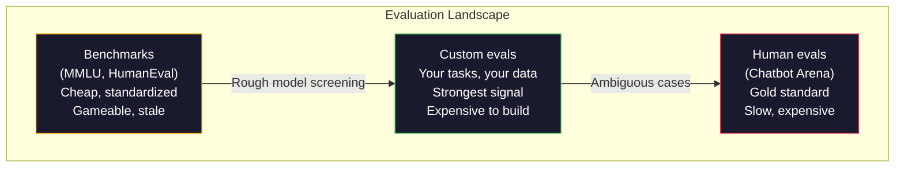
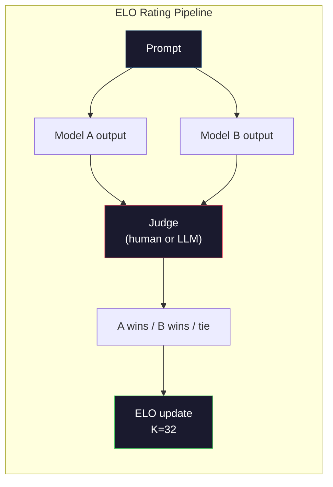

# Evaluation: Benchmarks, Evals, LM Harness

> Goodhart's Law: when a measure becomes a target, it ceases to be a good measure. Every frontier lab games benchmarks. MMLU scores go up, yet models still can't count the R's in "strawberry." The only eval that matters is your own eval—on your tasks, with your data.

**Type:** Build
**Languages:** Python
**Prerequisites:** Phase 10, Lessons 01-05 (Building LLMs from Scratch)
**Time:** ~90 minutes

## Learning Objectives

- Build a custom evaluation harness that runs multiple-choice and open-ended benchmarks against a language model
- Explain why standard benchmarks (MMLU, HumanEval) saturate and fail to differentiate frontier models
- Implement task-specific evals with proper metrics: exact match, F1, BLEU, and LLM-as-judge scoring
- Design a custom evaluation suite targeting your specific use case rather than relying on public leaderboards

## The Problem

MMLU was released in 2020 with 15,908 questions across 57 subjects. Within three years, frontier models saturated it. GPT-4 scored 86.4%. Claude 3 Opus scored 86.8%. Llama 3 405B scored 88.6%. The leaderboard compressed into a 3-point range where differences are statistical noise, not real capability gaps.

Meanwhile, these same models fail at tasks a 10-year-old handles without thinking. Claude 3.5 Sonnet scores 88.7% on MMLU yet initially couldn't count the letters in "strawberry"—a task requiring zero world knowledge, zero reasoning, just character-level iteration. HumanEval tests code generation with 164 problems. Models score 90%+ on it yet still produce code that breaks on edge cases any junior developer would catch.

The gap between benchmark performance and real-world reliability is the central problem of LLM evaluation. Benchmarks tell you how a model performs on benchmarks. They tell you almost nothing about how that model performs on your specific task, with your specific data, against your specific failure modes. If you're building a customer service bot, MMLU is irrelevant. If you're building a code assistant, HumanEval only covers function-level generation—it says nothing about debugging, refactoring, or explaining code across files.

You need custom evals. Not because benchmarks are useless—they're useful for rough model selection—but because the final evaluation must precisely match your deployment conditions.

## The Concept

### The eval landscape

Evaluation comes in three types, each with different costs and signal quality.

**Benchmarks** are standardized test suites. MMLU, HumanEval, SWE-bench, MATH, ARC, HellaSwag. You run a model on a benchmark and get a score. Pros: everyone uses the same test, so you can compare models. Cons: models and training data increasingly contaminate these benchmarks. Labs train on data that includes benchmark questions. Scores go up. Capability doesn't necessarily follow.

**Custom evals** are test suites you build for your specific use case. You define inputs, expected outputs, and scoring functions. A legal document summarizer is evaluated on legal documents. A SQL generator is evaluated on your database schema. These are expensive to create but they're the only evaluations that predict production performance.

**Human evals** use paid annotators to judge model outputs on criteria like helpfulness, correctness, fluency, and safety. They're the gold standard for open-ended tasks where automatic scoring fails. Chatbot Arena has collected over 2 million human preference votes across 100+ models. Cons: cost ($0.10-$2.00 per judgment) and speed (hours to days).



### Why benchmarks break

Three mechanisms cause benchmark scores to stop reflecting real capability.

**Data contamination.** Training corpora scrape the internet. Benchmark questions are on the internet. Models see answers during training. This isn't cheating in the traditional sense—labs don't intentionally inject benchmark data. But web-scale scraping makes excluding it nearly impossible.

**Teaching to the test.** Labs optimize training mix for benchmark performance. If 5% of the training mix is MMLU-style multiple choice, the model learns the format and answer distribution. MMLU is 4-way choice. Models learn that the answer distribution is roughly uniform over A/B/C/D, which helps even when the model doesn't know the answer.

**Saturation.** When every frontier model scores 85-90% on a benchmark, it no longer discriminates. The remaining 10-15% of questions may be ambiguous, mislabeled, or require obscure domain knowledge. Going from 87% to 89% on MMLU might mean the model memorized two more obscure questions, not that it got smarter.

### Perplexity: a quick health check

Perplexity measures how surprised the model is by a sequence of tokens. Formally, it's the exponentiated average negative log-likelihood:

```
PPL = exp(-1/N * sum(log P(token_i | context)))
```

A perplexity of 10 means the model is, on average, as uncertain as choosing uniformly among 10 options at each token position. Lower is better. GPT-2 gets ~30 perplexity on WikiText-103. GPT-3 gets ~20. Llama 3 8B gets ~7.

Perplexity is useful for comparing models on the same test set, but it has blind spots. A model can achieve low perplexity by being good at predicting common patterns while being terrible at rare but important ones. It also says nothing about instruction following, reasoning, or factual accuracy. Use it as a sanity check, not a final verdict.

### LLM-as-Judge

Use a strong model to evaluate a weaker model's outputs. The idea is simple: ask GPT-4o or Claude Sonnet to score a response on a 1-5 scale for correctness, helpfulness, and safety. At ~$0.01 per judgment with GPT-4o-mini, it correlates surprisingly well with human judgments—around 80% agreement on most tasks.

The scoring prompt matters more than the model. Vague prompts ("rate this response") produce noisy scores. Structured prompts with rubrics ("5 if the answer is factually correct and cites sources, 4 if correct but unsourced, 3 if partially correct...") produce consistent, reproducible scores.

Failure modes: the judge model exhibits position bias (preferring the first response in pairwise comparisons), verbosity bias (preferring longer responses), and self-preference (GPT-4 rates GPT-4 outputs higher than equivalent Claude outputs). Mitigations: randomize order, normalize by length, use a different judge than the model being evaluated.

### ELO ratings from pairwise comparisons

The Chatbot Arena approach. Show two responses from different models to the same prompt. A human (or LLM judge) picks the better one. From thousands of these comparisons, compute an ELO rating for each model—the same system used in chess.

ELO advantages: relative rankings are more reliable than absolute scores, handles ties gracefully, and converges with fewer comparisons than scoring each output independently. As of early 2026, Chatbot Arena rankings show GPT-4o, Claude 3.5 Sonnet, and Gemini 1.5 Pro within 20 ELO points of each other at the top.



### Eval frameworks

**lm-evaluation-harness** (EleutherAI): The standard open-source eval framework. Supports 200+ benchmarks. One command runs MMLU, HellaSwag, ARC, etc. against any Hugging Face model. Used by the Open LLM Leaderboard.

**RAGAS**: An evaluation framework specifically for RAG pipelines. Measures faithfulness (does the answer match retrieved context?), relevancy (is the retrieved context relevant to the question?), and answer correctness.

**promptfoo**: Config-driven eval for prompt engineering. Define test cases in YAML, run against multiple models, get pass/fail reports. Useful for regression testing prompts—ensuring a prompt change doesn't break existing test cases.

### Building custom evals

The only eval that matters for production. The process:

1. **Define the task.** What exactly should the model do? Be precise. "Answer questions" is too vague. "Given a customer complaint email, extract the product name, issue category, and sentiment" is a task you can evaluate.

2. **Create test cases.** Minimum 50 for prototyping, 200+ for production. Each test case is an (input, expected_output) pair. Include edge cases: empty inputs, adversarial inputs, ambiguous inputs, inputs in other languages.

3. **Define scoring.** Exact match for structured outputs. BLEU/ROUGE for text similarity. LLM-as-judge for open-ended quality. F1 for extraction tasks. Combine multiple metrics with weights.

4. **Automate.** Every eval runs in one command. No manual steps. Store results in a format that allows comparison over time.

5. **Track over time.** An eval score in isolation is meaningless. You need trend lines. Did the score improve after the last prompt change? Regress after switching models? Version your evals alongside your prompts.

| Eval type | Cost per judgment | Agreement with humans | Best for |
|-----------|-------------------|----------------------|----------|
| Exact match | ~$0 | 100% (when applicable) | Structured output, classification |
| BLEU/ROUGE | ~$0 | ~60% | Translation, summarization |
| LLM-as-judge | ~$0.01 | ~80% | Open-ended generation |
| Human eval | $0.10-$2.00 | N/A (it is ground truth) | Ambiguous, high-stakes tasks |

## Build It

### Step 1: A minimal eval framework

Define the core abstraction. An eval case has an input, an expected output, and an optional metadata dict. A scorer takes a prediction and a reference, returns a score between 0 and 1.

```python
import json
from collections import Counter

class EvalCase:
    def __init__(self, input_text, expected, metadata=None):
        self.input_text = input_text
        self.expected = expected
        self.metadata = metadata or {}

class EvalSuite:
    def __init__(self, name, cases, scorers):
        self.name = name
        self.cases = cases
        self.scorers = scorers

    def run(self, model_fn):
        results = []
        for case in self.cases:
            prediction = model_fn(case.input_text)
            scores = {}
            for scorer_name, scorer_fn in self.scorers.items():
                scores[scorer_name] = scorer_fn(prediction, case.expected)
            results.append({
                "input": case.input_text,
                "expected": case.expected,
                "prediction": prediction,
                "scores": scores,
            })
        return results
```

### Step 2: Scoring functions

Build exact match, token F1, and a simulated LLM-as-judge scorer.

```python
def exact_match(prediction, expected):
    return 1.0 if prediction.strip().lower() == expected.strip().lower() else 0.0

def token_f1(prediction, expected):
    pred_tokens = set(prediction.lower().split())
    exp_tokens = set(expected.lower().split())
    if not pred_tokens or not exp_tokens:
        return 0.0
    common = pred_tokens & exp_tokens
    precision = len(common) / len(pred_tokens)
    recall = len(common) / len(exp_tokens)
    if precision + recall == 0:
        return 0.0
    return 2 * (precision * recall) / (precision + recall)

def llm_judge_simulated(prediction, expected):
    pred_words = set(prediction.lower().split())
    exp_words = set(expected.lower().split())
    if not exp_words:
        return 0.0
    overlap = len(pred_words & exp_words) / len(exp_words)
    length_penalty = min(1.0, len(prediction) / max(len(expected), 1))
    return round(overlap * 0.7 + length_penalty * 0.3, 3)
```

### Step 3: ELO rating system

Implement pairwise comparison with ELO updates. This is exactly the system Chatbot Arena uses to rank models.

```python
class ELOTracker:
    def __init__(self, k=32, initial_rating=1500):
        self.ratings = {}
        self.k = k
        self.initial_rating = initial_rating
        self.history = []

    def _ensure_player(self, name):
        if name not in self.ratings:
            self.ratings[name] = self.initial_rating

    def expected_score(self, rating_a, rating_b):
        return 1 / (1 + 10 ** ((rating_b - rating_a) / 400))

    def record_match(self, player_a, player_b, outcome):
        self._ensure_player(player_a)
        self._ensure_player(player_b)

        ea = self.expected_score(self.ratings[player_a], self.ratings[player_b])
        eb = 1 - ea

        if outcome == "a":
            sa, sb = 1.0, 0.0
        elif outcome == "b":
            sa, sb = 0.0, 1.0
        else:
            sa, sb = 0.5, 0.5

        self.ratings[player_a] += self.k * (sa - ea)
        self.ratings[player_b] += self.k * (sb - eb)

        self.history.append({
            "a": player_a, "b": player_b,
            "outcome": outcome,
            "rating_a": round(self.ratings[player_a], 1),
            "rating_b": round(self.ratings[player_b], 1),
        })

    def leaderboard(self):
        return sorted(self.ratings.items(), key=lambda x: -x[1])
```

### Step 4: Perplexity calculation

Compute perplexity from token probabilities. In practice you'd get these from the model's logits. Here we simulate with a probability distribution.

```python
import numpy as np

def perplexity(log_probs):
    if not log_probs:
        return float("inf")
    avg_neg_log_prob = -np.mean(log_probs)
    return float(np.exp(avg_neg_log_prob))

def token_log_probs_simulated(text, model_quality=0.8):
    np.random.seed(hash(text) % 2**31)
    tokens = text.split()
    log_probs = []
    for i, token in enumerate(tokens):
        base_prob = model_quality
        if len(token) > 8:
            base_prob *= 0.6
        if i == 0:
            base_prob *= 0.7
        prob = np.clip(base_prob + np.random.normal(0, 0.1), 0.01, 0.99)
        log_probs.append(float(np.log(prob)))
    return log_probs
```

### Step 5: Aggregate results

Compute summary statistics for an eval run: mean, median, pass rate at a threshold, and breakdown by metric.

```python
def summarize_results(results, threshold=0.8):
    all_scores = {}
    for r in results:
        for metric, score in r["scores"].items():
            all_scores.setdefault(metric, []).append(score)

    summary = {}
    for metric, scores in all_scores.items():
        arr = np.array(scores)
        summary[metric] = {
            "mean": round(float(np.mean(arr)), 3),
            "median": round(float(np.median(arr)), 3),
            "std": round(float(np.std(arr)), 3),
            "min": round(float(np.min(arr)), 3),
            "max": round(float(np.max(arr)), 3),
            "pass_rate": round(float(np.mean(arr >= threshold)), 3),
            "n": len(scores),
        }
    return summary

def print_summary(summary, suite_name="Eval"):
    print(f"\n{'=' * 60}")
    print(f"  {suite_name} Summary")
    print(f"{'=' * 60}")
    for metric, stats in summary.items():
        print(f"\n  {metric}:")
        print(f"    Mean:      {stats['mean']:.3f}")
        print(f"    Median:    {stats['median']:.3f}")
        print(f"    Std:       {stats['std']:.3f}")
        print(f"    Range:     [{stats['min']:.3f}, {stats['max']:.3f}]")
        print(f"    Pass rate: {stats['pass_rate']:.1%} (threshold >= 0.8)")
        print(f"    N:         {stats['n']}")
```

### Step 6: Run the full pipeline

Wire everything together. Define a task, create test cases, simulate two models, run evals, compute ELO from pairwise comparisons, and print the leaderboard.

```python
def demo_model_good(prompt):
    responses = {
        "What is the capital of France?": "Paris",
        "What is 2 + 2?": "4",
        "Who wrote Hamlet?": "William Shakespeare",
        "What language is PyTorch written in?": "Python and C++",
        "What is the boiling point of water?": "100 degrees Celsius",
    }
    return responses.get(prompt, "I don't know")

def demo_model_bad(prompt):
    responses = {
        "What is the capital of France?": "Paris is the capital city of France",
        "What is 2 + 2?": "The answer is four",
        "Who wrote Hamlet?": "Shakespeare",
        "What language is PyTorch written in?": "Python",
        "What is the boiling point of water?": "212 Fahrenheit",
    }
    return responses.get(prompt, "Unknown")

cases = [
    EvalCase("What is the capital of France?", "Paris"),
    EvalCase("What is 2 + 2?", "4"),
    EvalCase("Who wrote Hamlet?", "William Shakespeare"),
    EvalCase("What language is PyTorch written in?", "Python and C++"),
    EvalCase("What is the boiling point of water?", "100 degrees Celsius"),
]

suite = EvalSuite(
    name="General Knowledge",
    cases=cases,
    scorers={
        "exact_match": exact_match,
        "token_f1": token_f1,
        "llm_judge": llm_judge_simulated,
    },
)

results_good = suite.run(demo_model_good)
results_bad = suite.run(demo_model_bad)

print_summary(summarize_results(results_good), "Model A (concise)")
print_summary(summarize_results(results_bad), "Model B (verbose)")
```

The "good" model gives exact answers. The "bad" model gives verbose paraphrases. Exact match harshly penalizes the verbose model. Token F1 and LLM-as-judge are more forgiving. This illustrates why metric choice matters: the same model can look great or terrible depending on how you score.

### Step 7: ELO tournament

Run pairwise comparisons between models across multiple rounds.

```python
elo = ELOTracker(k=32)

for case in cases:
    pred_a = demo_model_good(case.input_text)
    pred_b = demo_model_bad(case.input_text)

    score_a = token_f1(pred_a, case.expected)
    score_b = token_f1(pred_b, case.expected)

    if score_a > score_b:
        outcome = "a"
    elif score_b > score_a:
        outcome = "b"
    else:
        outcome = "tie"

    elo.record_match("model_a_concise", "model_b_verbose", outcome)

print("\nELO Leaderboard:")
for name, rating in elo.leaderboard():
    print(f"  {name}: {rating:.0f}")
```

### Step 8: Perplexity comparison

Compare perplexity across "models" at different quality levels.

```python
test_text = "The quick brown fox jumps over the lazy dog in the garden"

for quality, label in [(0.9, "Strong model"), (0.7, "Medium model"), (0.4, "Weak model")]:
    log_probs = token_log_probs_simulated(test_text, model_quality=quality)
    ppl = perplexity(log_probs)
    print(f"  {label} (quality={quality}): perplexity = {ppl:.2f}")
```

## Use It

### lm-evaluation-harness (EleutherAI)

The standard tool for running benchmarks on any model.

```python
# pip install lm-eval
# Command line:
# lm_eval --model hf --model_args pretrained=meta-llama/Llama-3.1-8B --tasks mmlu --batch_size 8

# Python API:
# import lm_eval
# results = lm_eval.simple_evaluate(
#     model="hf",
#     model_args="pretrained=meta-llama/Llama-3.1-8B",
#     tasks=["mmlu", "hellaswag", "arc_easy"],
#     batch_size=8,
# )
# print(results["results"])
```

### promptfoo

Config-driven eval for prompt engineering. Define tests in YAML, run across multiple providers.

```yaml
# promptfoo.yaml
providers:
  - openai:gpt-4o-mini
  - anthropic:claude-3-haiku

prompts:
  - "Answer in one word: {{question}}"

tests:
  - vars:
      question: "What is the capital of France?"
    assert:
      - type: contains
        value: "Paris"
  - vars:
      question: "What is 2 + 2?"
    assert:
      - type: equals
        value: "4"
```

### RAG evaluation with RAGAS

```python
# pip install ragas
# from ragas import evaluate
# from ragas.metrics import faithfulness, answer_relevancy, context_precision
#
# result = evaluate(
#     dataset,
#     metrics=[faithfulness, answer_relevancy, context_precision],
# )
# print(result)
```

RAGAS measures what generic evals miss: whether the model's answer is grounded in retrieved context, not just abstractly "correct."

## Ship It

This lesson produces `outputs/prompt-eval-designer.md`—a reusable prompt that designs custom eval suites for any task. Give it a task description and it generates test cases, scoring functions, and a pass/fail threshold recommendation.

It also produces `outputs/skill-llm-evaluation.md`—a decision framework for choosing the right evaluation strategy based on your task type, budget, and latency requirements.

## Exercises

1. Add a "consistency" scorer that runs the same input through the model 5 times and measures how often the outputs match each other. Inconsistent answers on deterministic inputs reveal brittle prompts or excessive temperature.

2. Extend the ELO tracker to support multiple judge functions (exact match, F1, LLM-as-judge) and weight them. Compare how the leaderboard changes when you weight exact match heavily vs weight F1 heavily.

3. Build an eval suite for a specific task: classifying emails into 5 categories. Create 100 test cases with diverse examples and edge cases (emails that could belong to multiple categories, empty emails, emails in other languages). Measure different "models" (rule-based, keyword-matching, simulated LLM).

4. Implement contamination detection: given a set of eval questions and a training corpus, check what percentage of eval questions (or close paraphrases) appear in the training data. This is how researchers audit benchmark validity.

5. Build a "model diff" tool. Given eval results from two model versions, highlight which specific test cases improved, which regressed, and which stayed the same. This is the eval equivalent of a code diff—essential for understanding whether a change helped or hurt.

## Key Terms

| Term | How people say it | What it actually is |
|------|-------------------|---------------------|
| MMLU | "The benchmark" | Massive Multitask Language Understanding—15,908 multiple-choice questions across 57 subjects, saturated above 88% by 2025 |
| HumanEval | "The code eval" | OpenAI's 164 Python function completion problems, tests only isolated function generation |
| SWE-bench | "The real coding eval" | 2,294 GitHub issues from 12 Python repos, measures end-to-end bug fixing including test generation |
| Perplexity | "How confused the model is" | exp(-avg(log P(token_i given context)))—lower means the model assigns higher probability to actual tokens |
| ELO rating | "Chess rankings for models" | Relative strength score computed from pairwise win/loss records, used by Chatbot Arena to rank 100+ models |
| LLM-as-judge | "Using AI to grade AI" | A strong model scores a weaker model's output against a rubric, ~$0.01 per judgment, ~80% agreement with human judges |
| Data contamination | "The model saw the test" | Training data includes benchmark questions, inflating scores without improving real capability |
| Eval suite | "A bunch of tests" | A versioned collection of (input, expected_output, scorer) triples that measure a specific capability |
| Pass rate | "Percentage it gets right" | Fraction of eval cases scoring above a threshold—more actionable than mean score because it measures reliability |
| Chatbot Arena | "The model ranking site" | LMSYS platform with 2M+ human preference votes, producing the most trusted LLM leaderboard via ELO scores |

## Further Reading

- [Hendrycks et al., 2021 -- "Measuring Massive Multitask Language Understanding"](https://arxiv.org/abs/2009.03300) -- The MMLU paper, still the most-cited LLM benchmark despite saturation
- [Chen et al., 2021 -- "Evaluating Large Language Models Trained on Code"](https://arxiv.org/abs/2107.03374) -- OpenAI's HumanEval paper, establishing code generation evaluation methodology
- [Zheng et al., 2023 -- "Judging LLM-as-a-Judge"](https://arxiv.org/abs/2306.05685) -- Systematic analysis of using LLMs to evaluate LLMs, including position and verbosity bias findings
- [LMSYS Chatbot Arena](https://chat.lmsys.org/) -- Crowdsourced model comparison platform with 2M+ votes, the most trusted real-world LLM ranking
