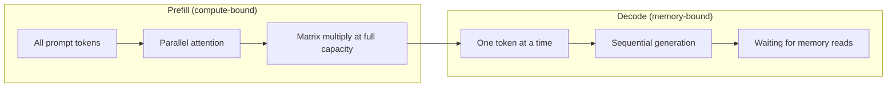
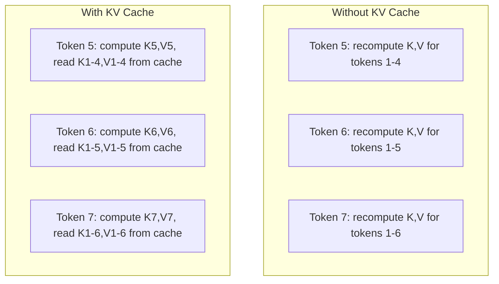
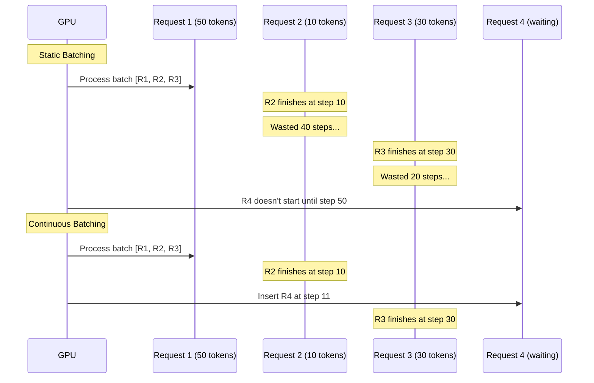
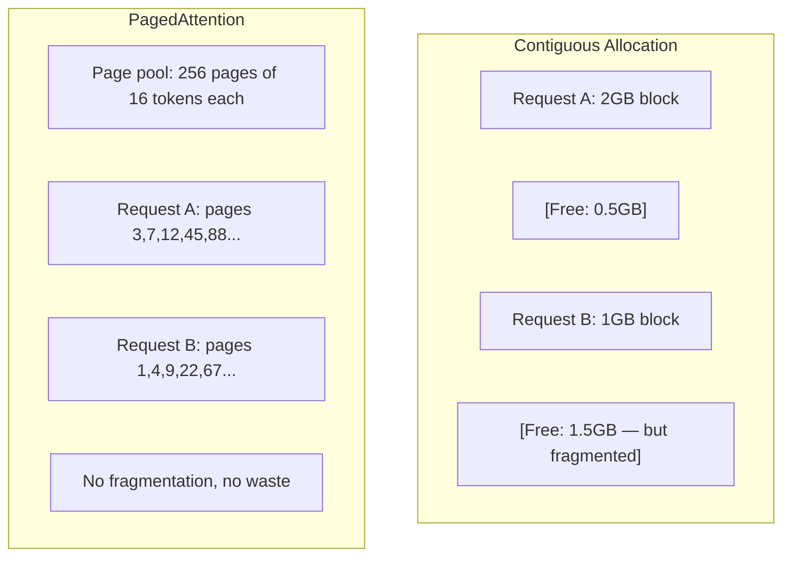
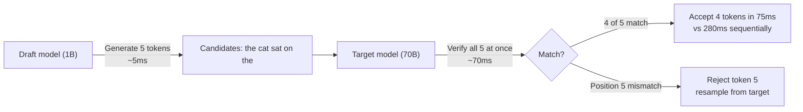

# Inference Optimization

> LLM inference is defined by two phases. Prefill processes your prompt in parallel — compute-bound. Decode generates one token at a time — memory-bound. Every optimization targets one or both.

**Type:** Build
**Languages:** Python
**Prerequisites:** Phase 10, Lessons 01-08 (transformer architecture, attention)
**Time:** ~120 minutes

## Learning Objectives

- Implement KV-cache to eliminate redundant computation during autoregressive token generation
- Explain the prefill vs decode phases of LLM inference and why each has a different bottleneck (compute-bound vs memory-bound)
- Implement the concepts of continuous batching and PagedAttention to maximize GPU utilization under concurrent requests
- Compare inference optimization techniques (KV-cache, speculative decoding, flash attention) and their throughput/latency tradeoffs

## The Problem

You deploy Llama 3 70B on 4x A100s. A single user gets ~50 tokens/second. Feels fast. Then 100 users hit the endpoint simultaneously. Throughput drops to 3 tokens/sec/user. Your $25,000/month GPU bill is serving responses slower than a human types.

The model itself didn't change between 1 user and 100 users. Same weights, same architecture, same math. What changed is how you schedule work. Naive inference wastes 90%+ of available GPU compute. A user waiting for their 47th token holds an entire batch slot while the GPU memory bus sits idle between matmuls. Meanwhile a new user's 2,000-token prompt could have filled that dead time with useful compute.

This isn't a scaling problem. It's a scheduling problem. The techniques in this lesson — KV caching, continuous batching, PagedAttention, speculative decoding, prefix caching — are the difference between a $25k/month and $5k/month inference bill for the same traffic.

vLLM serving Llama 3 70B on 4x A100-80GB achieves ~50 tokens/sec/user at low concurrency and sustains 15-25 TPS/user at 100 concurrent requests via continuous batching and PagedAttention. Without these optimizations, the same hardware serves 5 TPS/user at that concurrency. Same GPUs, same model, 4x the throughput.

## The Concept

### Prefill vs Decode

Every LLM inference request has two distinct phases.

**Prefill** processes the entire input prompt. All tokens are known, so attention can be computed in parallel over the full sequence. This is one big matrix multiplication — GPU cores stay busy. The bottleneck is compute: how many FLOPS your hardware can deliver per second. An A100 does 312 TFLOPS (BF16). A 70B model prefilling a 4,096-token prompt on a single A100 takes ~400ms.

**Decode** generates one output token at a time. Each new token attends to all previous tokens, but only one token is produced per forward pass. The weight matrices are the same size as during prefill, but you're multiplying them by a single vector instead of a matrix. GPU cores finish in microseconds, then wait for the next batch of weights to arrive from memory. The bottleneck is memory bandwidth: how fast you can stream model weights from HBM to compute units. An A100 has 2 TB/s bandwidth. A 70B model in FP16 is 140 GB. Reading the entire model once takes 70ms — that's your floor for a single decode step.



**The ops:byte ratio** (also called arithmetic intensity) captures this tradeoff. It measures how many operations you perform per byte loaded from memory.

```
ops:byte ratio = FLOPs per token / bytes read from memory
```

During prefill with a batch of 4,096 tokens, you perform ~4,096 multiply-accumulates per weight loaded. The ratio is high — you're compute-bound. During decode at batch size 1, you perform ~1 operation per weight loaded. The ratio is low — you're memory-bound.

The fundamental insight: *decode is memory-bound because you read the entire model to produce a single token*. Every optimization below either reduces what you read, increases the token batch you process per read, or avoids the read entirely.

### KV Cache

During attention, each token's query attends to the key and value vectors of every previous token. Without caching, generating token N requires recomputing key and value projections for all N-1 previous tokens. Token 1 gets projected when generating token 2, then again for token 3, then again for token 4. By token 1,000, you've projected token 1 a total of 999 times.

KV cache stores the key and value projections of all previous tokens. When generating token N, you only compute key and value for token N, then concatenate with the cached K/V from tokens 1 through N-1.



**KV cache memory formula:**

```
KV cache size = 2 * num_layers * num_kv_heads * head_dim * seq_len * bytes_per_param
```

For Llama 3 70B (80 layers, 8 KV heads under GQA, head_dim=128, BF16):

```
per token: 2 * 80 * 8 * 128 * 2 bytes = 327,680 bytes = 320 KB
at 4,096 tokens: 320 KB * 4,096 = 1.28 GB
at 128K tokens: 320 KB * 131,072 = 40 GB
```

A single 128K-context conversation with Llama 3 70B consumes 40 GB of KV cache — half an A100's memory. 100 concurrent users at 4K tokens each need 128 GB for KV cache alone. This is why KV cache management is the core challenge of inference optimization.

### Continuous Batching

Static batching waits until N requests accumulate as a batch, processes them together, and waits until *all* finish before accepting new requests. If one request needs 500 tokens and another needs 10, the short request sits idle for 490 decode steps after finishing.

Continuous batching (also called iteration-level batching) inserts new requests into the batch as soon as any request completes. The batch is re-evaluated at every decode step. A request that finishes after 10 tokens is immediately replaced by a waiting request.



The throughput gain depends on how variable output lengths are. When lengths are uniform, continuous batching matches static. When lengths vary (the common case), continuous batching can deliver 2-5x higher throughput because GPU slots never sit empty.

### PagedAttention

Each request's KV cache is a contiguous block of memory. As requests come and go, memory fragments — exactly like RAM fragmentation in an operating system. A 4K-token request needs 1.28 GB contiguous. Even if you have 2 GB free total, there may not be 1.28 GB *contiguous*. You either waste memory or reject requests.

PagedAttention (from vLLM) applies OS-style virtual memory to the KV cache. Instead of allocating one contiguous block per request, it allocates fixed-size "pages" (typically 16 tokens each). Pages can live anywhere in GPU physical memory. A page table maps each request's logical sequence positions to physical page locations.



PagedAttention also enables **copy-on-write** for shared prefixes. If 50 requests share the same system prompt, that system prompt's KV cache pages are stored once and referenced by all 50 requests. Only when a request diverges (different user message) does it get its own pages. This dramatically cuts memory usage for applications with shared system prompts.

vLLM reports near-zero memory waste (~4% vs ~60-80% for naive allocation) through PagedAttention.

### Speculative Decoding

Decode is slow because it's sequential — you generate one token, feed it back, generate the next. But what if you could cheaply guess the next 5 tokens and verify them all at once?

Speculative decoding uses a small, fast **draft model** to generate K candidate tokens. Then the large **target model** processes all K candidates in one forward pass (this looks like prefill — parallel, compute-bound, efficient). If the target model agrees with the draft model's predictions, you accept all K tokens in the time of one target forward pass. If it disagrees at position j, you accept tokens 1 through j-1 and discard the rest.



Speedup depends on the **acceptance rate** — how often the draft model's predictions match the target. For a Llama 3 8B drafting for Llama 3 70B, typical acceptance rates are 70-85% on natural language. This translates to 2-3x decode speedup.

Three approaches to speculative decoding:

| Approach | Draft Source | Acceptance Rate | Overhead |
|--------|-------------|-----------------|----------|
| Draft-target (Leviathan et al.) | Separate small model | 70-85% | Draft model memory |
| EAGLE (Li et al.) | Lightweight head on target | 75-90% | ~1% extra params |
| N-gram lookup | Token n-gram table | 40-60% | Negligible |

**EAGLE** trains a small autoregressive head on top of the target model's hidden states. It predicts the next token's embedding using the target model's penultimate-layer features. Because it operates on the target model's own representations (rather than a separate model's), it achieves higher acceptance rates with minimal extra memory. EAGLE-2 adds a dynamic draft tree that adjusts candidate count based on context.

**N-gram speculative decoding** maintains a table of n-gram continuations from the current context or a pre-built corpus. If the draft matches something that appeared earlier in the same conversation (repetitive patterns, code, structured output), it fires with zero neural network overhead. Average acceptance rate is lower but cost per speculation is essentially free.

Speculative decoding is *mathematically exact* — the output distribution is identical to the target model's distribution. It's not an approximation. The verification step ensures every accepted token has exactly the probability the target model would assign.

### Prefix Caching

Many requests share the same prefix. A chatbot's system prompt. A RAG context chunk. A set of few-shot examples. Without prefix caching, every request recomputes the KV cache for these shared tokens from scratch.

Prefix caching stores the KV cache for common prefixes and reuses it across requests. When a new request arrives with a known prefix, the system copies (or references) the cached KV entries and only computes KV for the unique suffix.

For a 2,000-token system prompt shared across all requests, prefix caching saves ~400ms of prefill per request. At 100 req/s, that's 40 seconds of GPU compute saved per second — more than an entire GPU's worth of work.

SGLang's RadixAttention implements prefix caching using a radix tree (trie), indexed by token content. Any request matching a stored prefix gets its KV cache for free. The tree supports partial prefix matching — if you share 1,500 of 2,000 prefix tokens with a cached entry, you reuse those 1,500 and only recompute 500.

### Inference Engines

Three engines dominate production LLM serving:

| Engine | Key Innovation | Best For |
|--------|---------------|----------|
| vLLM | PagedAttention, continuous batching | General-purpose serving, highest compatibility |
| SGLang | RadixAttention (prefix caching), structured generation | Multi-turn chatbots, constrained decoding |
| TensorRT-LLM | NVIDIA kernel fusion, FP8 quantization | Maximum single-card throughput on NVIDIA hardware |

**vLLM** is the default starting point. It supports the widest range of models, runs on any GPU vendor (NVIDIA, AMD, Intel), and achieves strong throughput via PagedAttention + continuous batching. OpenAI-compatible API means you can drop it in as a replacement for any OpenAI API call.

**SGLang** builds on the same foundation as vLLM but adds RadixAttention for prefix caching and a domain-specific language for structured LLM programs. If your workload involves multi-turn conversations, tool use, or constrained decoding (JSON output, regex-guided generation), SGLang often outperforms vLLM by 2-5x through prefix reuse.

**TensorRT-LLM** compiles models into optimized NVIDIA GPU kernels. It fuses operations (attention + linear + activation in one kernel), uses FP8 on H100 GPUs, and integrates with NVIDIA Triton Inference Server for production deployment. It achieves the highest single-card throughput on NVIDIA hardware but requires more setup and only works on NVIDIA GPUs.

Real-world numbers for Llama 3 70B (4x A100-80GB, BF16):

| Metric | vLLM | SGLang | TensorRT-LLM |
|--------|------|--------|---------------|
| Throughput (1 user) | ~50 TPS | ~55 TPS | ~65 TPS |
| Throughput (100 users) | ~2,500 TPS total | ~3,200 TPS total | ~3,000 TPS total |
| Time to first token | ~400ms | ~300ms (prefix hit) | ~350ms |
| Max context | 128K | 128K | 128K |

### The Ops:Byte Framework

You can't optimize what you don't measure. The ops:byte ratio tells you whether you're compute-bound or memory-bound, which determines which optimizations matter.

```
Compute roof: peak FLOPS of the GPU
Memory roof:  peak bandwidth * ops:byte ratio
```

When ops:byte is low (decode, small batch), you hit the memory bandwidth roof. Adding more compute (higher clock, more cores) doesn't help. You need to reduce memory reads (quantization, KV cache compression) or increase batch size to amortize reads over more useful work.

When ops:byte is high (prefill, large batch), you hit the compute roof. Memory bandwidth optimizations don't help. You need faster GPUs, kernel fusion, or lower precision to squeeze out more FLOPS.

| Scenario | ops:byte | Bound by | Optimize with |
|----------|----------|-------|---------------|
| Prefill, batch=1 | ~4,096 | Compute | Kernel fusion, FP8 |
| Decode, batch=1 | ~1 | Memory | Quantization, KV compression |
| Decode, batch=32 | ~32 | Memory | Larger batch, continuous batching |
| Decode, batch=256 | ~256 | Transitional | Both matter |
| Decode, batch=1024 | ~1,024 | Compute | Kernel fusion, tensor parallelism |

The crossover point on an A100 is approximately ops:byte = 156 (312 TFLOPS / 2 TB/s). Below 156, you're memory-bound. Above 156, you're compute-bound. Continuous batching pushes decode toward this crossover by packing more tokens per iteration.

## Build It

### Step 1: KV Cache from scratch

We build a multi-head KV cache that stores key and value projections per layer per head, and demonstrates the memory growth pattern.

```python
import numpy as np

class KVCache:
    def __init__(self, num_layers, num_heads, head_dim, max_seq_len, dtype=np.float16):
        self.num_layers = num_layers
        self.num_heads = num_heads
        self.head_dim = head_dim
        self.max_seq_len = max_seq_len
        self.dtype = dtype

        self.k_cache = np.zeros(
            (num_layers, num_heads, max_seq_len, head_dim), dtype=dtype
        )
        self.v_cache = np.zeros(
            (num_layers, num_heads, max_seq_len, head_dim), dtype=dtype
        )
        self.seq_len = 0

    def update(self, layer_idx, new_keys, new_values):
        num_new = new_keys.shape[1]
        end = self.seq_len + num_new
        self.k_cache[layer_idx, :, self.seq_len:end, :] = new_keys
        self.v_cache[layer_idx, :, self.seq_len:end, :] = new_values
        return (
            self.k_cache[layer_idx, :, :end, :],
            self.v_cache[layer_idx, :, :end, :]
        )

    def advance(self, num_tokens):
        self.seq_len += num_tokens

    def memory_bytes(self):
        return self.k_cache.nbytes + self.v_cache.nbytes

    def used_bytes(self):
        per_token = 2 * self.num_layers * self.num_heads * self.head_dim * np.dtype(self.dtype).itemsize
        return per_token * self.seq_len
```

### Step 2: Attention with KV Cache

A simplified multi-head attention that uses the KV cache during decode steps.

```python
def scaled_dot_product_attention(query, keys, values):
    head_dim = query.shape[-1]
    scores = np.matmul(query, keys.transpose(0, 1, 3, 2)) / np.sqrt(head_dim)
    seq_len_q = scores.shape[-2]
    seq_len_k = scores.shape[-1]
    if seq_len_q > 1:
        mask = np.triu(np.ones((seq_len_q, seq_len_k), dtype=np.float32), k=seq_len_k - seq_len_q + 1)
        scores = scores + mask * (-1e9)
    max_scores = np.max(scores, axis=-1, keepdims=True)
    exp_scores = np.exp(scores - max_scores)
    attn_weights = exp_scores / np.sum(exp_scores, axis=-1, keepdims=True)
    return np.matmul(attn_weights, values)


class MultiHeadAttention:
    def __init__(self, d_model, num_heads):
        self.num_heads = num_heads
        self.head_dim = d_model // num_heads
        scale = np.sqrt(2.0 / d_model)
        self.W_q = np.random.randn(d_model, d_model).astype(np.float32) * scale
        self.W_k = np.random.randn(d_model, d_model).astype(np.float32) * scale
        self.W_v = np.random.randn(d_model, d_model).astype(np.float32) * scale
        self.W_o = np.random.randn(d_model, d_model).astype(np.float32) * scale

    def forward(self, x, kv_cache=None, layer_idx=0):
        batch, seq_len, d_model = x.shape
        Q = np.matmul(x, self.W_q).reshape(batch, seq_len, self.num_heads, self.head_dim).transpose(0, 2, 1, 3)
        K = np.matmul(x, self.W_k).reshape(batch, seq_len, self.num_heads, self.head_dim).transpose(0, 2, 1, 3)
        V = np.matmul(x, self.W_v).reshape(batch, seq_len, self.num_heads, self.head_dim).transpose(0, 2, 1, 3)

        if kv_cache is not None:
            K_full, V_full = kv_cache.update(layer_idx, K[0], V[0])
            K = K_full[np.newaxis, :, :, :]
            V = V_full[np.newaxis, :, :, :]
            if seq_len == 1:
                kv_cache.advance(1)

        attn_out = scaled_dot_product_attention(Q, K, V)
        attn_out = attn_out.transpose(0, 2, 1, 3).reshape(batch, -1, d_model)
        return np.matmul(attn_out, self.W_o)
```

### Step 3: Continuous Batching Simulator

This simulates the scheduling difference between static and continuous batching.

```python
import heapq

class Request:
    def __init__(self, request_id, prompt_tokens, output_tokens, arrival_step):
        self.request_id = request_id
        self.prompt_tokens = prompt_tokens
        self.output_tokens = output_tokens
        self.arrival_step = arrival_step
        self.tokens_generated = 0
        self.start_step = None
        self.end_step = None

    def is_done(self):
        return self.tokens_generated >= self.output_tokens


def simulate_static_batching(requests, batch_size):
    step = 0
    completed = []
    queue = list(requests)
    queue.sort(key=lambda r: r.arrival_step)

    while queue:
        batch = []
        while queue and len(batch) < batch_size:
            r = queue.pop(0)
            r.start_step = max(step, r.arrival_step)
            batch.append(r)

        if batch:
            step = max(step, max(r.start_step for r in batch))
            max_output = max(r.output_tokens for r in batch)
            for r in batch:
                r.tokens_generated = r.output_tokens
                r.end_step = step + max_output
            step += max_output
            completed.extend(batch)

    return completed


def simulate_continuous_batching(requests, batch_size):
    step = 0
    completed = []
    queue = sorted(requests, key=lambda r: r.arrival_step)
    queue_idx = 0
    active = []
    waiting = []

    while queue_idx < len(queue) or active or waiting:
        while queue_idx < len(queue) and queue[queue_idx].arrival_step <= step:
            waiting.append(queue[queue_idx])
            queue_idx += 1

        while waiting and len(active) < batch_size:
            r = waiting.pop(0)
            r.start_step = step
            active.append(r)

        if not active:
            if waiting:
                step += 1
                continue
            elif queue_idx < len(queue):
                step = queue[queue_idx].arrival_step
                continue
            else:
                break

        for r in active:
            r.tokens_generated += 1

        done = [r for r in active if r.is_done()]
        for r in done:
            r.end_step = step + 1
            completed.append(r)
        active = [r for r in active if not r.is_done()]

        step += 1

    return completed


def batching_stats(completed):
    latencies = [r.end_step - r.arrival_step for r in completed]
    total_time = max(r.end_step for r in completed) - min(r.arrival_step for r in completed)
    total_tokens = sum(r.output_tokens for r in completed)
    return {
        "avg_latency": np.mean(latencies),
        "p50_latency": np.median(latencies),
        "p99_latency": np.percentile(latencies, 99),
        "total_time": total_time,
        "throughput": total_tokens / total_time if total_time > 0 else 0,
    }
```

### Step 4: Prefix Cache

A trie-based prefix cache that stores KV entries for shared prefixes.

```python
class TrieNode:
    def __init__(self):
        self.children = {}
        self.kv_data = None
        self.hit_count = 0


class PrefixCache:
    def __init__(self, max_entries=1000):
        self.root = TrieNode()
        self.max_entries = max_entries
        self.total_entries = 0
        self.hits = 0
        self.misses = 0

    def _walk(self, token_ids):
        node = self.root
        depth = 0
        for tid in token_ids:
            if tid not in node.children:
                break
            node = node.children[tid]
            depth += 1
        return node, depth

    def lookup(self, token_ids):
        node, depth = self._walk(token_ids)
        if depth > 0:
            self.hits += 1
            current = self.root
            for tid in token_ids[:depth]:
                current = current.children[tid]
                current.hit_count += 1
            kv_entries = []
            current = self.root
            for tid in token_ids[:depth]:
                current = current.children[tid]
                if current.kv_data is not None:
                    kv_entries.append(current.kv_data)
            return depth, kv_entries
        self.misses += 1
        return 0, []

    def insert(self, token_ids, kv_per_token):
        node = self.root
        for i, tid in enumerate(token_ids):
            if tid not in node.children:
                if self.total_entries >= self.max_entries:
                    return i
                node.children[tid] = TrieNode()
                self.total_entries += 1
            node = node.children[tid]
            if i < len(kv_per_token):
                node.kv_data = kv_per_token[i]
        return len(token_ids)

    def hit_rate(self):
        total = self.hits + self.misses
        return self.hits / total if total > 0 else 0.0
```

### Step 5: Speculative Decoding Simulator

We simulate draft-target speculative decoding with a configurable acceptance rate.

```python
class DraftModel:
    def __init__(self, vocab_size, acceptance_rate=0.8):
        self.vocab_size = vocab_size
        self.acceptance_rate = acceptance_rate

    def generate(self, context, num_tokens):
        tokens = np.random.randint(0, self.vocab_size, size=num_tokens)
        return tokens

    def get_probs(self, context, token):
        probs = np.random.dirichlet(np.ones(self.vocab_size))
        return probs


class TargetModel:
    def __init__(self, vocab_size):
        self.vocab_size = vocab_size

    def get_probs(self, context, tokens=None):
        if tokens is not None:
            return [np.random.dirichlet(np.ones(self.vocab_size)) for _ in tokens]
        return np.random.dirichlet(np.ones(self.vocab_size))


def speculative_decode(draft_model, target_model, context, num_speculative=5,
                       draft_cost=1.0, target_cost=10.0, verify_cost=12.0):
    total_tokens = 0
    total_cost = 0.0
    accepted_counts = []
    context = list(context)

    max_tokens = 100

    while total_tokens < max_tokens:
        draft_tokens = draft_model.generate(context, num_speculative)
        total_cost += draft_cost * num_speculative

        target_probs = target_model.get_probs(context, draft_tokens)
        total_cost += verify_cost

        accepted = 0
        for i, token in enumerate(draft_tokens):
            draft_p = draft_model.get_probs(context + list(draft_tokens[:i]), token)
            target_p = target_probs[i]

            r = np.random.random()
            acceptance_prob = min(1.0, target_p[token] / (draft_p[token] + 1e-10))

            if r < draft_model.acceptance_rate:
                accepted += 1
                context.append(token)
                total_tokens += 1
            else:
                new_token = np.random.choice(draft_model.vocab_size, p=target_p)
                context.append(new_token)
                total_tokens += 1
                break

        accepted_counts.append(accepted)

        if accepted == num_speculative:
            bonus_probs = target_model.get_probs(context)
            bonus_token = np.random.choice(draft_model.vocab_size, p=bonus_probs)
            context.append(bonus_token)
            total_tokens += 1

    sequential_cost = total_tokens * target_cost
    return {
        "total_tokens": total_tokens,
        "speculative_cost": total_cost,
        "sequential_cost": sequential_cost,
        "speedup": sequential_cost / total_cost if total_cost > 0 else 1.0,
        "avg_accepted": np.mean(accepted_counts),
        "acceptance_rate": np.mean(accepted_counts) / num_speculative,
    }


def compare_speculation_strategies(vocab_size=1000, num_trials=20):
    results = {}

    for name, acceptance_rate, spec_tokens in [
        ("Draft-target (8B->70B)", 0.78, 5),
        ("EAGLE", 0.85, 6),
        ("N-gram", 0.50, 4),
        ("No speculation", 0.0, 0),
    ]:
        if spec_tokens == 0:
            results[name] = {
                "speedup": 1.0,
                "acceptance_rate": 0.0,
                "avg_accepted": 0.0,
            }
            continue

        trial_results = []
        for _ in range(num_trials):
            draft = DraftModel(vocab_size, acceptance_rate=acceptance_rate)
            target = TargetModel(vocab_size)
            context = list(np.random.randint(0, vocab_size, size=10))
            result = speculative_decode(draft, target, context, num_speculative=spec_tokens)
            trial_results.append(result)

        results[name] = {
            "speedup": np.mean([r["speedup"] for r in trial_results]),
            "acceptance_rate": np.mean([r["acceptance_rate"] for r in trial_results]),
            "avg_accepted": np.mean([r["avg_accepted"] for r in trial_results]),
        }

    return results
```

### Step 6: KV Cache Memory Profiler

Compute KV cache memory requirements for real model configurations.

```python
MODEL_CONFIGS = {
    "Llama-3-8B": {
        "num_layers": 32, "num_kv_heads": 8, "head_dim": 128,
        "model_params_b": 8, "gqa": True,
    },
    "Llama-3-70B": {
        "num_layers": 80, "num_kv_heads": 8, "head_dim": 128,
        "model_params_b": 70, "gqa": True,
    },
    "Llama-3-405B": {
        "num_layers": 126, "num_kv_heads": 8, "head_dim": 128,
        "model_params_b": 405, "gqa": True,
    },
    "Mistral-7B": {
        "num_layers": 32, "num_kv_heads": 8, "head_dim": 128,
        "model_params_b": 7, "gqa": True,
    },
    "GPT-4-est": {
        "num_layers": 120, "num_kv_heads": 96, "head_dim": 128,
        "model_params_b": 1800, "gqa": False,
    },
}


def kv_cache_memory(config, seq_len, dtype_bytes=2):
    per_token = 2 * config["num_layers"] * config["num_kv_heads"] * config["head_dim"] * dtype_bytes
    total = per_token * seq_len
    return {
        "per_token_bytes": per_token,
        "per_token_kb": per_token / 1024,
        "total_bytes": total,
        "total_mb": total / (1024 ** 2),
        "total_gb": total / (1024 ** 3),
    }


def memory_budget(config, gpu_memory_gb, model_dtype_bytes=2, kv_dtype_bytes=2):
    model_memory_gb = config["model_params_b"] * 1e9 * model_dtype_bytes / (1024 ** 3)
    overhead_gb = gpu_memory_gb * 0.1
    available_for_kv = gpu_memory_gb - model_memory_gb - overhead_gb

    if available_for_kv <= 0:
        return {"error": "Model does not fit in GPU memory", "model_memory_gb": model_memory_gb}

    per_token = 2 * config["num_layers"] * config["num_kv_heads"] * config["head_dim"] * kv_dtype_bytes
    max_tokens = int(available_for_kv * (1024 ** 3) / per_token)

    return {
        "gpu_memory_gb": gpu_memory_gb,
        "model_memory_gb": round(model_memory_gb, 1),
        "overhead_gb": round(overhead_gb, 1),
        "available_for_kv_gb": round(available_for_kv, 1),
        "max_total_tokens": max_tokens,
        "max_users_at_2k": max_tokens // 2048,
        "max_users_at_4k": max_tokens // 4096,
        "max_users_at_32k": max_tokens // 32768,
    }
```

## Use It

With vLLM:

```python
from vllm import LLM, SamplingParams

llm = LLM(
    model="meta-llama/Llama-3-70B-Instruct",
    tensor_parallel_size=4,
    enable_prefix_caching=True,
    max_model_len=8192,
    gpu_memory_utilization=0.9,
)

params = SamplingParams(temperature=0.7, max_tokens=256)
outputs = llm.generate(["Explain inference optimization in one paragraph."], params)
```

With SGLang for prefix caching + structured output:

```python
import sglang as sgl

@sgl.function
def classify(s, text):
    s += sgl.system("You are a classifier. Output JSON only.")
    s += sgl.user(f"Classify this text: {text}")
    s += sgl.assistant(sgl.gen("result", regex=r'\{"label": "(positive|negative|neutral)"\}'))

runtime = sgl.Runtime(model_path="meta-llama/Llama-3-70B-Instruct", tp_size=4)
sgl.set_default_backend(runtime)

results = classify.run_batch([
    {"text": "This product is amazing!"},
    {"text": "Terrible experience."},
    {"text": "It was okay I guess."},
])
```

With TensorRT-LLM:

```python
import tensorrt_llm
from tensorrt_llm.runtime import ModelRunner

runner = ModelRunner.from_dir("./llama-70b-trt-engine/", rank=0)

outputs = runner.generate(
    batch_input_ids=[tokenizer.encode("Explain KV caching.")],
    max_new_tokens=256,
    temperature=0.7,
)
```

## Ship It

This lesson produces:
- `outputs/skill-inference-optimization.md` — a skill for diagnosing and optimizing LLM inference serving

## Exercises

1. Modify the KV cache profiler to compare FP16 vs FP8 vs INT4 KV cache quantization. For Llama 3 70B at 4K context on 4x A100-80GB, calculate the maximum concurrent users for each. Quantizing KV to INT4 should roughly quadruple user capacity.

2. Extend the continuous batching simulator to track GPU utilization (fraction of filled batch slots per step). For 50 requests with Pareto-distributed output lengths (shape=1.5, scale=20), plot utilization over time for static vs continuous batching. Continuous batching should maintain >80% utilization.

3. Implement a Grouped-Query Attention (GQA) version of the KV cache where `num_kv_heads < num_query_heads`. Llama 3 70B uses 64 query heads but only 8 KV heads. Calculate memory savings vs full multi-head attention (1/8th KV cache size).

4. Build a prefix cache with LRU eviction. Set max_entries to 500 and generate 1,000 requests where 60% share one of 5 common prefixes. Measure hit rate and compare to an infinite cache. A good eviction policy should keep hit rate above 55%.

5. Extend the speculative decoding simulator to implement tree-based speculation (EAGLE-2 style). Instead of a single chain of K draft tokens, generate a tree of candidates (e.g., 3 layers with 2 branches each = 8 leaf candidates). Compare total tokens accepted per verification round vs linear speculation.

## Key Terms

| Term | What people say | What it actually is |
|------|----------------|----------------------|
| Prefill | "Processing the prompt" | Computing attention in parallel over all input tokens — compute-bound because the full matrix multiply keeps GPU cores busy |
| Decode | "Generating tokens" | Producing one token per forward pass, reading all model weights each time — memory-bound because compute finishes before the next batch of weights arrives |
| KV cache | "Caching attention state" | Storing key and value projections of all previous tokens so each decode step doesn't recompute them — trades memory for compute |
| Continuous batching | "Dynamic batching" | Inserting new requests into the running batch as soon as any request completes, evaluated at every decode iteration rather than waiting for a full batch |
| PagedAttention | "Virtual memory for KV cache" | Allocating KV cache in fixed-size pages rather than contiguous blocks, eliminating memory fragmentation and enabling copy-on-write for shared prefixes |
| Speculative decoding | "Draft and verify" | Using a fast draft model to propose multiple tokens, then verifying all in one target model forward pass — mathematically exact, 2-3x speedup |
| EAGLE | "Self-speculative decoding" | A speculative decoding variant that trains a lightweight head on the target model's own hidden states, achieving higher acceptance rates than a separate draft model |
| Prefix caching | "Reusing system prompt KV" | Storing computed KV cache entries for common prefixes (system prompts, few-shot examples) and reusing across requests, skipping redundant prefill |
| Ops:byte ratio | "Arithmetic intensity" | Ratio of compute operations to bytes read from memory — determines whether a workload is compute-bound (high ratio) or memory-bound (low ratio) |
| Time to first token | "TTFT" | Latency from receiving a request to producing the first output token — dominated by prefill time for long prompts |

## Further Reading

- Kwon et al., "Efficient Memory Management for Large Language Model Serving with PagedAttention" (2023) — The vLLM paper introducing paged KV cache management, now the industry standard for inference serving
- Leviathan et al., "Fast Inference from Transformers via Speculative Decoding" (2023) — The foundational paper proving draft-verify speculation produces exact target model distribution while achieving 2-3x speedups
- Li et al., "EAGLE: Speculative Sampling Requires Rethinking Feature Uncertainty" (2024) — Achieves higher acceptance rates by training a head on the target model's own features rather than using a separate draft model
- Zheng et al., "SGLang: Efficient Execution of Structured Language Model Programs" (2024) — Introduces RadixAttention for prefix caching and a programming model for multi-call LLM programs
- Williams et al., "Roofline: An Insightful Visual Performance Model for Multicore Architectures" (2009) — The original roofline paper that formalized the ops:byte framework for reasoning about compute vs memory bottlenecks
