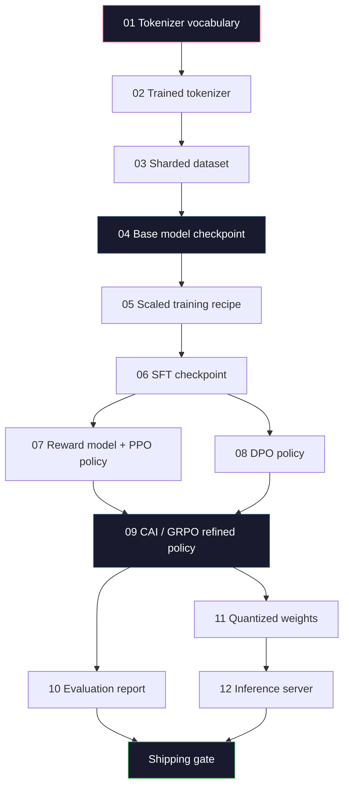
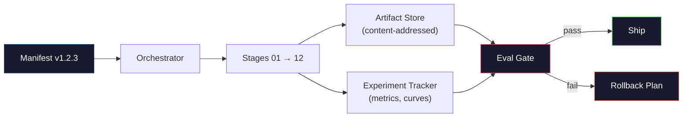

# Building a Complete LLM Pipeline

> Everything from Lessons 01 through 12 is a stage in a pipeline. This lesson is the scaffolding that turns those stages into an end-to-end run: tokenization, pretraining, scaling, SFT, alignment, evaluation, quantization, serving. You won't train a 70B model on a laptop. You'll produce the orchestration layer, the manifest, the eval gates, and the rollback plan — what frontier teams in 2026 use to decide what ships. This is the capstone.

**Type:** Build
**Languages:** Python (stdlib)
**Prerequisites:** Phase 10, all Lessons 01-12
**Time:** ~120 minutes

## Learning Objectives

- Combine the previous eleven lessons (tokenizer, data, pretraining, scaling, SFT, RLHF, DPO, CAI, eval, quantization, inference) into a reproducible pipeline spec
- Define artifact contracts between stages: what each stage consumes, what it produces, and how the next stage validates its inputs
- Build an orchestrator that tracks experiments, hashes artifacts, and gates shipping decisions on eval thresholds
- Design rollback plans: which artifacts are cheap to rerun, which are expensive, and what a corrupted checkpoint costs

## The Problem

Every previous lesson works. The tokenizer trained. The mini-GPT pretrained. The SFT dataset assembled. The reward model trained. DPO ran. Eval measured. Quantized weights exported. Inference served. Each one is a notebook. Each one has its own conventions, its own output paths, its own seeds.

A frontier training run is not a notebook. Llama 3 405B consumed roughly 30 million H100-hours over ~54 days. DeepSeek-V3 used about 2.8 million H800-hours. During that time, a corrupted checkpoint, a data contamination, an eval regression, can cost the team a week of wall-clock and a month of GPU budget. Teams survive these by pipeline hygiene: every stage has deterministic inputs, deterministic outputs, a manifest, a hash, a gate.

This is the capstone. You won't run this pipeline end-to-end on a laptop. You'll write the orchestrator that coordinates the stages, the manifest that describes the run, the validators that gate shipping decisions, and the replay plan that lets a third party rerun your work from a single file. The code is small; the discipline is large.

These patterns scale identically from 100M to 1T parameters. The same four components — manifest, orchestrator, eval gate, artifact store — run Llama 3 and your hobby GPT alike. The difference is the magnitude of numbers inside each stage's config, not the shape of the pipeline.

## The Concept

### The twelve stages

Each Phase 10 lesson is a stage. Here is the full dependency graph.



Stages 07 and 08 can run in parallel. Everything else is a hard dependency. A change in Stage 02 (tokenizer) invalidates every downstream artifact. A change in Stage 10 (eval) invalidates only the shipping decision.

### The manifest

A manifest is a single file that describes a run completely enough to replay it. Nothing the pipeline produces should depend on state not captured in the manifest. The fields are boring but mandatory.

```
pipeline_version: 1.2.3
seed: 42
git_commit: a1b2c3d4
stages:
  01_tokenizer:
    recipe: bpe_32k
    input_hash: sha256:...
    output_hash: sha256:...
    wall_clock_sec: 3600
    cost_usd: 12
```

Stage N's output hash is Stage N+1's input hash. Any deviation and the pipeline stops. This is how you catch data corruption early. It's also how a teammate on another continent verifies their replay produced the same artifacts as yours.

In practice teams use a small YAML schema plus a manifest checker that diffs against the last successful run. Any delta beyond expected fields (cost, wall-clock) is a red flag.

### Typed artifacts

Each stage's output is a typed artifact. Not a directory blob, not a pickle, but a named type with a known schema.

| Stage | Artifact Type | Key Fields |
|-------|--------------|-----------|
| 01-02 | Tokenizer | vocab.json, merges.txt, config.json, hash |
| 03 | Dataset | shards[], row count, token count, dedup stats |
| 04-05 | Checkpoint | weights.safetensors, config.json, optimizer state, step |
| 06 | SFT Model | checkpoint + SFT recipe + data mix |
| 07 | Reward Model | RM checkpoint + preference data hash |
| 08-09 | Policy | checkpoint + reference hash + beta + KL budget spent |
| 10 | Eval Report | benchmark scores + regression diff + eval data hash |
| 11 | Quantized Model | quantized weights + calibration data + accuracy delta from FP16 |
| 12 | Server Spec | endpoint + model hash + config + observability hooks |

Typing prevents the most common failure mode: feeding a Stage 08 output as a Stage 06 input, shipping a DPO-trained model through the SFT path. Typed artifacts and typed stage signatures make these mistakes compile-time failures, not day-five failures.

### Eval gates

Shipping is not "training is done". Shipping is "training is done AND the eval gate passes". Gates are defined before the run starts.

```
gates:
  mmlu:      >= baseline + 0.5   # no regression
  humaneval: >= baseline + 1.0
  truthfulqa: >= baseline         # no drop
  safety_refusal_rate: <= 0.05
  kl_from_reference: <= 25.0
  cost_total_usd: <= 50000
```

Every gate is a numeric threshold. No "looks good" gates. No subjective sign-offs. If every gate passes, the artifact is tagged shippable. If any fails, the run is held pending an explicit override by a named reviewer, and that override itself is recorded in the manifest.

Two gates catch most disasters. A *regression* gate (new model must be at least as good as previous on core benchmarks) catches training bugs. A *KL budget* gate (aligned policy must not drift more than X from its reference) catches alignment overshoot. Every production pipeline has both.

### The orchestrator

A small piece of code that reads the manifest, dispatches stages, tracks artifacts, and stops on any contract violation. This is not Airflow. This is not Kubeflow. For pipeline hygiene you want a boring thing you wrote yourself.

The orchestrator's responsibilities are narrow:

1. Parse the DAG from the manifest.
2. For each stage, check whether the expected output already exists with the correct hash (skip if yes).
3. Run the stage, capture stdout/stderr, measure wall-clock and cost.
4. Verify the output hash against the downstream stage's expected input hash.
5. On failure, write a partial manifest noting the exact failed stage and exit non-zero.

That's 200 lines of Python. It'll look like the `code/main.py` file in this lesson. Under the hood, real pipelines execute individual stages with `torchrun` or `ray` on a cluster, but the orchestrator itself runs on a single machine.

### Experiment tracking and artifact storage

Two external systems anchor the pipeline.

**Experiment tracker (wandb, neptune, mlflow).** Logs loss curves, eval metrics, system telemetry for each stage. When you need to compare run A to run B three weeks later, you go to the tracker. Teams almost always use a hosted tracker for this — building your own wastes time you should spend on training.

**Artifact store (S3, R2, GCS).** Immutable object storage for checkpoints, datasets, tokenizers, eval reports. Artifacts are addressed by hash, not by filename. A filename like `latest.pt` is a trap; `ckpt-7b-step-20000-sha256:abc123.safetensors` is a contract.

The orchestrator writes to both. The tracker is for humans viewing charts. The artifact store is for the next stage looking up its inputs.

### Cost accounting

A frontier run carries a dollar number. Budget discipline happens in two places.

**Pre-run estimation.** From the manifest, compute expected FLOPs (for pretraining: 6 x params x tokens), expected GPU-hours (FLOPs / peak throughput / utilization), and dollar cost at current rental rates. If the estimate exceeds the budget gate, the pipeline refuses to start.

**In-run tracking.** Per-stage wall-clock and cost are recorded in the manifest. After each stage, check remaining budget. If a stage overruns, the next stage's gate evaluates with the new remaining budget. You don't wait for the VC to call before discovering you're out of money.

Llama 3's reported cost is $61 million. DeepSeek-V3 reported $5.6 million for the main pretraining run. The ratio is mostly hardware efficiency plus mixture-of-experts — but the specific costs are visible because both teams track it per-stage, not per-run.

### Reproducible vs deterministic

These are not the same thing. *Reproducible* means same manifest + same code + same infrastructure yields a checkpoint with equivalent downstream metrics. *Deterministic* means bit-identical output.

Modern LLM training is reproducible but not deterministic. Reduction order in distributed training, GPU kernel non-determinism (cuBLAS, flash-attn), and mixed-precision rounding conspire to produce floats that differ at the 1e-5 level across runs. This is fine for invariant final metrics. It's fatal if you want to debug with bit-level diffs. The antidote is to record input hashes, output hashes, and headline metrics per stage — if those match, the run is "reproduced" even if weights aren't bit-identical.



### The rollback plan

Before the run starts, write down what to do when each stage fails. Three categories.

- **Cheap to rerun** (hours): tokenizer, eval, quantization, inference server. Just rerun.
- **Medium** (days): SFT, DPO, CAI. Keep the base model; rerun only the alignment stages.
- **Expensive** (weeks and millions of dollars): pretraining. The rollback plan here is not "rerun." It's "use the last good checkpoint and rerun the cheaper downstream stages with revised data."

Because stage dependencies are typed and hashed, the orchestrator can automatically compute the rollback set: invalidate the failed stage plus every one of its descendants. A failure at Stage 06 (SFT) invalidates 06, 07, 08, 09, 10, 11, 12. A failure at Stage 11 (quantization) invalidates only 11 and 12. Write this out in advance to avoid improvising at 4am when the team is exhausted.

### Production recipes observed in 2026

Most frontier teams converge on the same skeleton.

- Tokenizer: 128k BPE with byte fallback. Trained on a small, balanced multilingual slice.
- Pretraining: 10-20T tokens, mostly web plus code plus synthetic. Muon or AdamW optimizer. FSDP2 or DeepSpeed ZeRO-3. Gradient checkpointing. BF16 weights, FP32 master weights.
- SFT: 500K-2M instruction pairs, human and synthetic mix, strictly deduplicated against eval sets.
- Alignment: DPO or CAI + GRPO. RLHF only when preference signal is too many-dimensional for DPO.
- Eval: MMLU-Pro, MATH, HumanEval+, GPQA, SWE-Bench Verified, LiveBench, plus a private held-out set the public never sees.
- Quantization: 4-bit GPTQ or AWQ for serving, 8-bit for safety evals where accuracy delta matters.
- Serving: vLLM, TensorRT-LLM, or in-house. Continuous batching. Speculative decoding. KV cache eviction.

The numbers change every six months. The skeleton doesn't.

## Build It

This lesson's code is an orchestrator and a manifest checker, not twelve training scripts. Each stage is simulated by a placeholder that produces a correctly shaped and hashed output artifact. Running the orchestrator end-to-end proves the pipeline's plumbing works before you burn GPU dollars on real stages.

Full implementation in `code/main.py`. Key components:

- `Manifest` dataclass: pipeline version, seed, git commit, stages, gates.
- `Stage` dataclass: name, type, inputs (hashes), output (hash), wall-clock, cost.
- `Orchestrator.run()`: parse DAG, dispatch stages, verify hashes, update manifest.
- `EvalGate.check()`: read thresholds, compare with latest eval report, return pass/fail.
- `ArtifactStore` (in-memory stub): put/get by hash, simulating S3.
- `CostTracker`: per-stage and cumulative, halt on cap exceeded.

The pipeline in `main.py` runs twelve placeholder stages, produces a manifest, and fires a failing eval gate to show what a held run looks like. Replace each placeholder with the corresponding lesson's real training script and you have the skeleton frontier pipelines use.

## Use It

The canonical workflow has three commands.

```
python code/main.py plan    # validate manifest, compute cost estimate, print DAG
python code/main.py run     # execute stages, writing to manifest.out.yaml
python code/main.py gate    # read manifest.out.yaml, apply eval gates, ship-or-hold
```

Always run `plan` first. Most pipeline bugs are exposed at plan time — missing gate thresholds, stale hashes, budget overruns. Running `plan` is free. Running `run` is expensive. Catch bugs on the cheap side to save money.

The output of `gate` is either `SHIP` or `HOLD: <reason>`. A held run is not a failure; it's a decision point. A named reviewer either overrides (and the override is logged) or approves a rollback.

## Ship It

This lesson produces `outputs/skill-llm-pipeline-reviewer.md`. Feed it a proposed pipeline manifest and it checks all contracts: stage typing, hash chains, gates, rollback plan, cost estimation. It refuses to approve manifests that lack eval gates, have unbounded KL budgets, or mix eval and training data.

## Exercises

1. Extend the orchestrator to support parallel execution of Stages 07 and 08. Use the stdlib `concurrent.futures` module. Confirm the final manifest records both stages' outputs and that Stage 09's input hash is a deterministic combination of both.

2. Add a "contamination check" gate. Given the eval dataset hash and training dataset shards, compute overlap (exact string match or 13-gram matching). Gate fails if overlap exceeds 0.1%. Feed it a contaminated training set and confirm the gate holds the run.

3. Implement a cost estimator from first principles. For Stage 04 (pretraining), estimate FLOPs as 6 x params x tokens, assume 40% MFU (model FLOPs utilization) on H100, 989 TFLOPS BF16, $2.50/GPU-hour. Report the estimate for a 7B model trained on 2T tokens. Compare against the published Llama 2 numbers.

4. Do a partial rollback. Simulate Stage 09 (CAI) failing, then rerun stages 09 through 12 while keeping 01-08 cached. The orchestrator should detect cached artifacts by hash and skip them. Measure wall-clock savings vs a full rerun.

5. Add observability. Emit an OpenTelemetry span for each stage with attributes for parameters, tokens seen, loss, and cost. Send spans to a local collector. The point is not the dashboard; it's that each stage's health is traceable from a single trace ID.

## Key Terms

| Term | What people say | What it actually is |
|------|----------------|----------------------|
| Manifest | "The recipe file" | A YAML or JSON describing pipeline version, seed, per-stage config, and gate thresholds — enough to replay a run |
| Content-addressed | "By hash not by name" | Storing artifacts by SHA-256 of their content, so you never confuse version A with version B |
| Eval gate | "Shipping criteria" | Numeric thresholds on benchmark metrics and safety scores that must pass before an artifact is tagged shippable |
| KL budget | "How far alignment drifted" | A cap on cumulative KL(policy \|\| reference) across alignment stages, enforced as a gate |
| MFU | "How much of your GPU you use" | Model FLOPs utilization — actual FLOPs divided by theoretical peak. Typical 40% at 70B, 55% at 7B |
| Rollback plan | "What we do when it breaks" | A pre-written set of actions for each stage's failure: rerun, fall back, retrain with revised inputs |
| Orchestrator | "The conductor" | A process that reads the manifest, dispatches stages, verifies hashes, and stops on any contract violation |
| Artifact store | "Versioned S3 for weights" | Immutable content-addressed object storage — the single source of truth for checkpoints, datasets, eval reports |
| Reproducible | "Replay gives same metrics" | Bit-different weights but equivalent downstream metrics — the realistic goal for distributed LLM training |
| Cost gate | "You can't spend more than X" | Pre-run cost estimate plus in-run tracker — if estimate exceeds budget the pipeline refuses to start |

## Further Reading

- [Dubey et al., 2024 -- "The Llama 3 Herd of Models"](https://arxiv.org/abs/2407.21783) -- The most detailed public description of a frontier pipeline, covering data, training, alignment, eval
- [DeepSeek-AI, 2024 -- "DeepSeek-V3 Technical Report"](https://arxiv.org/abs/2412.19437) -- Efficiency-first pipeline at ~1/10th the cost of Llama 3-scale training
- [Kaplan et al., 2020 -- "Scaling Laws for Neural Language Models"](https://arxiv.org/abs/2001.08361) -- The original compute-data-parameter scaling relationship
- [Hoffmann et al., 2022 -- "Training Compute-Optimal Large Language Models (Chinchilla)"](https://arxiv.org/abs/2203.15556) -- Correction to Kaplan that recalibrated modern data budgets
- [PyTorch FSDP2 documentation](https://pytorch.org/docs/stable/fsdp.html) -- The distributed training primitive that replaced FSDP1 in PyTorch 2.4+
- [Weights & Biases LLM Reports](https://wandb.ai/site/llms) -- Real manifests and experiment tracker outputs from open-source LLM runs, usable as templates to copy
