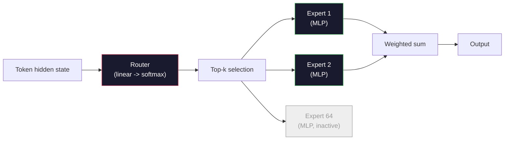

# Open Models: Architecture Walkthroughs

> You built a GPT-2 Small from scratch in Lesson 04. The frontier open models of 2026 are the same family, plus five or six specific changes. RMSNorm replaces LayerNorm. SwiGLU replaces GELU. RoPE replaces learned positional embeddings. GQA or MLA replaces full MHA. Scaled Mixture-of-Experts. The math you already know covers 95% of them. This lesson reads Llama 3, DeepSeek-V3, Mixtral, Qwen, and Gemma side by side, pointing out the exact line where each architecture forks.

**Type:** Learn
**Languages:** Python (stdlib)
**Prerequisites:** Phase 10, Lessons 04, 05, 12 (Pretraining, Scaling, Inference)
**Time:** ~45 minutes

## Learning Objectives

- Read the config.json of Llama 3, Mistral, Mixtral, Gemma 2, Qwen 2.5, and DeepSeek-V3, and explain every field
- Point out the specific architectural changes each model makes relative to GPT-2 Small and justify them from first principles
- Calculate parameter count, KV cache size, and activation memory from a model's config alone
- Choose the right open model for a deployment target given latency, memory, and capability constraints

## The Problem

In Lesson 04 you wrote 350 lines of numpy and got a GPT-2-shaped model. Llama 3 405B has a 200-page technical report. Your intuition is that these are different beasts. They're not. Those 200 pages describe the same object plus five or six well-motivated modifications plus a thousand implementation details about scaling. The skeleton — embedding, transformer block, attention, MLP, norm, head — hasn't changed.

This lesson is a diff. For each major open model family, we list exactly what it changed relative to GPT-2, why, and what it costs. After reading, you can pick up any new model card and translate it in your head back to the GPT-2 baseline.

The practical payoff is: when Meta releases Llama 5 or DeepSeek releases V4, you don't need a new mental model. You look at the config, see which well-known knob moved, and know what the downstream implications are. The architecture of 2026 is a finite toolkit. Every new model picks a different subset.

## The Concept

### The invariant core

All autoregressive open models share:

- Token embedding matrix (vocab_size x hidden_dim).
- A stack of N decoder blocks: norm, self-attention, residual, norm, MLP, residual.
- Final norm and a linear head projecting to vocab_size (often sharing weights with the embedding).
- Causal mask, cross-entropy loss on the next token.

That's the shape. Everything else is a knob.

### The six knobs that actually move

Across every frontier open model from 2024-2026, the same six design choices get picked:

1. **Normalization.** LayerNorm -> RMSNorm.
2. **Positional encoding.** Learned absolute -> RoPE (with variants: YaRN, NTK).
3. **Activation.** GELU -> SwiGLU (or GeGLU).
4. **Attention head sharing.** MHA -> GQA -> MQA -> MLA.
5. **Dense vs sparse MLP.** Dense -> Mixture-of-Experts.
6. **Pre-norm placement.** Pre-norm stays. Post-norm is gone.

Everything else (learning rate schedule, data mix, batch size, context length) lives in the training config, not the architecture. Six knobs.

### Knob 1: RMSNorm

LayerNorm subtracts mean, divides by std, scales, shifts. RMSNorm keeps only the scaling:

```
RMSNorm(x) = x / sqrt(mean(x^2) + eps) * gamma
```

No mean subtraction. No bias. One fewer matmul per token. Zhang and Sennrich (2019) argued it matches LayerNorm on machine translation while being 10% faster. Every modern open model runs it.

Cost: none. Benefit: small throughput improvement, simpler code.

### Knob 2: RoPE

Learned positional embeddings in GPT-2 are a lookup table of 1024 slots. Context 1025 falls off the end of the table. The model can't extrapolate beyond its training length.

Rotary Positional Encoding (RoPE, Su et al. 2021) injects position by rotating each Q and K vector pairwise before the attention dot product. The rotation angle is a deterministic function of position, so there's nothing to learn and nothing that runs out. With scaling tricks (NTK-aware interpolation, YaRN), a model trained on 8k context can stretch to 128k at inference with modest accuracy loss.

```
q_rotated = rotate(q, angle(pos))
k_rotated = rotate(k, angle(pos))
score = q_rotated . k_rotated
```

Every Llama, Mistral, Qwen, DeepSeek, and Gemma uses RoPE. Gemma 2 uses a hybrid (RoPE on most layers, local sliding-window attention on the rest).

### Knob 3: SwiGLU

GPT-2's MLP is `x -> gelu(xW1 + b1) -> (...)W2 + b2`. SwiGLU (Shazeer 2020) replaces the activation with a gated product:

```
SwiGLU(x) = (xW1) * sigmoid(xW1) * xV
```

Two parallel projections instead of one, gated by the Swish activation. Empirically stronger perplexity per parameter. Llama 2 adopted it, everyone followed. The MLP's hidden size is typically set so total parameter count matches the original dense MLP: if GPT-2 uses `ff_dim = 4 * hidden`, SwiGLU uses `ff_dim = (2/3) * 4 * hidden = 8/3 * hidden`.

### Knob 4: Attention head sharing

GPT-2 uses **Multi-Head Attention (MHA)**: each head has its own Q, K, V projections.

**Multi-Query Attention (MQA, Shazeer 2019)** shares a single K and a single V across all heads. Cuts KV cache by num_heads factor, a 12x to 32x reduction on typical models. Slight accuracy drop on hard benchmarks.

**Grouped-Query Attention (GQA, Ainslie et al. 2023)** is the middle ground: G groups of Q heads share one K and one V. Llama 3 8B uses GQA with 32 Q heads, 8 KV heads (G=8), so the KV cache shrinks 4x compared to full MHA.

**Multi-Head Latent Attention (MLA, DeepSeek 2024)** compresses K and V into a shared low-rank latent representation, then projects back per-head. Further reduces KV cache while preserving per-head expressiveness. DeepSeek-V2 and V3 rely on it for long-context performance.

| Scheme | KV Heads | KV Cache | Accuracy |
|--------|----------|----------|----------|
| MHA    | num_heads | Full | Best |
| GQA    | num_groups (G < num_heads) | Reduced num_heads / G | Near MHA |
| MQA    | 1 | Reduced num_heads | Slight drop |
| MLA    | Latent, decompressed per-head | Smaller than MQA | Near MHA |

For any model above ~13B parameters, GQA or MLA is effectively mandatory. Full MHA at scale is a KV cache disaster.

### Knob 5: Mixture of Experts

A dense MLP activates all its parameters for every token. An MoE MLP has K experts per block and a router that picks top-k experts per token (typically top-2). Only those experts' weights do a forward pass for that token.

```
router_logits = xW_r
indices, weights = top_k(router_logits, k=2)
output = sum_i weights[i] * expert[indices[i]](x)
```

The appeal: you can have 64 experts each 7B-sized (so total parameters are enormous) but only run 2 of them per token (so per-token compute matches a dense 7B model). Mixtral 8x7B has 47B total params but activates only 13B per token. DeepSeek-V3 has 671B total params but activates only 37B per token.



Upside: same compute, more parameters, better capacity. Downside: expert memory still lives somewhere (so serving needs more VRAM than a dense equivalent), load-balancing the router is hard, and fine-tuning the router itself during alignment is an active research area.

### Knob 6: Pre-norm stays

The original transformer applied layer norm after each sublayer. Every open model since GPT-2 puts it *before* each sublayer instead. Pre-norm is strictly easier to train at depth. There's nothing to debate.

### Per-model diff

The table below makes it concrete.

| Model | Year | Total Params | Active Params | Norm | Activation | Position | Attention | MoE | Context |
|-------|------|-------------|---------------|------|-----------|----------|-----------|-----|---------|
| GPT-2 Small | 2019 | 124M | 124M | LayerNorm | GELU | Learned | MHA (12 heads) | No | 1k |
| Llama 3 8B | 2024 | 8B | 8B | RMSNorm | SwiGLU | RoPE | GQA (32/8) | No | 128k |
| Llama 3 70B | 2024 | 70B | 70B | RMSNorm | SwiGLU | RoPE | GQA (64/8) | No | 128k |
| Llama 3 405B | 2024 | 405B | 405B | RMSNorm | SwiGLU | RoPE | GQA (128/16) | No | 128k |
| Mistral 7B | 2023 | 7.2B | 7.2B | RMSNorm | SwiGLU | RoPE | GQA | No | 32k |
| Mixtral 8x7B | 2023 | 47B | 13B | RMSNorm | SwiGLU | RoPE | GQA | Yes (8 experts, top-2) | 32k |
| Gemma 2 9B | 2024 | 9B | 9B | RMSNorm (pre+post) | GeGLU | RoPE + sliding | GQA | No | 8k |
| Qwen 2.5 72B | 2024 | 72B | 72B | RMSNorm | SwiGLU | RoPE (YaRN) | GQA (64/8) | No | 128k |
| DeepSeek V2 236B | 2024 | 236B | 21B | RMSNorm | SwiGLU | RoPE | MLA | Yes (160 experts, top-6) | 128k |
| DeepSeek V3 | 2024 | 671B | 37B | RMSNorm | SwiGLU | RoPE | MLA | Yes (256 experts, top-8) | 128k |

Scan the columns. RMSNorm is universal. SwiGLU or its GeGLU cousin is universal. RoPE is universal. GQA above 7B is universal unless replaced by MLA. MoE is the differentiator at the top end.

### Reading a config.json

Llama 3 8B config:

```
{
  "hidden_size": 4096,
  "intermediate_size": 14336,
  "num_hidden_layers": 32,
  "num_attention_heads": 32,
  "num_key_value_heads": 8,
  "max_position_embeddings": 131072,
  "rope_theta": 500000.0,
  "rms_norm_eps": 1e-5,
  "vocab_size": 128256
}
```

Every field maps to something you've already implemented.

- `hidden_size`: embedding dimension.
- `intermediate_size`: MLP hidden size (3.5x hidden — the SwiGLU formula).
- `num_hidden_layers`: stack depth.
- `num_attention_heads`: Q heads.
- `num_key_value_heads`: KV heads (GQA).
- `max_position_embeddings`: training context length.
- `rope_theta`: RoPE base frequency. Meta scaled it from the default 10k to 500k for long-context extrapolation.
- `rms_norm_eps`: numerical stability.
- `vocab_size`: token count.

From these alone you can compute total parameters, KV cache, and peak activation memory. Exact formulas in `code/main.py`.

### Activation memory budget

Above a few billion parameters, activations dominate training memory. Rule of thumb for pretraining (with gradient checkpointing):

```
activation_mem ~ batch_size * seq_len * hidden_size * num_layers * bytes_per_element
```

For Llama 3 8B at batch 1, seq 8192, BF16, 32 layers, hidden 4096: activations alone are ~8 GB with checkpointing, 40 GB without. This is why flash-attention and ring-attention matter — they rewrite the attention computation so activations fit.

### KV cache budget

Inference at max context:

```
kv_cache = 2 * num_layers * num_kv_heads * head_dim * max_seq_len * bytes_per_element
```

Llama 3 8B at 128k context, BF16, head_dim = hidden / num_heads = 128:
`2 * 32 * 8 * 128 * 131072 * 2 = 17.2 GB` per sequence.

The 8B weights in BF16 are 16 GB. The KV cache for a single 128k sequence is larger than the weights. This is the memory pressure driving GQA, MLA, and KV cache quantization research.

### When each model wins

- **Single 80GB GPU, no MoE**: Llama 3 8B, Mistral 7B, Gemma 2 9B. Easy to serve, wide tooling support.
- **Single node (8x 80GB), large capacity**: Llama 3 70B, Qwen 2.5 72B. Highest dense open capability.
- **Highest open capability, accepting MoE complexity**: DeepSeek V3, Mixtral 8x22B. Best capability per active FLOP.
- **Long-context requirements**: Llama 3 (RoPE scaled to 128k), DeepSeek (MLA advantage).
- **Low-latency serving**: Gemma 2 9B (sliding window cuts long-context compute).

## Build It

This lesson's code is a calculator. Given any config.json, it prints parameter count per component, KV cache at max context, SwiGLU MLP ratio, and a short verdict on the architecture (dense / GQA / MLA / MoE).

```python
config = {
    "hidden_size": 4096, "intermediate_size": 14336,
    "num_hidden_layers": 32, "num_attention_heads": 32,
    "num_key_value_heads": 8, "vocab_size": 128256,
    "max_position_embeddings": 131072,
}
```

The script walks through the architecture field by field, computing parameters for embedding, attention (with GQA reduction), MLP (with SwiGLU expansion), layernorm, and head. Then it computes KV cache for the stated context length and prints a summary.

Implementation in `code/main.py`.

## Use It

Run the calculator on the bundled configs for Llama 3 8B, Mistral 7B, Mixtral 8x7B, and DeepSeek V3. Compare parameter breakdowns. Notice that MoE models' total parameters dwarf dense models, but active parameters are often smaller. Notice that DeepSeek V3's KV cache is smaller than Llama 3 405B's despite having more total parameters — that's MLA at work.

Then plug in the config of any model you have locally, read the summary, and decide whether it fits on your GPU.

## Ship It

This lesson produces `outputs/skill-open-model-picker.md`. Given a deployment target (GPU type, VRAM, context length, latency budget) and a task profile (chat, code, reasoning, long-context), it recommends an open model, a quantization scheme from Lesson 11, and an inference stack from Lesson 12, with explicit reasoning about the six architectural knobs.

## Exercises

1. Read Qwen 2.5 72B's config from HuggingFace. Compute total parameters from scratch. Compare against the HF-reported value and find where any discrepancy comes from (head dimension rounding, KV sharing factor, etc.).

2. DeepSeek V3 uses 256 experts, top-8 routing. Calculate the active-to-total expert ratio and compare with Mixtral 8x7B's 8-of-8 top-2. What does the shift from sparse (25%) to even sparser (3%) mean for capacity per FLOP?

3. Compute the KV cache for Llama 3 405B at 128k context in FP8 and BF16. The FP8 number is half the BF16 number. On a single 8xH100 node (80GB each = 640GB total, minus weight memory), how many concurrent sequences can you serve?

4. Gemma 2 alternates between full attention and sliding-window attention layers. Write the formula for KV cache when half the layers use a 4096-token sliding window instead of full context. How much memory does this save at 8k total context?

5. Find a recent frontier open model released after this lesson was written. Identify which of the six knobs it picked, and whether it introduces a seventh knob. The moment a new architecture ships, this lesson looks dated — the goal is to update your table, not rebuild your mental model.

## Key Terms

| Term | What people say | What it actually is |
|------|----------------|----------------------|
| RMSNorm | "LayerNorm without the mean" | Normalizes by root-mean-square only, with a learned scale — cheaper than LayerNorm and equivalent |
| RoPE | "Rotary positional" | Pairwise 2D rotation of each Q and K vector by a position-dependent angle — extrapolates beyond training length with scaling tricks |
| SwiGLU | "The new MLP activation" | Gated Linear Unit with Swish: `(xW1) * sigmoid(xW1) * xV` — standard in every 2024+ open model |
| GQA | "Middle-ground attention" | Grouped-Query Attention: G groups of Q heads share one K and one V head — shrinks KV cache without MQA's accuracy hit |
| MLA | "DeepSeek's attention" | Multi-Head Latent Attention: compresses K/V into a shared low-rank latent, decompresses per-head — smallest KV cache for large models |
| MoE | "Sparse experts" | Mixture of Experts: N MLPs per block, router picks top-k per token — massive total params, small active params |
| Top-k routing | "Pick k experts per token" | The router scores each expert, activates the top-k — typical k is 2 (Mixtral) to 8 (DeepSeek) |
| YaRN | "Stretch RoPE" | Yet another RoPE Extension — interpolates rotation angles to stretch context from 8k to 128k+ at inference |
| Sliding-window attention | "Don't attend to everything" | Each token attends only to the most recent W tokens — caps attention cost at O(W) per token, used in Gemma 2 and early Mistral |
| Active parameters | "What runs per token" | For MoE models, the parameters that do a forward pass per token (much less than total) — determines per-token FLOPs |

## Further Reading

- [Dubey et al., 2024 -- "The Llama 3 Herd of Models"](https://arxiv.org/abs/2407.21783) -- Architecture and training reference for the dense Llama 3 family
- [DeepSeek-AI, 2024 -- "DeepSeek-V3 Technical Report"](https://arxiv.org/abs/2412.19437) -- MLA plus auxiliary-loss-free load balancing plus 671B MoE
- [Jiang et al., 2024 -- "Mixtral of Experts"](https://arxiv.org/abs/2401.04088) -- The classic MoE open model paper
- [Su et al., 2021 -- "RoFormer: Enhanced Transformer with Rotary Position Embedding"](https://arxiv.org/abs/2104.09864) -- The RoPE paper
- [Shazeer, 2020 -- "GLU Variants Improve Transformer"](https://arxiv.org/abs/2002.05202) -- SwiGLU, GeGLU, and friends
- [Ainslie et al., 2023 -- "GQA: Training Generalized Multi-Query Transformer Models"](https://arxiv.org/abs/2305.13245) -- The GQA paper
- [Gemma 2 Team, 2024 -- "Gemma 2: Improving Open Language Models at a Practical Size"](https://arxiv.org/abs/2408.00118) -- Hybrid full + sliding attention, pre + post norm
- [Qwen Team, 2024 -- "Qwen 2.5 Technical Report"](https://arxiv.org/abs/2412.15115) -- YaRN context extension and long-context training recipe
