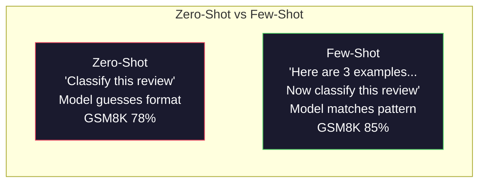
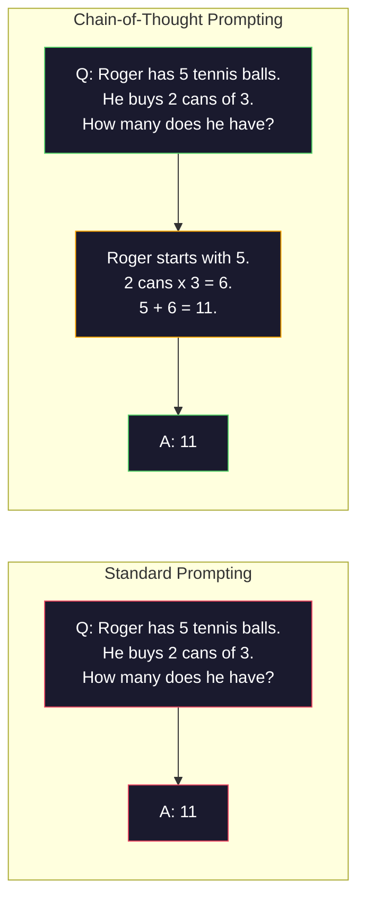
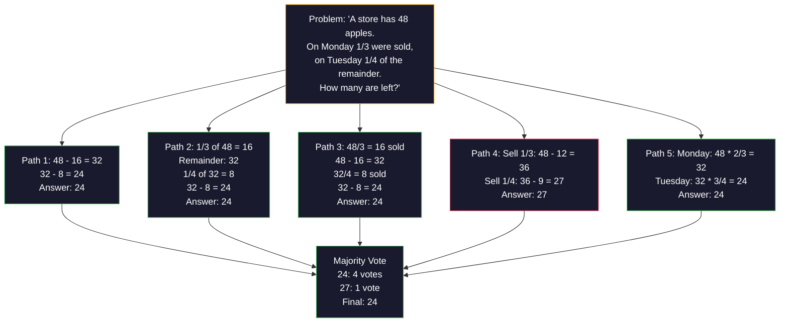
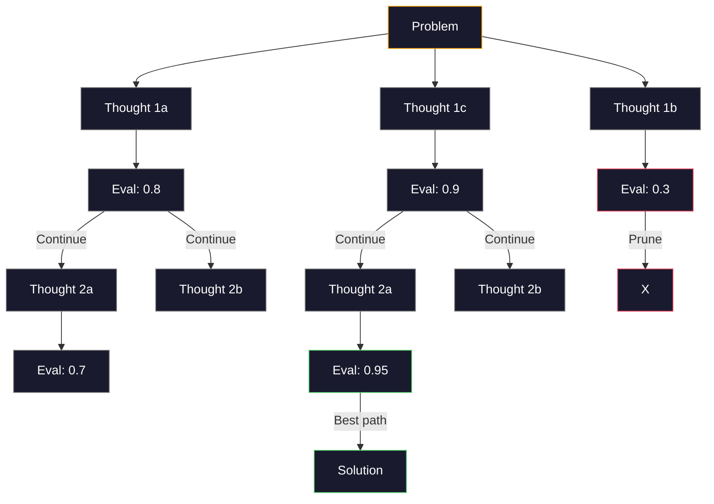

# Few-Shot, Chain-of-Thought, Tree-of-Thought

> Telling a model what to do is prompting. Teaching it how to think is engineering. The gap between 78% and 91% accuracy on the same model, same task, same data isn't a better model — it's a better reasoning strategy.

**Type:** Build
**Languages:** Python
**Prerequisites:** Lesson 11.01 (Prompt Engineering)
**Time:** ~45 minutes

## Learning Objectives

- Implement few-shot prompting: select and format example demonstrations to maximize task accuracy
- Apply chain-of-thought (CoT) reasoning to improve accuracy on multi-step problems like math word problems
- Build a tree-of-thought prompt that explores multiple reasoning paths and selects the best one
- Measure accuracy gains from zero-shot, few-shot, and CoT on standard benchmarks

## The Problem

You're building a math tutoring app. Your prompt says: "Solve this word problem." On GSM8K, the standard elementary math benchmark, GPT-5 gets it right 94% of the time. You think that's the ceiling. It's not — chain-of-thought can add 3-4 more points.

Add five words — "Let's think step by step" — and accuracy jumps to 91%. Add a few worked examples, and it hits 95%. Same model, same temperature, same API cost. The only difference is you gave the model a scratch pad.

This isn't a hack — it's how reasoning works. Humans don't solve multi-step problems in one mental leap, and neither do transformers. When you force the model to generate intermediate tokens, those tokens become part of the context for the next token. Each reasoning step feeds the next. The model literally computes its way to the answer.

But "think step by step" is a starting point, not the end. What if you sample five reasoning paths and majority-vote? What if you have the model explore a tree of possibilities, evaluating and pruning branches? What if you interleave reasoning with tool calls? These aren't hypotheticals. They're published techniques with measured improvements, and you'll build all of them in this lesson.

## The Concept

### Zero-Shot vs Few-Shot: When Examples Beat Instructions

Zero-shot prompting gives the model a task and nothing else. Few-shot prompting gives it examples first.

Wei et al. (2022) measured this across 8 benchmarks. For simple tasks like sentiment classification, zero-shot and few-shot perform within 2% of each other. For complex tasks — multi-step arithmetic, symbolic reasoning — few-shot improves accuracy by 10-25%.

The intuition: examples are compressed instructions. Instead of describing the output format, show it. Instead of explaining the reasoning process, demonstrate it. The model pattern-matches on examples far more reliably than it interprets abstract instructions.



**Few-shot wins when:** Format-sensitive tasks, classification, structured extraction, domain-specific terminology, and any task that requires the model to match a specific pattern.

**Zero-shot wins when:** Simple factual questions, creative tasks where examples would constrain creativity, and tasks where finding good examples is harder than writing good instructions.

### Example Selection: Similar Beats Random

Not all examples are equally useful. Selecting examples similar to the target input improves classification tasks by 5-15% over random selection (Liu et al., 2022). Three principles:

1. **Semantic similarity**: Pick examples closest to the input in embedding space
2. **Label diversity**: Cover all output classes in your examples
3. **Difficulty matching**: Match the complexity of the target problem

The sweet spot for most tasks is 3-5 examples. Fewer than 3 and the model doesn't have enough signal to extract patterns. More than 5 and you hit diminishing returns while wasting context window tokens. For classification with many labels, use one example per label.

### Chain-of-Thought: Giving the Model a Scratch Pad

Chain-of-thought (CoT) prompting was introduced by Wei et al. (2022) at Google Brain. The idea is simple: instead of asking the model for just the answer, ask it to write out its reasoning steps first.



Mechanistically, why does this work? Every token a transformer generates becomes context for the next token. Without CoT, the model must compress all reasoning into hidden states of a single forward pass. With CoT, the model externalizes intermediate computations as tokens. Each reasoning token extends the effective computation depth.

**GSM8K benchmark (elementary math, 8.5K problems):**

| Model | Zero-Shot | Zero-Shot CoT | Few-Shot CoT |
|-------|-----------|---------------|--------------|
| GPT-4o | 78% | 91% | 95% |
| GPT-5 | 94% | 97% | 98% |
| o4-mini (reasoning) | 97% | — | — |
| Claude Opus 4.7 | 93% | 97% | 98% |
| Gemini 3 Pro | 92% | 96% | 98% |
| Llama 4 70B | 80% | 89% | 94% |
| DeepSeek-V3.1 | 89% | 94% | 96% |

**A note on reasoning models.** Models like OpenAI's o-series (o3, o4-mini) and DeepSeek-R1 run chain-of-thought internally before producing an answer. Adding "Let's think step by step" to reasoning models is redundant and sometimes counterproductive — they already do this.

CoT comes in two flavors:

**Zero-shot CoT**: Append "Let's think step by step" to the prompt. No examples needed. Kojima et al. (2022) showed this single phrase improves accuracy on arithmetic, commonsense, and symbolic reasoning tasks.

**Few-shot CoT**: Provide examples with reasoning steps included. More effective than zero-shot CoT because the model sees the exact reasoning format you expect.

**When CoT hurts**: Simple fact recall ("What is the capital of France?"), single-step classification, and tasks where speed matters more than accuracy. CoT adds 50-200 tokens of reasoning overhead per query. For high-throughput, low-complexity tasks, that's wasted cost.

### Self-Consistency: Sample Many, Vote Once

Wang et al. (2023) introduced self-consistency. The insight: a single CoT path may contain reasoning errors. But if you sample N independent reasoning paths (with temperature > 0) and majority-vote on the final answer, errors cancel out.



In the original PaLM 540B experiments, self-consistency improved GSM8K accuracy from 56.5% (single CoT) to 74.4% with N=40. On GPT-5 the gain is small (97% to 98%) because base accuracy is already saturated. The technique shines most on models with base CoT accuracy in the 60-85% range — the sweet spot where single-path errors are frequent but not systematic. For reasoning models (o-series, R1), self-consistency is subsumed by built-in internal sampling.

The cost: N samples means N× the API cost and latency. In practice, N=5 captures most of the benefit. N=3 is the minimum for meaningful voting. Beyond N=10, returns diminish for most tasks.

### Tree-of-Thought: Branching Exploration

Yao et al. (2023) introduced Tree-of-Thought (ToT). Where CoT follows a single linear reasoning path, ToT explores multiple branches and evaluates which are most promising before continuing.



ToT has three components:

1. **Thought generation**: Produce multiple candidate next steps
2. **State evaluation**: Score each candidate (can use the LLM itself as evaluator)
3. **Search algorithm**: BFS or DFS over the tree, pruning low-scoring branches

On the Game of 24 task (use four numbers with arithmetic to make 24), GPT-4 with standard prompting solves 7.3%. With CoT it's 4.0% (CoT actually hurts here because the search space is too wide). With ToT it's 74%.

ToT is expensive. Every node in the tree requires an LLM call. A tree with branching factor 3 and depth 3 requires up to 39 LLM calls. Use it only for problems where the search space is large but evaluable — planning, puzzles, constrained creative problem-solving.

### ReAct: Think + Act

Yao et al. (2022) combined reasoning traces with actions. The model alternates between thinking (generating reasoning) and acting (calling tools, searching, computing).

```mermaid
graph LR
    Q["Question:\nWhat is the population\nof the country where\nthe Eiffel Tower is?"]
    T1["Think: I need to\nfind which country\nhas the Eiffel Tower"]
    A1["Act: Search\n'Eiffel Tower location'"]
    O1["Observe:\nParis, France"]
    T2["Think: Now I need\nFrance's population"]
    A2["Act: Search\n'France population 2024'"]
    O2["Observe:\n68.4 million"]
    T3["Think: I have\nthe answer"]
    F["Answer:\n68.4 million"]

    Q --> T1 --> A1 --> O1 --> T2 --> A2 --> O2 --> T3 --> F

    style Q fill:#1a1a2e,stroke:#ffa500,color:#fff
    style T1 fill:#1a1a2e,stroke:#51cf66,color:#fff
    style A1 fill:#1a1a2e,stroke:#e94560,color:#fff
    style O1 fill:#1a1a2e,stroke:#808080,color:#fff
    style T2 fill:#1a1a2e,stroke:#51cf66,color:#fff
    style A2 fill:#1a1a2e,stroke:#e94560,color:#fff
    style O2 fill:#1a1a2e,stroke:#808080,color:#fff
    style T3 fill:#1a1a2e,stroke:#51cf66,color:#fff
    style F fill:#1a1a2e,stroke:#51cf66,color:#fff
```



On knowledge-intensive tasks, ReAct outperforms pure CoT because it can ground reasoning in real data. On HotpotQA (multi-hop QA), GPT-4 with ReAct achieves 35.1% exact match vs 29.4% with CoT alone. The real power is that reasoning errors get corrected by observations — the model can update its plan mid-execution.

ReAct is the foundation of modern AI agents. Every agent framework (LangChain, CrewAI, AutoGen) implements some variant of the Thought-Action-Observation loop. You'll build full agents in Phase 14. This lesson covers the prompting pattern.

### Structured Prompting: XML Tags, Delimiters, Headers

As prompts get complex, structure prevents the model from confusing sections. Three approaches:

**XML tags** (best with Claude, works everywhere):
```
<context>
You are reviewing a pull request.
The codebase uses TypeScript and React.
</context>

<task>
Review the following diff for bugs, security issues, and style violations.
</task>

<diff>
{diff_content}
</diff>

<output_format>
List each issue with: file, line, severity (critical/warning/info), description.
</output_format>
```

**Markdown headers** (universal):
```
## Role
Senior security engineer at a fintech company.

## Task
Analyze this API endpoint for vulnerabilities.

## Input
{api_code}

## Rules
- Focus on OWASP Top 10
- Rate each finding: critical, high, medium, low
- Include remediation steps
```

**Delimiters** (minimal but effective):
```
---INPUT---
{user_text}
---END INPUT---

---INSTRUCTIONS---
Summarize the above in 3 bullet points.
---END INSTRUCTIONS---
```

### Prompt Chaining: Sequential Decomposition

Some tasks are too complex for a single prompt. Prompt chaining breaks them into multiple steps where one prompt's output becomes the next prompt's input.


Chaining beats a single prompt for three reasons:

1. **Each step is simpler**: The model handles one focused task rather than juggling everything at once
2. **Intermediate outputs are inspectable**: You can validate and correct between steps
3. **Different steps can use different models**: Cheap models for extraction, expensive models for reasoning

### Performance Comparison

| Technique | Best For | GSM8K Accuracy (GPT-5) | API Calls | Token Overhead | Complexity |
|-----------|----------|------------------------|-----------|----------------|------------|
| Zero-Shot | Simple tasks | 94% | 1 | None | Minimal |
| Few-Shot | Format matching | 96% | 1 | 200-500 tokens | Low |
| Zero-Shot CoT | Quick reasoning boost | 97% | 1 | 50-200 tokens | Minimal |
| Few-Shot CoT | Max single-call accuracy | 98% | 1 | 300-600 tokens | Low |
| Self-Consistency (N=5) | High-stakes reasoning | 98.5% | 5 | 5× token cost | Medium |
| Reasoning Models (o4-mini) | Drop-in CoT replacement | 97% | 1 | Hidden (2-10× internal) | Minimal |
| Tree-of-Thought | Search/planning problems | N/A (74% on Game of 24) | 10-40+ | 10-40× token cost | High |
| ReAct | Grounded reasoning | N/A (35.1% on HotpotQA) | 3-10+ | Variable | High |
| Prompt Chaining | Complex multi-step tasks | 96% (pipeline) | 2-5 | 2-5× token cost | Medium |

Choosing the right technique depends on three factors: accuracy requirements, latency budget, and cost tolerance. For most production systems, few-shot CoT with self-consistency (N=3) as a fallback covers 90% of use cases.

## Build It

We'll build a math problem solver that combines few-shot prompting, chain-of-thought reasoning, and self-consistency voting into a single pipeline. Then we add tree-of-thought for hard problems.

The full implementation is in `code/advanced_prompting.py`. Below are the key components.

### Step 1: Few-Shot Example Bank

The first component manages few-shot examples and selects the most relevant ones for a given problem.

```python
GSM8K_EXAMPLES = [
    {
        "question": "Janet's ducks lay 16 eggs per day. She eats three for breakfast every morning and bakes muffins for her friends every day with four. She sells every egg at the farmers' market for $2. How much does she make every day at the farmers' market?",
        "reasoning": "Janet's ducks lay 16 eggs per day. She eats 3 and bakes 4, using 3 + 4 = 7 eggs. So she has 16 - 7 = 9 eggs left. She sells each for $2, so she makes 9 * 2 = $18 per day.",
        "answer": "18"
    },
    ...
]
```

Each example has three parts: question, reasoning chain, and final answer. The reasoning chain is what turns an ordinary few-shot example into a CoT few-shot example.

### Step 2: Chain-of-Thought Prompt Builder

The prompt builder assembles a system message, few-shot examples with reasoning chains, and the target question into a single prompt.

```python
def build_cot_prompt(question, examples, num_examples=3):
    system = (
        "You are a math problem solver. "
        "For each problem, show your step-by-step reasoning, "
        "then give the final numerical answer on the last line "
        "in the format: 'The answer is [number]'."
    )

    example_text = ""
    for ex in examples[:num_examples]:
        example_text += f"Q: {ex['question']}\n"
        example_text += f"A: {ex['reasoning']} The answer is {ex['answer']}.\n\n"

    user = f"{example_text}Q: {question}\nA:"
    return system, user
```

That format constraint ("The answer is [number]") is critical. Without it, self-consistency can't extract and compare answers across samples.

### Step 3: Self-Consistency Voting

Sample N reasoning paths and take the majority answer.

```python
def self_consistency_solve(question, examples, client, model, n_samples=5):
    system, user = build_cot_prompt(question, examples)

    answers = []
    reasonings = []
    for _ in range(n_samples):
        response = client.chat.completions.create(
            model=model,
            messages=[
                {"role": "system", "content": system},
                {"role": "user", "content": user}
            ],
            temperature=0.7
        )
        text = response.choices[0].message.content
        reasonings.append(text)
        answer = extract_answer(text)
        if answer is not None:
            answers.append(answer)

    vote_counts = Counter(answers)
    best_answer = vote_counts.most_common(1)[0][0] if vote_counts else None
    confidence = vote_counts[best_answer] / len(answers) if best_answer else 0

    return best_answer, confidence, reasonings, vote_counts
```

Temperature 0.7 matters. At temperature 0.0, all N samples would be identical, defeating the purpose. You need enough randomness to produce diverse reasoning paths, but not so much that the model starts hallucinating.

### Step 4: Tree-of-Thought Solver

For problems where linear reasoning fails, ToT explores multiple approaches and evaluates which direction is most promising.

```python
def tree_of_thought_solve(question, client, model, breadth=3, depth=3):
    thoughts = generate_initial_thoughts(question, client, model, breadth)
    scored = [(t, evaluate_thought(t, question, client, model)) for t in thoughts]
    scored.sort(key=lambda x: x[1], reverse=True)

    for current_depth in range(1, depth):
        next_thoughts = []
        for thought, score in scored[:2]:
            extensions = extend_thought(thought, question, client, model, breadth)
            for ext in extensions:
                ext_score = evaluate_thought(ext, question, client, model)
                next_thoughts.append((ext, ext_score))
        scored = sorted(next_thoughts, key=lambda x: x[1], reverse=True)

    best_thought = scored[0][0] if scored else ""
    return extract_answer(best_thought), best_thought
```

The evaluator is itself an LLM call. You ask the model: "On a scale of 0.0 to 1.0, how promising is this reasoning path for solving the problem?" This is the key insight of ToT — the model evaluates its own partial solutions.

### Step 5: Full Pipeline

The pipeline combines all techniques with an escalation strategy.

```python
def solve_with_escalation(question, examples, client, model):
    system, user = build_cot_prompt(question, examples)
    single_response = call_llm(client, model, system, user, temperature=0.0)
    single_answer = extract_answer(single_response)

    sc_answer, confidence, _, _ = self_consistency_solve(
        question, examples, client, model, n_samples=5
    )

    if confidence >= 0.8:
        return sc_answer, "self_consistency", confidence

    tot_answer, _ = tree_of_thought_solve(question, client, model)
    return tot_answer, "tree_of_thought", None
```

The escalation logic: try cheap first (single CoT). If self-consistency confidence is below 0.8 (fewer than 4 out of 5 samples agree), escalate to ToT. This balances cost and accuracy — most problems are solved cheaply, hard ones get more compute.

## Use It

### With LangChain

LangChain has built-in support for prompt templates and output parsing that simplifies few-shot and CoT patterns:

```python
from langchain_core.prompts import FewShotPromptTemplate, PromptTemplate
from langchain_openai import ChatOpenAI

example_prompt = PromptTemplate(
    input_variables=["question", "reasoning", "answer"],
    template="Q: {question}\nA: {reasoning} The answer is {answer}."
)

few_shot_prompt = FewShotPromptTemplate(
    examples=examples,
    example_prompt=example_prompt,
    suffix="Q: {input}\nA: Let's think step by step.",
    input_variables=["input"]
)

llm = ChatOpenAI(model="gpt-4o", temperature=0.7)
chain = few_shot_prompt | llm
result = chain.invoke({"input": "If a train travels 120 km in 2 hours..."})
```

LangChain also has `ExampleSelector` classes for semantic similarity selection:

```python
from langchain_core.example_selectors import SemanticSimilarityExampleSelector
from langchain_openai import OpenAIEmbeddings

selector = SemanticSimilarityExampleSelector.from_examples(
    examples,
    OpenAIEmbeddings(),
    k=3
)
```

### With DSPy

DSPy treats prompting strategies as optimizable modules. Instead of hand-crafting CoT prompts, you define a signature and let DSPy optimize the prompt:

```python
import dspy

dspy.configure(lm=dspy.LM("openai/gpt-4o", temperature=0.7))

class MathSolver(dspy.Module):
    def __init__(self):
        self.solve = dspy.ChainOfThought("question -> answer")

    def forward(self, question):
        return self.solve(question=question)

solver = MathSolver()
result = solver(question="Janet's ducks lay 16 eggs per day...")
```

DSPy's `ChainOfThought` automatically adds the reasoning trace. `dspy.majority` implements self-consistency:

```python
result = dspy.majority(
    [solver(question=q) for _ in range(5)],
    field="answer"
)
```

### Comparison: From-Scratch vs Frameworks

| Feature | From Scratch (this lesson) | LangChain | DSPy |
|---------|--------------------------|-----------|------|
| Control over prompt format | Full | Template-based | Automatic |
| Self-consistency | Manual voting | Manual | Built-in (`dspy.majority`) |
| Example selection | Custom logic | `ExampleSelector` | `dspy.BootstrapFewShot` |
| Tree-of-Thought | Custom tree search | Community chain | Not built-in |
| Prompt optimization | Manual iteration | Manual | Automatic compilation |
| Best for | Learning, custom pipelines | Standard workflows | Research, optimization |

## Ship It

This lesson produces two artifacts.

**1. Reasoning chain prompt** (`outputs/prompt-reasoning-chain.md`): A production-ready few-shot CoT with self-consistency prompt template. Plug in your own examples and problem domain.

**2. CoT pattern selection skill** (`outputs/skill-cot-patterns.md`): A decision framework for choosing the right reasoning technique based on task type, accuracy requirements, and cost constraints.

## Exercises

1. **Measure the gap**: Take 10 GSM8K problems. Solve each with zero-shot, few-shot, zero-shot CoT, and few-shot CoT. Record accuracy for each. Which technique gives the biggest lift on your model?

2. **Example selection experiment**: For those same 10 problems, compare random example selection vs hand-picked similar examples. Measure the accuracy difference. At what point does example quality matter more than example count?

3. **Self-consistency cost curve**: Run self-consistency with N=1, 3, 5, 7, 10 on 20 GSM8K problems. Plot accuracy vs cost (total tokens). Where is the elbow on your model?

4. **Build a ReAct loop**: Extend the pipeline with a calculator tool. When the model generates a math expression, execute it with Python's `eval()` (sandboxed) and feed the result back. Measure whether tool-grounded reasoning beats pure CoT.

5. **ToT for creative tasks**: Adapt the Tree-of-Thought solver for a creative writing task: "Write a six-word story that is both funny and sad." Use the LLM as evaluator. Does branching exploration produce better creative outputs than single-shot generation?

## Key Terms

| Term | What people say | What it actually is |
|------|----------------|----------------------|
| Few-shot prompting | "Give it some examples" | Including input-output demonstrations in the prompt to anchor the model's output format and behavior |
| Chain-of-thought | "Make it think step by step" | Eliciting intermediate reasoning tokens that extend the model's effective computation before producing a final answer |
| Self-Consistency | "Run it multiple times" | Sampling N diverse reasoning paths at temperature > 0 and majority-voting on the final answer to select the most common result |
| Tree-of-Thought | "Let it explore options" | Structured search over reasoning branches where each partial solution is evaluated and only promising paths are expanded |
| ReAct | "Think + tool calls" | Interleaving reasoning traces with external actions (search, compute, API calls) in a Thought-Action-Observation loop |
| Prompt chaining | "Break it into steps" | Decomposing complex tasks into sequential prompts where each output feeds the next input |
| Zero-shot CoT | "Just add think step by step" | Appending a reasoning trigger phrase without any examples, relying on the model's latent reasoning capability |

## Further Reading

- [Chain-of-Thought Prompting Elicits Reasoning in Large Language Models](https://arxiv.org/abs/2201.11903) — Wei et al. 2022. The original CoT paper from Google Brain. Read sections 2-3 for core results.
- [Self-Consistency Improves Chain of Thought Reasoning in Language Models](https://arxiv.org/abs/2203.11171) — Wang et al. 2023. The self-consistency paper. Table 1 has all the numbers you need.
- [Tree of Thoughts: Deliberate Problem Solving with Large Language Models](https://arxiv.org/abs/2305.10601) — Yao et al. 2023. The ToT paper. Section 4's Game of 24 results are the highlight.
- [ReAct: Synergizing Reasoning and Acting in Language Models](https://arxiv.org/abs/2210.03629) — Yao et al. 2022. The foundation of modern AI agents. Section 3 explains the Thought-Action-Observation loop.
- [Large Language Models are Zero-Shot Reasoners](https://arxiv.org/abs/2205.11916) — Kojima et al. 2022. The "Let's think step by step" paper. It's that simple, and it works surprisingly well.
- [DSPy: Compiling Declarative Language Model Calls into Self-Improving Pipelines](https://arxiv.org/abs/2310.03714) — Khattab et al. 2023. Treats prompting as a compilation problem. Read if you want to go beyond manual prompt engineering.
- [OpenAI — Reasoning models guide](https://platform.openai.com/docs/guides/reasoning) — Vendor guide on when chain-of-thought goes from a prompt-level trick to an internal, per-token-billed "reasoning" mode.
- [Lightman et al., "Let's Verify Step by Step" (2023)](https://arxiv.org/abs/2305.20050) — Process reward models (PRM) that score each step in a chain; this reasoning supervision signal beats outcome-only rewards.
- [Snell et al., "Scaling LLM Test-Time Compute Optimally" (2024)](https://arxiv.org/abs/2408.03314) — Systematic study of CoT length, self-consistency sampling, and MCTS; where "think step by step" goes when accuracy matters more than latency.
