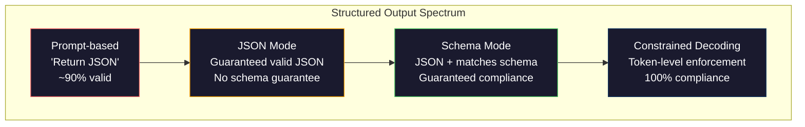
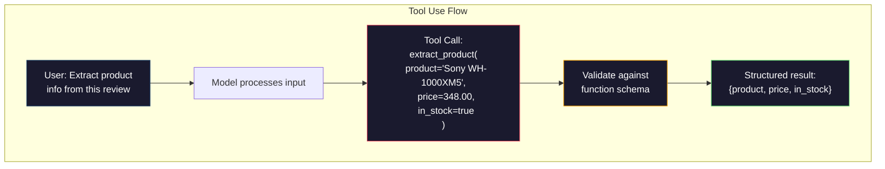

# Structured Outputs: JSON, Schema Validation, Constrained Decoding

> Your LLM returns a string. Your application needs JSON. This gap breaks more production systems than any model hallucination. Structured outputs are the bridge between natural language and typed data. Get it right and your LLM becomes a reliable API. Get it wrong and you're parsing free text with regex at 3 AM.

**Type:** Build
**Languages:** Python
**Prerequisites:** Phase 10, Lessons 01-05 (Building LLMs from Scratch)
**Time:** ~90 minutes
**Related:** Phase 5 · 20 (Structured Outputs & Constrained Decoding) covers the decoder-level theory (FSM/CFG logit processors, Outlines, XGrammar). This lesson focuses on the production SDK layer (OpenAI `response_format`, Anthropic tool use, Instructor) — read Phase 5 · 20 first if you want to understand what happens below the API.

## Learning Objectives

- Implement JSON mode and schema-constrained outputs using OpenAI and Anthropic API parameters
- Build a Pydantic validation layer that rejects malformed LLM outputs and retries with error feedback
- Explain how constrained decoding enforces valid JSON at the token level without post-processing
- Design robust extraction prompts that reliably convert unstructured text to typed data structures

## The Problem

You ask an LLM: "Extract the product name, price, and stock status from this text." It responds:

```
The product is the Sony WH-1000XM5 headphones, which cost $348.00 and are currently in stock.
```

This is a perfectly correct answer. It's also completely useless to your application. Your inventory system needs `{"product": "Sony WH-1000XM5", "price": 348.00, "in_stock": true}`. You need a JSON object with specific keys, specific types, specific value constraints. You don't need a sentence.

The naive fix: add "Respond in JSON" to your prompt. This works 90% of the time. The other 10%, the model wraps JSON in markdown code fences, or adds a "Here's the JSON:" preamble, or produces syntactically invalid JSON by closing a bracket too early. Your JSON parser crashes. Your pipeline breaks. You add try/except and retry loops. The retry sometimes produces different data. Now you have a consistency problem on top of a parsing problem.

This isn't a prompt engineering problem — it's a decoding problem. The model generates tokens left-to-right. At each position, it picks the most likely next token from a vocabulary of 100K+ options. At any given position, most of those options would produce invalid JSON. If the model just emitted `{"price":`, the next token must be a digit, a quote (for strings), `null`, `true`, `false`, or a minus sign. Anything else produces invalid JSON. Without constraints, the model might pick an English word that makes perfect semantic sense but is syntactically catastrophic.

## The Concept

### The Spectrum of Structured Outputs

There are four levels of control over structured outputs, each more reliable than the last.



**Prompt-based** ("Respond in valid JSON"): No enforcement. The model usually complies, but sometimes doesn't. Reliability: ~90%. Failure modes: markdown fences, preamble text, truncated output, wrong structure.

**JSON mode**: The API guarantees the output is valid JSON. OpenAI's `response_format: { type: "json_object" }` enables this. Output parses without error. But it doesn't necessarily match your expected schema — extra keys, wrong types, missing fields.

**Schema mode**: The API accepts a JSON Schema and guarantees the output conforms to it. As of 2026, every major provider supports this natively: OpenAI's `response_format: { type: "json_schema", json_schema: {...} }` (or `tool_choice="required"`), Anthropic tool use with `input_schema`, and Gemini's `response_schema` + `response_mime_type: "application/json"`. The output will have the exact keys, types, and constraints you specify.

**Constrained decoding**: At each token position during generation, the decoder masks out all tokens that would produce invalid output. If the schema requires a number and the model is about to emit a letter, that token's probability is set to zero. The model can only produce tokens that lead to valid output. This is what OpenAI's structured outputs mode, and libraries like Outlines and Guidance, implement under the hood.

### JSON Schema: The Contract Language

JSON Schema is how you tell the model (or validation layer) what the output must look like. Every major structured output system uses it.

```json
{
  "type": "object",
  "properties": {
    "product": { "type": "string" },
    "price": { "type": "number", "minimum": 0 },
    "in_stock": { "type": "boolean" },
    "categories": {
      "type": "array",
      "items": { "type": "string" }
    }
  },
  "required": ["product", "price", "in_stock"]
}
```

This schema says: the output must be an object with a string `product`, a non-negative number `price`, a boolean `in_stock`, and an optional string array `categories`. Any output that doesn't match gets rejected.

Schemas handle tricky cases: nested objects, arrays with typed elements, enums (constraining strings to specific values), patterns (regex on strings), and combinators (oneOf, anyOf, allOf for polymorphic outputs).

### The Pydantic Pattern

In Python, you don't write JSON Schema by hand. You define a Pydantic model and it generates the schema for you.

```python
from pydantic import BaseModel

class Product(BaseModel):
    product: str
    price: float
    in_stock: bool
    categories: list[str] = []
```

This produces the same JSON Schema as above. The Instructor library (and OpenAI's SDK) accept Pydantic models directly: pass in the model class, get back a validated instance. If the LLM output doesn't match, Instructor retries automatically.

### Function Calling / Tool Use

A different interface to the same problem. Instead of asking the model to produce JSON directly, you define "tools" (functions) with typed parameters. The model outputs a function call with structured arguments. OpenAI calls this "function calling," Anthropic calls it "tool use." The result is the same: structured data.



Tool use is preferred when the model needs to choose which function to call, not just fill in parameters. If you have 10 different extraction schemas and the model must pick the right one based on input, tool use gives you both schema selection and structured output.

### Common Failure Modes

Even with schema enforcement, structured outputs can fail in subtle ways.

**Hallucinated values**: Output matches the schema but contains fabricated data. The text says $348, the model outputs `{"price": 299.99}`. Schema validation can't catch this — the type is correct, the value is wrong.

**Enum confusion**: You constrain a field to `["in_stock", "out_of_stock", "preorder"]`. The model outputs `"available"` — semantically correct, but not in the allowed set. Good constrained decoding catches this; prompt-based approaches don't.

**Nested object depth**: Deeply nested schemas (4+ levels) produce more errors. Each nesting level is another point where the model can lose track of the structure.

**Array length**: Models may produce too many or too few elements in arrays. Schema supports `minItems` and `maxItems`, but not all providers enforce them at the decoding level.

**Missing optional fields**: The model omits fields that are technically optional but semantically important for your use case. Make them required in the schema even if data is sometimes missing — force the model to explicitly output `null`.

## Build It

### Step 1: JSON Schema Validator

Build a validator from scratch that checks whether a Python object conforms to a JSON Schema. This is what runs on the output side to verify compliance.

```python
import json

def validate_schema(data, schema):
    errors = []
    _validate(data, schema, "", errors)
    return errors

def _validate(data, schema, path, errors):
    schema_type = schema.get("type")

    if schema_type == "object":
        if not isinstance(data, dict):
            errors.append(f"{path}: expected object, got {type(data).__name__}")
            return
        for key in schema.get("required", []):
            if key not in data:
                errors.append(f"{path}.{key}: required field missing")
        properties = schema.get("properties", {})
        for key, value in data.items():
            if key in properties:
                _validate(value, properties[key], f"{path}.{key}", errors)

    elif schema_type == "array":
        if not isinstance(data, list):
            errors.append(f"{path}: expected array, got {type(data).__name__}")
            return
        min_items = schema.get("minItems", 0)
        max_items = schema.get("maxItems", float("inf"))
        if len(data) < min_items:
            errors.append(f"{path}: array has {len(data)} items, minimum is {min_items}")
        if len(data) > max_items:
            errors.append(f"{path}: array has {len(data)} items, maximum is {max_items}")
        items_schema = schema.get("items", {})
        for i, item in enumerate(data):
            _validate(item, items_schema, f"{path}[{i}]", errors)

    elif schema_type == "string":
        if not isinstance(data, str):
            errors.append(f"{path}: expected string, got {type(data).__name__}")
            return
        enum_values = schema.get("enum")
        if enum_values and data not in enum_values:
            errors.append(f"{path}: '{data}' not in allowed values {enum_values}")

    elif schema_type == "number":
        if not isinstance(data, (int, float)):
            errors.append(f"{path}: expected number, got {type(data).__name__}")
            return
        minimum = schema.get("minimum")
        maximum = schema.get("maximum")
        if minimum is not None and data < minimum:
            errors.append(f"{path}: {data} is less than minimum {minimum}")
        if maximum is not None and data > maximum:
            errors.append(f"{path}: {data} is greater than maximum {maximum}")

    elif schema_type == "boolean":
        if not isinstance(data, bool):
            errors.append(f"{path}: expected boolean, got {type(data).__name__}")

    elif schema_type == "integer":
        if not isinstance(data, int) or isinstance(data, bool):
            errors.append(f"{path}: expected integer, got {type(data).__name__}")
```

### Step 2: Pydantic-Style Model to Schema

Build a minimal class-to-schema converter. Define a Python class, automatically generate its JSON Schema.

```python
class SchemaField:
    def __init__(self, field_type, required=True, default=None, enum=None, minimum=None, maximum=None):
        self.field_type = field_type
        self.required = required
        self.default = default
        self.enum = enum
        self.minimum = minimum
        self.maximum = maximum

def python_type_to_schema(field):
    type_map = {
        str: "string",
        int: "integer",
        float: "number",
        bool: "boolean",
    }

    schema = {}

    if field.field_type in type_map:
        schema["type"] = type_map[field.field_type]
    elif field.field_type == list:
        schema["type"] = "array"
        schema["items"] = {"type": "string"}
    elif isinstance(field.field_type, dict):
        schema = field.field_type

    if field.enum:
        schema["enum"] = field.enum
    if field.minimum is not None:
        schema["minimum"] = field.minimum
    if field.maximum is not None:
        schema["maximum"] = field.maximum

    return schema

def model_to_schema(name, fields):
    properties = {}
    required = []

    for field_name, field in fields.items():
        properties[field_name] = python_type_to_schema(field)
        if field.required:
            required.append(field_name)

    return {
        "type": "object",
        "properties": properties,
        "required": required,
    }
```

### Step 3: Constrained Token Filter

Simulate constrained decoding. Given a partial JSON string and a schema, determine which token categories are valid at the current position.

```python
def next_valid_tokens(partial_json, schema):
    stripped = partial_json.strip()

    if not stripped:
        return ["{"]

    try:
        json.loads(stripped)
        return ["<EOS>"]
    except json.JSONDecodeError:
        pass

    last_char = stripped[-1] if stripped else ""

    if last_char == "{":
        return ['"', "}"]
    elif last_char == '"':
        if stripped.endswith('":'):
            return ['"', "0-9", "true", "false", "null", "[", "{"]
        return ["a-z", '"']
    elif last_char == ":":
        return [" ", '"', "0-9", "true", "false", "null", "[", "{"]
    elif last_char == ",":
        return [" ", '"', "{", "["]
    elif last_char in "0123456789":
        return ["0-9", ".", ",", "}", "]"]
    elif last_char == "}":
        return [",", "}", "]", "<EOS>"]
    elif last_char == "]":
        return [",", "}", "<EOS>"]
    elif last_char == "[":
        return ['"', "0-9", "true", "false", "null", "{", "[", "]"]
    else:
        return ["any"]

def demonstrate_constrained_decoding():
    partial_states = [
        '',
        '{',
        '{"product"',
        '{"product":',
        '{"product": "Sony"',
        '{"product": "Sony",',
        '{"product": "Sony", "price":',
        '{"product": "Sony", "price": 348',
        '{"product": "Sony", "price": 348}',
    ]

    print(f"{'Partial JSON':<45} {'Valid Next Tokens'}")
    print("-" * 80)
    for state in partial_states:
        valid = next_valid_tokens(state, {})
        display = state if state else "(empty)"
        print(f"{display:<45} {valid}")
```

### Step 4: Extraction Pipeline

Combine everything into an extraction pipeline: define a schema, simulate LLM producing structured output, validate the output, and handle retries.

```python
def simulate_llm_extraction(text, schema, attempt=0):
    if "headphones" in text.lower() or "sony" in text.lower():
        if attempt == 0:
            return '{"product": "Sony WH-1000XM5", "price": 348.00, "in_stock": true, "categories": ["audio", "headphones"]}'
        return '{"product": "Sony WH-1000XM5", "price": 348.00, "in_stock": true}'

    if "laptop" in text.lower():
        return '{"product": "MacBook Pro 16", "price": 2499.00, "in_stock": false, "categories": ["computers"]}'

    return '{"product": "Unknown", "price": 0, "in_stock": false}'

def extract_with_retry(text, schema, max_retries=3):
    for attempt in range(max_retries):
        raw = simulate_llm_extraction(text, schema, attempt)

        try:
            data = json.loads(raw)
        except json.JSONDecodeError as e:
            print(f"  Attempt {attempt + 1}: JSON parse error -- {e}")
            continue

        errors = validate_schema(data, schema)
        if not errors:
            return data

        print(f"  Attempt {attempt + 1}: Schema validation errors -- {errors}")

    return None

product_schema = {
    "type": "object",
    "properties": {
        "product": {"type": "string"},
        "price": {"type": "number", "minimum": 0},
        "in_stock": {"type": "boolean"},
        "categories": {"type": "array", "items": {"type": "string"}},
    },
    "required": ["product", "price", "in_stock"],
}
```

### Step 5: Run the Full Pipeline

```python
def run_demo():
    print("=" * 60)
    print("  Structured Output Pipeline Demo")
    print("=" * 60)

    print("\n--- Schema Definition ---")
    product_fields = {
        "product": SchemaField(str),
        "price": SchemaField(float, minimum=0),
        "in_stock": SchemaField(bool),
        "categories": SchemaField(list, required=False),
    }
    generated_schema = model_to_schema("Product", product_fields)
    print(json.dumps(generated_schema, indent=2))

    print("\n--- Schema Validation ---")
    test_cases = [
        ({"product": "Test", "price": 10.0, "in_stock": True}, "Valid object"),
        ({"product": "Test", "price": -5.0, "in_stock": True}, "Negative price"),
        ({"product": "Test", "in_stock": True}, "Missing price"),
        ({"product": "Test", "price": "ten", "in_stock": True}, "String as price"),
        ("not an object", "String instead of object"),
    ]

    for data, label in test_cases:
        errors = validate_schema(data, product_schema)
        status = "PASS" if not errors else f"FAIL: {errors}"
        print(f"  {label}: {status}")

    print("\n--- Constrained Decoding Simulation ---")
    demonstrate_constrained_decoding()

    print("\n--- Extraction Pipeline ---")
    texts = [
        "The Sony WH-1000XM5 headphones are priced at $348 and currently available.",
        "The new MacBook Pro 16-inch laptop costs $2499 but is sold out.",
        "This is a random sentence with no product info.",
    ]

    for text in texts:
        print(f"\n  Input: {text[:60]}...")
        result = extract_with_retry(text, product_schema)
        if result:
            print(f"  Output: {json.dumps(result)}")
        else:
            print(f"  Output: FAILED after retries")
```

## Use It

### OpenAI Structured Outputs

```python
# from openai import OpenAI
# from pydantic import BaseModel
#
# client = OpenAI()
#
# class Product(BaseModel):
#     product: str
#     price: float
#     in_stock: bool
#
# response = client.beta.chat.completions.parse(
#     model="gpt-5-mini",
#     messages=[
#         {"role": "system", "content": "Extract product information."},
#         {"role": "user", "content": "Sony WH-1000XM5, $348, in stock"},
#     ],
#     response_format=Product,
# )
#
# product = response.choices[0].message.parsed
# print(product.product, product.price, product.in_stock)
```

OpenAI's structured outputs mode uses constrained decoding internally. Every token the model generates is guaranteed to produce output matching the Pydantic schema. No retries, no validation. The constraints are baked into the decoding process.

### Anthropic Tool Use

```python
# import anthropic
#
# client = anthropic.Anthropic()
#
# response = client.messages.create(
#     model="claude-opus-4-7",
#     max_tokens=1024,
#     tools=[{
#         "name": "extract_product",
#         "description": "Extract product information from text",
#         "input_schema": {
#             "type": "object",
#             "properties": {
#                 "product": {"type": "string"},
#                 "price": {"type": "number"},
#                 "in_stock": {"type": "boolean"},
#             },
#             "required": ["product", "price", "in_stock"],
#         },
#     }],
#     messages=[{"role": "user", "content": "Extract: Sony WH-1000XM5, $348, in stock"}],
# )
```

Anthropic implements structured outputs through tool use. The model emits a tool call with structured arguments that match the input_schema. Same result, different API surface.

### Instructor Library

```python
# pip install instructor
# import instructor
# from openai import OpenAI
# from pydantic import BaseModel
#
# client = instructor.from_openai(OpenAI())
#
# class Product(BaseModel):
#     product: str
#     price: float
#     in_stock: bool
#
# product = client.chat.completions.create(
#     model="gpt-5-mini",
#     response_model=Product,
#     messages=[{"role": "user", "content": "Sony WH-1000XM5, $348, in stock"}],
# )
```

Instructor wraps any LLM client and adds automatic retries with validation. If the first attempt doesn't pass validation, it sends the error back to the model as context and asks it to fix the output. Works with any provider, not just OpenAI.

## Ship It

This lesson produces `outputs/prompt-structured-extractor.md` — a reusable prompt template that extracts structured data from any text given a schema definition. Feed it a JSON Schema and unstructured text, and it returns validated JSON.

It also produces `outputs/skill-structured-outputs.md` — a decision framework for choosing the right structured output strategy based on your provider, reliability requirements, and schema complexity.

## Exercises

1. Extend the schema validator to support `oneOf` (data must match exactly one of several schemas). This handles polymorphic outputs — e.g., a field that could be either a `Product` object or a `Service` object with different shapes.

2. Build a "schema diff" tool that compares two schemas and identifies breaking changes (removed required fields, changed types) vs non-breaking changes (added optional fields, relaxed constraints). This is critical for versioning your extraction schemas in production.

3. Implement a more realistic constrained decoding simulator. Given a JSON Schema and a 100-token vocabulary (letters, digits, punctuation, keywords), walk through the generation process step by step, masking invalid tokens at each position. Measure what fraction of the vocabulary is valid at each step.

4. Build an extraction evaluation suite. Create 50 product descriptions with hand-labeled JSON outputs. Run your extraction pipeline on all 50 and measure exact match, field-level accuracy, and type compliance. Identify which fields are hardest to extract correctly.

5. Add a "confidence score" to your extraction pipeline. For each extracted field, estimate how confident the model is (based on token probabilities, or by running extraction 3 times and measuring consistency). Flag low-confidence fields for human review.

## Key Terms

| Term | What people say | What it actually is |
|------|----------------|----------------------|
| JSON mode | "Return JSON" | An API flag that guarantees syntactically valid JSON output, without enforcing any particular schema |
| Structured output | "Typed JSON" | Output that matches a specific JSON Schema with correct keys, types, and constraints |
| Constrained decoding | "Guided generation" | Masking out tokens at each position that would produce invalid output — guarantees 100% schema compliance |
| JSON Schema | "A JSON template" | A declarative language describing the structure, types, and constraints of JSON data (used by OpenAPI, JSON Forms, etc.) |
| Pydantic | "Python dataclass on steroids" | A Python library for defining data models with type validation, used by FastAPI and Instructor to generate JSON Schemas |
| Function calling | "Tool use" | The LLM outputs a structured function call (name + typed arguments) instead of free text — supported by both OpenAI and Anthropic |
| Instructor | "Pydantic for LLMs" | A Python library that wraps LLM clients and returns validated Pydantic instances, with automatic retries on validation failure |
| Token masking | "Filtering the vocabulary" | Setting specific token probabilities to zero during generation, making it impossible for the model to produce them |
| Schema compliance | "Matching the shape" | Output has every required field, correct types, values within constraints, and no extra disallowed fields |
| Retry loop | "Try until it works" | Sending validation errors back to the model for correction — Instructor does this automatically up to a configurable limit |

## Further Reading

- [OpenAI Structured Outputs Guide](https://platform.openai.com/docs/guides/structured-outputs) — Official documentation for JSON Schema-based constrained decoding in the OpenAI API
- [Willard & Louf, 2023 -- "Efficient Guided Generation for Large Language Models"](https://arxiv.org/abs/2307.09702) — The Outlines paper on compiling JSON Schema into finite state machines for token-level constraints
- [Instructor documentation](https://python.useinstructor.com/) — The standard library for getting structured outputs from any LLM with Pydantic validation and retries
- [Anthropic Tool Use Guide](https://docs.anthropic.com/en/docs/tool-use) — How Claude implements structured outputs through tool use with JSON Schema input_schema
- [JSON Schema specification](https://json-schema.org/) — The complete specification of the schema language used by every major structured output system
- [Outlines library](https://github.com/outlines-dev/outlines) — Open-source constrained generation using regex and JSON Schema compiled to finite state machines
- [Dong et al., "XGrammar: Flexible and Efficient Structured Generation Engine for Large Language Models" (MLSys 2025)](https://arxiv.org/abs/2411.15100) — Current state-of-the-art grammar engine; pushdown automaton compilation masks tokens at ~100 ns/token.
- [Beurer-Kellner et al., "Prompting Is Programming: A Query Language for Large Language Models" (LMQL)](https://arxiv.org/abs/2212.06094) — The LMQL paper, framing constrained decoding as a query language with type and value constraints.
- [Microsoft Guidance (framework docs)](https://github.com/guidance-ai/guidance) — Template-driven constrained generation; complementary to Outlines and XGrammar, vendor-agnostic.
