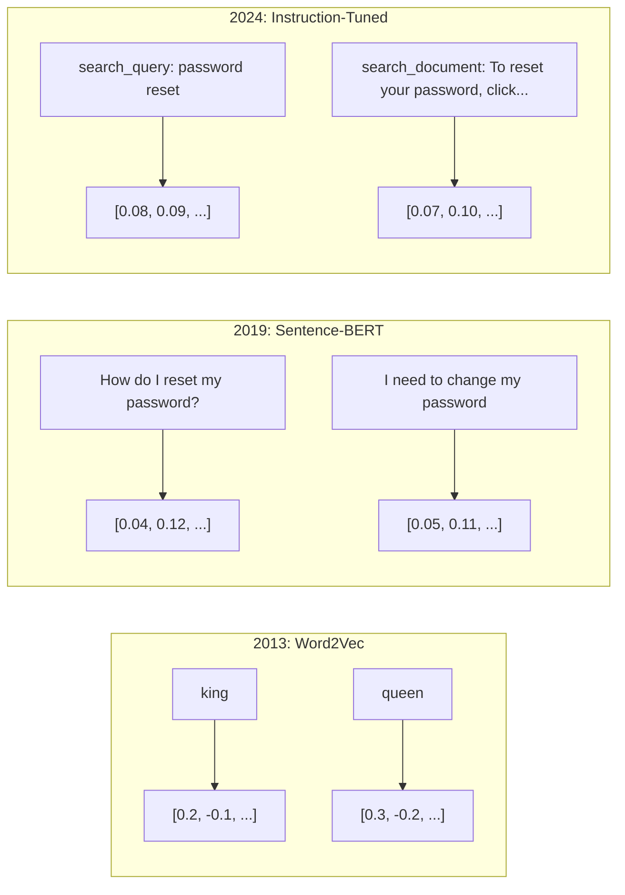
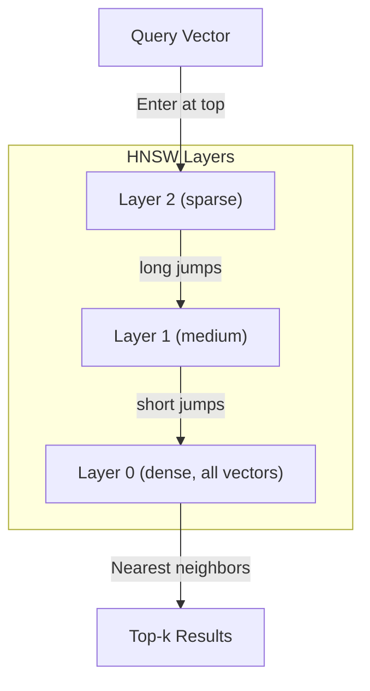

# Embeddings and Vector Representations

> Text is discrete, math is continuous. Every time you ask an LLM to find "similar" documents, compare semantics, or search beyond keywords, you're relying on a bridge between these two worlds. That bridge is the embedding. If you don't understand embeddings, you don't understand modern AI — you're just using it.

**Type:** Build
**Languages:** Python
**Prerequisites:** Phase 11, Lesson 01 (Prompt Engineering)
**Time:** ~75 minutes
**Related:** Phase 5 · 22 (Embedding Models Deep Dive) covers dense vs sparse vs multi-vector, Matryoshka truncation, and model selection by dimension. This lesson focuses on the production pipeline (vector databases, HNSW, similarity math). Read Phase 5 · 22 before choosing a model.

## Learning Objectives

- Generate text embeddings using API providers and open-source models, and compute cosine similarity between them
- Explain why embeddings solve the vocabulary mismatch problem that keyword search cannot handle
- Build a semantic search index that retrieves documents by meaning rather than exact keyword matches
- Evaluate embedding quality using retrieval benchmarks (precision@k, recall) and select the right embedding model for your task

## The Problem

You have 10,000 support tickets. A customer writes: "my payment didn't go through." You need to find similar historical tickets. Keyword search finds tickets containing "payment" and "didn't go through." It misses "transaction failed," "charge was declined," and "billing error." These tickets describe the exact same problem using completely different words.

This is the vocabulary mismatch problem. Human language has dozens of ways to say the same thing. Keyword search treats each word as an independent symbol with no meaning. It cannot know that "declined" and "didn't go through" refer to the same concept.

You need a text representation where similarity is determined by meaning, not spelling. You need a way to place "my payment didn't go through" and "transaction was declined" close together in some mathematical space, while pushing "my payment arrived on time" far away — even though they both contain the word "payment."

That representation is the embedding.

## The Concept

### What Is an Embedding?

An embedding is a dense vector of floating-point numbers representing the semantics of text. The word "dense" matters — every dimension carries information, unlike sparse representations (bag of words, TF-IDF) where most dimensions are zero.

"The cat sat on the mat" becomes something like `[0.023, -0.041, 0.087, ..., 0.012]` — a list of 768 to 3072 numbers depending on the model. These numbers encode meaning. You never look at them directly — you compare them.

### The Word2Vec Breakthrough

In 2013, Google's Tomas Mikolov and colleagues published Word2Vec. The core insight: train a neural network to predict a word from its neighbors (or neighbors from a word), and the hidden layer weights become meaningful vector representations.

The famous result:

```
king - man + woman = queen
```

Vector arithmetic on word embeddings captures semantic relationships. The direction from "man" to "woman" is approximately the same as the direction from "king" to "queen." This is the moment the field realized that geometry can encode meaning.

Word2Vec produces 300-dimensional vectors. Each word gets one vector regardless of context. "Bank" in "river bank" and "bank account" has the same embedding. This limitation drove the next decade of research.

### From Words to Sentences

Word embeddings represent individual tokens. Production systems need to embed entire sentences, paragraphs, or documents. Four approaches emerged:

**Averaging**: Take the mean of all word vectors in a sentence. Cheap, lossy, surprisingly decent for short texts. Loses word order entirely — "dog bites man" and "man bites dog" get identical embeddings.

**CLS token**: Transformer models (BERT, 2018) output a special [CLS] token embedding that represents the full input. Better than averaging, but the [CLS] token was trained for next-sentence prediction, not similarity.

**Contrastive learning**: Explicitly train models to push similar pairs together and dissimilar pairs apart. Sentence-BERT (Reimers & Gurevych, 2019) used this approach and became the foundation of modern embedding models. Given "How do I reset my password?" and "I need to change my password," the model learns these should have nearly identical vectors.

**Instruction-tuned embeddings**: The latest approach. Models like E5 and GTE accept a task prefix ("search_query:", "search_document:") that tells the model what kind of embedding to produce. This lets one model serve multiple tasks.



### Modern Embedding Models

The market has converged on a few production-grade options (MTEB scores as of early 2026, MTEB v2):

| Model | Provider | Dimensions | MTEB | Context | Cost per 1M tokens |
|-------|----------|-----------|------|---------|------------------|
| Gemini Embedding 2 | Google | 3072 (Matryoshka) | 67.7 (retrieval) | 8192 | $0.15 |
| embed-v4 | Cohere | 1024 (Matryoshka) | 65.2 | 128K | $0.12 |
| voyage-4 | Voyage AI | 1024/2048 (Matryoshka) | 66.8 | 32K | $0.12 |
| text-embedding-3-large | OpenAI | 3072 (Matryoshka) | 64.6 | 8192 | $0.13 |
| text-embedding-3-small | OpenAI | 1536 (Matryoshka) | 62.3 | 8192 | $0.02 |
| BGE-M3 | BAAI | 1024 (dense+sparse+ColBERT) | 63.0 multilingual | 8192 | Open weights |
| Qwen3-Embedding | Alibaba | 4096 (Matryoshka) | 66.9 | 32K | Open weights |
| Nomic-embed-v2 | Nomic | 768 (Matryoshka) | 63.1 | 8192 | Open weights |

MTEB (Massive Text Embedding Benchmark) v2 covers 100+ tasks across retrieval, classification, clustering, reranking, and summarization. Higher is better. By 2026, open-weight models (Qwen3-Embedding, BGE-M3) match or surpass closed hosted models on most dimensions. Gemini Embedding 2 leads on pure retrieval; Voyage/Cohere lead on domain-specific (finance, legal, code). Always benchmark on your own queries before committing.

### Similarity Metrics

Given two embedding vectors, there are three ways to measure how similar they are:

**Cosine similarity**: The cosine of the angle between two vectors. Ranges from -1 (opposite) to 1 (same direction). Ignores magnitude — a 10-word sentence and a 500-word document can score 1.0 if they point in the same direction. This is the default for 90% of use cases.

```
cosine_sim(a, b) = dot(a, b) / (||a|| * ||b||)
```

**Dot product**: The raw inner product of two vectors. When vectors are normalized (unit length), this is identical to cosine similarity. Faster to compute. OpenAI's embeddings are normalized, so dot product and cosine give the same ranking.

```
dot(a, b) = sum(a_i * b_i)
```

**Euclidean (L2) distance**: Straight-line distance in vector space. Lower = more similar. Sensitive to magnitude differences. Use when absolute position in space matters, not just direction.

```
L2(a, b) = sqrt(sum((a_i - b_i)^2))
```

When to use which:

| Metric | Good for | Avoid when |
|--------|----------|------------|
| Cosine similarity | Comparing texts of different lengths; most retrieval tasks | Magnitude itself carries information |
| Dot product | Normalized embeddings; maximum speed | Vectors have varying magnitudes |
| Euclidean distance | Clustering; spatial nearest-neighbor | Comparing documents of vastly different lengths |

### Vector Databases and HNSW

Brute-force similarity search compares the query against every stored vector. 1 million vectors at 1536 dimensions is 1.5 billion multiply-add operations per query. Too slow.

Vector databases solve this with approximate nearest neighbor (ANN) algorithms. The dominant algorithm is HNSW (Hierarchical Navigable Small World):

1. Build a multi-layer graph of vectors
2. Upper layers are sparse — long-range connections between distant clusters
3. Lower layers are dense — fine-grained connections between nearby vectors
4. Search starts at the top layer and greedily descends, refining at each level
5. Returns approximate top-k results in O(log n) instead of O(n)

HNSW trades a small amount of accuracy (typically 95-99% recall) for massive speed gains. At 10 million vectors, brute force takes seconds; HNSW takes milliseconds.



Production options:

| Database | Type | Best for | Max scale |
|----------|------|----------|-----------|
| Pinecone | Managed SaaS | Zero-ops production | Billions |
| Weaviate | Open source | Self-hosted, hybrid search | 100M+ |
| Qdrant | Open source | High performance, filtering | 100M+ |
| ChromaDB | Embedded | Prototyping, local dev | 1M |
| pgvector | Postgres extension | Already using Postgres | 10M |
| FAISS | Library | In-process, research | 1B+ |

### Chunking Strategies

Documents are too long to embed as a single vector. A 50-page PDF covers dozens of topics — its embedding becomes an average of everything, similar to nothing. You split documents into chunks and embed each chunk.

**Fixed-size chunking**: Cut every N tokens with M tokens of overlap. Simple and predictable. Works well when documents have no clear structure. A 512-token chunk with 50-token overlap: chunk 1 is tokens 0-511, chunk 2 is tokens 462-973.

**Sentence-based chunking**: Split on sentence boundaries, grouping sentences until you approach the token limit. Each chunk is at least one complete sentence. Better than fixed-size because you never split a thought mid-sentence.

**Recursive chunking**: Try splitting at the largest boundaries first (section headers). If still too big, try paragraph boundaries. Then sentence boundaries. Then character limits. This is LangChain's `RecursiveCharacterTextSplitter` and works well on mixed-format corpora.

**Semantic chunking**: Embed each sentence, then group consecutive sentences whose embeddings are similar. When embedding similarity drops below a threshold, start a new chunk. Expensive (requires per-sentence embedding) but produces the most coherent chunks.

| Strategy | Complexity | Quality | Best for |
|----------|-----------|---------|----------|
| Fixed-size | Low | OK | Unstructured text, logs |
| Sentence-based | Low | Good | Articles, emails |
| Recursive | Medium | Good | Markdown, HTML, mixed docs |
| Semantic | High | Best | When retrieval quality is critical |

The sweet spot for most systems: 256-512 token chunks with 50 token overlap.

### Bi-Encoder vs Cross-Encoder

A bi-encoder embeds query and document independently, then compares vectors. Fast — you embed the query once and compare against pre-computed document embeddings. This is what you use for retrieval.

A cross-encoder takes the query and one document as a single input and outputs a relevance score. Slow — it passes every query-document pair through the full model. But much more accurate because it can attend between query and document tokens simultaneously.

The production pattern: bi-encoder retrieves the top-100 candidates, cross-encoder reranks them to top-10. This is the retrieve-then-rerank pipeline.


Reranking models: Cohere Rerank 3.5 ($2 per 1000 queries), BGE-reranker-v2 (free, open-source), Jina Reranker v2 (free, open-source).

### Matryoshka Embeddings

Traditional embeddings are all-or-nothing. A 1536-dimensional vector uses 1536 floats. You can't truncate to 256 dimensions without retraining.

Matryoshka Representation Learning (Kusupati et al., 2022) fixes this. The model is trained so that the first N dimensions capture the most important information, like Russian nesting dolls. Truncating a 1536-dim Matryoshka embedding to 256 dims loses some accuracy but remains usable.

OpenAI's text-embedding-3-small and text-embedding-3-large support Matryoshka truncation via the `dimensions` parameter. Request 256 dimensions instead of 1536 and get 6× storage reduction with roughly 3-5% accuracy loss on standard benchmarks.

### Binary Quantization

A 1536-dim embedding stored as float32 takes 6144 bytes. Multiply by 10 million documents: 61 GB just for vectors.

Binary quantization converts each float to a single bit: positive becomes 1, negative becomes 0. Storage drops from 6144 bytes to 192 bytes — a 32× reduction. Similarity is computed with Hamming distance (count differing bits), which is a single CPU instruction.

Accuracy loss is roughly 5-10% on retrieval recall. The common pattern: use binary quantization for first-pass search over millions of vectors, then rescore the top-1000 with full-precision vectors. This gives you 95%+ of full-precision accuracy with 32× less memory.

## Build It

We build a semantic search engine from scratch. No vector database, no external embedding API. Pure Python with numpy for the math.

### Step 1: Text Chunking

```python
def chunk_text(text, chunk_size=200, overlap=50):
    words = text.split()
    chunks = []
    start = 0
    while start < len(words):
        end = start + chunk_size
        chunk = " ".join(words[start:end])
        chunks.append(chunk)
        start += chunk_size - overlap
    return chunks


def chunk_by_sentences(text, max_chunk_tokens=200):
    sentences = text.replace("\n", " ").split(".")
    sentences = [s.strip() + "." for s in sentences if s.strip()]
    chunks = []
    current_chunk = []
    current_length = 0
    for sentence in sentences:
        sentence_length = len(sentence.split())
        if current_length + sentence_length > max_chunk_tokens and current_chunk:
            chunks.append(" ".join(current_chunk))
            current_chunk = []
            current_length = 0
        current_chunk.append(sentence)
        current_length += sentence_length
    if current_chunk:
        chunks.append(" ".join(current_chunk))
    return chunks
```

### Step 2: Building Embeddings from Scratch

We implement a simple dense embedding using TF-IDF with L2 normalization. This isn't a neural embedding, but it obeys the same contract: text in, fixed-length vector out, similar texts produce similar vectors.

```python
import math
import numpy as np
from collections import Counter

class SimpleEmbedder:
    def __init__(self):
        self.vocab = []
        self.idf = []
        self.word_to_idx = {}

    def fit(self, documents):
        vocab_set = set()
        for doc in documents:
            vocab_set.update(doc.lower().split())
        self.vocab = sorted(vocab_set)
        self.word_to_idx = {w: i for i, w in enumerate(self.vocab)}
        n = len(documents)
        self.idf = np.zeros(len(self.vocab))
        for i, word in enumerate(self.vocab):
            doc_count = sum(1 for doc in documents if word in doc.lower().split())
            self.idf[i] = math.log((n + 1) / (doc_count + 1)) + 1

    def embed(self, text):
        words = text.lower().split()
        count = Counter(words)
        total = len(words) if words else 1
        vec = np.zeros(len(self.vocab))
        for word, freq in count.items():
            if word in self.word_to_idx:
                tf = freq / total
                vec[self.word_to_idx[word]] = tf * self.idf[self.word_to_idx[word]]
        norm = np.linalg.norm(vec)
        if norm > 0:
            vec = vec / norm
        return vec
```

### Step 3: Similarity Functions

```python
def cosine_similarity(a, b):
    dot = np.dot(a, b)
    norm_a = np.linalg.norm(a)
    norm_b = np.linalg.norm(b)
    if norm_a == 0 or norm_b == 0:
        return 0.0
    return float(dot / (norm_a * norm_b))


def dot_product(a, b):
    return float(np.dot(a, b))


def euclidean_distance(a, b):
    return float(np.linalg.norm(a - b))
```

### Step 4: Vector Index with Brute-Force Search

```python
class VectorIndex:
    def __init__(self):
        self.vectors = []
        self.texts = []
        self.metadata = []

    def add(self, vector, text, meta=None):
        self.vectors.append(vector)
        self.texts.append(text)
        self.metadata.append(meta or {})

    def search(self, query_vector, top_k=5, metric="cosine"):
        scores = []
        for i, vec in enumerate(self.vectors):
            if metric == "cosine":
                score = cosine_similarity(query_vector, vec)
            elif metric == "dot":
                score = dot_product(query_vector, vec)
            elif metric == "euclidean":
                score = -euclidean_distance(query_vector, vec)
            else:
                raise ValueError(f"Unknown metric: {metric}")
            scores.append((i, score))
        scores.sort(key=lambda x: x[1], reverse=True)
        results = []
        for idx, score in scores[:top_k]:
            results.append({
                "text": self.texts[idx],
                "score": score,
                "metadata": self.metadata[idx],
                "index": idx
            })
        return results

    def size(self):
        return len(self.vectors)
```

### Step 5: Semantic Search Engine

```python
class SemanticSearchEngine:
    def __init__(self, chunk_size=200, overlap=50):
        self.embedder = SimpleEmbedder()
        self.index = VectorIndex()
        self.chunk_size = chunk_size
        self.overlap = overlap

    def index_documents(self, documents, source_names=None):
        all_chunks = []
        all_sources = []
        for i, doc in enumerate(documents):
            chunks = chunk_text(doc, self.chunk_size, self.overlap)
            all_chunks.extend(chunks)
            name = source_names[i] if source_names else f"doc_{i}"
            all_sources.extend([name] * len(chunks))
        self.embedder.fit(all_chunks)
        for chunk, source in zip(all_chunks, all_sources):
            vec = self.embedder.embed(chunk)
            self.index.add(vec, chunk, {"source": source})
        return len(all_chunks)

    def search(self, query, top_k=5, metric="cosine"):
        query_vec = self.embedder.embed(query)
        return self.index.search(query_vec, top_k, metric)

    def search_with_scores(self, query, top_k=5):
        results = self.search(query, top_k)
        return [
            {
                "text": r["text"][:200],
                "source": r["metadata"].get("source", "unknown"),
                "score": round(r["score"], 4)
            }
            for r in results
        ]
```

### Step 6: Comparing Similarity Metrics

```python
def compare_metrics(engine, query, top_k=3):
    results = {}
    for metric in ["cosine", "dot", "euclidean"]:
        hits = engine.search(query, top_k=top_k, metric=metric)
        results[metric] = [
            {"score": round(h["score"], 4), "preview": h["text"][:80]}
            for h in hits
        ]
    return results
```

## Use It

Swap in production embedding APIs — the architecture stays the same. Only the embedder changes:

```python
from openai import OpenAI

client = OpenAI()

def openai_embed(texts, model="text-embedding-3-small", dimensions=None):
    kwargs = {"model": model, "input": texts}
    if dimensions:
        kwargs["dimensions"] = dimensions
    response = client.embeddings.create(**kwargs)
    return [item.embedding for item in response.data]
```

Matryoshka truncation with OpenAI — same model, fewer dimensions, less storage:

```python
full = openai_embed(["semantic search query"], dimensions=1536)
compact = openai_embed(["semantic search query"], dimensions=256)
```

The 256-dim vector uses 6× less storage. For 10 million documents, that's 10 GB vs 61 GB. Accuracy loss is roughly 3-5% on standard benchmarks.

Reranking with Cohere:

```python
import cohere

co = cohere.ClientV2()

results = co.rerank(
    model="rerank-v3.5",
    query="What is the refund policy?",
    documents=["Full refund within 30 days...", "No refunds after 90 days..."],
    top_n=3
)
```

Local embeddings with no API dependency:

```python
from sentence_transformers import SentenceTransformer

model = SentenceTransformer("BAAI/bge-small-en-v1.5")
embeddings = model.encode(["semantic search query", "another document"])
```

The VectorIndex class from our build works with all of these. Swap the embedding function, keep the search logic.

## Ship It

This lesson produces:
- `outputs/prompt-embedding-advisor.md` — a prompt that selects embedding models and strategies for specific use cases
- `outputs/skill-embedding-patterns.md` — a skill that teaches agents how to use embeddings effectively in production

## Exercises

1. **Metric comparison**: Run the same 5 queries against sample documents using cosine similarity, dot product, and Euclidean distance. Record top-3 results for each. On which queries do the metrics disagree? Why?

2. **Chunk size experiment**: Index sample documents with chunk sizes of 50, 100, 200, and 500 words. Run 5 queries on each and record top-1 similarity scores. Plot chunk size vs retrieval quality. Find the point where larger chunks start hurting.

3. **Matryoshka simulation**: Build a SimpleEmbedder that produces 500-dim vectors. Truncate to 50, 100, 200, and 500 dimensions. Measure how retrieval recall degrades at each truncation. This simulates Matryoshka behavior without needing the real training trick.

4. **Binary quantization**: Take embeddings from the search engine, convert them to binary (positive = 1, negative = 0), and implement Hamming distance search. Compare top-10 results against full-precision cosine similarity. Measure overlap percentage.

5. **Sentence-based chunking**: Replace fixed-size chunking with `chunk_by_sentences`. Run the same queries and compare retrieval scores. Does respecting sentence boundaries improve results?

## Key Terms

| Term | What people say | What it actually is |
|------|----------------|----------------------|
| Embedding | "Text to numbers" | A dense vector where geometric proximity encodes semantic similarity |
| Word2Vec | "The OG embedding" | 2013 model that learns word vectors by predicting context words; proved vector arithmetic encodes meaning |
| Cosine similarity | "How alike are two vectors" | The cosine of the angle between vectors; 1 = same direction, 0 = orthogonal, -1 = opposite |
| HNSW | "Fast vector search" | Hierarchical Navigable Small World graph — multi-layer structure enabling O(log n) approximate nearest neighbor search |
| Bi-encoder | "Embed separately, compare fast" | Encodes query and document independently into vectors; enables pre-computation and fast retrieval |
| Cross-encoder | "Slow but accurate reranker" | Passes query-document pair jointly through the full model; higher accuracy, cannot pre-compute |
| Matryoshka embedding | "Truncatable vectors" | Embeddings trained so the first N dimensions capture the most important information, allowing variable-size storage |
| Binary quantization | "1-bit embeddings" | Converting float vectors to binary (sign bit only), using Hamming distance for search, 32× storage reduction |
| Chunking | "Slicing documents for embedding" | Splitting documents into 256-512 token segments so each can be independently embedded and retrieved |
| Vector database | "Search engine for embeddings" | A data store optimized for storing vectors and performing approximate nearest neighbor search at scale |
| Contrastive learning | "Train by comparison" | A training method that pushes similar pairs' embeddings together and dissimilar pairs' embeddings apart |
| MTEB | "The embedding benchmark" | Massive Text Embedding Benchmark — 56 datasets across 8 task types; the standard for comparing embedding models |

## Further Reading

- Mikolov et al., "Efficient Estimation of Word Representations in Vector Space" (2013) — The Word2Vec paper that started the embedding revolution with the king-queen analogy
- Reimers & Gurevych, "Sentence-BERT: Sentence Embeddings using Siamese BERT-Networks" (2019) — How to train bi-encoders for sentence-level similarity, the foundation of modern embedding models
- Kusupati et al., "Matryoshka Representation Learning" (2022) — The technique behind variable-dimension embeddings adopted by OpenAI in text-embedding-3
- Malkov & Yashunin, "Efficient and Robust Approximate Nearest Neighbor using Hierarchical Navigable Small World Graphs" (2018) — The HNSW paper, the algorithm behind most production vector search
- OpenAI Embeddings Guide (platform.openai.com/docs/guides/embeddings) — Practical reference for text-embedding-3 models including Matryoshka dimension reduction
- MTEB Leaderboard (huggingface.co/spaces/mteb/leaderboard) — Live benchmark comparing all embedding models across tasks and languages
- [Muennighoff et al., "MTEB: Massive Text Embedding Benchmark" (EACL 2023)](https://arxiv.org/abs/2210.07316) — The benchmark that defines the 8 task types (classification, clustering, pair classification, reranking, retrieval, STS, summarization, bitext mining) reported on the leaderboard; read it before trusting any single MTEB score.
- [Sentence Transformers documentation](https://www.sbert.net/) — The authoritative reference for bi-encoder vs cross-encoder, pooling strategies, and the ingest-chunk-embed-store RAG pipeline this lesson implements.
