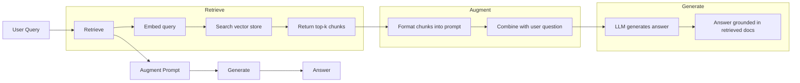
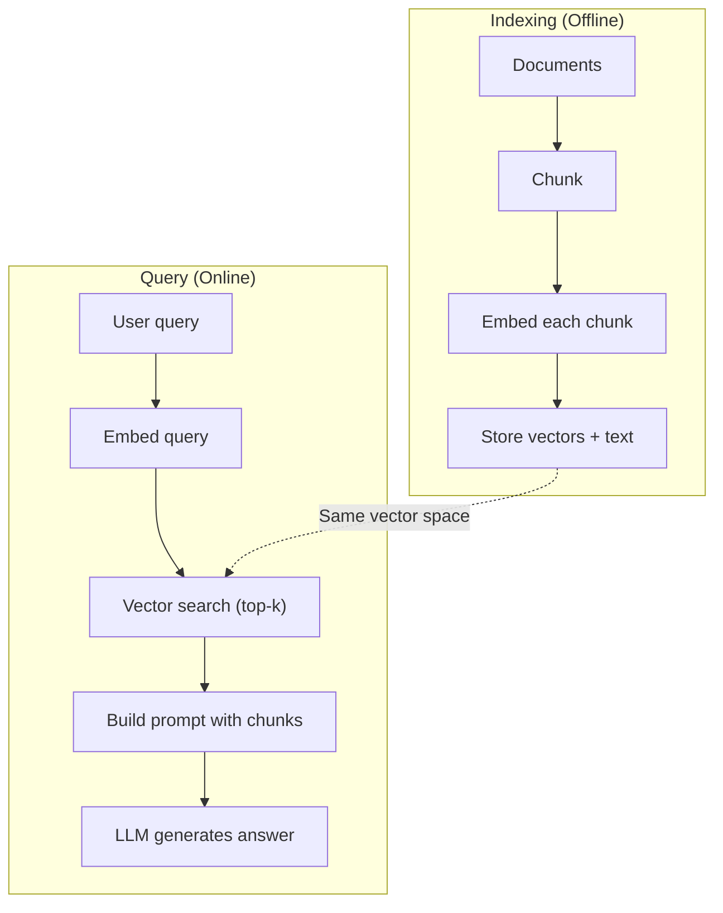

# RAG (Retrieval-Augmented Generation)

> Your LLM knows everything up to its training cutoff. It knows nothing about your company's docs, your codebase, or last week's meeting notes. RAG solves this by retrieving relevant documents and stuffing them into the prompt. This is the most deployed pattern in production AI. If you build only one thing from this course, build a RAG pipeline.

**Type:** Build
**Languages:** Python
**Prerequisites:** Phase 10 (LLMs from Scratch), Phase 11 Lessons 01-05
**Time:** ~90 minutes
**Related:** Phase 5 · 23 (Chunking Strategies for RAG) covers six chunking algorithms and when each wins. Phase 5 · 22 (Embedding Models Deep Dive) covers how to pick an embedder. Phase 11 · 07 (Advanced RAG) covers hybrid search, reranking, and query transforms.

## Learning Objectives

- Build a complete RAG pipeline: document loading, chunking, embedding, vector storage, retrieval, and generation
- Implement semantic search with a vector database (ChromaDB, FAISS, or Pinecone) using proper indexing
- Explain why RAG is preferred over fine-tuning for knowledge-grounded applications (cost, freshness, traceability)
- Evaluate RAG quality with retrieval metrics (precision, recall) and generation metrics (faithfulness, relevance)

## The Problem

You're building a chatbot for your company. A customer asks "What's the refund policy for the enterprise plan?" The LLM gives a generic answer about typical SaaS refund policies. The real policy, buried in a 200-page internal wiki, says enterprise customers get a 60-day window with prorated refunds. The LLM has never seen this document. It cannot know what it wasn't trained on.

Fine-tuning is one solution. Take the LLM, train it on your internal docs, deploy the updated model. This works, but the problems are severe. Fine-tuning costs thousands in compute. The moment docs change, the model is stale. You can't trace which source the model pulled an answer from. And if the company acquires another product line next month, you need to fine-tune again.

RAG is the other solution. The model stays unchanged. When a question comes in, you search your document store for relevant passages, paste them into the prompt before the question, and let the model answer using those passages as context. The document store updates in minutes. You can see exactly which documents were retrieved. The model itself never changes. This is why RAG dominates production: it's cheaper, fresher, more auditable, and works with any LLM.

## The Concept

### The RAG Pattern

The entire pattern is four steps:



Query -> Retrieve -> Augment prompt -> Generate. Every RAG system follows this pattern. The differences between production RAG systems are in the details of each step: how you chunk, how you embed, how you search, how you construct the prompt.

### Why RAG Beats Fine-Tuning

| Concern | Fine-Tuning | RAG |
|---------|------------|-----|
| Cost | $1,000-$100,000+ per training run | $0.01-$0.10 per query (embedding + LLM) |
| Freshness | Stale without retraining | Minutes to update by re-indexing docs |
| Auditability | Can't trace answers to sources | Can show exact retrieved passages |
| Hallucination | Still hallucinates freely | Grounded in retrieved documents |
| Data privacy | Training data baked into weights | Documents stay in your vector store |

Fine-tuning permanently changes model weights. RAG temporarily changes model context. For most applications, temporary context is what you want.

The only case where fine-tuning wins: when you need the model to adopt a specific style, tone, or reasoning pattern that prompting alone can't achieve. For factual knowledge retrieval, RAG wins every time.

### Embedding Models

An embedding model converts text into a dense vector. Similar texts produce vectors that are close together in this high-dimensional space. "How do I reset my password?" and "I need to change my password" produce nearly identical vectors despite sharing few words. "The cat sat on the mat" produces a very different vector.

Common embedding models (2026 lineup — see Phase 5 · 22 for full analysis):

| Model | Dimensions | Provider | Notes |
|-------|-----------|----------|-------|
| text-embedding-3-small | 1536 (Matryoshka) | OpenAI | Best value for most use cases |
| text-embedding-3-large | 3072 (Matryoshka) | OpenAI | Higher accuracy, truncatable to 256/512/1024 |
| Gemini Embedding 2 | 3072 (Matryoshka) | Google | Top of MTEB retrieval leaderboard; 8K context |
| voyage-4 | 1024/2048 (Matryoshka) | Voyage AI | Domain variants available (code, finance, law) |
| Cohere embed-v4 | 1024 (Matryoshka) | Cohere | Strong multilingual, 128K context |
| BGE-M3 | 1024 (dense + sparse + ColBERT) | BAAI (open-weight) | Three views from one model |
| Qwen3-Embedding | 4096 (Matryoshka) | Alibaba (open-weight) | Highest retrieval scores among open weights |
| all-MiniLM-L6-v2 | 384 | Open-weight (Sentence Transformers) | Prototyping baseline |

In this lesson we build a simple embedding ourselves using TF-IDF. Not because production systems use TF-IDF, but because it makes the concept concrete: text in, vector out, similar texts produce similar vectors.

### Vector Similarity

Given two vectors, how do you measure similarity? Three options:

**Cosine similarity**: The cosine of the angle between two vectors. Ranges from -1 (opposite) to 1 (identical). Ignores magnitude, only cares about direction. This is the default choice for RAG.

```
cosine_sim(a, b) = dot(a, b) / (||a|| * ||b||)
```

**Dot product**: The raw inner product. Larger vectors get higher scores. Useful when magnitude carries information (longer documents might be more relevant).

```
dot(a, b) = sum(a_i * b_i)
```

**L2 (Euclidean) distance**: Straight-line distance in vector space. Smaller distance = more similar. Sensitive to magnitude differences.

```
L2(a, b) = sqrt(sum((a_i - b_i)^2))
```

Cosine similarity is the standard choice. It handles documents of different lengths gracefully because it normalizes by magnitude. When someone says "vector search," they almost always mean cosine similarity.

### Chunking Strategies

Documents are too long to embed as a single vector. A 50-page PDF might produce a terrible embedding because it contains dozens of topics. So you split documents into chunks and embed each chunk independently.

**Fixed-size chunking**: Cut every N tokens. Simple and predictable. A 512-token chunk with 50-token overlap means chunk 1 is tokens 0-511, chunk 2 is tokens 462-973, and so on. The overlap ensures you don't cut a sentence at an unlucky boundary.

**Semantic chunking**: Cut at natural boundaries. Paragraphs, sections, or markdown headers. Each chunk is a coherent unit of meaning. More complex to implement but better retrieval.

**Recursive chunking**: Try to cut at the largest boundary first (section headers). If a section is still too large, cut at paragraph boundaries. If a paragraph is still too large, cut at sentence boundaries. This is what LangChain's RecursiveCharacterTextSplitter does, and it works well in practice.

Chunk size matters more than most people think:

- Too small (64-128 tokens): Each chunk lacks context. "It grew 15% last quarter" — without knowing what "it" refers to, this is meaningless.
- Too large (2048+ tokens): Each chunk covers multiple topics, diluting relevance. When you search for revenue data, you get a chunk that's 10% about revenue and 90% about headcount.
- Sweet spot (256-512 tokens): Enough context to be self-contained, focused enough to be relevant.

Most production RAG systems use 256-512 token chunks with 50-token overlap. Anthropic's RAG guide recommends this range.

### Vector Databases

Once you have embeddings, you need somewhere to store and search them. Options:

| Database | Type | Best For |
|----------|------|----------|
| FAISS | Library (in-process) | Prototyping, small-medium datasets |
| Chroma | Lightweight DB | Local development, small deployments |
| Pinecone | Managed service | Production without ops burden |
| Weaviate | Open-source DB | Self-hosted production |
| pgvector | Postgres extension | Already using Postgres |
| Qdrant | Open-source DB | High-performance self-hosted |

In this lesson we build a simple in-memory vector store. It stores vectors in a list and does brute-force cosine similarity search. This is equivalent to FAISS with a flat index. It scales to about 100k vectors before getting slow. Production systems use approximate nearest neighbor (ANN) algorithms like HNSW to search millions of vectors in milliseconds.

### The Full Pipeline



The indexing phase runs once per document (or when documents update). The query phase runs on every user request. In production, indexing might take hours for millions of documents. Query must respond in under a second.

### Real Numbers

Most production RAG systems use these parameters:

- **k = 5 to 10** chunks retrieved per query
- **Chunk size = 256 to 512 tokens** with 50-token overlap
- **Context budget**: 2,500-5,000 tokens of retrieved content per query
- **Total prompt**: ~8,000-16,000 tokens (system prompt + retrieved chunks + conversation history + user query)
- **Embedding dimensions**: 384-3072 depending on model
- **Indexing throughput**: 100-1,000 documents/second with API embeddings
- **Query latency**: 50-200ms for retrieval, 500-3000ms for generation

## Build It

### Step 1: Document Chunking

```python
def chunk_text(text, chunk_size=200, overlap=50):
    words = text.split()
    chunks = []
    start = 0
    while start < len(words):
        end = start + chunk_size
        chunk = " ".join(words[start:end])
        chunks.append(chunk)
        start += chunk_size - overlap
    return chunks
```

### Step 2: TF-IDF Embedding

We build a simple embedding function. TF-IDF (Term Frequency-Inverse Document Frequency) isn't a neural embedding, but it converts text into vectors in a way that captures word importance. Words that appear frequently in a document get higher TF. Words that are rare across the corpus get higher IDF. Multiplying them gives a vector where important, distinctive words have high values.

```python
import math
from collections import Counter

def build_vocabulary(documents):
    vocab = set()
    for doc in documents:
        vocab.update(doc.lower().split())
    return sorted(vocab)

def compute_tf(text, vocab):
    words = text.lower().split()
    count = Counter(words)
    total = len(words)
    return [count.get(word, 0) / total for word in vocab]

def compute_idf(documents, vocab):
    n = len(documents)
    idf = []
    for word in vocab:
        doc_count = sum(1 for doc in documents if word in doc.lower().split())
        idf.append(math.log((n + 1) / (doc_count + 1)) + 1)
    return idf

def tfidf_embed(text, vocab, idf):
    tf = compute_tf(text, vocab)
    return [t * i for t, i in zip(tf, idf)]
```

### Step 3: Cosine Similarity Search

```python
def cosine_similarity(a, b):
    dot = sum(x * y for x, y in zip(a, b))
    norm_a = math.sqrt(sum(x * x for x in a))
    norm_b = math.sqrt(sum(x * x for x in b))
    if norm_a == 0 or norm_b == 0:
        return 0.0
    return dot / (norm_a * norm_b)

def search(query_embedding, stored_embeddings, top_k=5):
    scores = []
    for i, emb in enumerate(stored_embeddings):
        sim = cosine_similarity(query_embedding, emb)
        scores.append((i, sim))
    scores.sort(key=lambda x: x[1], reverse=True)
    return scores[:top_k]
```

### Step 4: Prompt Construction

This is where the "augmentation" in RAG happens. Take the retrieved chunks, format them into a prompt, and instruct the LLM to answer based on the provided context.

```python
def build_rag_prompt(query, retrieved_chunks):
    context = "\n\n---\n\n".join(
        f"[Source {i+1}]\n{chunk}"
        for i, chunk in enumerate(retrieved_chunks)
    )
    return f"""Answer the question based ONLY on the following context.
If the context doesn't contain enough information, say "I don't have enough information to answer that."

Context:
{context}

Question: {query}

Answer:"""
```

### Step 5: Complete RAG Pipeline

```python
class RAGPipeline:
    def __init__(self):
        self.chunks = []
        self.embeddings = []
        self.vocab = []
        self.idf = []

    def index(self, documents):
        all_chunks = []
        for doc in documents:
            all_chunks.extend(chunk_text(doc))
        self.chunks = all_chunks
        self.vocab = build_vocabulary(all_chunks)
        self.idf = compute_idf(all_chunks, self.vocab)
        self.embeddings = [
            tfidf_embed(chunk, self.vocab, self.idf)
            for chunk in all_chunks
        ]

    def query(self, question, top_k=5):
        query_emb = tfidf_embed(question, self.vocab, self.idf)
        results = search(query_emb, self.embeddings, top_k)
        retrieved = [(self.chunks[i], score) for i, score in results]
        prompt = build_rag_prompt(
            question, [chunk for chunk, _ in retrieved]
        )
        return prompt, retrieved
```

### Step 6: Generation (Simulated)

In production, this is where you call the LLM API. In this lesson, we simulate generation by extracting the most relevant sentence from the retrieved context.

```python
def simple_generate(prompt, retrieved_chunks):
    query_words = set(prompt.lower().split("question:")[-1].split())
    best_sentence = ""
    best_score = 0
    for chunk in retrieved_chunks:
        for sentence in chunk.split("."):
            sentence = sentence.strip()
            if not sentence:
                continue
            words = set(sentence.lower().split())
            overlap = len(query_words & words)
            if overlap > best_score:
                best_score = overlap
                best_sentence = sentence
    return best_sentence if best_sentence else "I don't have enough information."
```

## Use It

With real embedding models and LLMs, the code barely changes:

```python
from openai import OpenAI

client = OpenAI()

def embed(text):
    response = client.embeddings.create(
        model="text-embedding-3-small",
        input=text
    )
    return response.data[0].embedding

def generate(prompt):
    response = client.chat.completions.create(
        model="gpt-4o-mini",
        messages=[{"role": "user", "content": prompt}],
        temperature=0
    )
    return response.choices[0].message.content
```

Or with Anthropic:

```python
import anthropic

client = anthropic.Anthropic()

def generate(prompt):
    response = client.messages.create(
        model="claude-sonnet-4-20250514",
        max_tokens=1024,
        messages=[{"role": "user", "content": prompt}]
    )
    return response.content[0].text
```

The pipeline is the same. Swap the embedding function, swap the generation function. The retrieval logic, chunking, and prompt construction are all identical regardless of which model you use.

For large-scale vector stores, swap the brute-force search for a proper vector database:

```python
import chromadb

client = chromadb.Client()
collection = client.create_collection("my_docs")

collection.add(
    documents=chunks,
    ids=[f"chunk_{i}" for i in range(len(chunks))]
)

results = collection.query(
    query_texts=["What is the refund policy?"],
    n_results=5
)
```

Chroma handles embedding internally (defaults to all-MiniLM-L6-v2) and stores vectors in a local database. Same pattern, different plumbing.

## Ship It

This lesson produces:
- `outputs/prompt-rag-architect.md` — a prompt that designs RAG systems for specific use cases
- `outputs/skill-rag-pipeline.md` — a skill that teaches an agent how to build and debug RAG pipelines

## Exercises

1. Replace TF-IDF embedding with a simple bag-of-words approach (binary: 1 if word present, 0 otherwise). Compare retrieval quality on sample documents. TF-IDF should win because it weights rare words higher.

2. Experiment with chunk sizes: try 50, 100, 200, 500 words on the same document set. Run the same 5 queries for each size and count how many return a relevant chunk in the top-3. Find the sweet spot where retrieval quality peaks.

3. Add metadata to each chunk (source document name, chunk position). Rewrite the prompt template to include source citations so the LLM cites its sources.

4. Implement a simple evaluation: given 10 question-answer pairs, run each question through the RAG pipeline and measure what fraction of retrieved chunks contain the answer. This is retrieval recall at k.

5. Build a conversation-aware RAG pipeline: maintain a history of the last 3 exchanges and include them in the prompt alongside retrieved chunks. Test with follow-up questions like asking about pricing then "what about the enterprise plan?"

## Key Terms

| Term | What people say | What it actually is |
|------|----------------|----------------------|
| RAG | "AI that reads your docs" | Retrieve relevant documents, paste them into the prompt, generate an answer grounded in those documents |
| Embedding | "Turn text into numbers" | A dense vector representation of text where similar semantics produce similar vectors |
| Vector database | "Search engine for AI" | A data store optimized for storing vectors and finding nearest neighbors by similarity |
| Chunking | "Splitting docs into pieces" | Breaking documents into smaller segments (typically 256-512 tokens) so each can be independently embedded and retrieved |
| Cosine similarity | "How similar two vectors are" | The cosine of the angle between two vectors; 1 = same direction, 0 = orthogonal, -1 = opposite |
| Top-k retrieval | "Get the best k matches" | Return the k chunks from the vector store most similar to the query |
| Context window | "How much text the LLM can see" | The maximum number of tokens an LLM can process in a single request; retrieved chunks must fit within it |
| Augmented generation | "Answer using given context" | Generating a response using retrieved documents as context rather than relying solely on trained knowledge |
| TF-IDF | "Word importance scoring" | Term Frequency times Inverse Document Frequency; weights a word by how distinctive it is in the corpus |
| Indexing | "Preparing docs for search" | The offline process of chunking, embedding, and storing documents so they can be searched at query time |

## Further Reading

- Lewis et al., "Retrieval-Augmented Generation for Knowledge-Intensive NLP Tasks" (2020) — the original RAG paper from Facebook AI Research that formalized the retrieve-then-generate pattern
- Anthropic's RAG documentation (docs.anthropic.com) — practical guidance on chunk sizes, prompt construction, and evaluation
- Pinecone Learning Center, "What is RAG?" — clear visual walkthrough of the RAG pipeline with production-level considerations
- Sentence-BERT: Reimers & Gurevych (2019) — the paper behind the all-MiniLM embedding model, showing how to train bi-encoders for semantic similarity
- [Karpukhin et al., "Dense Passage Retrieval for Open-Domain Question Answering" (EMNLP 2020)](https://arxiv.org/abs/2004.04906) — the DPR paper proving dense bi-encoder retrieval beats BM25 on open-domain QA, setting the pattern for modern RAG retrievers.
- [LlamaIndex High-Level Concepts](https://docs.llamaindex.ai/en/stable/getting_started/concepts.html) — the main concepts you need when building RAG pipelines: data loaders, node parsers, indices, retrievers, response synthesizers.
- [LangChain RAG tutorial](https://python.langchain.com/docs/tutorials/rag/) — another flavor of orchestrator; a chain-of-runnables view of the same retrieve-then-generate pattern.
