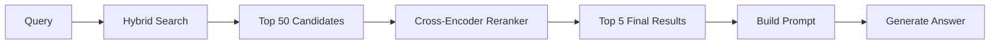
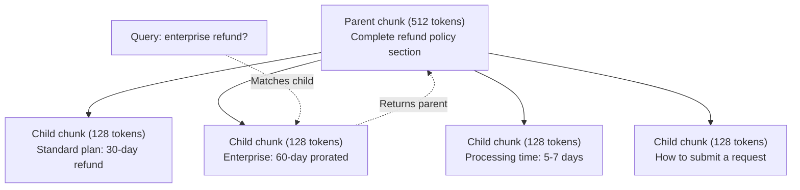
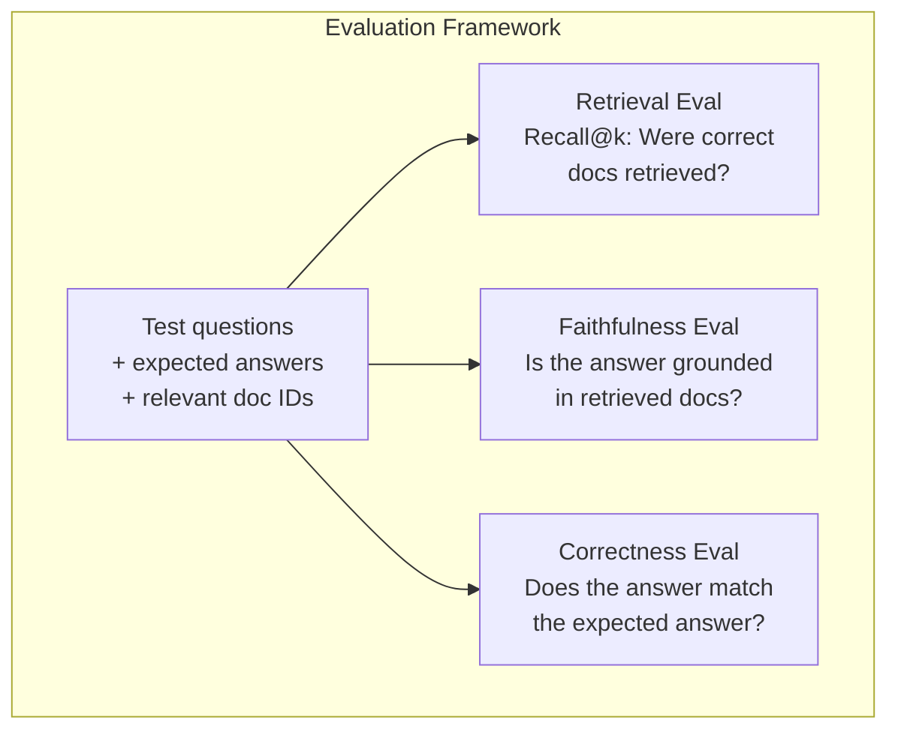

# Advanced RAG (Chunking, Reranking, Hybrid Search)

> Basic RAG retrieves the top-k most similar chunks. This works for simple questions. It breaks down on multi-hop reasoning, ambiguous queries, and large corpora. Advanced RAG is the difference between a demo that works on 10 documents and a system that works on 10 million.

**Type:** Build
**Languages:** Python
**Prerequisites:** Phase 11, Lesson 06 (RAG)
**Time:** ~90 minutes
**Related:** Phase 5 · 23 (Chunking Strategies for RAG) covers all six chunking algorithms — recursive, semantic, sentence, parent-document, late chunking, contextual retrieval — with Vectara/Anthropic benchmarks. This lesson builds on top: hybrid search, reranking, query transforms.

## Learning Objectives

- Implement advanced chunking strategies (semantic, recursive, parent-child) that preserve document structure and context
- Build a hybrid search pipeline combining BM25 keyword matching, semantic vector search, and a cross-encoder reranker
- Apply query transformation techniques (HyDE, multi-query, step-back) to improve retrieval on ambiguous or complex questions
- Diagnose and fix common RAG failures: wrong chunks retrieved, answer not in context, multi-hop reasoning collapse

## The Problem

You built a basic RAG pipeline in Lesson 06. It works for straightforward questions on a small corpus. Now try these:

**Ambiguous query**: "What was last quarter's revenue?" Semantic search returns chunks about revenue strategy, revenue forecasts, the CFO's thoughts on revenue growth. All semantically similar to the word "revenue," but none contain the actual number. The correct chunk says "Q3 2025 was $47.2M" but uses the word "earnings" instead of "revenue." The embedding model thinks "revenue strategy" is closer to the query than "Q3 earnings were $47.2M."

**Multi-hop question**: "Which team had the highest improvement in customer satisfaction scores?" This requires finding satisfaction scores for each team, comparing them, and identifying the maximum. No single chunk contains the answer. The information is spread across team reports.

**Large corpus problem**: You have 2 million chunks. The correct answer is in chunk 1,847,293. Your top-5 retrieval pulls chunks 14, 89,201, 1,200,000, 44, and 901,333. Close in embedding space, but none contain the answer. At this scale, the approximation error in nearest-neighbor search is enough to push relevant results out of the top-k.

Basic RAG fails because vector similarity ≠ relevance. A chunk can be semantically similar to a query without being useful for answering it. Advanced RAG addresses this with four techniques: hybrid search (add keyword matching), reranking (score candidates more carefully), query transformation (fix the query before searching), and better chunking (retrieve at the right granularity).

## The Concept

### Hybrid Search: Semantic + Keyword

Semantic search (vector similarity) excels at understanding meaning. "How do I cancel my subscription?" matches "Steps to terminate your plan" despite sharing no words. But it misses exact matches. "Error code E-4021" might not match a chunk containing "E-4021" if the embedding model treats it as noise.

Keyword search (BM25) is the opposite. It excels at exact matches. "E-4021" matches perfectly. But "cancel my subscription" returns zero results if the document says "terminate your plan."

Hybrid search runs both and merges the results.

**BM25** (Best Matching 25) is the standard keyword search algorithm. It's been the backbone of search engines since the 1990s. The formula:

```
BM25(q, d) = sum over terms t in q:
    IDF(t) * (tf(t,d) * (k1 + 1)) / (tf(t,d) + k1 * (1 - b + b * |d| / avgdl))
```

where tf(t,d) is term frequency in document d, IDF(t) is inverse document frequency, |d| is document length, avgdl is average document length, k1 controls term frequency saturation (default 1.2), b controls length normalization (default 0.75).

In plain language: BM25 scores a document higher when it contains query terms (especially rare ones), but with diminishing returns for repeated occurrences. A document with "revenue" 50 times isn't 50x more relevant than one with it once.

### Reciprocal Rank Fusion (RRF)

You have two ranked lists: one from vector search, one from BM25. How do you merge them? Reciprocal Rank Fusion is the standard approach.

```
RRF_score(d) = sum over rankings R:
    1 / (k + rank_R(d))
```

where k is a constant (usually 60) that prevents top-ranked results from dominating.

A document ranked #1 in vector and #5 in BM25 gets: 1/(60+1) + 1/(60+5) = 0.0164 + 0.0154 = 0.0318

A document ranked #3 in vector and #2 in BM25 gets: 1/(60+3) + 1/(60+2) = 0.0159 + 0.0161 = 0.0320

RRF naturally balances both signals. Documents that rank highly in both lists get the best scores. Documents that are #1 in one list but absent from the other get moderate scores. It's robust because it uses ranks rather than raw scores, so differences in score distributions between the two systems don't matter.

### Reranking

Retrieval (whether vector, keyword, or hybrid) is fast but imprecise. It uses bi-encoders: query and each document are embedded independently, then compared. Embeddings are computed once and cached. This scales to millions of documents.

Reranking uses cross-encoders: query and a candidate document are fed together into a model that outputs a relevance score. The model sees both texts simultaneously and can capture fine-grained interactions between them. A cross-encoder can understand that "What were Q3 earnings?" is highly relevant to a chunk containing "$47.2M in Q3" even if the bi-encoder missed this connection.

The cost: cross-encoders are 100-1000x slower than bi-encoders because they jointly process query-document pairs. You can't pre-compute cross-encoder scores for a million documents. The solution: retrieve a larger candidate set (top-50 from hybrid search), then rerank with a cross-encoder to get the final top-5.



Common reranking models (2026 lineup):
- Cohere Rerank 3.5: managed API, multilingual, best recall uplift on mixed corpora
- Voyage rerank-2.5: managed API, lowest latency among managed options
- Jina-Reranker-v2 Multilingual: open-weight, 100+ languages
- bge-reranker-v2-m3: open-weight, strong baseline
- cross-encoder/ms-marco-MiniLM-L-6-v2: open-weight, runs on CPU for prototyping
- ColBERTv2 / Jina-ColBERT-v2: late-interaction multi-vector reranker — O(tokens) not O(docs) at scoring time

### Query Transformation

Sometimes the problem isn't retrieval, it's the query itself. "What was that thing about the new policy change?" is a terrible search query. It has no specific terms, its embedding is vague. No retrieval system can find the right document from this.

**Query rewriting**: Rewrite the user's query into a better search query. An LLM can do this:

```
User: "What was that thing about the new policy change?"
Rewritten: "Recent policy changes and updates"
```

**HyDE (Hypothetical Document Embedding)**: Instead of searching with the query, generate a hypothetical answer, embed that, and search for similar real documents.

```
Query: "What is the refund policy for enterprise?"
Hypothetical answer: "Enterprise customers are eligible for a full refund
within 60 days of purchase. Refunds are pro-rated based on the remaining
subscription period and processed within 5-7 business days."
```

Embed this hypothetical answer and search for real documents similar to it. The intuition: a hypothetical answer is closer in embedding space to the real answer than the original question is. Questions and answers have different linguistic structure. By generating a hypothetical answer, you bridge the gap between "question space" and "answer space" in embeddings.

HyDE adds one extra LLM call before retrieval. This adds 500-2000ms of latency. It's worth it when retrieval quality on the raw query is poor.

### Parent-Child Chunking

Standard chunking forces a tradeoff: small chunks for precise retrieval, large chunks for sufficient context. Parent-child chunking eliminates this tradeoff.

Index with small chunks (128 tokens) for retrieval. When a small chunk is retrieved, return its parent chunk (512 tokens) to the prompt. The small chunk precisely matches the query; the parent chunk gives the LLM enough context to generate a good answer.



The query "enterprise refund?" precisely matches child chunk C2. But the prompt receives the full parent chunk P, which includes surrounding context about processing time and submission process.

### Metadata Filtering

Before running vector search, filter the corpus by metadata: date, source, category, author, language. This narrows the search space and prevents irrelevant results.

"What changed in the security policy last month?" should only search documents in the security category from the last 30 days. Without metadata filtering, you search the entire corpus and might retrieve a two-year-old security document that happens to be semantically similar.

Production RAG systems store metadata alongside each chunk: source document, creation date, category, author, version. Vector databases support pre-filtering by metadata before similarity search, which is critical for performance at scale.

### Evaluation

You built a RAG system. How do you know it works? Three metrics:

**Retrieval relevance (Recall@k)**: For a set of test questions with known relevant documents, what fraction of relevant documents appear in the top-k results? If the answer to a question is in chunk 47, is chunk 47 in the top-5?

**Faithfulness**: Is the generated answer grounded in the retrieved documents? If the retrieved chunks say "60-day refund window" but the model says "90-day refund window," that's a faithfulness failure. The model hallucinated despite having the correct context.

**Answer correctness**: Does the generated answer match the expected answer? This is the end-to-end metric. It combines retrieval quality and generation quality.

A simple faithfulness check: take each claim in the generated answer and verify it (in substance) appears in the retrieved chunks. If the answer contains a fact not in any retrieved chunk, it's likely a hallucination.



## Build It

### Step 1: Implement BM25

```python
import math
from collections import Counter

class BM25:
    def __init__(self, k1=1.2, b=0.75):
        self.k1 = k1
        self.b = b
        self.docs = []
        self.doc_lengths = []
        self.avg_dl = 0
        self.doc_freqs = {}
        self.n_docs = 0

    def index(self, documents):
        self.docs = documents
        self.n_docs = len(documents)
        self.doc_lengths = []
        self.doc_freqs = {}

        for doc in documents:
            words = doc.lower().split()
            self.doc_lengths.append(len(words))
            unique_words = set(words)
            for word in unique_words:
                self.doc_freqs[word] = self.doc_freqs.get(word, 0) + 1

        self.avg_dl = sum(self.doc_lengths) / self.n_docs if self.n_docs else 1

    def score(self, query, doc_idx):
        query_words = query.lower().split()
        doc_words = self.docs[doc_idx].lower().split()
        doc_len = self.doc_lengths[doc_idx]
        word_counts = Counter(doc_words)
        score = 0.0

        for term in query_words:
            if term not in word_counts:
                continue
            tf = word_counts[term]
            df = self.doc_freqs.get(term, 0)
            idf = math.log((self.n_docs - df + 0.5) / (df + 0.5) + 1)
            numerator = tf * (self.k1 + 1)
            denominator = tf + self.k1 * (1 - self.b + self.b * doc_len / self.avg_dl)
            score += idf * numerator / denominator

        return score

    def search(self, query, top_k=10):
        scores = [(i, self.score(query, i)) for i in range(self.n_docs)]
        scores.sort(key=lambda x: x[1], reverse=True)
        return scores[:top_k]
```

### Step 2: Reciprocal Rank Fusion

```python
def reciprocal_rank_fusion(ranked_lists, k=60):
    scores = {}
    for ranked_list in ranked_lists:
        for rank, (doc_id, _) in enumerate(ranked_list):
            if doc_id not in scores:
                scores[doc_id] = 0.0
            scores[doc_id] += 1.0 / (k + rank + 1)
    fused = sorted(scores.items(), key=lambda x: x[1], reverse=True)
    return fused
```

### Step 3: Hybrid Search Pipeline

```python
def hybrid_search(query, chunks, vector_embeddings, vocab, idf, bm25_index, top_k=5, fusion_k=60):
    query_emb = tfidf_embed(query, vocab, idf)
    vector_results = search(query_emb, vector_embeddings, top_k=top_k * 3)
    bm25_results = bm25_index.search(query, top_k=top_k * 3)
    fused = reciprocal_rank_fusion([vector_results, bm25_results], k=fusion_k)
    return fused[:top_k]
```

### Step 4: Simple Reranker

In production you'd use a cross-encoder model. Here we build a reranker that scores query-document relevance using word overlap, word importance, and phrase matching.

```python
def rerank(query, candidates, chunks):
    query_words = set(query.lower().split())
    stop_words = {"the", "a", "an", "is", "are", "was", "were", "what", "how",
                  "why", "when", "where", "do", "does", "for", "of", "in", "to",
                  "and", "or", "on", "at", "by", "it", "its", "this", "that",
                  "with", "from", "be", "has", "have", "had", "not", "but"}
    query_terms = query_words - stop_words

    scored = []
    for doc_id, initial_score in candidates:
        chunk = chunks[doc_id].lower()
        chunk_words = set(chunk.split())

        term_overlap = len(query_terms & chunk_words)

        query_bigrams = set()
        q_list = [w for w in query.lower().split() if w not in stop_words]
        for i in range(len(q_list) - 1):
            query_bigrams.add(q_list[i] + " " + q_list[i + 1])
        bigram_matches = sum(1 for bg in query_bigrams if bg in chunk)

        position_boost = 0
        for term in query_terms:
            pos = chunk.find(term)
            if pos != -1 and pos < len(chunk) // 3:
                position_boost += 0.5

        rerank_score = (
            term_overlap * 1.0
            + bigram_matches * 2.0
            + position_boost
            + initial_score * 5.0
        )
        scored.append((doc_id, rerank_score))

    scored.sort(key=lambda x: x[1], reverse=True)
    return scored
```

### Step 5: HyDE (Hypothetical Document Embedding)

```python
def hyde_generate_hypothesis(query):
    templates = {
        "what": "The answer to '{query}' is as follows: Based on our documentation, {topic} involves specific policies and procedures that define how the process works.",
        "how": "To address '{query}': The process involves several steps. First, you need to initiate the request. Then, the system processes it according to the defined rules.",
        "default": "Regarding '{query}': Our records indicate specific details and policies related to this topic that provide a comprehensive answer."
    }
    query_lower = query.lower()
    if query_lower.startswith("what"):
        template = templates["what"]
    elif query_lower.startswith("how"):
        template = templates["how"]
    else:
        template = templates["default"]

    topic_words = [w for w in query.lower().split()
                   if w not in {"what", "is", "the", "how", "do", "does", "a", "an",
                                "for", "of", "to", "in", "on", "at", "by", "and", "or"}]
    topic = " ".join(topic_words) if topic_words else "this topic"

    return template.format(query=query, topic=topic)


def hyde_search(query, chunks, vector_embeddings, vocab, idf, top_k=5):
    hypothesis = hyde_generate_hypothesis(query)
    hypothesis_emb = tfidf_embed(hypothesis, vocab, idf)
    results = search(hypothesis_emb, vector_embeddings, top_k)
    return results, hypothesis
```

### Step 6: Parent-Child Chunking

```python
def create_parent_child_chunks(text, parent_size=200, child_size=50):
    words = text.split()
    parents = []
    children = []
    child_to_parent = {}

    parent_idx = 0
    start = 0
    while start < len(words):
        parent_end = min(start + parent_size, len(words))
        parent_text = " ".join(words[start:parent_end])
        parents.append(parent_text)

        child_start = start
        while child_start < parent_end:
            child_end = min(child_start + child_size, parent_end)
            child_text = " ".join(words[child_start:child_end])
            child_idx = len(children)
            children.append(child_text)
            child_to_parent[child_idx] = parent_idx
            child_start += child_size

        parent_idx += 1
        start += parent_size

    return parents, children, child_to_parent
```

### Step 7: Faithfulness Evaluation

```python
def evaluate_faithfulness(answer, retrieved_chunks):
    answer_sentences = [s.strip() for s in answer.split(".") if len(s.strip()) > 10]
    if not answer_sentences:
        return 1.0, []

    grounded = 0
    ungrounded = []
    context = " ".join(retrieved_chunks).lower()

    for sentence in answer_sentences:
        words = set(sentence.lower().split())
        stop_words = {"the", "a", "an", "is", "are", "was", "were", "and", "or",
                      "to", "of", "in", "for", "on", "at", "by", "it", "this", "that"}
        content_words = words - stop_words
        if not content_words:
            grounded += 1
            continue

        matched = sum(1 for w in content_words if w in context)
        ratio = matched / len(content_words) if content_words else 0

        if ratio >= 0.5:
            grounded += 1
        else:
            ungrounded.append(sentence)

    score = grounded / len(answer_sentences) if answer_sentences else 1.0
    return score, ungrounded


def evaluate_retrieval_recall(queries_with_relevant, retrieval_fn, k=5):
    total_recall = 0.0
    results = []

    for query, relevant_indices in queries_with_relevant:
        retrieved = retrieval_fn(query, k)
        retrieved_indices = set(idx for idx, _ in retrieved)
        relevant_set = set(relevant_indices)
        hits = len(retrieved_indices & relevant_set)
        recall = hits / len(relevant_set) if relevant_set else 1.0
        total_recall += recall
        results.append({
            "query": query,
            "recall": recall,
            "hits": hits,
            "total_relevant": len(relevant_set)
        })

    avg_recall = total_recall / len(queries_with_relevant) if queries_with_relevant else 0
    return avg_recall, results
```

## Use It

With a real cross-encoder for reranking:

```python
from sentence_transformers import CrossEncoder

reranker = CrossEncoder("cross-encoder/ms-marco-MiniLM-L-6-v2")

def rerank_with_cross_encoder(query, candidates, chunks, top_k=5):
    pairs = [(query, chunks[doc_id]) for doc_id, _ in candidates]
    scores = reranker.predict(pairs)
    scored = list(zip([doc_id for doc_id, _ in candidates], scores))
    scored.sort(key=lambda x: x[1], reverse=True)
    return scored[:top_k]
```

With Cohere's managed reranker:

```python
import cohere

co = cohere.Client()

def rerank_with_cohere(query, candidates, chunks, top_k=5):
    docs = [chunks[doc_id] for doc_id, _ in candidates]
    response = co.rerank(
        model="rerank-english-v3.0",
        query=query,
        documents=docs,
        top_n=top_k
    )
    return [(candidates[r.index][0], r.relevance_score) for r in response.results]
```

With a real LLM for HyDE:

```python
import anthropic

client = anthropic.Anthropic()

def hyde_with_llm(query):
    response = client.messages.create(
        model="claude-sonnet-4-20250514",
        max_tokens=256,
        messages=[{
            "role": "user",
            "content": f"Write a short paragraph that would be a good answer to this question. Do not say you don't know. Just write what the answer would look like.\n\nQuestion: {query}"
        }]
    )
    return response.content[0].text
```

With Weaviate for production hybrid search:

```python
import weaviate

client = weaviate.connect_to_local()

collection = client.collections.get("Documents")
response = collection.query.hybrid(
    query="enterprise refund policy",
    alpha=0.5,
    limit=10
)
```

The alpha parameter controls the balance: 0.0 = pure keyword (BM25), 1.0 = pure vector, 0.5 = equal weight. Most production systems use an alpha between 0.3 and 0.7.

## Ship It

This lesson produces:
- `outputs/prompt-advanced-rag-debugger.md` — a prompt that diagnoses and fixes RAG quality issues
- `outputs/skill-advanced-rag.md` — a skill for building production RAG with hybrid search and reranking

## Exercises

1. Compare BM25 vs vector search vs hybrid search on sample documents. For each of 5 test queries, record which method returns the most relevant chunk at position 1. Hybrid should win at least 3 out of 5.

2. Implement a metadata filter. Add a "category" field to each document (security, billing, api, product). Filter chunks to only the relevant category before running vector search. Test with "What encryption is used?" and verify it only searches security chunks.

3. Build a complete HyDE pipeline using the simple generate function from Lesson 06. Compare retrieval quality (top-3 relevance) between direct query search and HyDE search on all 5 test queries. HyDE should improve results on ambiguous queries.

4. Implement parent-child chunking on sample documents. Use child_size=30, parent_size=100. Search with child chunks but return parent chunks in the prompt. Compare generated answers against standard chunking with chunk_size=50.

5. Create an evaluation dataset: 10 questions with known answer chunks. Measure Recall@3, Recall@5, Recall@10 for each of: (a) vector search only, (b) BM25 only, (c) hybrid search, (d) hybrid + reranking. Plot the results and identify where reranking helps most.

## Key Terms

| Term | What people say | What it actually is |
|------|----------------|----------------------|
| BM25 | "Keyword search" | A probabilistic ranking algorithm that scores documents by term frequency, inverse document frequency, and document length normalization |
| Hybrid search | "Best of both worlds" | Running semantic (vector) and keyword (BM25) search in parallel, then merging results with rank fusion |
| Reciprocal Rank Fusion | "Merging ranked lists" | Combining multiple ranked lists by summing 1/(k + rank) for each document across all lists |
| Reranking | "Second-pass scoring" | Using a more expensive cross-encoder model to re-score candidates from an initial retrieval pass |
| Cross-encoder | "Joint query-document model" | A model that takes query and document as a single input and outputs a relevance score; more accurate than bi-encoders but too slow for full-corpus search |
| Bi-encoder | "Independent embedding model" | A model that embeds query and document independently; fast because embeddings are precomputed, but less accurate than cross-encoders |
| HyDE | "Search with a fake answer" | Generate a hypothetical answer to the query, embed it, and search for real documents similar to it |
| Parent-child chunking | "Small search, big context" | Index with small chunks for precise retrieval but return larger parent chunks for sufficient context |
| Metadata filtering | "Narrow before searching" | Filtering documents by attributes (date, source, category) before running vector search to reduce the search space |
| Faithfulness | "Did it stay grounded" | Whether the generated answer is supported by retrieved documents rather than hallucinated from model training data |

## Further Reading

- Robertson & Zaragoza, "The Probabilistic Relevance Framework: BM25 and Beyond" (2009) — the definitive BM25 reference explaining the probabilistic foundations behind the formula
- Cormack et al., "Reciprocal Rank Fusion Outperforms Condorcet and Individual Rank Learning Methods" (2009) — the original RRF paper showing it beats more complex fusion methods
- Gao et al., "Precise Zero-Shot Dense Retrieval without Relevance Labels" (2022) — the HyDE paper showing hypothetical document embeddings improve retrieval without any training data
- Nogueira & Cho, "Passage Re-ranking with BERT" (2019) — demonstrates that cross-encoder reranking on top of BM25 significantly improves retrieval quality
- [Khattab et al., "DSPy: Compiling Declarative Language Model Calls into Self-Improving Pipelines" (2023)](https://arxiv.org/abs/2310.03714) — treats prompt construction and weight selection as optimization problems over retrieval pipelines; read it for "programming LLMs" rather than "prompting LLMs."
- [Edge et al., "From Local to Global: A Graph RAG Approach to Query-Focused Summarization" (Microsoft Research 2024)](https://arxiv.org/abs/2404.16130) — the GraphRAG paper: entity-relation extraction + Leiden community detection for query-focused summarization; the global vs local retrieval distinction.
- [Asai et al., "Self-RAG: Learning to Retrieve, Generate, and Critique through Self-Reflection" (ICLR 2024)](https://arxiv.org/abs/2310.11511) — self-evaluating RAG with reflection tokens; the agentic frontier beyond static retrieve-then-generate.
- [LangChain Query Construction blog](https://blog.langchain.dev/query-construction/) — how to translate natural language queries into structured database queries (Text-to-SQL, Cypher) as a pre-retrieval step.
