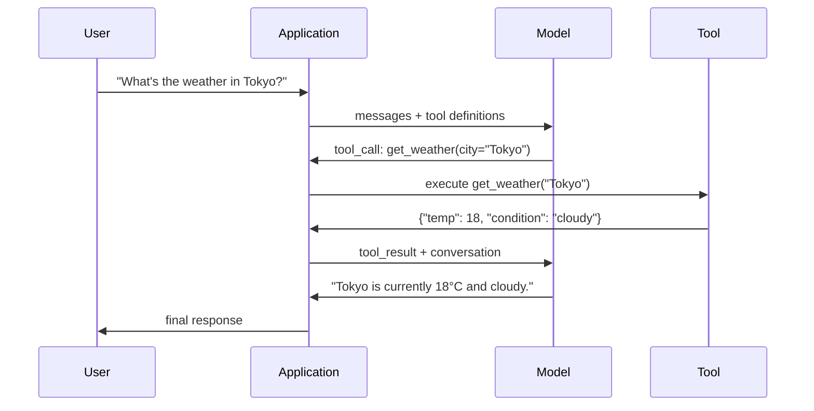

# Function Calling & Tool Use

> LLMs can't do anything. They generate text. That's the full extent of their capability. They can't check the weather, query a database, send an email, run code, or read a file. Every "AI agent" you've ever seen is an LLM generating JSON that says which function to call — and then your code actually calls it. The model is the brain, tools are the hands, and function calling is the nervous system connecting them.

**Type:** Build
**Languages:** Python
**Prerequisites:** Phase 11 Lesson 03 (Structured Outputs)
**Time:** ~75 minutes
**Related:** Phase 11 · 14 (Model Context Protocol) — when a tool needs to be shared across multiple hosts, you upgrade from inline function-calling to an MCP server. This lesson covers the inline case; MCP covers the protocol case.

## Learning Objectives

- Implement a function calling loop: define tool schemas, parse the model's tool-call JSON, execute functions, return results
- Design tool schemas with clear descriptions and typed parameters that enable reliable model invocation
- Build a multi-turn agent loop that chains multiple function calls to answer complex queries
- Handle function calling edge cases: parallel tool calls, error propagation, and preventing infinite tool loops

## The Problem

You're building a chatbot. A user asks: "What's the weather like in Tokyo right now?"

The model responds: "I don't have access to real-time weather data, but based on the season, Tokyo is probably around 15 degrees Celsius..."

This is a hallucination wrapped in a disclaimer. The model doesn't know the weather and never will. Weather changes every hour. The model's training data is months old.

The correct answer requires calling the OpenWeatherMap API, getting the current temperature, and returning the real number. The model can't call an API. Your code can. The missing piece: a structured protocol for the model to say "I need to call the weather API with these parameters" and for your code to execute it and feed the result back.

That's function calling. The model outputs structured JSON describing which function to call with what arguments. Your application executes the function. The result goes back into the conversation. The model uses that result to produce its final answer.

Without function calling, LLMs are encyclopedias. With it, they become agents.

## The Concept

### The Function Calling Loop

Every tool-use interaction follows the same 5-step cycle.



Step 1: User sends a message. Step 2: Model receives the message along with tool definitions (JSON Schema describing available functions). Step 3: Instead of responding with text, the model outputs a tool call — a structured JSON object with a function name and arguments. Step 4: Your code executes the function and captures the result. Step 5: The result goes back to the model, which now has real data to produce its final answer.

The model never executes anything. It only decides what to call and with what arguments. Your code is the executor.

### Tool Definitions: The JSON Schema Contract

Each tool is defined by a JSON Schema that tells the model what the function does, what parameters it accepts, and what types those parameters must be.

```json
{
  "type": "function",
  "function": {
    "name": "get_weather",
    "description": "Get current weather for a city. Returns temperature in Celsius and conditions.",
    "parameters": {
      "type": "object",
      "properties": {
        "city": {
          "type": "string",
          "description": "City name, e.g. 'Tokyo' or 'San Francisco'"
        },
        "units": {
          "type": "string",
          "enum": ["celsius", "fahrenheit"],
          "description": "Temperature units"
        }
      },
      "required": ["city"]
    }
  }
}
```

The `description` fields are critical. The model reads them to decide when and how to use the tool. A vague description like "gets weather" produces worse tool selection than "Get current weather for a city. Returns temperature in Celsius and conditions." The description is a prompt for tool selection.

### Provider Comparison

Every major provider supports function calling, but the API layer varies.

| Provider | API Parameter | Tool Call Format | Parallel Calls | Forced Call |
|----------|--------------|-----------------|---------------|----------------|
| OpenAI (GPT-5, o4) | `tools` | `tool_calls[].function` | Yes (multiple per turn) | `tool_choice="required"` |
| Anthropic (Claude 4.6/4.7) | `tools` | `content[].type="tool_use"` | Yes (multiple blocks) | `tool_choice={"type":"any"}` |
| Google (Gemini 3) | `function_declarations` | `functionCall` | Yes | `function_calling_config` |
| Open-weight (Llama 4, Qwen3, DeepSeek-V3) | Native `tools` on Llama 4; others use Hermes or ChatML | Mixed | Model-dependent | Prompt-based, or `tool_choice` where supported |

By 2026, the three closed-source providers have converged on a nearly identical JSON Schema-based format. Llama 4 ships a native `tools` field matching the OpenAI shape. Open-weight fine-tunes still vary — the most common format in third-party fine-tunes is Hermes format (NousResearch). For tools shared across hosts, prefer MCP (Phase 11 · 14) over inline function-calling — the server is the same for all of them.

### Tool Choice: Auto, Required, Specific

You control when the model uses tools.

**Auto** (default): The model decides whether to call a tool or respond directly. "What's 2+2?" — respond directly. "What's the weather?" — call a tool.

**Required**: The model must call at least one tool. Use this when you're sure the user's intent requires a tool. Prevents the model from guessing instead of looking up real data.

**Specific function**: Force the model to call a particular function. `tool_choice={"type":"function", "function": {"name": "get_weather"}}` guarantees the weather tool is called regardless of the query. Use it for routing — when upstream logic has already determined which tool is needed.

### Parallel Function Calling

GPT-4o and Claude can call multiple functions in a single turn. A user asks: "What's the weather in Tokyo and New York?" The model outputs two tool calls simultaneously:

```json
[
  {"name": "get_weather", "arguments": {"city": "Tokyo"}},
  {"name": "get_weather", "arguments": {"city": "New York"}}
]
```

Your code executes both (ideally concurrently), returns both results, and the model synthesizes a single response. This cuts round-trips from 2 to 1. For agents with 5-10 tool calls per query, parallel calling reduces latency by 60-80%.

### Structured Outputs vs Function Calling

Lesson 03 covered structured outputs. Function calling uses the same JSON Schema machinery but for a different purpose.

**Structured outputs**: Force the model to produce data in a specific shape. The output is the final product. Example: extracting product info from text into `{name, price, in_stock}`.

**Function calling**: The model declares intent to perform an action. The output is an intermediate step. Example: `get_weather(city="Tokyo")` — the model is requesting an action, not producing a final answer.

Use structured outputs for data extraction. Use function calling when the model needs to interact with external systems.

### Safety: Non-Negotiable Rules

Function calling is the most dangerous capability you can give an LLM. The model chooses what to execute. If your tool set includes a database query, the model constructs the query. If it includes a shell command, the model writes the command.

**Rule 1: Never pass model-generated SQL directly to a database.** Models can and will generate DROP TABLE, UNION injections, or queries that return every row. Always parameterize. Always validate. Always use an allowlist of operations.

**Rule 2: Allowlist functions.** The model can only call functions you explicitly define. Never create a generic "execute any function by name" tool. If you have 50 internal functions, only expose the 5 the user needs.

**Rule 3: Validate arguments.** The model might pass a city name of `"; DROP TABLE users; --"`. Validate every argument against expected types, ranges, and formats before execution.

**Rule 4: Sanitize tool results.** If a tool returns sensitive data (API keys, PII, internal errors), filter it before sending back to the model. The model will include tool results verbatim in its response.

**Rule 5: Rate-limit tool calls.** A model stuck in a loop can call tools hundreds of times. Set a cap (10-20 per conversation is reasonable). Break infinite loops.

### Error Handling

Tools fail. APIs time out. Databases go down. Files don't exist. The model needs to know when a tool failed and why.

Return errors as structured tool results, not exceptions:

```json
{
  "error": true,
  "message": "City 'Toky' not found. Did you mean 'Tokyo'?",
  "code": "CITY_NOT_FOUND"
}
```

The model reads this, adjusts its arguments, and retries. Models are good at self-correcting from structured error messages. They're bad at recovering from empty responses or generic "something went wrong" errors.

### MCP: Model Context Protocol

MCP is Anthropic's open standard for tool interoperability. Instead of each application defining its own tools, MCP provides a universal protocol: tools are served by MCP servers and consumed by MCP clients (like Claude Code, Cursor, or your app).

An MCP server can expose tools to any compatible client. A Postgres MCP server gives any MCP-compatible agent database access. A GitHub MCP server gives any agent repository access. Define tools once, use everywhere.

MCP is to function calling what HTTP is to the web. It standardizes the transport layer and makes tools portable.

## Build It

### Step 1: Define a Tool Registry

Build a registry that stores tool definitions and their implementations. Each tool has a JSON Schema definition (what the model sees) and a Python function (what your code executes).

```python
import json
import math
import time
import hashlib


TOOL_REGISTRY = {}


def register_tool(name, description, parameters, function):
    TOOL_REGISTRY[name] = {
        "definition": {
            "type": "function",
            "function": {
                "name": name,
                "description": description,
                "parameters": parameters,
            },
        },
        "function": function,
    }
```

### Step 2: Implement 5 Tools

Build a calculator, weather lookup, web search simulator, file reader, and code runner.

```python
def calculator(expression, precision=2):
    allowed = set("0123456789+-*/.() ")
    if not all(c in allowed for c in expression):
        return {"error": True, "message": f"Invalid characters in expression: {expression}"}
    try:
        result = eval(expression, {"__builtins__": {}}, {"math": math})
        return {"result": round(float(result), precision), "expression": expression}
    except Exception as e:
        return {"error": True, "message": str(e)}


WEATHER_DB = {
    "tokyo": {"temp_c": 18, "condition": "cloudy", "humidity": 72, "wind_kph": 14},
    "new york": {"temp_c": 22, "condition": "sunny", "humidity": 45, "wind_kph": 8},
    "london": {"temp_c": 12, "condition": "rainy", "humidity": 88, "wind_kph": 22},
    "san francisco": {"temp_c": 16, "condition": "foggy", "humidity": 80, "wind_kph": 18},
    "sydney": {"temp_c": 25, "condition": "sunny", "humidity": 55, "wind_kph": 10},
}


def get_weather(city, units="celsius"):
    key = city.lower().strip()
    if key not in WEATHER_DB:
        suggestions = [c for c in WEATHER_DB if c.startswith(key[:3])]
        return {
            "error": True,
            "message": f"City '{city}' not found.",
            "suggestions": suggestions,
            "code": "CITY_NOT_FOUND",
        }
    data = WEATHER_DB[key].copy()
    if units == "fahrenheit":
        data["temp_f"] = round(data["temp_c"] * 9 / 5 + 32, 1)
        del data["temp_c"]
    data["city"] = city
    return data


SEARCH_DB = {
    "python function calling": [
        {"title": "OpenAI Function Calling Guide", "url": "https://platform.openai.com/docs/guides/function-calling", "snippet": "Learn how to connect LLMs to external tools."},
        {"title": "Anthropic Tool Use", "url": "https://docs.anthropic.com/en/docs/tool-use", "snippet": "Claude can interact with external tools and APIs."},
    ],
    "MCP protocol": [
        {"title": "Model Context Protocol", "url": "https://modelcontextprotocol.io", "snippet": "An open standard for connecting AI models to data sources."},
    ],
    "weather API": [
        {"title": "OpenWeatherMap API", "url": "https://openweathermap.org/api", "snippet": "Free weather API with current, forecast, and historical data."},
    ],
}


def web_search(query, max_results=3):
    key = query.lower().strip()
    for db_key, results in SEARCH_DB.items():
        if db_key in key or key in db_key:
            return {"query": query, "results": results[:max_results], "total": len(results)}
    return {"query": query, "results": [], "total": 0}


FILE_SYSTEM = {
    "data/config.json": '{"model": "gpt-4o", "temperature": 0.7, "max_tokens": 4096}',
    "data/users.csv": "name,email,role\nAlice,alice@example.com,admin\nBob,bob@example.com,user",
    "README.md": "# My Project\nA tool-use agent built from scratch.",
}


def read_file(path):
    if ".." in path or path.startswith("/"):
        return {"error": True, "message": "Path traversal not allowed.", "code": "FORBIDDEN"}
    if path not in FILE_SYSTEM:
        available = list(FILE_SYSTEM.keys())
        return {"error": True, "message": f"File '{path}' not found.", "available_files": available, "code": "NOT_FOUND"}
    content = FILE_SYSTEM[path]
    return {"path": path, "content": content, "size_bytes": len(content), "lines": content.count("\n") + 1}


def run_code(code, language="python"):
    if language != "python":
        return {"error": True, "message": f"Language '{language}' not supported. Only 'python' is available."}
    forbidden = ["import os", "import sys", "import subprocess", "exec(", "eval(", "__import__", "open("]
    for pattern in forbidden:
        if pattern in code:
            return {"error": True, "message": f"Forbidden operation: {pattern}", "code": "SECURITY_VIOLATION"}
    try:
        local_vars = {}
        exec(code, {"__builtins__": {"print": print, "range": range, "len": len, "str": str, "int": int, "float": float, "list": list, "dict": dict, "sum": sum, "min": min, "max": max, "abs": abs, "round": round, "sorted": sorted, "enumerate": enumerate, "zip": zip, "map": map, "filter": filter, "math": math}}, local_vars)
        result = local_vars.get("result", None)
        return {"success": True, "result": result, "variables": {k: str(v) for k, v in local_vars.items() if not k.startswith("_")}}
    except Exception as e:
        return {"error": True, "message": f"{type(e).__name__}: {e}"}
```

### Step 3: Register All Tools

```python
def register_all_tools():
    register_tool(
        "calculator", "Evaluate a mathematical expression. Supports +, -, *, /, parentheses, and decimals. Returns the numeric result.",
        {"type": "object", "properties": {"expression": {"type": "string", "description": "Math expression, e.g. '(10 + 5) * 3'"}, "precision": {"type": "integer", "description": "Decimal places in result", "default": 2}}, "required": ["expression"]},
        calculator,
    )
    register_tool(
        "get_weather", "Get current weather for a city. Returns temperature, condition, humidity, and wind speed.",
        {"type": "object", "properties": {"city": {"type": "string", "description": "City name, e.g. 'Tokyo' or 'San Francisco'"}, "units": {"type": "string", "enum": ["celsius", "fahrenheit"], "description": "Temperature units, defaults to celsius"}}, "required": ["city"]},
        get_weather,
    )
    register_tool(
        "web_search", "Search the web for information. Returns a list of results with title, URL, and snippet.",
        {"type": "object", "properties": {"query": {"type": "string", "description": "Search query"}, "max_results": {"type": "integer", "description": "Maximum results to return", "default": 3}}, "required": ["query"]},
        web_search,
    )
    register_tool(
        "read_file", "Read the contents of a file. Returns the file content, size, and line count.",
        {"type": "object", "properties": {"path": {"type": "string", "description": "Relative file path, e.g. 'data/config.json'"}}, "required": ["path"]},
        read_file,
    )
    register_tool(
        "run_code", "Execute Python code in a sandboxed environment. Set a 'result' variable to return output.",
        {"type": "object", "properties": {"code": {"type": "string", "description": "Python code to execute"}, "language": {"type": "string", "enum": ["python"], "description": "Programming language"}}, "required": ["code"]},
        run_code,
    )
```

### Step 4: Build the Function Calling Loop

This is the core engine. It simulates the model deciding which tool to call, executes the tool, and feeds results back.

```python
def simulate_model_decision(user_message, tools, conversation_history):
    msg = user_message.lower()

    if any(word in msg for word in ["weather", "temperature", "forecast"]):
        cities = []
        for city in WEATHER_DB:
            if city in msg:
                cities.append(city)
        if not cities:
            for word in msg.split():
                if word.capitalize() in [c.title() for c in WEATHER_DB]:
                    cities.append(word)
        if not cities:
            cities = ["tokyo"]
        calls = []
        for city in cities:
            calls.append({"name": "get_weather", "arguments": {"city": city.title()}})
        return calls

    if any(word in msg for word in ["calculate", "compute", "math", "what is", "how much"]):
        for token in msg.split():
            if any(c in token for c in "+-*/"):
                return [{"name": "calculator", "arguments": {"expression": token}}]
        if "+" in msg or "-" in msg or "*" in msg or "/" in msg:
            expr = "".join(c for c in msg if c in "0123456789+-*/.() ")
            if expr.strip():
                return [{"name": "calculator", "arguments": {"expression": expr.strip()}}]
        return [{"name": "calculator", "arguments": {"expression": "0"}}]

    if any(word in msg for word in ["search", "find", "look up", "google"]):
        query = msg.replace("search for", "").replace("look up", "").replace("find", "").strip()
        return [{"name": "web_search", "arguments": {"query": query}}]

    if any(word in msg for word in ["read", "file", "open", "cat", "show"]):
        for path in FILE_SYSTEM:
            if path.split("/")[-1].split(".")[0] in msg:
                return [{"name": "read_file", "arguments": {"path": path}}]
        return [{"name": "read_file", "arguments": {"path": "README.md"}}]

    if any(word in msg for word in ["run", "execute", "code", "python"]):
        return [{"name": "run_code", "arguments": {"code": "result = 'Hello from the sandbox!'", "language": "python"}}]

    return []


def execute_tool_call(tool_call):
    name = tool_call["name"]
    args = tool_call["arguments"]

    if name not in TOOL_REGISTRY:
        return {"error": True, "message": f"Unknown tool: {name}", "code": "UNKNOWN_TOOL"}

    tool = TOOL_REGISTRY[name]
    func = tool["function"]
    start = time.time()

    try:
        result = func(**args)
    except TypeError as e:
        result = {"error": True, "message": f"Invalid arguments: {e}"}

    elapsed_ms = round((time.time() - start) * 1000, 2)
    return {"tool": name, "result": result, "execution_time_ms": elapsed_ms}


def run_function_calling_loop(user_message, max_iterations=5):
    conversation = [{"role": "user", "content": user_message}]
    tool_definitions = [t["definition"] for t in TOOL_REGISTRY.values()]
    all_tool_results = []

    for iteration in range(max_iterations):
        tool_calls = simulate_model_decision(user_message, tool_definitions, conversation)

        if not tool_calls:
            break

        results = []
        for call in tool_calls:
            result = execute_tool_call(call)
            results.append(result)

        conversation.append({"role": "assistant", "content": None, "tool_calls": tool_calls})

        for result in results:
            conversation.append({"role": "tool", "content": json.dumps(result["result"]), "tool_name": result["tool"]})

        all_tool_results.extend(results)
        break

    return {"conversation": conversation, "tool_results": all_tool_results, "iterations": iteration + 1 if tool_calls else 0}
```

### Step 5: Argument Validation

Build a validator that checks tool call arguments against the JSON Schema before execution.

```python
def validate_tool_arguments(tool_name, arguments):
    if tool_name not in TOOL_REGISTRY:
        return [f"Unknown tool: {tool_name}"]

    schema = TOOL_REGISTRY[tool_name]["definition"]["function"]["parameters"]
    errors = []

    if not isinstance(arguments, dict):
        return [f"Arguments must be an object, got {type(arguments).__name__}"]

    for required_field in schema.get("required", []):
        if required_field not in arguments:
            errors.append(f"Missing required argument: {required_field}")

    properties = schema.get("properties", {})
    for arg_name, arg_value in arguments.items():
        if arg_name not in properties:
            errors.append(f"Unknown argument: {arg_name}")
            continue

        prop_schema = properties[arg_name]
        expected_type = prop_schema.get("type")

        type_checks = {"string": str, "integer": int, "number": (int, float), "boolean": bool, "array": list, "object": dict}
        if expected_type in type_checks:
            if not isinstance(arg_value, type_checks[expected_type]):
                errors.append(f"Argument '{arg_name}': expected {expected_type}, got {type(arg_value).__name__}")

        if "enum" in prop_schema and arg_value not in prop_schema["enum"]:
            errors.append(f"Argument '{arg_name}': '{arg_value}' not in {prop_schema['enum']}")

    return errors
```

### Step 6: Run the Demo

```python
def run_demo():
    register_all_tools()

    print("=" * 60)
    print("  Function Calling & Tool Use Demo")
    print("=" * 60)

    print("\n--- Registered Tools ---")
    for name, tool in TOOL_REGISTRY.items():
        desc = tool["definition"]["function"]["description"][:60]
        params = list(tool["definition"]["function"]["parameters"].get("properties", {}).keys())
        print(f"  {name}: {desc}...")
        print(f"    params: {params}")

    print(f"\n--- Argument Validation ---")
    validation_tests = [
        ("get_weather", {"city": "Tokyo"}, "Valid call"),
        ("get_weather", {}, "Missing required arg"),
        ("get_weather", {"city": "Tokyo", "units": "kelvin"}, "Invalid enum value"),
        ("calculator", {"expression": 123}, "Wrong type (int for string)"),
        ("unknown_tool", {"x": 1}, "Unknown tool"),
    ]
    for tool_name, args, label in validation_tests:
        errors = validate_tool_arguments(tool_name, args)
        status = "VALID" if not errors else f"ERRORS: {errors}"
        print(f"  {label}: {status}")

    print(f"\n--- Tool Execution ---")
    direct_tests = [
        {"name": "calculator", "arguments": {"expression": "(10 + 5) * 3 / 2"}},
        {"name": "get_weather", "arguments": {"city": "Tokyo"}},
        {"name": "get_weather", "arguments": {"city": "Mars"}},
        {"name": "web_search", "arguments": {"query": "python function calling"}},
        {"name": "read_file", "arguments": {"path": "data/config.json"}},
        {"name": "read_file", "arguments": {"path": "../etc/passwd"}},
        {"name": "run_code", "arguments": {"code": "result = sum(range(1, 101))"}},
        {"name": "run_code", "arguments": {"code": "import os; os.system('rm -rf /')"}},
    ]
    for call in direct_tests:
        result = execute_tool_call(call)
        print(f"\n  {call['name']}({json.dumps(call['arguments'])})")
        print(f"    -> {json.dumps(result['result'], indent=None)[:100]}")
        print(f"    time: {result['execution_time_ms']}ms")

    print(f"\n--- Full Function Calling Loop ---")
    test_queries = [
        "What's the weather in Tokyo?",
        "Calculate (100 + 250) * 0.15",
        "Search for MCP protocol",
        "Read the config file",
        "Run some Python code",
        "Tell me a joke",
    ]
    for query in test_queries:
        print(f"\n  User: {query}")
        result = run_function_calling_loop(query)
        if result["tool_results"]:
            for tr in result["tool_results"]:
                print(f"    Tool: {tr['tool']} ({tr['execution_time_ms']}ms)")
                print(f"    Result: {json.dumps(tr['result'], indent=None)[:90]}")
        else:
            print(f"    [No tool called -- direct response]")
        print(f"    Iterations: {result['iterations']}")

    print(f"\n--- Parallel Tool Calls ---")
    multi_city_query = "What's the weather in tokyo and london?"
    print(f"  User: {multi_city_query}")
    result = run_function_calling_loop(multi_city_query)
    print(f"  Tool calls made: {len(result['tool_results'])}")
    for tr in result["tool_results"]:
        city = tr["result"].get("city", "unknown")
        temp = tr["result"].get("temp_c", "N/A")
        print(f"    {city}: {temp}C, {tr['result'].get('condition', 'N/A')}")

    print(f"\n--- Security Checks ---")
    security_tests = [
        ("read_file", {"path": "../../etc/passwd"}),
        ("run_code", {"code": "import subprocess; subprocess.run(['ls'])"}),
        ("calculator", {"expression": "__import__('os').system('ls')"}),
    ]
    for tool_name, args in security_tests:
        result = execute_tool_call({"name": tool_name, "arguments": args})
        blocked = result["result"].get("error", False)
        print(f"  {tool_name}({list(args.values())[0][:40]}): {'BLOCKED' if blocked else 'ALLOWED'}")
```

## Use It

### OpenAI Function Calling

```python
# from openai import OpenAI
#
# client = OpenAI()
#
# tools = [{
#     "type": "function",
#     "function": {
#         "name": "get_weather",
#         "description": "Get current weather for a city",
#         "parameters": {
#             "type": "object",
#             "properties": {
#                 "city": {"type": "string"},
#                 "units": {"type": "string", "enum": ["celsius", "fahrenheit"]}
#             },
#             "required": ["city"]
#         }
#     }
# }]
#
# response = client.chat.completions.create(
#     model="gpt-4o",
#     messages=[{"role": "user", "content": "Weather in Tokyo?"}],
#     tools=tools,
#     tool_choice="auto",
# )
#
# tool_call = response.choices[0].message.tool_calls[0]
# args = json.loads(tool_call.function.arguments)
# result = get_weather(**args)
#
# final = client.chat.completions.create(
#     model="gpt-4o",
#     messages=[
#         {"role": "user", "content": "Weather in Tokyo?"},
#         response.choices[0].message,
#         {"role": "tool", "tool_call_id": tool_call.id, "content": json.dumps(result)},
#     ],
# )
# print(final.choices[0].message.content)
```

OpenAI returns tool calls as `response.choices[0].message.tool_calls`. Each call has an `id` you must include when returning results. The model uses this ID to match results to calls. GPT-4o can return multiple tool calls in a single response — iterate and execute them all.

### Anthropic Tool Use

```python
# import anthropic
#
# client = anthropic.Anthropic()
#
# response = client.messages.create(
#     model="claude-sonnet-4-20250514",
#     max_tokens=1024,
#     tools=[{
#         "name": "get_weather",
#         "description": "Get current weather for a city",
#         "input_schema": {
#             "type": "object",
#             "properties": {
#                 "city": {"type": "string"},
#                 "units": {"type": "string", "enum": ["celsius", "fahrenheit"]}
#             },
#             "required": ["city"]
#         }
#     }],
#     messages=[{"role": "user", "content": "Weather in Tokyo?"}],
# )
#
# tool_block = next(b for b in response.content if b.type == "tool_use")
# result = get_weather(**tool_block.input)
#
# final = client.messages.create(
#     model="claude-sonnet-4-20250514",
#     max_tokens=1024,
#     tools=[...],
#     messages=[
#         {"role": "user", "content": "Weather in Tokyo?"},
#         {"role": "assistant", "content": response.content},
#         {"role": "user", "content": [{"type": "tool_result", "tool_use_id": tool_block.id, "content": json.dumps(result)}]},
#     ],
# )
```

Anthropic returns tool calls as content blocks with `type: "tool_use"`. Tool results go in a user message with `type: "tool_result"`. Note the key difference: Anthropic uses `input_schema` to define tool parameters, while OpenAI uses `parameters`.

### MCP Integration

```python
# MCP servers expose tools through a standardized protocol.
# Any MCP-compatible client can discover and call these tools.
#
# Example: connecting to a Postgres MCP server
#
# from mcp import ClientSession, StdioServerParameters
# from mcp.client.stdio import stdio_client
#
# server_params = StdioServerParameters(
#     command="npx",
#     args=["-y", "@modelcontextprotocol/server-postgres", "postgresql://localhost/mydb"],
# )
#
# async with stdio_client(server_params) as (read, write):
#     async with ClientSession(read, write) as session:
#         await session.initialize()
#         tools = await session.list_tools()
#         result = await session.call_tool("query", {"sql": "SELECT count(*) FROM users"})
```

MCP decouples tool implementation from tool consumption. The Postgres server understands SQL. The GitHub server understands APIs. Your agent just discovers and calls tools — it doesn't need provider-specific code for each integration.

## Ship It

This lesson produces `outputs/prompt-tool-designer.md` — a reusable prompt template for designing tool definitions. Give it a description of what you want a tool to do, and it produces a complete JSON Schema definition with descriptions, types, and constraints.

It also produces `outputs/skill-function-calling-patterns.md` — a decision framework for implementing function calling in production, covering tool design, error handling, security, and provider-specific patterns.

## Exercises

1. **Add a 6th tool: database query.** Implement a simulated SQL tool with in-memory tables. The tool accepts a table name and filter conditions (not raw SQL). Validate the table name is in an allowlist and filter operators are limited to `=`, `>`, `<`, `>=`, `<=`. Return matching rows as JSON.

2. **Implement retry with error feedback.** When a tool call fails (e.g., city not found), feed the error message back to the model decision function and let it correct the arguments. Track how many retries each call takes. Maximum 3 retries per tool call.

3. **Build a multi-step agent.** Some queries require chaining tools: "Read the config file and tell me what model is configured, then search the web for that model's pricing." Implement a loop that runs until the model decides no more tools are needed, passing accumulated results into each decision step. Limit to 10 iterations to prevent infinite loops.

4. **Measure tool selection accuracy.** Create 30 test queries with expected tool names. Run your decision function on all 30 and measure what percentage selects the correct tool. Identify which queries cause the most confusion between tools.

5. **Implement tool call caching.** If the same tool is called with identical arguments within 60 seconds, return the cached result instead of re-executing. Use a dictionary keyed by `(tool_name, frozenset(args.items()))`. Measure cache hit rate over a 20-query conversation.

## Key Terms

| Term | What people say | What it actually is |
|------|----------------|----------------------|
| Function calling | "Tool use" | The model outputs structured JSON describing a function to call with specific arguments — your code executes it, not the model |
| Tool definition | "Function schema" | A JSON Schema object describing a tool's name, purpose, parameters, and types — the model reads it to decide when and how to use the tool |
| Tool choice | "Calling mode" | Controls whether the model must call a tool (required), may call a tool (auto), or must call a specific tool (named) |
| Parallel calls | "Multi-tool" | The model outputs multiple tool calls in a single turn, reducing round-trips — supported by GPT-4o and Claude |
| Tool result | "Function output" | The return value from executing a tool, sent back to the model as a message so it can use real data in its response |
| Argument validation | "Input checking" | Verifying model-generated arguments match expected types, ranges, and constraints before executing the tool |
| MCP | "Tool protocol" | Model Context Protocol — Anthropic's open standard for exposing tools via servers that any compatible client can discover and call |
| Agent loop | "ReAct loop" | The iterative cycle of model deciding tools, code executing them, and results feeding back until the model has enough information to answer |
| Tool poisoning | "Prompt injection via tools" | An attack where tool results contain instructions that manipulate model behavior — sanitize all tool outputs |
| Rate limiting | "Call budget" | Setting a maximum number of tool calls per conversation to prevent infinite loops and runaway API costs |

## Further Reading

- [OpenAI Function Calling Guide](https://platform.openai.com/docs/guides/function-calling) — the authoritative reference for GPT-4o tool use including parallel calls, forced calls, and structured arguments
- [Anthropic Tool Use Guide](https://docs.anthropic.com/en/docs/tool-use) — Claude's tool use implementation with input_schema, multi-tool responses, and tool_choice configuration
- [Model Context Protocol Specification](https://modelcontextprotocol.io) — the open standard for tool interoperability across AI applications with server/client architecture
- [Schick et al., 2023 -- "Toolformer: Language Models Can Teach Themselves to Use Tools"](https://arxiv.org/abs/2302.04761) — the foundational paper on training LLMs to decide when and how to call external tools
- [Patil et al., 2023 -- "Gorilla: Large Language Model Connected with Massive APIs"](https://arxiv.org/abs/2305.15334) — fine-tuning LLMs for accurate API calls across 1645 APIs with reduced hallucination
- [Berkeley Function Calling Leaderboard](https://gorilla.cs.berkeley.edu/leaderboard.html) — live benchmark comparing GPT-4o, Claude, Gemini, and open-weight models on function calling accuracy
- [Yao et al., "ReAct: Synergizing Reasoning and Acting in Language Models" (ICLR 2023)](https://arxiv.org/abs/2210.03629) — the Thought-Action-Observation loop that is the agent outer loop wrapped around each tool call; where this lesson ends, Phase 14 picks up.
- [Anthropic — Building effective agents (Dec 2024)](https://www.anthropic.com/research/building-effective-agents) — five composable patterns built from the single tool-use primitive (prompt chaining, routing, parallelization, orchestrator-workers, evaluator-optimizer).
