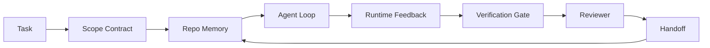

# Agent Workbench Engineering: Why Capable Models Still Fail

> A capable model is not enough. A reliable agent needs a workbench: instructions, state, scope, feedback, verification, review, and handoff. Strip these away, and even frontier models produce work that is unsafe to ship.

**Type:** Learn + Build
**Languages:** Python (standard library)
**Prerequisites:** Phase 14 · 01 (Agent Loop), Phase 14 · 26 (Failure Modes)
**Time:** ~45 minutes

## Learning Objectives

- Separate model capability from execution reliability.
- Name the seven workbench surfaces that determine whether an agent can deliver.
- Compare a "prompt-only" run against a "workbench-guided" run on a small repo task.
- Produce a failure-mode report mapping each missing surface to the symptoms it causes.

## The Problem

You drop a frontier model into a real repository and tell it to add input validation. It opens four files, writes plausible-looking code, declares success, and stops. You run the tests. Two fail. A third modified file has nothing to do with validation. There is no record of what the agent assumed, what it tried first, or what remains undone.

The model got Python right. It got the job wrong. It never knew what counts as done, where it is allowed to write, which tests are authoritative, or how the next session should pick up.

This is not a model bug. It is a workbench bug. The surfaces around the model are missing the pieces that turn one-shot generation into reliable, recoverable engineering.

## The Concept

The workbench is the runtime environment that wraps the model during a task. It has seven surfaces:

| Surface | What it carries | Failure when missing |
|---------|-----------------|----------------------|
| Instructions | Boot rules, forbidden actions, definition of done | Agent guesses what delivery means |
| State | Current task, touched files, blockers, next action | Each session restarts from zero |
| Scope | Allowed files, forbidden files, acceptance criteria | Edits leak into unrelated code |
| Feedback | Real command output captured into the loop | Agent declares success on a 400 |
| Verification | Tests, lint, smoke runs, scope checks | "Looks good" ships to main |
| Review | A second pass with a different role | The builder grades its own homework |
| Handoff | What changed, why, what remains | Next session rediscovers everything |

The workbench is model-independent. You can swap the model and keep the surfaces. You cannot swap the surfaces and keep reliability.



The loop closes on the state file, not on chat history. Chat is volatile. The repository is the system of record.

### Workbench vs Prompt Engineering

A prompt tells the model what you want this turn. A workbench tells the model how to work across turns and sessions. Most agent failure stories are workbench failures dressed in prompt-engineering clothing.

### Workbench vs Framework

A framework gives you a runtime (LangGraph, AutoGen, Agents SDK). A workbench gives the agent a place to work inside that runtime. You need both. This mini-series covers the second.

### Reasoning from Primitives, Not from Vendor Taxonomies

There is a lot of writing about "harness engineering" right now. Addy Osmani, OpenAI, Anthropic, LangChain, Martin Fowler, MongoDB, HumanLayer, Augment Code, Thoughtworks, walkinglabs' awesome list, and a steady stream of Medium and Hacker News posts are all carrying it. They disagree on the boundary of "what a harness is," what is in scope, and which terminology to use. We do not need to pick sides. The seven surfaces are a UX layer; beneath every workbench are the same distributed-systems primitives that prop up any reliable backend.

Strip the agent label off for a moment. An agent run is computation spread across time, processes, and machines. To make it reliable, you need the same primitives any production system needs.

| Primitive | What it is | What it carries for agents |
|-----------|------------|------------------------------|
| Function | A typed handler. Preferably pure. Owns its inputs and outputs. | A tool call, a rule check, a validation step, a model invocation |
| Worker | A long-lived process that owns one or more functions and a lifecycle | Builder, reviewer, validator, an MCP server |
| Trigger | An event source that invokes a function | Agent loop tick, HTTP request, queue message, cron, file change, hook |
| Runtime | The boundary that decides what runs where, with what timeout and resources | Claude Code's process, LangGraph's runtime, a worker container |
| HTTP / RPC | The wire between caller and worker | Tool-call protocol, MCP request, model API |
| Queue | A durable buffer between trigger and worker; backpressure, retries, idempotency | Task board, feedback log, review inbox |
| Session persistence | State that survives crashes, restarts, and model swaps | `agent_state.json`, checkpoints, KV store, the repository itself |
| Authorization policy | Who can call which function with which scope | Allowed/forbidden files, approval boundaries, MCP capability manifests |

Now map the seven workbench surfaces onto these primitives.

- **Instructions** — policy + function metadata. Rules are checks (functions). A router (`AGENTS.md`) is a policy attached to runtime boot.
- **State** — session persistence. A keyed store read by the runtime at every step. File, KV, or DB; persistence semantics matter, storage backend does not.
- **Scope** — per-task authorization policy. Allowed/forbidden globs are an ACL. Required approvals are a permission lattice.
- **Feedback** — invocation logs written to a queue. Every shell call is a record, durable, replayable.
- **Verification** — a function. Deterministic on inputs. Triggered at task close. Halts on failure.
- **Review** — a separate worker with read-only authorization over the builder's output and write-only authorization over the review report.
- **Handoff** — a durable record emitted by a session-end trigger. The next session's boot trigger reads it.

The agent loop itself is a worker that consumes events (user messages, tool results, timer ticks), calls functions (model first, then tools the model picks), writes records (state, feedback), and emits triggers (verification, review, handoff). Nothing mystical; same shape as a job processor.

### Circulating Patterns, Translated to Primitives

Every popular harness pattern reduces to these eight primitives. Translation table.

| Vendor or community pattern | What it actually is |
|------------------------------|--------------------|
| Ralph Loop (Claude Code, Codex, agentic_harness book) — re-injecting original intent into a fresh context window when the agent tries to stop prematurely | A trigger that re-enqueues the task with a clean context; session persistence carries the goal forward |
| Plan / Execute / Verify (PEV) | Three workers, one per role, communicating via state and a queue between phases |
| Harness-compute separation (OpenAI Agents SDK, April 2026) — separating control plane from execution plane | A restatement of control plane / data plane. Decades older than the agent label |
| Open Agent Passport (OAP, March 2026) — signing and auditing each tool call against a declarative policy before execution | An authorization policy enforced by a pre-action worker with a signed audit queue |
| Guides and Sensors (Birgitta Boeckeler / Thoughtworks) — feedforward rules + feedback observability | Authorization policy + validation functions + observability traces |
| Progressive compaction, 5 stages (Claude Code reverse-engineering, April 2026) | A state-management worker running cron-like on session persistence, keeping it within budget |
| Hooks / middleware (LangChain, Claude Code) — intercepting model and tool calls | Triggers + functions wrapped around the runtime call path |
| Skills as Markdown with progressive disclosure (Anthropic, Flue) | A function registry whose function metadata is loaded into context just-in-time |
| Sandbox agent (Codex, Sandcastle, Vercel Sandbox) | Compute plane: a runtime with an isolated filesystem, network, and lifecycle |
| MCP server | A worker exposing functions via stable RPC, with a capability manifest as authorization |

Every entry in that table is the agent community arriving at a primitive that already had a name in distributed systems, then giving it a new one. Useful labels for marketing; useless as engineering vocabulary.

### What the Receipts Actually Say

The "harness beats model" claim now has numbers behind it. Worth knowing, because they are also the only honest argument against "just wait for a smarter model."

- Terminal Bench 2.0 — the same model, harness changes alone moved a coding agent from outside the top 30 to fifth place (LangChain, "Anatomy of an Agent Harness").
- Vercel — removed 80% of its agent's tools; success rate jumped from 80% to 100% (MongoDB).
- Harvey — legal agent more than doubled accuracy through harness optimization alone (MongoDB).
- 88% of enterprise AI agent projects fail to reach production. Failures cluster in runtime, not in reasoning (preprints.org, "Harness Engineering for Language Agents," March 2026).
- A 2025 benchmark study across three popular open-source frameworks reported task completion rates around 50%; long-context WebAgent collapsed from 40-50% to below 10% under long-context conditions, mostly due to dead loops and goal loss (widely reported across multiple articles in early 2026).

The takeaway is not "harness always wins." Models do absorb harness tricks over time. The takeaway is that today, the load-bearing engineering is around the model, not inside it, and the primitives carrying that load are the same ones every production system has always needed.

### Where Vendor Articles Underspecify

You do not have to be polite here.

- LangChain's "Anatomy of an Agent Harness" lists eleven components — prompt, tools, hooks, sandbox, orchestration, memory, skills, sub-agents, and a runtime "dumb loop." It does not name queues, treat workers as deployment units, trigger semantics, session persistence as a separate concern, or authorization policy. It treats the harness as an object you configure, not a system you deploy.
- Addy Osmani's "Agent Harness Engineering" lands the `Agent = Model + Harness` framing and the ratchet pattern, but does not say what a harness is built from. It reads like a position, not a specification.
- Anthropic and OpenAI go deepest on surfaces, but both stay inside their own runtimes. The April 2026 "harness-compute separation" announcement in the Agents SDK is the first vendor article that explicitly supports a control-plane / data-plane split. That is a primitive idea, not a new idea.
- The agentic_harness book treats the harness as a configuration object (Jaymin West's "Agentic Engineering" Chapter 6), and its strongest sentence is "the harness is the primary security boundary of an agent system." That is just authorization policy, restated.
- Hacker News threads keep landing in the same place. The April 2026 thread "The agent harness belongs outside the sandbox" argues the harness should sit "more like a hypervisor, outside of everything, with context- and user-authorization-based access." That, again, is authorization policy as a separate plane.

You do not need to disagree with any of these articles to notice the gap. They are writing UX descriptions of a system that already exists. We are writing that system. Get the system right and the seven surfaces fall out of the primitives. Get the system wrong and no amount of `AGENTS.md` polish fixes the missing queue.

So when you hear "harness engineering" elsewhere, translate it to primitives. Prompts and rules are policy and functions. Scaffolding is runtime. Guardrails are authorization + verification. Hooks are triggers. Memory is session persistence. Ralph Loop is re-enqueue. Sub-agents are workers. Sandbox is compute plane. The vocabulary changed; the engineering did not. The workbench is agent-facing UX; and the harness — in the sense that survives the next vendor reframing — is functions, workers, triggers, runtimes, queues, persistence, and policy wired together correctly.

## Build It

`code/main.py` runs a small repo task twice. First prompt-only, then with all seven surfaces wired in. Same model, same task. The script tallies which surfaces were absent in the failing run and prints a failure-mode report.

The repo task is deliberately small: add input validation to a single-file FastAPI-style handler and write a passing test.

Run it:

```
python3 code/main.py
```

Output: side-by-side logs of both runs, a `failure_modes.json` summarizing the prompt-only run, and a one-line verdict for the workbench run.

The agent is a tiny rule-based stub; the point is the surfaces, not the model. In the rest of this mini-series you will rebuild each surface into a real, reusable artifact.

## Use It

Three places where workbench surfaces already exist in the wild, even if nobody calls them that:

- **Claude Code, Codex, Cursor.** `AGENTS.md` and `CLAUDE.md` are the instruction surface. Slash commands are scope. Hooks are verification.
- **LangGraph, OpenAI Agents SDK.** Checkpoints and session stores are the state surface. Handoffs are the handoff surface.
- **CI on a real repository.** Tests, lint, and type checks are verification. PR templates are handoff. CODEOWNERS is review.

Workbench engineering is the discipline of making these surfaces explicit and reusable, rather than letting each team rediscover them.

## Ship It

`outputs/skill-workbench-audit.md` is a portable skill that audits an existing repository for the seven workbench surfaces, reporting which are missing, which are partially present, and which are healthy. Drop it alongside any agent configuration; it tells you what to fix first.

## Exercises

1. Pick a repository where you already run agents. Score the seven surfaces from 0 (missing) to 2 (healthy). Which is your weakest?
2. Extend `main.py` so the prompt-only run also produces a fake "success" claim. Verify that the verification gate would have caught it.
3. Add an eighth surface for your own product. Argue why it does not collapse into one of the existing seven.
4. Rerun the script with a different stub agent that hallucinates extra file writes. Which surface catches it first?
5. Map the five recurring industry failure modes from Phase 14 · 26 onto the seven surfaces. Which mode is each surface designed to absorb?

## Key Terms

| Term | What people call it | What it actually is |
|------|----------------|------------------------|
| Workbench | "the configuration" | The engineered surfaces around the model that make work reliable |
| Surface | "a doc" or "a script" | A named, machine-readable input that the agent reads or writes every turn |
| System of record | "the notes" | The file the agent treats as truth when chat history is gone |
| Definition of done | "acceptance" | An objective, file-backed, unforgeable checklist |
| Workbench audit | "repo readiness check" | A pass over the seven surfaces, flagging missing pieces before work begins |

## Further Reading

Read these as data points, not as authorities. Each one is a partial taxonomy. Translate every concept back to a primitive (function, worker, trigger, runtime, HTTP/RPC, queue, persistence, policy) before deciding whether to adopt it.

Vendor framings:

- [Addy Osmani, Agent Harness Engineering](https://addyosmani.com/blog/agent-harness-engineering/) — `Agent = Model + Harness` and the ratchet pattern; thin on infrastructure layers
- [LangChain, The Anatomy of an Agent Harness](https://blog.langchain.com/the-anatomy-of-an-agent-harness/) — eleven components: prompt, tools, hooks, orchestration, sandbox, memory, skills, sub-agents, runtime; misses queues, deployment, authorization
- [OpenAI, Harness engineering: leveraging Codex in an agent-first world](https://openai.com/index/harness-engineering/) — Codex team's view of surfaces around their runtime
- [OpenAI, Unrolling the Codex agent loop](https://openai.com/index/unrolling-the-codex-agent-loop/) — agent loop reduced to a `while` over function calls
- [Anthropic, Effective harnesses for long-running agents](https://www.anthropic.com/engineering/effective-harnesses-for-long-running-agents) — long-span surfaces inside a specific runtime
- [Anthropic, Harness design for long-running application development](https://www.anthropic.com/engineering/harness-design-long-running-apps) — application design notes
- [LangChain Deep Agents harness capabilities](https://docs.langchain.com/oss/python/deepagents/harness) — runtime configuration surfaces

Practitioner articles with usable detail:

- [Martin Fowler / Birgitta Boeckeler, Harness engineering for coding agent users](https://martinfowler.com/articles/harness-engineering.html) — guides (feedforward) + sensors (feedback); the cleanest cybernetic framing
- [HumanLayer, Skill Issue: Harness Engineering for Coding Agents](https://www.humanlayer.dev/blog/skill-issue-harness-engineering-for-coding-agents) — "it's not a model problem, it's a configuration problem"
- [MongoDB, The Agent Harness: Why the LLM Is the Smallest Part of Your Agent System](https://www.mongodb.com/company/blog/technical/agent-harness-why-llm-is-smallest-part-of-your-agent-system) — receipts: Vercel 80% to 100%, Harvey accuracy doubled, Terminal Bench top-30 to top-5
- [Augment Code, Harness Engineering for AI Coding Agents](https://www.augmentcode.com/guides/harness-engineering-ai-coding-agents) — constraints-first walkthrough
- [Sequoia podcast, Harrison Chase on Context Engineering Long-Horizon Agents](https://sequoiacap.com/podcast/context-engineering-our-way-to-long-horizon-agents-langchains-harrison-chase/) — runtime concerns above model concerns

Books, papers, and reference implementations:

- [Jaymin West, Agentic Engineering — Chapter 6: Harnesses](https://www.jayminwest.com/agentic-engineering-book/6-harnesses) — book-length treatment of the harness as primary security boundary
- [preprints.org, Harness Engineering for Language Agents (March 2026)](https://www.preprints.org/manuscript/202603.1756) — academic framing as control / agency / runtime
- [walkinglabs/awesome-harness-engineering](https://github.com/walkinglabs/awesome-harness-engineering) — curated reading list across context, evaluation, observability, orchestration
- [ai-boost/awesome-harness-engineering](https://github.com/ai-boost/awesome-harness-engineering) — another curated list (tools, evaluation, memory, MCP, permissions)
- [andrewgarst/agentic_harness](https://github.com/andrewgarst/agentic_harness) — production-ready reference implementation with Redis-backed memory and evaluation suite
- [HKUDS/OpenHarness](https://github.com/HKUDS/OpenHarness) — open agent harness with built-in personal agents

Hacker News threads worth reading for disagreement rather than consensus:

- [HN: Effective harnesses for long-running agents](https://news.ycombinator.com/item?id=46081704)
- [HN: Improving 15 LLMs at Coding in One Afternoon. Only the Harness Changed](https://news.ycombinator.com/item?id=46988596)
- [HN: The agent harness belongs outside the sandbox](https://news.ycombinator.com/item?id=47990675) — argues for authorization as a separate plane

Cross-references within this curriculum:

- Phase 14 · 23 — OpenTelemetry GenAI conventions: the observability layer the sensors literature points to
- Phase 14 · 26 — Failure modes, cataloging what the seven surfaces are designed to absorb
- Phase 14 · 27 — Prompt injection defense, sitting on the authorization policy primitive
- Phase 14 · 29 — Production runtimes (queues, events, cron): where the primitives from this lesson live in deployment
