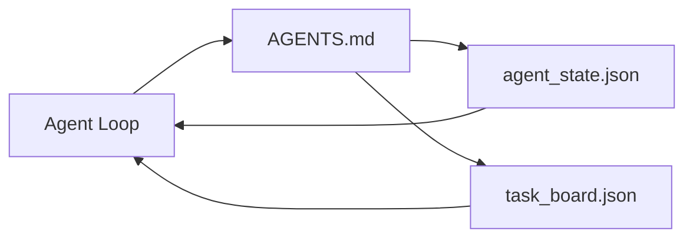

# Minimal Agent Workbench

> The minimum viable workbench is three files: a root instruction router, a state file, and a task board. Everything else layers on top of them. If a repository cannot sustain even these three, no model can save it.

**Type:** Build
**Languages:** Python (standard library)
**Prerequisites:** Phase 14 · 31 (Why Capable Models Still Fail)
**Time:** ~45 minutes

## Learning Objectives

- Define the three files that constitute a minimal viable workbench.
- Explain why a short root router beats a lengthy monolithic `AGENTS.md`.
- Build a state file the agent can read every turn and write at the end.
- Build a task board that survives multi-session work without relying on chat history.

## The Problem

Most teams do workbench by writing a 3000-line `AGENTS.md` and declaring it done. The model loads it, ignores the parts it cannot summarize, and still fails on the same surfaces it always failed on.

What you need is the opposite. A tiny root file that routes the agent into deeper files only when relevant. Persistent state the agent reads before acting and writes after acting. A task board stating what is in progress, what is blocked, and what comes next.

Three files. Each has one responsibility. Each is machine-readable enough to evolve into a real system later.

## The Concept



### AGENTS.md Is a Router, Not a Manual

A good `AGENTS.md` is short. It points the agent at:

- The state file (where you are).
- The task board (what remains).
- Deeper rules (under `docs/agent-rules.md`).
- Validation commands (how to know it works).

Anything longer goes into deeper docs, loaded only when needed. Long manuals get ignored. Short routers get followed.

### agent_state.json Is the System of Record

State carries: active task id, touched files, assumptions made, blockers, next action. The agent reads it every turn. The next session reads it instead of replaying chat.

State lives in a file because chat history is unreliable. Sessions die. Conversations get trimmed. Files do not.

### task_board.json Is the Queue

The task board carries each task with a status of `todo | in_progress | done | blocked`. It is the queue the agent pulls from when state is empty, and the queue you read when you want to know whether the agent is on track.

A task on the board has an id, a goal, an owner (`builder`, `reviewer`, or `human`), and acceptance criteria. The board is deliberately small: when it grows past one screen, you have a planning problem, not a board problem.

### The Three Files Are a Floor, Not a Ceiling

Later lessons add scope contracts, feedback runners, verification gates, reviewer checklists, and handoff packages. The three files here are what all of those assume exists.

## Build It

`code/main.py` writes the minimal workbench into an empty repository and demonstrates a single agent turn:

1. Read `agent_state.json`.
2. If state is empty, pull the next task from `task_board.json`.
3. Touch a file within scope.
4. Write back the updated state.

Run it:

```
python3 code/main.py
```

The script creates `workdir/` beside itself, lays down the three files, runs one turn, and prints the diff. Rerun it and watch the second turn pick up where the first left off.

## Use It

In production agent products, the same three files appear under different names:

- **Claude Code:** `AGENTS.md` or `CLAUDE.md` as router, `.claude/state.json`-style storage as state, hooks as the board.
- **Codex / Cursor:** workspace rules as router, session memory as state, queued tasks in the chat sidebar as the board.
- **Custom Python agents:** the files you just wrote.

Names change. The shape does not.

## Production Patterns in the Wild

Three patterns, when layered on top of the minimal workbench, let it survive contact with a real monorepo. They are independent of each other; pick the ones your repo actually needs.

**Nested `AGENTS.md` with nearest-wins precedence.** OpenAI ships 88 `AGENTS.md` files in its main repository, one per subcomponent. Codex, Cursor, Claude Code, and Copilot all walk from the working file toward the repo root, concatenating every `AGENTS.md` they find along the way. Subdirectory files extend the root file. Codex adds `AGENTS.override.md` to replace rather than extend; this override mechanism is Codex-specific, avoid it when working cross-tool. Augment Code's measurement is the key sentence: the best `AGENTS.md` files give a quality jump equivalent to upgrading from Haiku to Opus; the worst make output worse than having no file at all.

**Anti-patterns to reject, even when they look like coverage.** Conflicting instructions silently demote the agent from interactive to greedy mode (ICLR 2026 AMBIG-SWE: 48.8% to 28% solve rate); number your priorities, do not stack them flat. Unverifiable style rules without a verifiable command ("follow the Google Python Style Guide") make the agent fabricate compliance; pair every style rule with the exact lint command. Leading with style instead of commands buries the verification path; commands first, style second. Writing for humans instead of agents wastes context budget; brevity is a feature.

**Cross-tool symlinks.** A root file plus symlinks (`ln -s AGENTS.md CLAUDE.md`, `ln -s AGENTS.md .github/copilot-instructions.md`, `ln -s AGENTS.md .cursorrules`) makes every coding agent use the same source of truth. Nx's `nx ai-setup` automates this across Claude Code, Cursor, Copilot, Gemini, Codex, and OpenCode from a single configuration.

## Ship It

`outputs/skill-minimal-workbench.md` generates the three-file workbench for any new repository: an `AGENTS.md` router tuned for the project, an `agent_state.json` with the correct keys, and a `task_board.json` seeded with the current backlog.

## Exercises

1. Add a `last_run` timestamp to `agent_state.json`. If the file is more than 24 hours old, refuse to run unless ops confirms.
2. Add a `priority` field to the task board and change the puller to always pick the highest-priority `todo`.
3. Migrate `task_board.json` to JSON Lines so each task is one line and diffs cleanly in version control.
4. Write a `lint_workbench.py` that fails if `AGENTS.md` exceeds 80 lines or references a file that does not exist.
5. Decide which of the three files is the most painful to lose. Defend your choice.

## Key Terms

| Term | What people call it | What it actually is |
|------|----------------|------------------------|
| Router | `AGENTS.md` | Short root file that points the agent at deeper docs and files |
| State file | "the notes" | A machine-readable record of where the agent is, written every turn |
| Task board | "backlog" | A JSON queue of work with status, owner, and acceptance |
| System of record | "source of truth" | The file the workbench treats as authoritative when chat is gone |

## Further Reading

- [agents.md — the open spec](https://agents.md/) — adopted by Cursor, Codex, Claude Code, Copilot, Gemini, OpenCode
- [Augment Code, A good AGENTS.md is a model upgrade. A bad one is worse than no docs at all](https://www.augmentcode.com/blog/how-to-write-good-agents-dot-md-files) — measured quality jump
- [Blake Crosley, AGENTS.md Patterns: What Actually Changes Agent Behavior](https://blakecrosley.com/blog/agents-md-patterns) — what works and what does not, empirically
- [Datadog Frontend, Steering AI Agents in Monorepos with AGENTS.md](https://dev.to/datadog-frontend-dev/steering-ai-agents-in-monorepos-with-agentsmd-13g0) — nested precedence in practice
- [Nx Blog, Teach Your AI Agent How to Work in a Monorepo](https://nx.dev/blog/nx-ai-agent-skills) — single-source generation across six tools
- [The Prompt Shelf, AGENTS.md Best Practices: Structure, Scope, and Real Examples](https://thepromptshelf.dev/blog/agents-md-best-practices/) — section ordering that survives review
- [Anthropic, Claude Code subagents and session store](https://docs.anthropic.com/en/docs/agents-and-tools/claude-code/sub-agents)
- Phase 14 · 31 — the failure modes this minimal set absorbs
- Phase 14 · 34 — the persistent state schema this lesson previews
