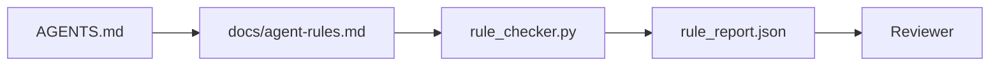

# Agent Instructions as Executable Constraints

> Instructions written as prose are wishes. Instructions written as constraints are tests. The workbench turns every rule into something the agent can check at runtime and a reviewer can verify after the fact.

**Type:** Build
**Languages:** Python (standard library)
**Prerequisites:** Phase 14 · 32 (Minimal Workbench)
**Time:** ~50 minutes

## Learning Objectives

- Separate routing prose from operational rules.
- Express boot rules, forbidden actions, definition of done, uncertainty handling, and approval boundaries as machine-checkable constraints.
- Implement a rule checker that scores a run against the rule set.
- Make the rule set diff-friendly so reviews can see what changed.

## The Problem

A typical `AGENTS.md` reads like an onboarding document for a new hire. It tells the agent to "be careful," "test thoroughly," and "ask if uncertain." Three days later the agent ships a change with no tests, writes to a forbidden directory, and never asks — because it never knew where the line was.

Instructions are powerful when operational and weak when aspirational. The fix is writing rules the workbench can interpret and a reviewer can score.

## The Concept

Rules belong in `docs/agent-rules.md`, away from the short root router. Each rule has a name, a category, and a check.



### Five Categories That Cover Most Rules

| Category | Question the rule answers | Example |
|----------|---------------------------|---------|
| Boot | What must be true before work starts? | "State file exists and is fresh" |
| Forbidden | What must never happen? | "Do not edit `scripts/release.sh`" |
| Definition of done | What proves the task is complete? | "pytest exits 0 and acceptance lines pass" |
| Uncertainty | What does the agent do when unsure? | "Open a question note rather than guessing" |
| Approval | What requires human sign-off? | "Any new dependency, any production write" |

A rule that does not fit one of these five usually wants to be two rules. Force the split.

### Rules Are Machine-Readable

Each rule has a slug, a category, a one-line description, and a `check` field naming a function in `rule_checker.py`. Adding a rule means adding a check; the checker grows with the workbench.

### Rules Are Diff-Friendly

Rules live in a single markdown file, one heading per rule. Renames are visible in diffs. New rules sit at the top of their category. Stale rules are deleted, not commented out, because the workbench is the source of truth, not a chat log of how the team felt last quarter.

### Rules vs Framework Guardrails

Framework guardrails (OpenAI Agents SDK guardrails, LangGraph interrupts) enforce rules at the runtime layer. This lesson's rule set is the human-readable, auditable contract those guardrails implement. You need both: the runtime catches violations within a turn, the rule set proves the runtime is doing the right thing.

## Build It

`code/main.py` provides:

- An `agent-rules.md` parser that loads rules into a dataclass.
- `rule_checker.py`-style checker functions, one per `check` reference.
- A demo agent run that violates two rules, and a pass that catches them.

Run it:

```
python3 code/main.py
```

Output: the parsed rule set, the run trace, per-rule pass/fail, and a `rule_report.json` stored beside the script.

## Production Patterns in the Wild

Three patterns separate a rule set that lasts a quarter from one that rots in a week.

**Tag severity at write time.** Each rule carries a `severity`: `block`, `warn`, or `info`. The checker reports all three; the runtime rejects only on `block`. Most teams over-severity early, then silently weaken under deadline pressure; tagging at write time forces calibration up front. Pair with the verification gate (Phase 14 · 38), which signs any override of a `block` rule into an `overrides.jsonl` audit log.

**Rule expiry as a forcing function.** Each rule carries an `expires_at` date (defaults to 90 days from authoring). When a non-expired rule has zero violations for 60 consecutive days, the checker emits a warning; the next quarterly review either justifies keeping it, weakens it to `info`, or deletes it. Cloudflare's production AI Code Review data (April 2026, 131,246 review runs across 5,169 repos in 30 days) shows that rule sets with explicit expiry stay under 30 rules per repo; those without grow to 80+ and mostly never fire.

**Markdown as source, JSON as cache.** `agent-rules.md` is the authoring file; `agent-rules.lock.json` is the cache the checker reads in the hot path. The lock is regenerated by a pre-commit hook. Markdown diffs are reviewable; JSON parsing does not enter every turn. Same shape as `package.json` / `package-lock.json` and `Cargo.toml` / `Cargo.lock`.

## Use It

In production:

- Claude Code, Codex, and Cursor read rules at session start and cite them when refusing an action. The checker reruns them in CI to catch silent drift.
- OpenAI Agents SDK guardrails register the same checks as input and output guardrails. The markdown is the documentation surface; the SDK is the runtime surface.
- LangGraph interrupts fire when a rule is violated mid-node. The interrupt handler reads the rule, asks the human, and resumes.

The rule set is portable across all three because it is just markdown plus function names.

## Ship It

`outputs/skill-rule-set-builder.md` interviews a project lead, categorizes their existing prose instructions into the five categories, and produces a versioned `agent-rules.md` plus a checker stub.

## Exercises

1. Add a sixth category if your product truly needs it. Argue why it does not collapse into one of the five.
2. Extend the checker so a rule can carry a severity (`block`, `warn`, `info`) and the report aggregates accordingly.
3. Wire the checker into CI: fail the build if a block-severity rule fails on the latest agent run.
4. Add an "expiry" field to each rule. After 90 days without a check failure, the rule enters pending-review.
5. Take a real `AGENTS.md` and rewrite it as five-category rules. How many lines are operational? How many are aspirational?

## Key Terms

| Term | What people call it | What it actually is |
|------|----------------|------------------------|
| Operational rule | "a real instruction" | A rule the workbench can check at runtime |
| Aspirational rule | "be careful" | A rule with no check; either delete or upgrade it |
| Definition of done | "acceptance" | Objective, file-backed proof that a task is complete |
| Block severity | "hard rule" | A violation that stops the run; cannot be silenced without ops |
| Rule expiry | "stale rule sweep" | A rule with N days of zero failures enters pending retirement |

## Further Reading

- [OpenAI Agents SDK guardrails](https://platform.openai.com/docs/guides/agents-sdk/guardrails)
- [LangGraph interrupts](https://langchain-ai.github.io/langgraph/how-tos/human_in_the_loop/breakpoints/)
- [Anthropic, Building Effective Agents](https://www.anthropic.com/research/building-effective-agents)
- [Rick Hightower, Agent RuleZ: A Deterministic Policy Engine](https://medium.com/@richardhightower/agent-rulez-a-deterministic-policy-engine-for-ai-coding-agents-9489e0561edf) — block/warn/info severity in production
- [Cloudflare, Orchestrating AI Code Review at Scale](https://blog.cloudflare.com/ai-code-review/) — 131K review runs, lessons from rule composition
- [microservices.io, GenAI development platform — part 1: guardrails](https://microservices.io/post/architecture/2026/03/09/genai-development-platform-part-1-development-guardrails.html) — defense in depth between rules and CI
- [Type-Checked Compliance: Deterministic Guardrails (arXiv 2604.01483)](https://arxiv.org/pdf/2604.01483) — Lean 4 as the ceiling for "rules as checks"
- [logi-cmd/agent-guardrails](https://github.com/logi-cmd/agent-guardrails) — merge-gate implementation: scope, mutation testing, violation budget
- Phase 14 · 32 — the minimal workbench this rule set drops into
- Phase 14 · 38 — the verification gate that consumes the rule report
- Phase 14 · 39 — the reviewer agent that scores rule compliance
